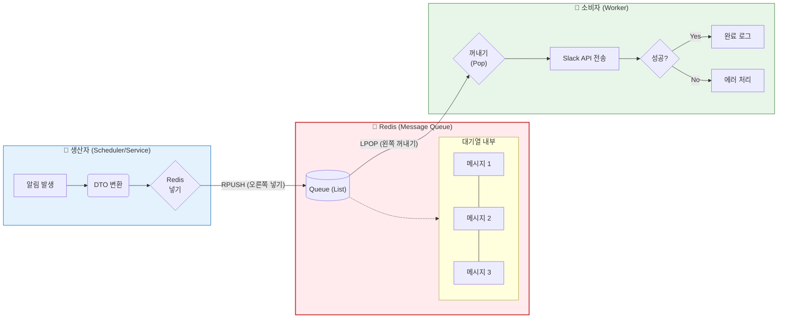

### 단계별 상세 설명 (비유: 맛집 주방 시스템)

**1단계: 주문 접수 (Producer - Scheduler)**
* 상황: 스케줄러가 "이 계정 삭제됐으니 알림 보내!"라고 요청을 만듭니다.
* 비유: 홀 서빙 직원이 손님에게 주문을 받아서 주문서(Message)를 작성합니다.
* 동작: RedisTemplate을 이용해 알림 내용(누구에게, 무슨 내용을)을 JSON 데이터로 포장합니다.

**2단계: 주문서 꽂기 (Redis Queue - Enqueue)**
* 상황: 작성된 알림 데이터를 Redis의 slack:notification:queue 리스트에 넣습니다.
* 비유: 서빙 직원이 주문서를 주방 앞 행거(Queue)에 순서대로 꽂아둡니다. 직원은 요리가 나올 때까지 기다리지 않고, 바로 다른 일을 하러 갑니다. (비동기 처리)
* 기술: Redis의 RPUSH (Right Push) 명령어를 사용하여 대기열의 맨 뒤에 줄을 세웁니다.

**3단계: 요리 시작 (Consumer - SlackNotificationWorker)**
* 상황: 별도로 돌아가는 SlackNotificationWorker가 1초마다 Redis를 확인합니다. "일감 있나?"
* 비유: 주방장(Worker)이 행거를 보고 있다가, 주문서가 들어오면 맨 앞의 주문서(FIFO)를 낚아채서 요리를 시작합니다.
* 기술: Redis의 LPOP (Left Pop) 명령어를 사용하여 대기열의 맨 앞에서 데이터를 꺼내옵니다.

4단계: 서빙 완료 (Slack API)
* 상황: 꺼내온 데이터를 바탕으로 실제 Slack API를 호출해 메시지를 전송합니다.
* 비유: 주방장이 요리를 완성해서 손님 테이블(Slack)로 내보냅니다.

### 직접 확인해보고 싶다면?
1. Redis 접속하기
- 로컬: 터미널에서 `redlis-cli` 입력
- 서버: 쿠버네티스 Redis 접속

2. Queue(List) 확인하기
접속이 되었다면 127.0.0.1:6379> 프롬프트가 뜰 겁니다. 이제 명령어를 입력해봅시다.

1) Key 확인
우리가 코드에서 정한 키 이름(slack:notification:queue)이 있는지 찾아봅니다.
(결과로 slack:notification:queue가 나와야 합니다. 안 나오면 현재 대기 중인 메시지가 0개라는 뜻입니다.)

2) 강제로 메시지 넣어보기 (테스트)
워커가 너무 빨리 가져가서 안 보일 수 있으니, 우리가 수동으로 가짜 주문서를 하나 넣어봅시다.
주의: JSON 형식을 코드의 DTO와 맞춰야 에러가 안 납니다.

```bash
# RPUSH 키이름 'JSON데이터'
RPUSH slack:notification:queue '{"type":"DM", "username":"test_user", "email":"test@test.com", "message":"레디스 확인 중입니다!"}'
```
(결과로 (integer) 1이 나오면 성공! 현재 큐에 1개가 쌓였다는 뜻입니다.)

3) 데이터 조회하기
이제 쌓여있는 데이터를 눈으로 확인해 봅시다. LRANGE 명령어를 씁니다.
```bash
# LRANGE 키이름 시작인덱스 끝인덱스 (0 -1은 '처음부터 끝까지'라는 뜻)
LRANGE slack:notification:queue 0 -1
```

3. 실시간 모니터링 (MONITOR)
"나는 데이터가 들어오고 나가는 걸 실시간으로 보고 싶어!" 하신다면 MONITOR 명령어를 사용해보세요. 
* 터미널 창을 하나 새로 엽니다.
* redis-cli 접속 후 아래 명령어를 칩니다.
```
MONITOR
```
* 이제 원래 터미널에서 스케줄러를 돌리거나 테스트 코드를 실행해 보세요.
* MONITOR 창에서 아래와 같이 실시간 로그가 후루룩 올라가는 게 보일 겁니다.
> 스케줄러가 RPUSH로 넣자마자, Worker가 LPOP으로 채가는 과정이 적나라하게 보입니다.
