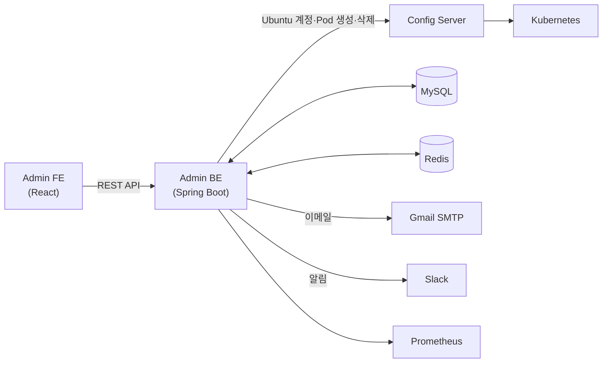

# 개요

## 1. 시스템 소개 및 목적

동국대학교 AI LAB 자동화 시스템은 연구실 GPU 서버 자원 관리와 컨테이너 생성 자동화를 위한 시스템입니다. 기존에는 연구실 인원의 서버 사용 요청을 관리자가 수동으로 처리했으나, 신청 접수부터 계정 생성, 만료 처리까지 일련의 과정을 자동화하여 관리자 업무 부담을 줄이는 것을 목적으로 합니다.

연구실 인원(학생, 연구원)은 AI/ML 연구를 위해 GPU 자원이 필요합니다. 여러 인원이 한정된 수의 서버를 공유하므로, 각 사용자에게 독립된 컨테이너 환경을 제공합니다. 컨테이너는 K8s Pod로 생성되며, 사용자는 승인 후 발급받은 SSH 포트와 Jupyter 포트로 접속해 사용합니다.

서버실에는 LAB과 FARM 두 개의 서버가 VLAN으로 분리되어 운영됩니다. 각 서버마다 탑재된 GPU 종류가 다르기 때문에, 사용자 신청 시 어느 서버에 컨테이너를 배치할지 적절히 오케스트레이션해야 합니다. 이처럼 이기종 서버 환경을 수동으로 관리하면 실수가 잦고 확장이 어렵기 때문에, 신청 접수부터 컨테이너 배치·회수까지 전 과정을 자동화하는 시스템이 필요합니다.

Admin BE는 이 자동화 시스템의 백엔드 서버로, 다음 역할을 담당합니다.

- 사용자/관리자 인증 및 권한 관리
- 서버 사용 신청 접수, 승인/거절 처리
- 승인 시 인프라 서버에 Ubuntu 계정 및 K8s 컨테이너 생성 요청
- 만료일 기반 컨테이너 자동 회수 및 사용자 알림 발송
- 장기 미접속 계정 자동 비활성화

본 문서는 Admin BE 인수인계 및 유지보수를 위한 기술 문서입니다.

---

## 2. 전체 구조

**FE ↔ BE**: 사용자·관리자의 모든 요청(신청, 승인, 조회 등)은 REST API로 들어옵니다.

**BE → Infra**: 승인 시 Infra Server에 Ubuntu 계정 생성과 K8s Pod 생성을 요청합니다. 만료·삭제 시에는 반대로 정리를 요청합니다.

**BE → 알림**: 승인, 만료 예고, 삭제 완료 등 주요 이벤트 발생 시 Gmail로 이메일을, Slack으로 알림을 보냅니다. Slack 알림은 Redis 큐를 통해 비동기로 발송합니다.

MySQL은 신청 내역, 사용자 정보, 포트 매핑 등 운영 데이터를 저장합니다. Redis는 JWT RefreshToken, Slack 알림 큐, 이메일 중복 방지에 사용합니다.

---

## 3. 기술 스택

- **Java 17**: 서버 사이드 애플리케이션 개발 언어
- **Spring Boot 3.5.3**: REST API 서버 구현, DI 컨테이너, 자동 설정
- **Spring Data JPA (Hibernate)**: DB 접근 추상화. 엔티티 매핑 및 쿼리 처리에 사용
- **MySQL 8.0.32**: 신청, 사용자, 컨테이너 상태 등 모든 영속 데이터 저장
- **Redis**: JWT RefreshToken 저장, Slack 알림 비동기 큐, 이메일 중복 방지(SETNX)
- **JWT (jjwt 0.11.5)**: 사용자 인증 토큰 생성 및 검증
- **Gradle 8.14.2**: 빌드 및 의존성 관리
- **Docker / Kubernetes / Helm (Fabric8 Kubernetes Client 6.10.0)**: 컨테이너 패키징 및 K8s 클러스터 배포
- **JavaMailSender (Gmail SMTP)**: 사용자 이메일 알림 발송
- **Slack Webhook / DM API**: 관리자 채널 알림 및 사용자 DM 발송
- **Swagger (springdoc-openapi 2.8.0)**: REST API 명세 자동 문서화

---

## 4. 서버 환경

서버는 LAB(`210.94.179.18`)과 FARM(`210.94.179.19`) 두 곳을 운영합니다. 두 서버는 VLAN으로 네트워크가 분리되어 있으며, 각 서버마다 탑재된 GPU 종류가 상이합니다. LAB 서버는 김지희 교수님 연구실에서 사용 중입니다.

Admin BE는 K8s 네임스페이스 `default`에 배포되며, NodePort 30083을 통해 외부에서 접근합니다(Pod 내부 포트 :8080). MySQL과 Redis는 `ailab-be` 네임스페이스에 있습니다.

- **API Base URL**: `http://210.94.179.18:30083`
- **Swagger UI**: `http://210.94.179.18:30083/swagger-ui/index.html`

클러스터 내부 서비스 주소는 아래와 같습니다.

| 서비스 | 주소 |
|--------|------|
| MySQL | `my-mysql.ailab-be.svc.cluster.local:3306` |
| Redis | `my-redis-master.ailab-be.svc.cluster.local:6379` |
| Infra Server | `containerssh-config-service.ailab-infra.svc.cluster.local` |

---

## 5. 시작하기

로컬 개발 환경 세팅은 [[시작|시작]] 페이지를 참고합니다. IntelliJ 설정, `application.yml` 준비, 로컬 DB 설정, Swagger 확인까지 순서대로 안내합니다.
