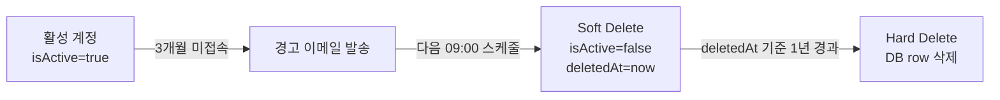

# 도메인 설명

BE를 구성하는 주요 도메인과 엔티티 구조를 설명합니다.

## ERD


ERD Cloud에서 직접 확인: [admin_be ERD](https://www.erdcloud.com/d/4xzXDuDyJm8inPt2Q)

---

## 1. User

사용자 계정 정보와 생명주기를 관리합니다.

**주요 필드**

| 필드 | 설명 |
|------|------|
| `email` | 로그인 식별자, unique |
| `password` | BCrypt 해시 |
| `role` | `USER` / `ADMIN` |
| `isActive` | 계정 활성 여부. `false`면 로그인 불가 |
| `lastLoginAt` | 마지막 로그인 시각. 스케줄러가 미접속 여부 판단에 사용 |
| `deletedAt` | Soft Delete 시각. null이면 활성 계정 |

**생명주기**



즉시 Hard Delete하지 않고 Soft Delete → 1년 유예 → Hard Delete 순서를 밟는 이유는 두 가지입니다. 첫째, `reactivate()`로 계정을 복구할 수 있어 실수로 삭제된 경우 대응이 가능합니다. 둘째, 신청 이력·로그 추적을 위해 일정 기간 데이터를 보존해야 하는 운영 요구사항을 반영합니다. Hard Delete는 `UserSchedulerService`가 `deletedAt < now - 1년`인 레코드를 찾아 완전히 삭제합니다.

---

## 2. Request

서버 사용 신청 한 건을 나타냅니다. 상태 전이와 보상 트랜잭션이 이 도메인의 핵심입니다.

**주요 필드**

| 필드 | 설명 |
|------|------|
| `ubuntuUsername` | Ubuntu 계정명, unique |
| `ubuntuPassword` / `ubuntuPasswordBase64` | 초기 비밀번호. `ubuntuPasswordBase64`는 Infra Server API가 base64 인코딩된 평문을 요구하기 때문에 별도 보관. BCrypt 해시(`ubuntuPassword`)에서는 원문 복원이 불가능하므로 승인 시점의 base64 값을 함께 저장함 |
| `ubuntuUid` / `ubuntuGid` | 승인 후 Infra Server에서 받아 저장 |
| `podName` / `nodeName` | 승인 후 Pod 생성 결과 저장 |
| `volumeSizeGiB` | 할당 스토리지 크기 |
| `expiresAt` | 컨테이너 만료일 |
| `status` | 현재 상태 (`PENDING` / `PROCESSING` / `FULFILLED` / `DENIED` / `DELETED`) |
| `adminComment` | 거절 사유 또는 관리자 메모 |
| `formAnswers` | 신청 양식 응답 (JSON). 양식 질문이 변경돼도 스키마 마이그레이션 없이 수용하기 위해 컬럼을 분리하지 않고 JSON으로 저장 |

상태 전이와 승인 흐름은 [[시스템 아키텍처|시스템-아키텍처]]를 참고합니다.

### ChangeRequest

FULFILLED 상태의 컨테이너에 대해 사용자가 변경을 요청할 때 생성됩니다. 원본 Request와 분리된 테이블에 저장되므로, 변경 요청이 거절되거나 폐기돼도 원본 Request는 영향받지 않습니다.

**changeType**

| 타입 | 변경 내용 |
|------|----------|
| `EXPIRES_AT` | 만료일 연장 |
| `VOLUME_SIZE` | 스토리지 크기 변경 |
| `RESOURCE_GROUP` | 서버 풀 변경 |
| `CONTAINER_IMAGE` | 컨테이너 이미지 변경 |
| `GROUP` | Ubuntu 그룹 변경 |
| `PORT` | 추가 포트 요청 |

ChangeRequest는 PENDING → FULFILLED(승인) 또는 DENIED(거절) 상태로 전이됩니다. 만료일 연장(`EXPIRES_AT`)이 승인된 경우에만 사용자에게 이메일을 발송합니다.

---

## 3. ResourceGroup / ContainerImage / Group

### ResourceGroup

컨테이너를 배치할 서버 풀을 나타냅니다.

| 필드 | 설명 |
|------|------|
| `resourceGroupName` | GPU 모델·풀 이름 (ex: `3090ti`) |
| `serverName` | 서버 구분 (`FARM` / `LAB`) |
| `description` | 관리자용 설명 |

`serverName`이 서버 군(FARM/LAB)을 나타내고, `resourceGroupName`이 그 안의 특정 GPU 풀을 세분합니다. 관리자가 승인 시 ResourceGroup을 선택하면 Infra Server는 해당 풀 내의 노드에 Pod를 배치합니다.

### ContainerImage

컨테이너 생성에 사용할 Docker 이미지 정보입니다.

| 필드 | 설명 |
|------|------|
| `imageName` | 이미지명 |
| `imageVersion` | 이미지 태그·버전 |
| `cudaVersion` | 해당 이미지가 지원하는 CUDA 버전 |
| `description` | 사용자에게 보여줄 설명 |

사용자는 서버 신청 시 목록에서 이미지를 선택합니다. CUDA 버전이 별도 필드로 관리되므로 사용자가 자신의 워크로드에 맞는 이미지를 고를 수 있습니다. `BaseTimeEntity`를 상속하므로 `createdAt`/`updatedAt`이 자동 관리됩니다.

### Group

Ubuntu 시스템 그룹을 나타냅니다.

| 필드 | 설명 |
|------|------|
| `groupName` | Ubuntu 그룹명 |
| `ubuntuGid` | Ubuntu GID (unique) |

Request와 Group은 `request_groups` 중간 테이블로 N:M 관계입니다. 하나의 신청에 여러 그룹을 지정할 수 있으며, 계정 생성 시 Infra Server의 `supplementary_groups` 필드에 이 목록이 전달됩니다. 이를 통해 컨테이너 안에서 특정 디렉터리나 리소스에 대한 접근 권한을 제어합니다.

---

## 4. Alarm

모든 알림(이메일·Slack)은 `AlarmService`를 단일 진입점으로 사용합니다. 직접 JavaMailSender나 Slack API를 호출하지 않고 AlarmService를 통해서만 발송합니다.

**이메일 발송**

Gmail SMTP를 통해 사용자에게 이메일을 발송합니다. 메시지 내용은 `messages.properties`의 기본값을 사용하거나, 관리자가 DB에 등록한 오버라이드 값을 우선 적용합니다(자세한 내용은 아래 messageTemplate 섹션 참고).

만료 예고 이메일은 Redis SETNX로 중복 발송을 방지합니다. 키 형식은 `email:preexpiry:{requestId}:{dayLabel}:{date}`이고 TTL은 25시간입니다. 스케줄러가 매일 실행되므로, 같은 날 같은 사용자에게 중복 발송되는 것을 막습니다.

**Slack 발송**

Slack 알림은 직접 보내지 않고 Redis List(`slack:notification:queue`)에 적재합니다. `SlackNotificationWorker`가 1초마다 LPOP으로 꺼내 Slack API를 호출합니다. Slack Webhook rate limit이 채널당 초당 1건이기 때문입니다.

---

## 5. Pod / PodExternalPort

`PodExternalPort`는 Infra Server가 Pod 생성 시 할당한 NodePort 매핑을 저장합니다. `pod_external_ports` 테이블에 저장되며, 하나의 Request에 여러 포트가 1:N으로 매핑됩니다.

| 필드 | 타입 | 설명 |
|------|------|------|
| `usagePurpose` | `VARCHAR(1000)` | 포트 용도 (`ssh`, `jupyter` 등) |
| `internalPort` | `INT` (1-65535) | 컨테이너 내부 포트 |
| `externalPort` | `INT` (1-65535) | 외부에서 접속하는 Kubernetes NodePort 번호 |

`BaseTimeEntity`를 상속하므로 `createdAt`/`updatedAt`이 자동 관리됩니다.

**흐름 요약**

1. 관리자가 신청 승인 → `POST /create-pod` 호출
2. Infra Server가 NodePort를 자동 할당하고 `ports` 배열로 응답
3. BE가 배열을 순회하며 `PodExternalPort` row를 `request_id`에 묶어 저장
4. 승인 완료 이메일에 포트 목록이 포함되어 사용자에게 발송

사용자는 이 포트를 통해 컨테이너에 SSH(`ssh -p {externalPort} ubuntu@서버IP`)나 Jupyter(`http://서버IP:{externalPort}`)로 접속합니다.

---

## 6. Node / Gpu

물리 서버 노드와 GPU 사양을 DB에서 관리합니다. Prometheus가 실시간 메트릭을 수집하는 것과 달리, Node/Gpu 테이블은 정적인 하드웨어 목록(어떤 서버에 GPU가 몇 개, 어떤 모델인지)을 저장합니다. 관리자 대시보드에서 서버 목록을 표시하거나, 신청 폼에서 ResourceGroup 설명을 구성할 때 이 정보를 사용합니다.

### Node

| 필드 | 설명 |
|------|------|
| `nodeId` | 노드 식별자 (ex: `farm1`, `lab-dgx`) — 문자열 PK, Infra Server의 노드명과 일치 |
| `rsgroup_id` | 소속 ResourceGroup (FARM / LAB) |
| `memorySizeGB` | 시스템 RAM (GB) |
| `cpuCoreCount` | CPU 코어 수 |

### Gpu

| 필드 | 설명 |
|------|------|
| `gpuModel` | GPU 모델명 (ex: `RTX4050`, `A3000`) |
| `ramGb` | GPU VRAM (GB) |
| `node_id` | 소속 노드 FK |

하나의 노드에 여러 GPU가 장착될 수 있어 Node → Gpu는 1:N입니다.

---

## 7. PortRequests

사용자가 서버 신청 시 SSH·Jupyter 외에 추가 포트를 요청하는 경우 `port_requests` 테이블에 저장됩니다. 기본 제공 포트(`PodExternalPort`)와 달리, 사용자가 명시적으로 요청한 포트를 별도로 추적합니다.

| 필드 | 설명 |
|------|------|
| `internalPort` | 요청하는 컨테이너 내부 포트 |
| `usagePurpose` | 포트 용도 (ex: `tensorboard`, `custom-api`) |
| `isActive` | 실제 Infra에 할당 완료 여부. 신청 시 `false`, 관리자 승인 후 포트가 열리면 `true` |
| `request_id` | 연관 Request FK |
| `rsgroup_id` | 어느 서버 풀에 요청하는지 |

`isActive=false`는 "요청은 됐지만 아직 Infra에 포트가 열리지 않은 상태"를 의미합니다. `activate()`가 호출되면 `isActive=true`로 전환됩니다.

---

## 8. Monitoring / Dashboard

### Monitoring

`GET /api/monitoring/metrics` — FE 대시보드가 주기적으로 폴링합니다. BE가 Prometheus HTTP API에 PromQL 쿼리를 날려 결과를 가공해 반환합니다. 인증 없이 접근 가능한 화이트리스트 경로(`/api/monitoring/**`)입니다.

| 지표 | PromQL |
|------|--------|
| 서버별 평균 GPU 사용률 (%) | `avg by(Hostname)(DCGM_FI_DEV_GPU_UTIL)` |
| 서버별 GPU 개수 | `count by(Hostname)(DCGM_FI_DEV_GPU_UTIL)` |
| 클러스터별 활성 컨테이너 수 | `sum by(cluster)(cluster_monitor_container_running)` |

Prometheus가 일시적으로 내려가도 API는 200을 반환합니다(빈 값 응답). 각 쿼리에 5초 타임아웃이 적용됩니다. Prometheus 연동 상세(WebClient 설정, 응답 구조 등)는 [[외부 연동|외부-연동]] 섹션 4를 참고합니다.

### Dashboard

`GET /api/admin/dashboard` — 관리자 대시보드용 집계 데이터를 단일 API로 내려줍니다.

| 집계 항목 | 내용 |
|-----------|------|
| 신청 현황 | 상태별 Request 수 (`PENDING` / `FULFILLED` / `DENIED` 등) |
| 사용자 현황 | 전체 사용자 수, 활성 사용자 수 |
| 서버별 사용량 | ResourceGroup별 FULFILLED Request 수 |

---

## 9. MessageTemplate

알림 메시지를 재배포 없이 수정할 수 있도록 "DB 우선, properties 폴백" 구조로 관리합니다.

`messages.properties`에 모든 메시지 키의 기본값이 있습니다. JAR에 포함되므로 수정하려면 재배포가 필요합니다. 관리자 화면에서 특정 키의 값을 수정하면 `message_templates` 테이블에 row가 생성됩니다. `DbMessageSource`는 메시지를 읽을 때 DB를 먼저 확인하고, 없으면 `messages.properties`로 폴백합니다.

```
메시지 조회 순서:
  1. message_templates 테이블에 해당 key row가 있으면 → DB 값 사용
  2. 없으면 → messages.properties 기본값 사용
```

관리자 API를 통해 특정 키를 "초기화(reset)"하면 DB row가 삭제되어 기본값으로 돌아갑니다. 코드를 건드리지 않고 이메일/Slack 메시지 내용을 조정할 때 유용합니다.
