# 시스템 아키텍처

## 1. Request 생명주기

사용자가 서버 사용을 신청하면 Request가 생성되고, 관리자 승인 여부와 컨테이너 운영 상태에 따라 아래 상태를 따라 전이됩니다. PROCESSING은 승인 처리 중 외부 서버 호출이 실패했을 때 PENDING으로 되돌아오는 보상 처리를 위해 존재합니다.

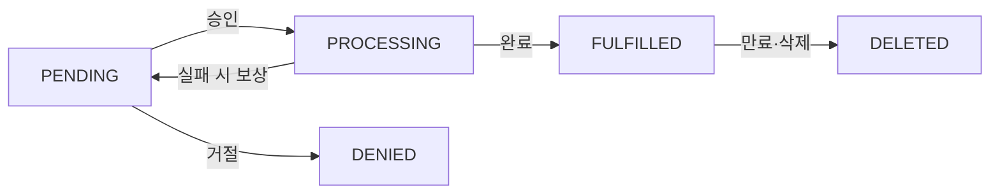

| 상태 | 설명 |
|------|------|
| `PENDING` | 신청 접수, 관리자 승인 대기 |
| `PROCESSING` | 승인 진행 중. 중복 승인 방지를 위해 사용 |
| `FULFILLED` | 승인 완료, 컨테이너 운영 중 |
| `DENIED` | 관리자 거절 |
| `DELETED` | 만료 또는 수동 삭제 |

---

## 2. 전체 흐름

로그인부터 신청, 승인, 만료 처리까지 FE·BE·Infra Server 세 주체 간 통신 흐름입니다. 승인 과정에서는 Infra Server에 Ubuntu 계정 생성과 Pod 생성을 순서대로 요청하며, 하나라도 실패하면 이전 단계를 되돌리는 보상 트랜잭션이 실행됩니다. 만료 처리는 스케줄러가 매일 08:00에 자동으로 수행합니다.

### 회원가입

이메일 인증 후 회원가입 순서입니다. 인증번호는 Redis에 5분 TTL로 저장하고, 인증 완료 상태(`VERIFIED:{email}`)는 10분간 유지됩니다. 회원가입 시 이 키가 있는지 확인하고, 저장 후 삭제합니다.

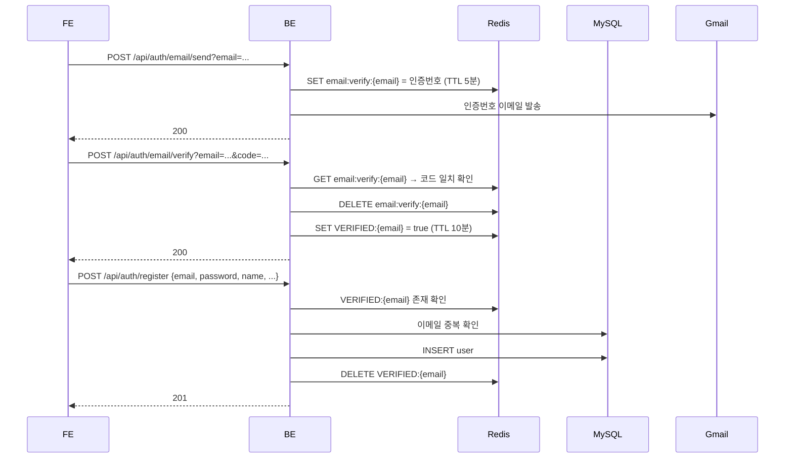

### 로그인

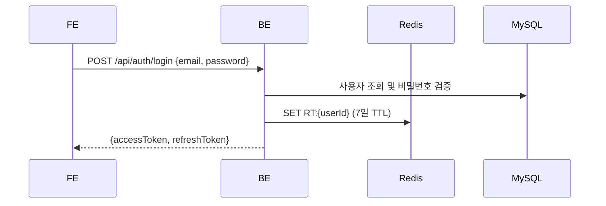

JWT 토큰 구조, 재발급, 로그아웃 흐름의 상세는 [인증·보안](인증-보안.md)을 참고합니다.

### 서버 사용 신청

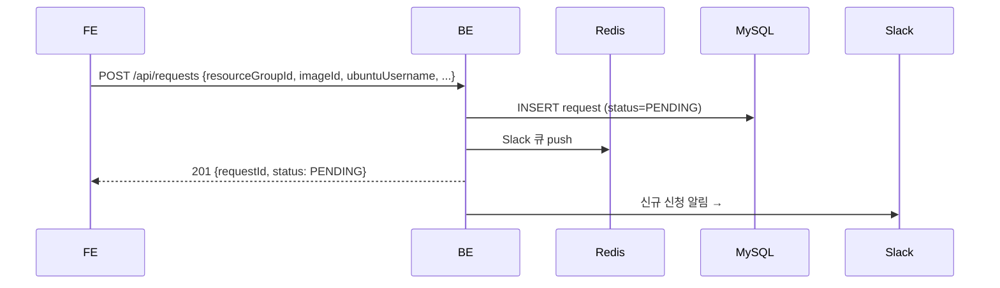

### 관리자 거절

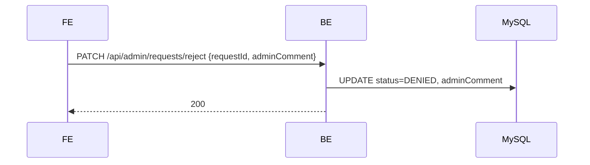

### 관리자 승인

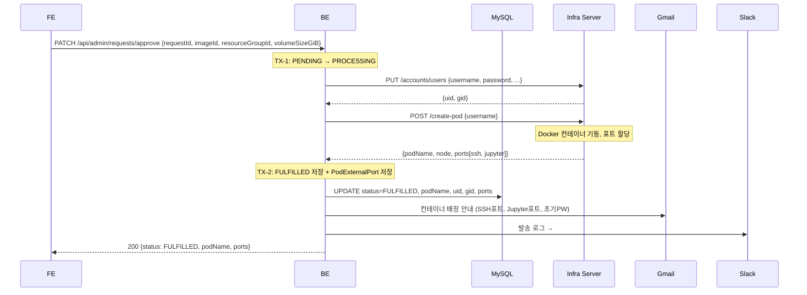

Infra Server API 구조와 WebClient 타임아웃 설정 상세는 [외부 연동](외부-연동.md)을 참고합니다.

### 변경 요청 (만료일 연장·그룹 변경 등)

FULFILLED 상태인 컨테이너에 대해 사용자가 만료일 연장, 그룹 변경, 볼륨 크기 변경 등을 요청할 수 있습니다. 변경 요청은 별도 ChangeRequest 테이블에 PENDING으로 저장되고, 관리자가 승인하면 원본 Request에 반영됩니다. 만료일 연장이 승인된 경우에만 이메일이 발송됩니다.

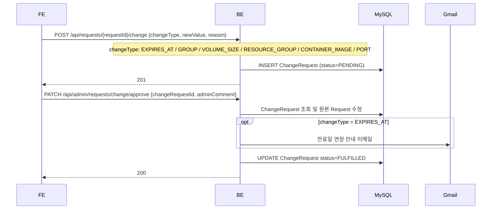

### 관리자 수동 삭제

FULFILLED 상태인 컨테이너를 관리자가 직접 삭제합니다. 스케줄러 자동 삭제와 같은 Infra 호출·이메일 흐름을 따르지만, 즉시 처리된다는 점이 다릅니다.

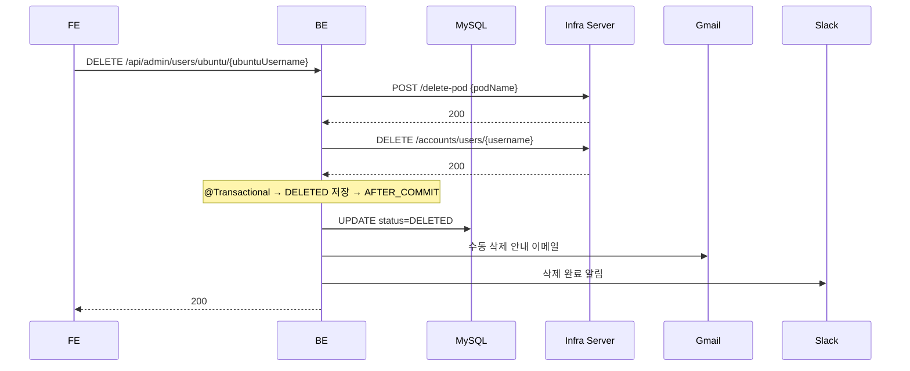

Pod 삭제나 Ubuntu 계정 삭제가 실패해도 DB는 `DELETED`로 처리되며, Infra 리소스는 수동 정리가 필요합니다. 보상 트랜잭션은 승인 흐름에만 적용됩니다.

### 만료 처리 (매일 08:00 KST, 스케줄러)

만료 예고 이메일은 SETNX로 중복 발송을 막습니다. 스케줄러가 매일 실행되기 때문에, 같은 날 같은 사용자에게 D-7 이메일이 두 번 나가는 상황이 생길 수 있습니다. 발송 전에 `email:preexpiry:{id}:{dayLabel}:{date}` 키를 Redis에 SETNX로 쓰고, 이미 키가 존재하면 발송을 건너뜁니다. TTL은 25시간이라 하루가 지나면 자동으로 만료됩니다.

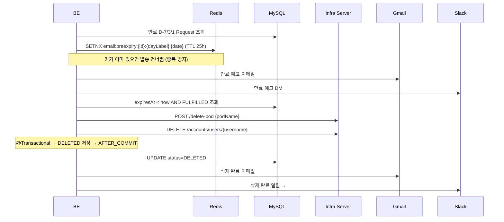

---

## 3. 스케줄러

BE 내부에 세 가지 스케줄러가 상시 동작합니다.

| 스케줄러 | 실행 | 역할 |
|---------|------|------|
| `RequestSchedulerService` | 매일 08:00 | D-7/3/1 만료 예고 알림 발송, 만료된 Request 삭제 처리 |
| `UserSchedulerService` | 매일 09:00 | 3개월 미접속 경고 → 비활성화 → 1년 후 완전 삭제 |
| `SlackNotificationWorker` | 1초 간격 | Redis 큐에서 메시지를 꺼내 Slack API로 발송, 최대 3회 재시도 |

### RequestSchedulerService

만료된 컨테이너를 삭제하는 흐름에서 주의할 점이 세 가지 있습니다.

첫째, 만료 대상 조회 시 `JOIN FETCH`로 User·ResourceGroup을 한 번에 가져옵니다. 단순 조회 후 알림 발송 단계에서 연관 엔티티를 건당 추가 조회하는 N+1 문제를 막기 위해서입니다.

둘째, 삭제 메서드 호출 시 같은 클래스 내에서 `this.delete()`로 호출하면 Spring AOP 프록시를 우회해 `@Transactional`이 적용되지 않습니다. 이를 피하기 위해 `@Transactional` 메서드를 별도 클래스(`RequestExpiryService`)로 분리하고, 해당 Bean을 주입받아 호출합니다.

셋째, 삭제 완료 알림은 `@TransactionalEventListener(phase = AFTER_COMMIT)`를 통해 DB 커밋이 확정된 후에만 발송됩니다. 트랜잭션이 롤백되면 이벤트도 함께 폐기되므로, DB에 반영되지 않은 삭제에 대한 알림이 발송되는 상황을 방지합니다.

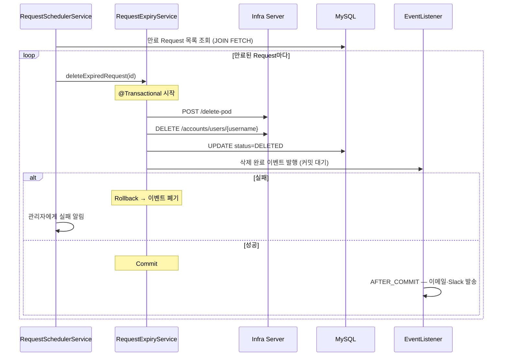

자세한 내용은 [우분투 계정 삭제 스케줄러](우분투-계정-삭제-스케줄러.md)를 참고합니다.

### UserSchedulerService

사용자 수명주기를 관리합니다. 매일 09:00에 실행되며 두 가지 작업을 처리합니다.

**1단계 — 장기 미접속 경고**

마지막 로그인 시각(`lastLoginAt`)과 해당 사용자의 가장 최근 컨테이너 만료일(`expiresAt`) 중 더 늦은 날짜를 기준으로, 3개월(`INACTIVE_MONTHS=3`) 이상 경과한 활성 사용자(`isActive=true`)를 조회해 삭제 예고 이메일을 발송합니다. 컨테이너가 활성 상태라면 로그인이 없어도 삭제 대상에서 제외됩니다. 이 시점에서는 계정을 삭제하지 않고 경고만 합니다.

**2단계 — Soft Delete**

경고 이메일을 받은 사용자가 일정 기간(`NOTIFICATION_LEAD_DAYS=8`) 내에 로그인하지 않으면 계정을 비활성화합니다. `isActive=false`, `deletedAt=now()`로 설정하고 비활성화 이메일을 발송합니다.

**3단계 — Hard Delete**

`deletedAt`이 1년(`HARD_DELETE_YEARS=1`) 이전인 사용자를 DB에서 완전히 삭제합니다.

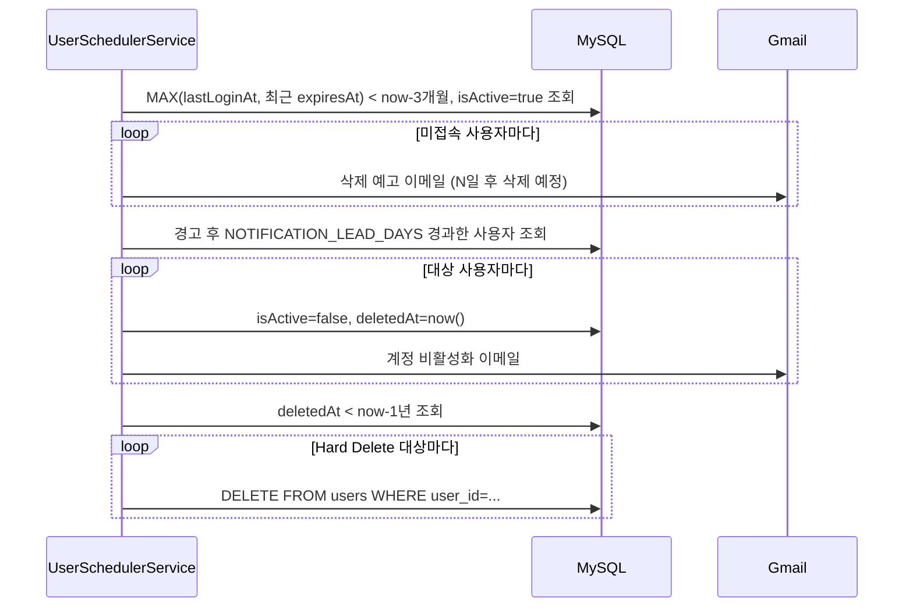

각 사용자 처리는 독립 트랜잭션으로 실행됩니다(`UserLifecycleTransactionalService`에 위임). 특정 사용자 처리 실패가 다른 사용자 처리에 영향을 주지 않습니다.

### SlackNotificationWorker

승인, 삭제 등 비즈니스 로직이 Slack API 응답을 기다리며 블로킹되는 것을 막기 위해 Redis 큐를 사이에 둡니다. 알림이 발생하면 메시지를 `slack:notification:queue`에 즉시 적재하고, `SlackNotificationWorker`가 1초마다 꺼내 Slack API를 호출합니다. 실패 시 최대 3회 재시도합니다.

1초 간격으로 설정한 이유는 Slack Webhook API의 rate limit이 채널당 초당 1건이기 때문입니다. 더 빠르게 폴링하면 제한에 걸려 메시지가 누락될 수 있습니다.

Redis List의 `RPUSH`(오른쪽 삽입)로 넣고 `LPOP`(왼쪽 꺼내기)으로 꺼내 FIFO 순서를 유지합니다. 자세한 내용은 [Redis 메시지 큐](Redis-메시지-큐-작동-원리.md)를 참고합니다.

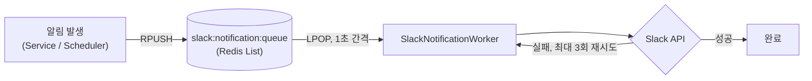

---

## 4. 내부 구조 및 통신

FE는 화면(pages)과 API 클라이언트(services)로 나뉩니다. BE는 도메인별 패키지로 구성되며 각각 Controller → Service → Repository 레이어를 따릅니다. Infra Server는 K8s 클러스터 내부 서비스로 Ubuntu 계정과 Docker 컨테이너 생성·삭제를 담당하며, BE에서만 접근합니다.

### FE 내부 구조

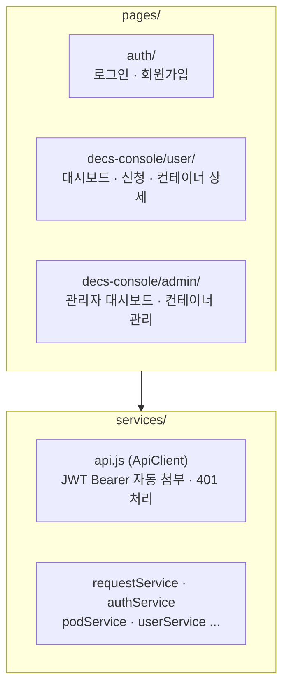

### BE 내부 구조

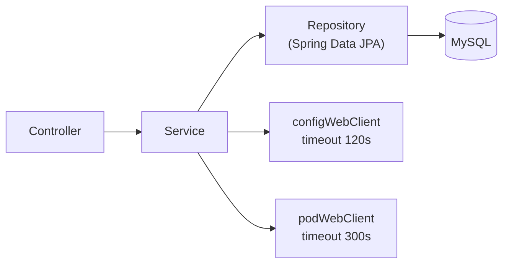

### FE ↔ BE ↔ Infra 통신

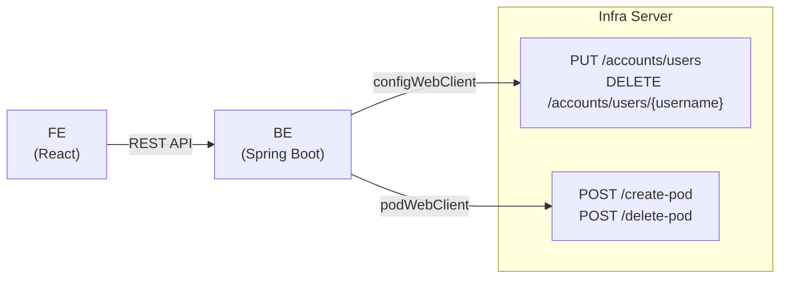

### BE 도메인 구조

```
domain/
├── requests        — 신청 접수, 승인/거절, 변경 요청 처리
├── users           — 사용자 관리, 인증
├── groups          — Ubuntu 그룹(GID) 관리
├── alarm           — 이메일·Slack 알림 발송
├── scheduler       — 만료·사용자 스케줄러, Slack 큐 Worker
├── pod             — Pod 정보 조회
├── containerImage  — 컨테이너 이미지 관리
├── resourceGroups  — 서버 그룹 관리
├── monitoring      — Prometheus 메트릭 조회
└── messageTemplate — 알림 메시지 템플릿 관리
```

### Infra Server API

K8s 클러스터 내부 서비스(`containerssh-config-service.ailab-infra.svc.cluster.local`)로 BE에서만 접근합니다. 서비스 이름에 `containerssh`가 포함되어 있으나, ContainerSSH 제품을 사용하는 것이 아니라 자체 개발된 Infra Server입니다. BE는 두 개의 WebClient를 사용해 통신합니다. 계정 관련 요청은 `configWebClient`(timeout 120s), Pod 관련 요청은 `podWebClient`(timeout 300s)입니다. Pod 생성에 더 긴 타임아웃을 두는 이유는 Docker 이미지 pull 시간이 포함되기 때문입니다.

| 엔드포인트 | 역할 |
|-----------|------|
| `PUT /accounts/users` | Ubuntu 계정 생성, uid·gid 반환 |
| `DELETE /accounts/users/{username}` | Ubuntu 계정 삭제 |
| `POST /create-pod` | Docker 컨테이너 기동, SSH·Jupyter 포트 할당 |
| `POST /delete-pod` | Docker 컨테이너 종료 |

WebClient 설정·에러 처리·보상 트랜잭션 연계 상세는 [외부 연동](외부-연동.md)을 참고합니다.

---

## 5. 도메인 설명

BE는 아래 도메인으로 구성됩니다. 각 도메인의 엔티티 구조, 생명주기, 비즈니스 규칙 상세는 [도메인 설명](도메인-설명.md)을 참고합니다.

| 도메인 | 역할 |
|--------|------|
| `users` | 사용자 계정 관리, 인증. USER / ADMIN 역할 구분 |
| `requests` | 서버 사용 신청 접수·승인·거절. ChangeRequest(변경 요청) 포함 |
| `groups` | Ubuntu 그룹(GID) 관리 |
| `alarm` | 이메일·Slack 알림 단일 진입점. 이메일 중복 방지(SETNX), Redis 큐 연계 |
| `scheduler` | 만료 Request 처리(08:00), 사용자 수명주기(09:00), Slack 큐 소비(1초 간격) |
| `pod` | Pod 정보 및 외부 포트(SSH·Jupyter) 관리 |
| `containerImage` | 컨테이너 이미지 목록 관리 |
| `resourceGroups` | FARM / LAB 서버 풀 관리 |
| `monitoring` | Prometheus 메트릭 조회 |
| `messageTemplate` | 알림 메시지 템플릿 관리. messages.properties 기본값 + DB 오버라이드 |

---

## 6. Redis 키 사용 현황

BE는 7개의 Redis 키 패턴을 사용합니다.

| 키 패턴 | 타입 | TTL | 목적 |
|---------|------|-----|------|
| `email:verify:{email}` | String | 5분 | 이메일 인증번호 임시 저장 |
| `VERIFIED:{email}` | String | 10분 | 인증 완료 상태. 이 키가 없으면 회원가입 불가 |
| `RT:{userId}` | String | 7일 | Refresh Token. 이 키가 없으면 로그아웃 상태 |
| `email:preexpiry:{requestId}:{dayLabel}:{date}` | String | 25시간 | 만료 예고 이메일 중복 발송 방지 (SETNX) |
| `slack:notification:queue` | List | 없음 | Slack 알림 FIFO 큐 (1초 간격 소비) |
| `slack:infra:notification:queue` | List | 없음 | Infra 관련 Slack 알림 전용 큐 |
| `slack:cache:users:list` | String | 1시간 | 이메일 → Slack UserId 변환용 멤버 목록 캐시 |

키 패턴별 상세 설명(저장·삭제 시점, 값 형태, redis-cli 확인 명령)은 [Redis 키 카탈로그](Redis-키-카탈로그.md)를 참고합니다.
