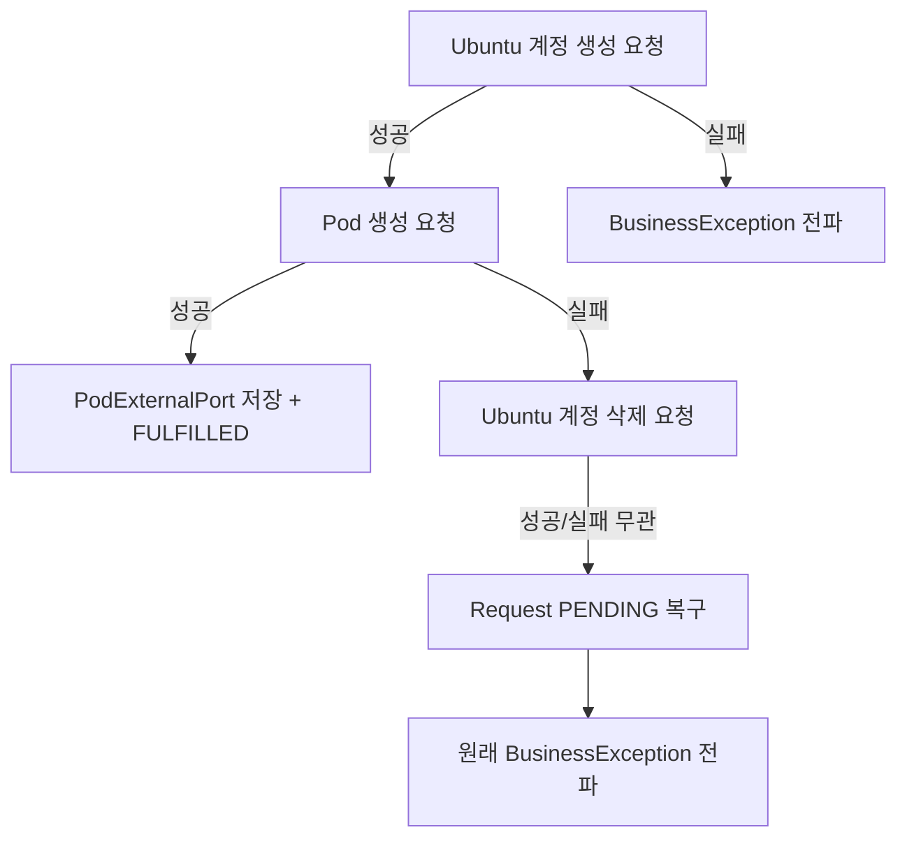

# 외부 연동

BE는 Ubuntu 계정·Pod 생성·삭제를 직접 구현된 Infra Server에 위임합니다. 두 종류의 작업은 타임아웃 특성이 달라 WebClient 인스턴스를 분리해 관리합니다.

| WebClient | 용도 | 타임아웃 |
|-----------|------|---------|
| `configWebClient` | Ubuntu 계정 생성·삭제 | 응답 120s, 연결 10s |
| `podWebClient` | Pod 생성·삭제 | 응답 300s, 연결 30s |

Pod 생성에 긴 타임아웃을 두는 이유는 Docker 이미지를 처음 pull할 때 시간이 크게 걸릴 수 있기 때문입니다. 두 WebClient 모두 같은 `config.base-url`(Infra Server)을 바라봅니다.

---

## 1. Ubuntu 계정 관리 (configWebClient)

### 계정 생성

관리자 승인 시 `AdminRequestCommandService`에서 호출합니다. 생성 성공 시 Infra Server가 반환한 `uid`와 `gid`를 Request에 저장합니다.

**요청**
```
PUT /accounts/users
Content-Type: application/json

{
  "name": "ubuntu_username",
  "passwd_base64": "base64로 인코딩된 초기 비밀번호",
  "gecos": "사용자 실명",
  "primary_group_name": "ubuntu_username",
  "supplementary_groups": [
    { "name": "ailab", "gid": 2001 }
  ]
}
```

필수 필드는 `name`과 `passwd_base64`이며, 나머지는 선택입니다. `supplementary_groups`는 사용자를 추가 그룹에 소속시킬 때 사용합니다.

**응답** (HTTP 201)

Swagger 스펙에 응답 스키마가 명시되어 있지 않으나, BE는 응답 본문에서 `uid`와 `gid`를 읽어 Request에 저장합니다.

### 계정 삭제

`UbuntuAccountService.deleteUbuntuAccount()`에서 호출합니다. 만료 처리 스케줄러와 보상 트랜잭션 두 경로에서 호출됩니다.

```
DELETE /accounts/users/{username}
```

404 응답은 계정이 이미 없는 것이므로 정상 처리로 간주하고 넘어갑니다. 삭제 결과가 "계정 없음"이라는 점에서 성공과 동일하기 때문입니다(멱등성). 보상 트랜잭션 경로에서 계정이 애초에 생성되지 않았을 때도 안전하게 호출할 수 있습니다. 400이나 다른 에러 코드는 `BusinessException(UBUNTU_USER_DELETION_FAILED)`으로 변환됩니다.

---

## 2. Pod 관리 (podWebClient)

### Pod 생성

승인 처리 중 Ubuntu 계정 생성 성공 후 호출합니다. 응답에서 `podName`, `node`, `ports` 정보를 받아 `PodExternalPort` 테이블에 저장합니다.

**요청**
```
POST /create-pod
Content-Type: application/json

{
  "username": "ubuntu_username"
}
```

**응답** (HTTP 201)
```json
{
  "status": "created",
  "node": "farm1",
  "pod_name": "ailab-user2100-1",
  "ports": [
    { "usage_purpose": "ssh",     "internal_port": 22,   "external_port": 30022 },
    { "usage_purpose": "jupyter", "internal_port": 8888, "external_port": 30888 }
  ]
}
```

4xx/5xx 응답이 오거나 응답 본문의 `pod_name`이 null이면 `BusinessException(POD_CREATION_FAILED)`를 던집니다. 이 예외는 보상 트랜잭션을 트리거해 앞서 생성한 Ubuntu 계정을 삭제하고 Request 상태를 PENDING으로 되돌립니다.

### Pod 삭제

```
POST /delete-pod
Content-Type: application/json

{
  "pod_name": "ailab-user2100-1"
}
```

`pod_name`이 null이면 호출 자체를 건너뜁니다(이미 Pod가 없는 경우를 대비). 400이나 500 응답은 `BusinessException`으로 변환됩니다.

---

## 3. 에러 처리와 보상 트랜잭션 연계

Ubuntu 계정 생성 → Pod 생성 순서로 진행하므로, 중간에 실패하면 이전 단계를 되돌려야 합니다.



Pod 생성 실패 시 Ubuntu 계정 삭제(`deleteUbuntuAccount`)가 추가로 실패하더라도 원래 예외(`POD_CREATION_FAILED`)가 그대로 전파됩니다. 로그에는 두 실패 모두 남습니다.

---

## 4. Prometheus 연동

FE 대시보드가 `GET /api/monitoring/metrics`를 폴링하면, BE가 Prometheus HTTP API에 PromQL 쿼리를 날려 결과를 가공해 반환합니다. 이 엔드포인트는 인증 없이 접근 가능한 화이트리스트 경로(`/api/monitoring/**`)입니다.

Prometheus 서버 주소는 `application.yml`의 `prometheus.base-url`에서 읽으며, 기본값은 클러스터 내부 주소(`http://10.98.198.241:9090`)입니다. 각 쿼리는 5초 타임아웃이 적용되고, 실패 시 예외를 전파하지 않고 빈 값을 반환합니다. Prometheus가 일시적으로 내려가도 대시보드 API 자체는 200으로 응답합니다.

**실행하는 PromQL 쿼리**

| 쿼리 | 설명 |
|------|------|
| `avg by(Hostname)(DCGM_FI_DEV_GPU_UTIL)` | 서버별 평균 GPU 사용률 (%) |
| `count by(Hostname)(DCGM_FI_DEV_GPU_UTIL)` | 서버별 GPU 개수 |
| `sum by(cluster)(cluster_monitor_container_running)` | 클러스터별 활성 컨테이너 수 |

GPU 메트릭은 DCGM(NVIDIA Data Center GPU Manager) Exporter가 수집합니다. 활성 컨테이너 수는 별도로 구현된 `cluster_monitor_container_running` 메트릭에서 읽어옵니다.

**응답 구조**

```json
{
  "gpuServers": [
    { "hostname": "farm1", "gpuUtil": 43.2, "gpuCount": 4 },
    { "hostname": "lab1",  "gpuUtil": 12.5, "gpuCount": 2 }
  ],
  "activeContainers": {
    "farm": 8,
    "lab": 3
  }
}
```

`gpuUtil`은 소수점 한 자리로 반올림해서 내려줍니다. 서버 목록은 `hostname` 기준 알파벳 순으로 정렬됩니다.
