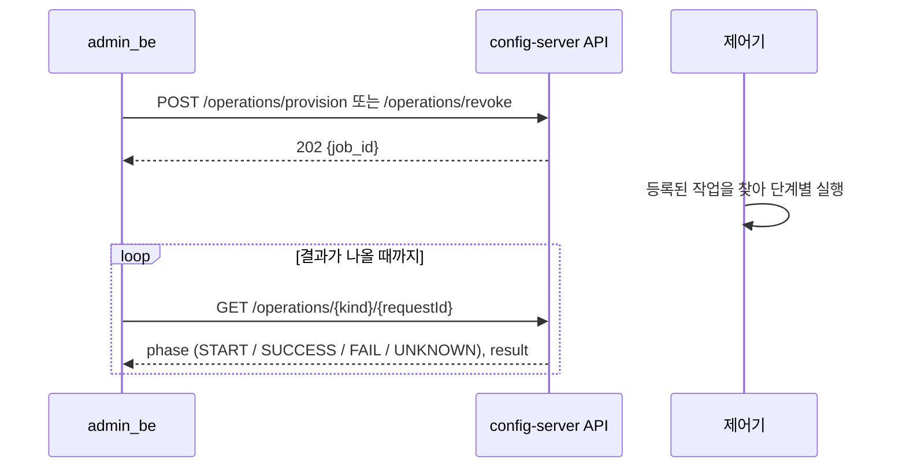

# 외부 연동

BE는 계정을 만들거나 컨테이너를 띄우는 실제 작업을 스스로 하지 않고 Infra Server(config-server)에 맡깁니다. v2.0부터 BE는 **작업을 등록만 하고 바로 돌아옵니다.** 실제 실행은 config-server의 제어기가 뒤에서 하고, BE는 결과를 조회해 신청 상태에 반영합니다. 이 문서는 그 경계에서 무엇을 주고받는지, 그리고 경계 너머가 실패했을 때 BE가 자기 상태를 어떻게 지키는지를 다룹니다.

## 0. 공통

| 항목 | 값 |
|------|----|
| 주소 | `config.base-url` (클러스터 내부 Service) |
| 인증 | 모든 호출에 `X-Internal-Token` 헤더. 값은 `config.api-token`(배포 때 Secret에서 주입). 비어 있으면 헤더를 붙이지 않는다 |
| 오류 처리 | config-server가 요청 내용 때문에 거절한 4xx는 `INFRA_REQUEST_REJECTED`(422), 5xx·연결 실패는 호출 목적별 코드(`POD_CREATION_FAILED`, `POD_DELETION_FAILED`, `POD_MIGRATION_FAILED` 등, 502)로 바뀐다. 같은 신청의 작업이 진행 중이라는 409는 `INVALID_REQUEST_STATUS`. 응답 본문은 로그와 예외 메시지에 남는다 |

| WebClient | 용도 | 응답 제한 |
|-----------|------|---------|
| `configWebClient` | 작업 등록·결과 조회·단계 기록 조회, 그룹 API | 120초(`config.timeout-seconds`), 연결 10초 |
| `podWebClient` | 고아 Pod 삭제(동기 API) | 600초(`config.pod-timeout-seconds`), 연결 30초 |

Bean 정의는 [`WebClientConfig`](https://github.com/CSID-DGU/admin_be/blob/main/src/main/java/DGU_AI_LAB/admin_be/global/config/WebClientConfig.java)에 있습니다. API 명세 전체는 [Infra API 레퍼런스](../infra/operations/API-레퍼런스.md)를 봅니다.

---

## 1. 작업 방식 (생성·회수)


```mermaid
sequenceDiagram
    participant BE as admin_be
    participant CS as config-server API
    participant CT as 제어기
    BE->>CS: POST /operations/provision 또는 /operations/revoke
    CS-->>BE: 202 {job_id}
    CT->>CT: 등록된 작업을 찾아 단계별 실행
    loop 결과가 나올 때까지
        BE->>CS: GET /operations/{kind}/{requestId}
        CS-->>BE: phase (START / SUCCESS / FAIL / UNKNOWN), result
    end
```

작업은 **신청 번호(requestId)** 로 식별합니다. 같은 신청의 같은 종류 작업이 끝나지 않았는데 다시 등록하면 409를 받습니다.

### 생성 작업 (승인)

`AdminRequestCommandService.approveRequest`가 신청을 PROCESSING으로 바꾼 뒤 등록하고 곧바로 응답합니다.

- 사용자에게 리눅스 계정이 없으면 `account`(초기 비밀번호 base64, 표시 이름, 기본·추가 그룹)를 함께 보냅니다.
- 이미 계정이 있으면 `account`를 빼고 컨테이너만 만들게 합니다. 기존 홈 디렉터리를 그대로 씁니다. 신청에서 고른 추가 그룹은 등록 전에 그룹 API로 더합니다.

결과는 `ProvisionJobPoller`가 3초(`operations.provision.poll-ms`)마다 PROCESSING 신청을 돌며 조회합니다.

| phase | 처리 |
|-------|------|
| `SUCCESS` | `completeApprovalJob` — 계정 UID/GID, Pod 이름·노드, 외부 포트를 신청에 반영하고 FULFILLED. 배정 안내 메일을 보낸 뒤 신청의 초기 비밀번호를 지운다(메일 실패여도 지운다) |
| `FAIL` | `failApprovalJob` — 신청을 PENDING으로 되돌리고 알린다. 제어기가 이번 작업이 만든 계정은 이미 되돌렸다 |
| `FAIL` + DEGRADED | 자원을 남긴 실패. 되돌리면 재승인 때 컨테이너가 하나 더 생기므로 신청을 그대로 두고 관리자에게 한 번 알린다 |
| `UNKNOWN` | 결과 불명. 신청을 그대로 두고 한 번 알린다 |

### 회수 작업 (만료·계정 삭제)

`OperationJobService.revokeAndWait`로 등록하고 **끝날 때까지 기다립니다**(호출자가 결과를 보고 다음 단계를 정하기 때문).

| 호출 | 본문 | 정리 대상 |
|------|------|----------|
| `PodService.deletePod` | `pod_name`, `delete_account=false` | NodePort Service·포트 배정·Pod·그 노드의 keytab |
| `UbuntuAccountService.deleteUbuntuAccount` | `username`, `node_name`, `delete_account=true` | 리눅스 계정·Kerberos principal (**홈 디렉터리는 보존**) |

- 같은 신청의 회수 작업이 이미 돌고 있으면(409) 새로 등록하지 않고 그 결과를 기다립니다.
- 계정을 지우려는데 이미 없으면 성공으로 봅니다(목표 상태에 이미 도달).
- `node_name`을 모르면 config-server가 계정 회수를 보류합니다. 모든 farm 노드를 훑으면 같은 이름의 무관한 옛 계정까지 지울 수 있기 때문입니다.

### 마이그레이션 작업

`PodMigrationService.startMigration`이 신청을 MIGRATING으로 바꾸고 `POST /operations/migrate`로 등록한 뒤 바로 돌아옵니다(API 응답 202). 등록이 실패하면 FULFILLED로 되돌립니다.

`MigrationJobPoller`가 3초마다 MIGRATING 신청의 결과를 조회합니다.

| phase | 처리 |
|-------|------|
| `SUCCESS` + `migrated` | 새 Pod 이름·노드·외부 포트로 바꾸고 FULFILLED. 기존 Pod 정리가 실패했으면 관리자에게 알림 |
| `SUCCESS` + `skipped` | Pod 정보는 그대로 두고 FULFILLED |
| `FAIL` | FULFILLED로 되돌리고 알림(기존 Pod는 그대로) |
| `FAIL` + DEGRADED, `UNKNOWN` | MIGRATING으로 두고 한 번 알림. Pod 상태를 확인한 뒤 정리 |

화면은 `GET /api/admin/requests/{id}/migrations/latest`로 마지막 결과(phase, migrated/skipped, 노드, 기존 Pod 정리 여부)를 확인합니다.

### 단계 기록

`GET /api/admin/requests/{requestId}/job-steps`는 config-server의 `/operations/{kind}/{requestId}/steps`를 생성·회수·마이그레이션 세 종류 모두 불러 합칩니다. 신청이 만들어지기 전에 시작된(같은 번호를 쓰던 옛 신청의) 작업은 뺍니다. 관리자 화면 신청 상세의 타임라인이 이 값을 씁니다. 컨테이너 준비 대기 단계에는 이미지를 새로 받았는지·걸린 시간·크기가 함께 오고, 그 안의 이미지 다운로드·컨테이너 시작·볼륨 마운트 재시도도 각각 단계로 옵니다.

---

## 2. 동기 API

| 호출 | config-server | 비고 |
|------|---------------|------|
| `PodService.deleteOrphanPod` | `DELETE /pods/{pod_name}` | 신청 기록이 없는 Pod만 지운다. 신청이 있는 Pod는 409(`POD_NOT_ORPHAN`) |
| `GroupService` | `POST /groups`, `POST /users/{username}/groups` | 그룹 생성, 사용자 그룹 추가 |

---

## 3. config-server가 BE를 부르는 경로

config-server는 컨테이너를 만들 때 사용자 설정(이미지, 후보 노드, 추가 포트)을 BE에서 다시 받습니다.

| 경로 | 쓰는 곳 |
|------|--------|
| `GET /api/requests/config/by-request/{requestId}` | 생성 작업 |
| `GET /api/requests/config/{username}` | 옛 동기 경로 호환(현재 작업은 모두 신청 번호로 조회) |

두 경로는 인증 화이트리스트에 있습니다([운영 가이드](운영-가이드.md)).

---

## 4. Prometheus 연동

FE 대시보드가 `GET /api/monitoring/metrics`를 폴링하면, BE가 Prometheus HTTP API에 PromQL 쿼리를 날려 결과를 가공해 반환합니다. 이 엔드포인트는 인증 없이 접근 가능한 화이트리스트 경로(`/api/monitoring/**`)입니다.

Prometheus 서버 주소는 `prometheus.base-url` 설정에서 읽습니다. 각 쿼리는 5초 타임아웃이 적용되고, 실패 시 예외를 전파하지 않고 빈 값을 반환합니다. Prometheus가 일시적으로 내려가도 대시보드 API 자체는 200으로 응답합니다.

| 쿼리 | 설명 |
|------|------|
| `avg by(Hostname)(DCGM_FI_DEV_GPU_UTIL)` | 서버별 평균 GPU 사용률 (%) |
| `count by(Hostname)(DCGM_FI_DEV_GPU_UTIL)` | 서버별 GPU 개수 |
| `sum by(cluster)(cluster_monitor_container_running)` | 클러스터별 활성 컨테이너 수 |

```json
{
  "gpuServers": [
    { "hostname": "farm1", "gpuUtil": 43.2, "gpuCount": 4 },
    { "hostname": "lab1",  "gpuUtil": 12.5, "gpuCount": 2 }
  ],
  "activeContainers": { "farm": 8, "lab": 3 }
}
```

`gpuUtil`은 소수점 한 자리로 반올림합니다. 서버 목록은 `hostname` 기준 알파벳 순입니다.
