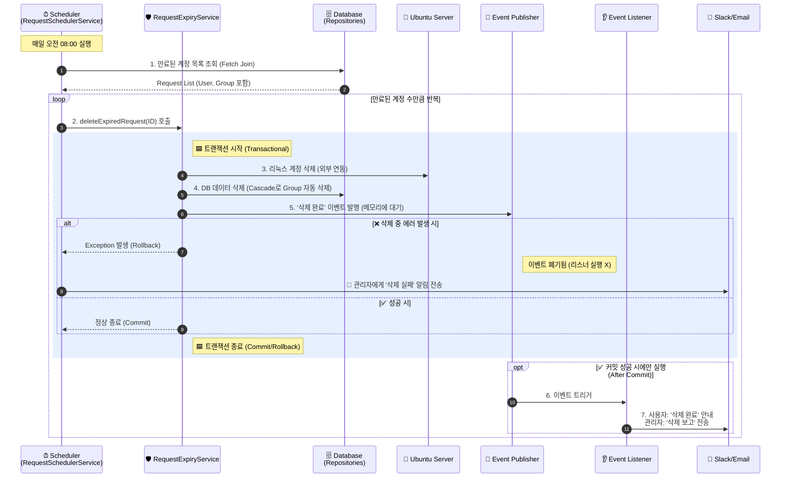
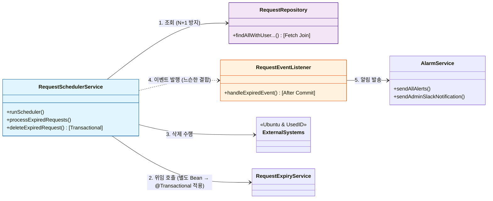

# 1. 🔄 안전한 삭제 프로세스 흐름도
> - alt(Alternative) = if - else
> - opt(Optional) = 단독 if (without else)

### 요약
- 파란색 박스 (트랜잭션): 이 안에서 일어나는 모든 일(DB 삭제, 리눅스 삭제)은 하나의 운명입니다. 하나라도 실패하면 다 같이 없었던 일이 됩니다(Rollback).
- 이벤트 대기: 5번에서 이벤트를 발행했지만, 바로 알림이 가지 않습니다. 트랜잭션이 성공적으로 커밋될 때까지 기다립니다.
- 안전장치: 만약 DB 삭제가 실패해서 롤백되면? 이벤트도 같이 사라집니다. 그래서 "삭제 안 됐는데 알림이 가는 사고"가 절대 발생하지 않습니다.

### 상세 설명
**1️⃣ 만료된 계정 목록 조회 (Fetch Join)**
동작: 스케줄러가 DB에서 `expiresAt`이 지난 계정들을 매일 정해진 시간마다 조회합니다.

핵심: 이때 단순히 findAll을 하지 않고 JOIN FETCH를 사용합니다. User(사용자)와 ResourceGroup(서버 정보)을 한 번의 쿼리로 미리 다 가져와서, 나중에 알림 보낼 때 N+1 성능 문제가 발생하지 않도록 최적화했습니다.

**2️⃣ 트랜잭션 진입 (Self-Invocation 해결)**
동작: 조회된 각 계정에 대해 삭제 메서드(deleteExpiredRequest)를 호출합니다.

핵심: 여기서 `this.delete...`가 아니라 별도 클래스(`RequestExpiryService`)의 메서드를 호출합니다. 같은 클래스 내부 호출은 트랜잭션(`@Transactional`)이 무시되기 때문에, 분리된 Bean(Spring 프록시)을 통해 진입하여 트랜잭션을 강제로 시작시킵니다.

**3️⃣ 리눅스 계정 삭제 (외부 Infra Server 연동)**
- 동작: 실제 Ubuntu 서버에 접속하여 사용자 계정과 홈 디렉터리를 삭제합니다.
- 핵심: 이 작업은 되돌리기 어렵기 때문에 가장 먼저 수행하고, 실패하면 즉시 전체 로직을 Rollback합니다.
- 추가 정보: Spring Application 내에서 Infra Server들은 모두 '외부 서버' 등의 워딩으로 처리하고 있습니다. 다른 관리자들과 소통할 때에는 Infra Server, Flask Server라고 하면 됩니다.  

**4️⃣ DB 데이터 삭제 (Cascade가 가장 중요!)**
- 동작: Request 엔티티를 삭제합니다.
- 핵심: 연관된 UsedId(UID 정보)와 Group 엔티티가 Cascade(연쇄 삭제) 설정에 의해 자동으로 깔끔하게 함께 삭제됩니다. (FK 에러 방지)

**5️⃣ '삭제 완료' 이벤트 발행**
- 동작: "삭제가 완료되었다"는 사실을 담은 이벤트를 발행합니다.
- 핵심: 이벤트를 발행했다고 해서 바로 알림이 가지 않습니다. 이 이벤트는 아직 트랜잭션 메모리 안에 갇혀 있으며, 커밋이 될 때까지 대기합니다.

**6️⃣ [Alt: 실패] 예외 발생 및 롤백**
- 상황: 만약 3번(리눅스)이나 4번(DB) 과정 중 에러가 발생했다면?
- 동작: 진행 중이던 모든 DB 작업을 취소(Rollback)하고, 5번에서 대기 중이던 이벤트도 폐기합니다.

**7️⃣ [Alt: 실패] 관리자 경고 알림**
- 동작: 롤백된 후, catch 블록에서 관리자 채널에만 "삭제 실패" 알림을 보냅니다.
- why?: 사용자는 자신의 계정이 삭제되지 않았으므로 잘못된 알림을 받지 않게 되고, 관리자는 문제를 인지하고 대응할 수 있습니다.

**8️⃣ [Alt: 성공] 트랜잭션 커밋 (Commit)**
- 상황: 3번, 4번 과정이 모두 에러 없이 끝났다면?
- 동작: DB에 변경 사항을 영구적으로 저장(Commit)합니다.

**9️⃣ [Opt] 리스너 트리거 (After Commit)**
- 동작: 커밋이 성공한 직후, 숨죽이고 있던 이벤트 리스너(`@TransactionalEventListener`)가 깨어납니다.
- 핵심: `phase = AFTER_COMMIT` 옵션 덕분에, 오직 "DB 삭제가 확실해진 시점"에만 실행됩니다.

**🔟 사용자 알림 발송 (삭제 완료)**
- 동작: 리스너가 사용자에게 이메일과 슬랙으로 "계정이 삭제되었습니다"라는 메시지를 보냅니다.
- why?: 이제는 DB에서 데이터가 진짜로 사라졌기 때문에, 사용자에게 확신을 가지고 알림을 보낼 수 있습니다.

**1️⃣1️⃣ 관리자 보고 전송**
- 동작: 동시에 관리자 슬랙 채널(Lab/Farm 구분)에 "누구의 어떤 계정이 삭제되었는지" 요약 리포트를 보냅니다.
- 완료: 이로써 하나의 계정에 대한 모든 삭제 프로세스가 안전하게 종료됩니다.

# 2. 🏗️ 컴포넌트 의존 관계도

이 구조도는 하나의 클래스가 너무 많은 일을 하지 않도록 책임(Role)을 분리한 것이 핵심입니다. 특히 "삭제하는 놈(Scheduler)"과 "알림 보내는 놈(Listener)"을 떼어놓은 이유를 이해하는 것이 중요합니다.

**1️⃣ 조회 최적화 (Scheduler ➡ Repository)**
- 역할: 스케줄러가 DB에서 데이터를 가져오는 단계입니다.
- 핵심 (Fetch Join): 단순히 데이터를 가져오는 게 아닙니다. Request만 가져오면 나중에 알림 보낼 때 User 정보가 없어서 DB를 또 조회해야 합니다(N+1 문제).
- 설명: 그래서 처음부터 "User랑 ResourceGroup 정보까지 한 방에 다 가져와!"라고 Repository에 요청합니다. 덕분에 성능이 빨라집니다.

**2️⃣ 트랜잭션 적용을 위한 우회 (Self-Invocation)**
- 역할: 스케줄러가 자기 자신의 삭제 메서드를 호출하는 단계입니다.
- 핵심 (Proxy): 여기서 "왜 굳이 별도 클래스(`RequestExpiryService`)를 만들어서 쓸까?"라는 의문이 들 수 있습니다.
- 설명: 같은 클래스 안에서 그냥 메서드를 부르면(this.method()), Spring이 트랜잭션 관리(@Transactional)를 못 해줍니다. `RequestExpiryService`는 Spring이 프록시로 감싸고 있는 Bean이므로, 이 Bean을 통해 호출하면 트랜잭션이 확실하게 걸립니다.

**3️⃣ 외부 시스템 제어 (Scheduler ➡ External Systems)**
- 역할: 실제 비즈니스 로직을 수행하는 단계입니다.
- 설명: 여기서 두 가지 중요한 외부 작업을 처리합니다.
1) Ubuntu PVC Service: 외부 서버 API 요청을 보내서 계정을 날려버립니다. (Spring Application이 Client가 됨)
2) ID Allocation Service: UsedId(할당된 UID 번호)를 시스템에 반납합니다.
- 이 단계는 트랜잭션 안에서 수행되므로, 에러가 나면 깔끔하게 취소됩니다.

**4️⃣ 이벤트 발행과 느슨한 결합 (Scheduler ⇢ Listener)**
- 역할: 삭제가 끝났음을 시스템에 알리는 단계입니다. (점선 화살표)
- 핵심 (Loose Coupling): 스케줄러는 "알림을 어떻게 보내는지" 전혀 모릅니다. 그냥 "나 삭제 끝났어!"라고 소리만 칩니다(Event Publish).
- 설명: 이렇게 분리해 놓은 덕분에, 나중에 알림 방식을 이메일에서 카톡 등으로 바꾸더라도 스케줄러 코드는 한 줄도 수정할 필요가 없습니다. 서로 의존성을 끊어내어 코드가 유연해졌습니다.

**5️⃣ 알림 발송 (Listener ➡ AlarmService)**
- 역할: 실제로 사용자에게 메시지를 쏘는 단계입니다.
- 핵심 (After Commit): 이 리스너는 아주 신중한 친구입니다. 스케줄러가 "끝났다"고 해도 바로 안 움직이고, "DB에 진짜 Commit 됐나?"를 확인한 뒤에 움직입니다.
- 설명: DB 저장이 확인되면 그때서야 AlarmService를 이용해 슬랙과 이메일을 발송합니다. "DB는 롤백됐는데 알림만 가는 유령 현상"을 막아주는 수문장 역할입니다.