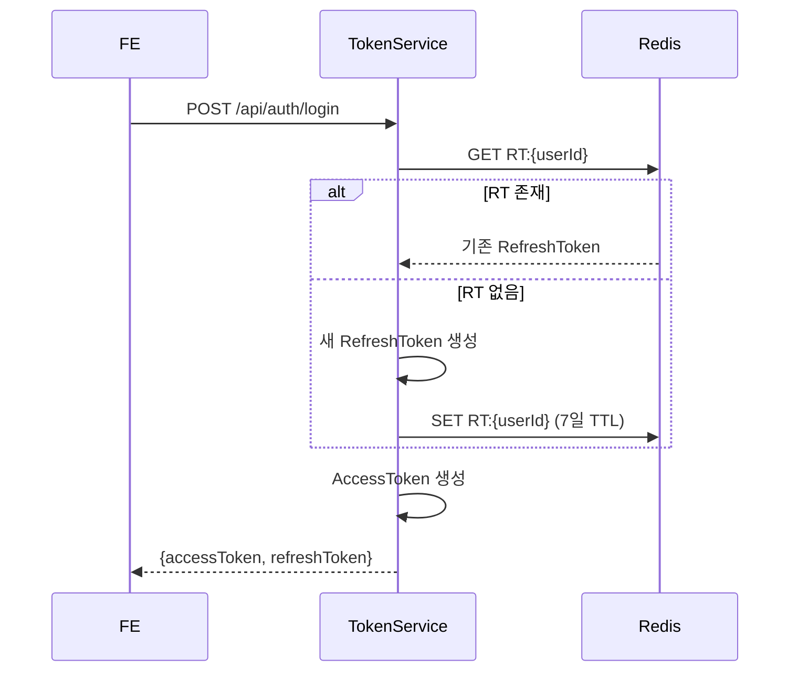
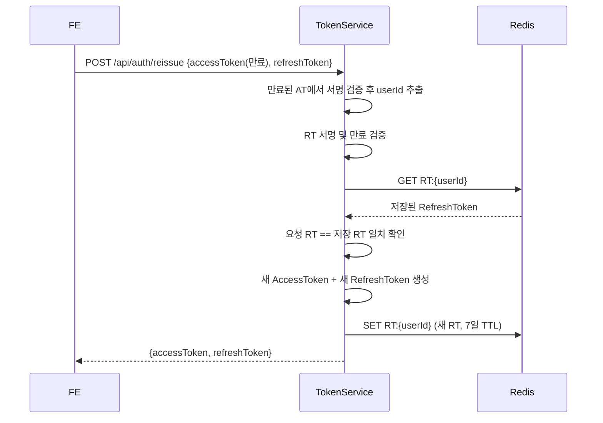
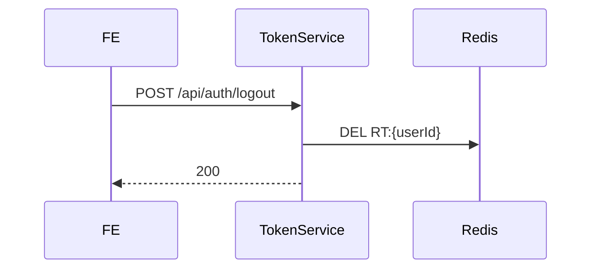
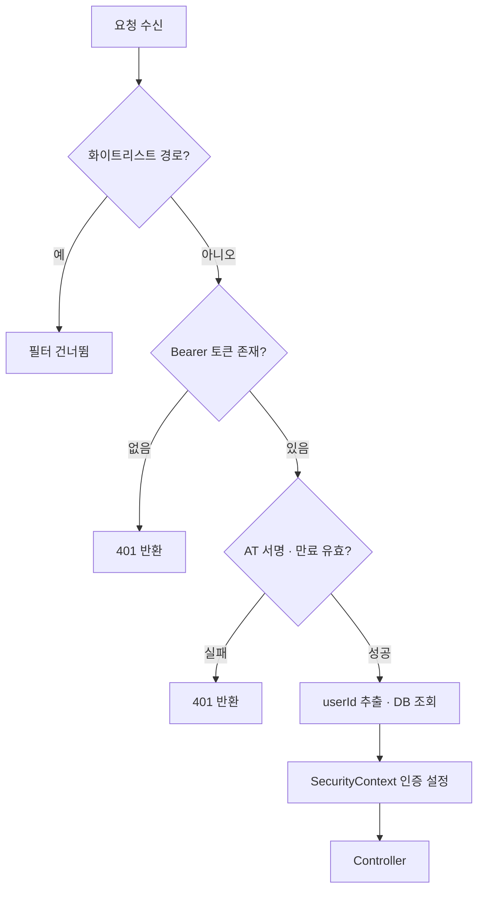

# 인증·보안

JWT와 Redis를 조합해 인증을 처리합니다.

AT와 RT를 분리하는 이유는 **검증 속도**와 **세션 제어** 두 가지입니다. AT는 모든 API 요청에 붙어오기 때문에 Redis나 DB 조회 없이 서명만 검증해 빠르게 처리합니다(Stateless). 반면 RT는 Redis에 저장하기 때문에 언제든 삭제해 즉시 세션을 종료할 수 있습니다. 로그아웃하면 Redis에서 RT를 지우고, 이후 AT가 만료돼 재발급을 시도할 때 Redis에 키가 없으므로 거부됩니다.

| | AccessToken | RefreshToken |
|--|------------|-------------|
| TTL | `application.yml` 설정값 (기본 1시간) | `application.yml` 설정값 (기본 7일) |
| 저장 위치 | 저장 안 함 (Stateless) | Redis `RT:{userId}` |
| 검증 방식 | 서명만 확인, I/O 없음 | Redis 조회 필요 |
| 사용 시점 | 모든 API 요청 | AT 만료 시 재발급 한 번 |
| 세션 종료 | 만료 전 직접 취소 불가 | Redis 키 삭제로 즉시 무효화 |

토큰의 `subject`에는 `userId`(Long)가 담깁니다. 서명 알고리즘은 HS256이며, secret key는 `application.yml`의 `jwt.secret`에서 읽어옵니다.

---

## 1. 토큰 발급 (로그인)

로그인 성공 시 AccessToken과 RefreshToken을 발급합니다. RefreshToken은 Redis에 이미 유효한 토큰이 있으면 재사용하고, 없으면 새로 발급합니다. 이 덕분에 여러 기기에서 로그인해도 RT가 중복 발급되지 않습니다.

---

## 2. 토큰 재발급

AT가 만료되면 클라이언트는 보관 중인 RT로 재발급을 요청합니다. 재발급 시 AT와 RT 모두 새로 발급됩니다. RT도 함께 교체하는 이유는 보안 때문입니다. RT가 탈취된 상황에서 정상 사용자가 먼저 재발급을 완료하면 Redis의 값이 새 RT로 교체되므로, 공격자가 이전 RT로 시도할 때 Redis 값과 일치하지 않아 거부됩니다.

재발급 흐름에서 주의할 점이 하나 있습니다. AT가 만료된 상태이므로 일반적인 검증(`parseClaimsJws`)을 쓰면 예외가 납니다. `JwtProvider.getSubjectFromExpiredToken()`은 만료된 AT에서도 서명이 유효하면 `ExpiredJwtException`의 claims를 꺼내 `userId`를 반환합니다. 서명 자체가 잘못된 경우에는 예외가 그대로 전파돼 재발급이 거부됩니다.

재발급이 거부되는 경우:
- 만료된 AT의 서명이 유효하지 않을 때
- RT가 만료됐을 때
- RT가 Redis에 없을 때 (로그아웃된 계정)
- 요청의 RT와 Redis에 저장된 RT가 다를 때

---

## 3. 로그아웃

Redis에서 `RT:{userId}` 키를 삭제합니다. 이후 해당 userId의 RT로 재발급 요청이 들어오면 Redis에 키가 없어 거부됩니다. AccessToken은 서버에 저장하지 않으므로 만료 전까지는 유효하지만, 짧은 TTL(1시간) 덕분에 실제 보안 영향은 제한됩니다.

---

## 4. 요청 인증 흐름 (JwtAuthenticationFilter)

모든 API 요청은 `JwtAuthenticationFilter`를 통과합니다. `OncePerRequestFilter`를 상속하므로 요청당 정확히 한 번만 실행됩니다.

필터가 건너뛰는 화이트리스트 경로(`UNPROTECTED_PATHS`)는 [운영 가이드](운영-가이드.md) 화이트리스트 설정 섹션에서 관리합니다.

AccessToken은 `Authorization: Bearer {token}` 헤더에서 추출합니다. 헤더가 없거나 `Bearer `로 시작하지 않으면 즉시 401을 반환합니다.

검증 실패 시 필터에서 바로 JSON 에러 응답을 씁니다. Spring의 `ExceptionHandlingFilter`를 거치지 않기 때문에 `GlobalExceptionHandler`가 아닌 필터 내부의 `setErrorResponse()`에서 직접 응답을 만듭니다.

---

## 5. 역할 기반 접근 제어

사용자 `Role`은 `USER`와 `ADMIN` 두 가지입니다. 관리자 기능은 `/api/admin/**` 경로로 분리되어 있으며, `SecurityConfig`에서 해당 경로에 `ADMIN` 권한을 요구합니다.

`Role`을 변경하는 별도 API는 제공하지 않습니다. 필요한 경우 MySQL에 직접 접속해 수정합니다. 접속 방법은 [운영 가이드](운영-가이드.md) MySQL 직접 접속 섹션을 참고합니다.
