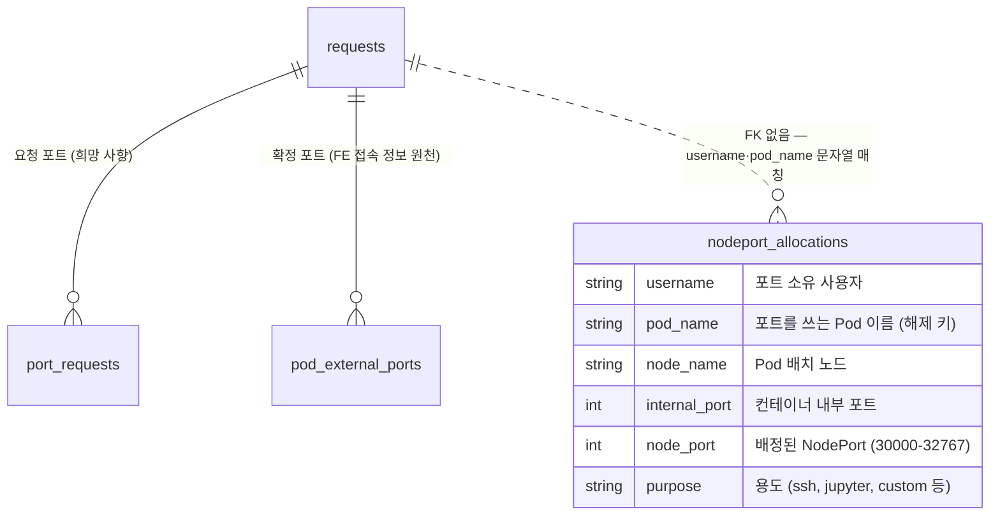

# 데이터베이스

데이터베이스 스키마/트랜잭션/운영 절차가 어떻게 구성되는지 정리한 페이지이다.   
배경이 되는 전체 흐름은 [시스템 아키텍처](시스템-아키텍처.md)를 먼저 읽으면 이해하기 쉽다.

---

## 1. 전체 데이터 베이스

| DB                        | 소유               | 용도                                                                  | 관할                          |
| ------------------------- | ---------------- | ------------------------------------------------------------------- | --------------------------- |
| infra-mysql `pod_port_db` | config-server 전용 | 어떤 포트를 누가 사용하는지 `nodeport_allocations` 테이블에 기록한다. | 이 저장소(admin_infra)          |
| admin_be MySQL            | admin_be(WAS)    | 신청·사용자 정보를 관리한다.                                                    | 별도 저장소이며, 이 문서에서는 이름만 언급한다. |

NodePort 배정은 동시에 두 요청이 들어오더라도 같은 포트를 중복 배정해서는 안 되는 작업이다. 따라서 여러 요청이 동시에 들어왔을 때 한 번에 하나씩 처리되도록 동시성을 제어해야 한다. 해당 잠금은 실제 배정을 수행하는 config-server 측 DB에서 처리한다.

신청과 사용자 정보는 admin_be의 관심사이므로 admin_be MySQL에서 관리한다. 두 시스템은 서로의 DB를 직접 조회하지 않고 API를 통해서만 통신한다.

NodePort 배정 장부가 한곳에만 존재하므로 포트 중복 배정 문제가 발생했을 때 infra-mysql 위주로 확인하면 된다.

---

## 2. infra-mysql 배포 형태

infra-mysql 배포는 `infra-sql/` 디렉터리의 manifest 2개로 구성

| 리소스                       | 내용                                                                                                  |
| ------------------------- | --------------------------------------------------------------------------------------------------- |
| StatefulSet `infra-mysql` | `mysql:8.0.36` 이미지, replicas는 1이고 Namespace는 `ailab-infra`이다.                                 |
| Service `infra-mysql`     | ClusterIP 타입이며 3306 포트를 제공. config-server는 `db.host: "infra-mysql"`로 접속한다.                        |
| StorageClass `sc-mysql`   | NFS CSI인 `nfs.csi.k8s.io`를 사용. NAS export를 백엔드로 사용하며 `reclaimPolicy: Retain`, `nfsvers=3`으로 설정. |
| PVC `mysql-data`          | StatefulSet의 `volumeClaimTemplate`으로 생성되며 용량은 10Gi. `/var/lib/mysql`에 마운트.                      |

StatefulSet은 Pod 이름과 스토리지를 고정하는 Kubernetes 워크로드이다. 따라서 infra-mysql Pod의 이름은 항상 `infra-mysql-0`이다.

### 계정과 DB 생성 주체

계정과 데이터베이스는 MySQL 공식 이미지의 초기화 동작이 생성한다.

공식 MySQL 이미지는 데이터 디렉터리가 비어 있는 최초 기동 시 다음 환경변수를 읽어 초기화를 수행한다.

| 환경변수             | 역할                                           |
| ---------------- | -------------------------------------------- |
| `MYSQL_DATABASE` | 지정한 데이터베이스를 생성. 이 시스템에서는 `pod_port_db`.  |
| `MYSQL_USER`     | 일반 사용자 계정을 . 이 시스템에서는 `pod_port_user`. |
| `MYSQL_PASSWORD` | 생성한 사용자 계정의 비밀번호를 설정.                      |

이미지는 생성한 사용자에게 `MYSQL_DATABASE`로 지정한 데이터베이스의 전체 권한을 부여한다.

즉, DCL(Data Control Language)인 `CREATE USER`, `GRANT` 등의 처리를 공식 이미지의 최초 초기화 동작에 위임한 구조이다.

현재 상태는 다음과 같다.

* 배포 매니페스트와 코드에 수동 `GRANT` 구문이 없다.
* 계정과 권한 생성은 MySQL 이미지의 초기화 동작에 위임한다.
* 별도의 init SQL 파일이나 초기 스키마 스크립트가 없다.

config-server는 Kubernetes Secret인 `config-server-db-secret`에서 비밀번호를 `DB_PASSWORD` 환경변수로 주입받는다. infra-mysql 측 비밀번호는 배포 manifest나 Secret을 `kubectl`로 조회한다.

---

## 3. 스키마와 DDL 관리

infra-mysql에서 사용하는 테이블은 **`nodeport_allocations`**

코드 전체를 기준으로 확인하면 `server_nodes`와 같은 다른 테이블은 사용하지 않는다.

| 컬럼              | 역할                                                         |
| --------------- | ---------------------------------------------------------- |
| `username`      | 포트를 소유한 사용자를 기록한다.                                         |
| `pod_name`      | 포트를 사용하는 사용자 Pod 이름이다. 포트 해제와 동기화 작업의 키로 사용한다.             |
| `node_name`     | Pod가 배치된 Kubernetes 노드를 기록한다.                              |
| `internal_port` | 컨테이너 내부 포트이다. 예시는 22, 8888 등이다.                            |
| `node_port`     | 외부 접근을 위해 배정한 NodePort이다. 기본 Kubernetes 범위는 30000~32767이다. |
| `purpose`       | 포트의 용도를 기록한다. 예시는 `ssh`, `jupyter`, `custom` 등이다.          |

### DDL 생성 주체

DDL(Data Definition Language)은 테이블 구조를 생성하거나 변경하는 SQL이다. 대표적인 구문은 `CREATE TABLE`, `ALTER TABLE`이다.

현재 코드에는 `CREATE TABLE` 구문이 없다.

따라서 **자동 스키마 부트 스트랩 기능이 없으며, DB를 새로 구축하면 `nodeport_allocations` 테이블을 수동으로 생성해야 한다.**

위 컬럼 목록은 코드의 `INSERT`와 `SELECT`가 실제로 사용하는 컬럼을 기준으로 작성 되었다.

자동 증가 ID, 기본 키, 인덱스, 컬럼 타입과 같이 코드에 직접 드러나지 않는 항목은 미확인 상태이다. 따라서 DB를 재구축할 때는 기존 DB에서 추출한 다음 결과를 우선 사용해야 한다.

```sql
SHOW CREATE TABLE nodeport_allocations;
```

기존 스키마 백업이 없는 경우에만 위 컬럼 목록을 기준으로 새 DDL을 정의한다.

### 재구축용 DDL 실행 절차

```bash
kubectl exec -it infra-mysql-0 -n ailab-infra -- \
  mysql -u pod_port_user -p pod_port_db
```

MySQL 접속 후 `nodeport_allocations` 테이블 생성 DDL을 실행한다.

```sql
CREATE TABLE nodeport_allocations (
    ...
);
```

실제 운영 환경에서는 기존 DB의 `SHOW CREATE TABLE` 결과를 사용해야 한다.

---

## 4. Flask에서의 사용 패턴

### 4.1 접속 방식

config-server의 MySQL 라이브러리는 PyMySQL이다.

`utils.py`의 `get_db_connection()` 함수가 다음 환경변수를 읽어 DB에 접속한다.

| 환경변수          | 역할               |
| ------------- | ---------------- |
| `DB_HOST`     | MySQL 호스트이다.     |
| `DB_USER`     | MySQL 사용자이다.     |
| `DB_PASSWORD` | MySQL 비밀번호이다.    |
| `DB_NAME`     | 사용할 데이터베이스 이름이다. |


포트 배정, 해제, 동기화와 같은 작업 단위마다 새로운 DB 연결을 생성하고, 작업이 끝나면 `finally` 구문에서 연결을 닫는다.

`autocommit=False`로 동작하므로 SQL 실행 후 명시적으로 `commit()`을 호출해야 변경 사항이 반영된다.

---

### 4.2 포트 배정 트랜잭션

NodePort 배정 트랜잭션은 `main.py`의 `allocate_nodeports()` 함수가 담당한다.

처리 순서는 다음과 같다.

1. 사용 중인 포트 목록을 `FOR UPDATE`로 조회한다.

```sql
SELECT node_port
FROM nodeport_allocations
FOR UPDATE;
```

2. NodePort 범위인 30000~32767에서 사용하지 않는 포트를 찾는다.
3. 요청한 포트 개수만큼 `nodeport_allocations`에 행을 삽입한다.
4. 모든 삽입이 성공하면 `conn.commit()`으로 트랜잭션을 확정한다.
5. 예외가 발생하면 `conn.rollback()`으로 전체 작업을 취소한다.

트랜잭션은 여러 SQL 작업을 하나의 작업 단위로 묶어 모두 성공하거나 모두 취소되도록 만드는 기능이다.

---

### 4.3 SELECT ... FOR UPDATE를 사용하는 이유

두 개의 승인 요청이 거의 동시에 들어오면 두 트랜잭션이 같은 시점에 동일한 빈 포트 목록을 읽을 수 있다.

잠금이 없다면 다음과 같은 경쟁 상태가 발생할 수 있다.

1. 트랜잭션 A가 30042번 포트가 비어 있다고 판단한다.
2. 트랜잭션 B도 30042번 포트가 비어 있다고 판단한다.
3. A와 B가 모두 30042번 포트를 배정하려고 한다.
4. 같은 NodePort가 두 사용자에게 중복 배정된다.

`SELECT ... FOR UPDATE`는 현재 트랜잭션이 조회한 행에 배타적 잠금을 건다.

두 번째 트랜잭션은 첫 번째 트랜잭션이 `commit`하거나 `rollback`할 때까지 기다리게 된다. 따라서 동시에 들어온 포트 배정 요청도 순차적으로 처리된다.

이 구조를 통해 NodePort 중복 배정을 방지한다.

---

### 4.4 포트 해제와 동기화

| 함수                                          | 동작                                       |
| ------------------------------------------- | ---------------------------------------- |
| `release_nodeports(pod_name)`               | 해당 `pod_name`과 연결된 행을 삭제한 후 commit한다.    |
| `reconcile_nodeport_allocations(namespace)` | DB 장부와 Kubernetes 실제 상태를 비교하여 불일치를 정리한다. |

#### release_nodeports

`release_nodeports(pod_name)`은 특정 Pod가 사용하던 NodePort 배정 정보를 삭제한다.

처리 방식은 다음과 같다.

```sql
DELETE FROM nodeport_allocations
WHERE pod_name = <pod_name>;
```

삭제 후 `commit()`을 호출한다.

#### reconcile_nodeport_allocations

`reconcile_nodeport_allocations(namespace)`는 infra-mysql의 장부와 Kubernetes의 실제 NodePort Service 목록을 비교한다.

이 동기화 작업에서는 Kubernetes의 실제 Service 상태를 기준 원본으로 사용한다.

다음 조건에 해당하는 DB 행을 삭제한다.

> Kubernetes에서는 이미 Service가 사라졌지만 infra-mysql에는 배정 기록이 남아 있는 경우이다.

포트 배정 직전에 동기화 함수를 호출하지만, 매 요청마다 Kubernetes API와 DB를 전체 조회하지 않도록 최소 실행 간격을 5분인 300초로 제한한다.

동기화에 실패하면 트랜잭션을 rollback한다. 다만 동기화 실패는 치명적 오류로 처리하지 않으며, 포트 배정 작업은 계속 진행한다.


---

## 5. 운영 절차

### 5.1 상태 확인

접속 방법은 [관리자 매뉴얼](../operations/운영-매뉴얼.md)의 관리자 접근점 표를 따른다.

`kubectl exec`로 `infra-mysql-0` Pod 내부에서 MySQL 클라이언트를 실행한다. 비밀번호는 Kubernetes Secret에서 조회한다.

```bash
kubectl exec -it infra-mysql-0 -n ailab-infra -- \
  mysql -u pod_port_user -p pod_port_db
```

현재 점유 중인 포트 전체는 다음 쿼리로 조회한다.

```sql
SELECT
    username,
    pod_name,
    node_port,
    purpose
FROM nodeport_allocations
ORDER BY node_port;
```

특정 사용자의 포트 배정 현황은 다음 쿼리로 조회한다.

```sql
SELECT *
FROM nodeport_allocations
WHERE username = '<username>';
```

---

### 5.2 백업

현재 자동 백업은 구성되어 있지 않다.

배포 매니페스트와 코드 어디에도 다음 구성은 존재하지 않는다.

* `mysqldump` 자동 실행
* Kubernetes CronJob
* 외부 백업 스크립트
* 정기 스냅샷 설정

현재 데이터 보호 장치는 StorageClass의 다음 설정뿐이다.

```yaml
reclaimPolicy: Retain
```

`Retain` 정책은 PVC나 StatefulSet을 삭제하더라도 NFS 위의 PV 데이터를 자동으로 제거하지 않도록 한다.

다만 이는 백업이 아니라 삭제 방지 장치이다. 파일 손상, 잘못된 SQL 실행, NAS 장애에는 대응하지 못한다.

infra-mysql의 데이터는 NodePort 배정 장부 하나이므로 데이터가 유실되더라도 Kubernetes 실제 Service 상태를 기준으로 장부를 다시 구성하거나 포트를 재배정할 수 있다.

그러나 스키마 정의는 코드에서 자동으로 생성되지 않으므로 다음 결과를 별도로 백업하는 것이 필요하다.

```sql
SHOW CREATE TABLE nodeport_allocations;
```

---

### 5.3 재구축 순서

infra-mysql 재구축은 다음 순서로 진행한다.

1. `nfs-mysql.yaml`을 적용하여 StorageClass `sc-mysql`을 생성한다.
2. `infra-mysql.yaml`을 적용하여 StatefulSet과 Service를 생성한다.
3. MySQL 최초 기동 과정에서 `pod_port_db` 데이터베이스와 `pod_port_user` 계정이 자동 생성되는지 확인한다.
4. `nodeport_allocations` 테이블의 DDL을 수동으로 실행한다.
5. config-server를 재시작한다.
6. 사용자 Pod 생성 요청을 한 건 실행한다.
7. infra-mysql에 NodePort 배정 행이 정상적으로 삽입되는지 확인한다.
8. Kubernetes에 NodePort Service가 정상적으로 생성되는지 확인한다.

자동 스키마 bootstrap이 없으므로 4단계의 수동 DDL 실행은 필수이다.

---

## 6. ERD — admin_be DB와의 논리 관계

다음 ERD는 포트 요청과 배정에 관련된 데이터베이스의 논리적 관계를 나타낸다.

`nodeport_allocations`의 컬럼은 코드에서 실제 사용하는 컬럼을 기준으로 작성한다. 타입과 기본 키 구성은 미확인 상태이므로 개념 수준으로 표기한다.

admin_be의 테이블은 별도 저장소에서 관리하므로 테이블 이름과 관계만 표현하고 상세 컬럼은 생략한다.



infra-mysql과 admin_be MySQL은 물리적으로 분리된 데이터베이스이다.

두 데이터베이스 사이에는 외래 키가 존재하지 않는다.

`nodeport_allocations`는 admin_be 테이블과 `username`, `pod_name` 문자열을 기준으로 느슨하게 연결된다. 따라서 두 시스템의 데이터를 대조해야 할 때는 SQL 조인을 사용할 수 없다.

대조 작업은 다음 방식으로 수행한다.

1. admin_be MySQL에서 요청과 확정 포트 정보를 조회한다.
2. infra-mysql에서 `nodeport_allocations`를 조회한다.
3. `username`과 `pod_name`을 기준으로 결과를 비교한다.
4. 불일치가 있으면 Kubernetes의 실제 Service 상태까지 함께 확인한다.

ERD의 점선 관계는 느슨한 논리 연결을 의미한다.(키는 없음)

---

## 핵심 구조 요약

이 시스템의 데이터베이스 구조는 다음과 같다.

1. MySQL은 infra-mysql과 admin_be MySQL 두 개로 분리된다.
2. infra-mysql은 NodePort 배정 장부만 관리한다.
3. admin_be MySQL은 사용자와 신청 정보를 관리한다.
4. 두 DB는 직접 연결하지 않고 API를 통해 통신한다.
5. infra-mysql의 데이터베이스와 계정은 MySQL 공식 이미지가 최초 기동 시 생성한다.
6. `nodeport_allocations` 테이블은 자동으로 생성되지 않으므로 수동 DDL이 필요하다.
7. NodePort 배정은 `SELECT ... FOR UPDATE`와 트랜잭션으로 직렬화한다.
8. 포트 해제는 `pod_name`을 기준으로 DB 행을 삭제한다.
9. Kubernetes 실제 Service와 DB 장부의 불일치는 reconcile 작업으로 정리한다.
10. 자동 백업은 없으며 `reclaimPolicy: Retain`은 삭제 방지 장치일 뿐 백업은 아니다.
11. 두 데이터베이스 사이에는 외래 키가 없으며 `username`과 `pod_name`으로 논리적으로 연결한다.
12. 장애 조사 시 infra-mysql, admin_be MySQL, Kubernetes Service 상태를 각각 조회하여 대조해야 한다.
