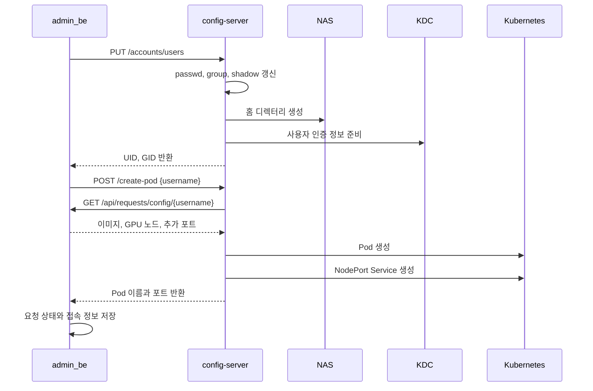
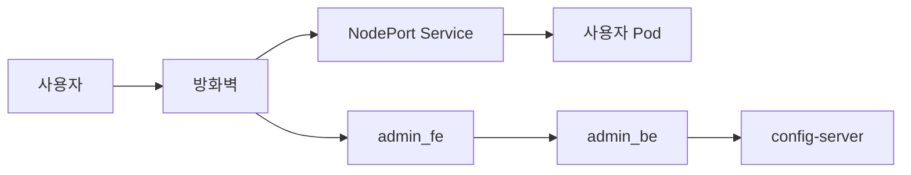
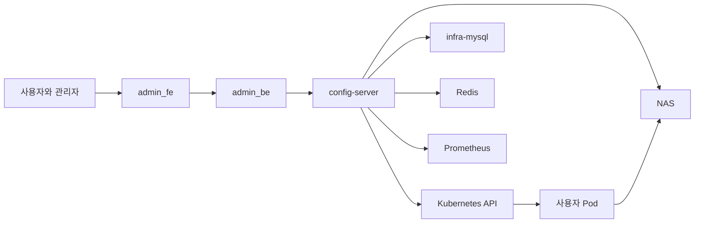
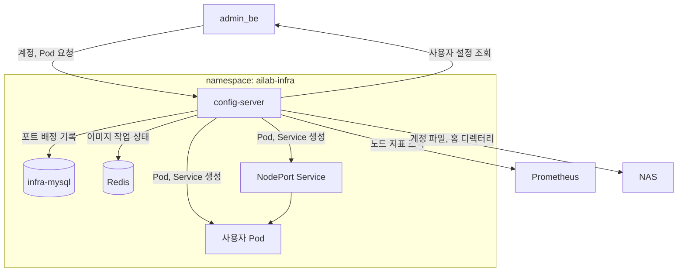

# 시스템 아키텍처

## 이 문서에서 다루는 내용

이 문서는 `admin_infra`의 config-server가 사용자 Pod, 계정, 홈 디렉터리를 만드는 과정을 설명한다. 운영 명령과 장애 조치는 [운영 매뉴얼](../operations/운영-매뉴얼.md), API의 요청·응답은 [API 레퍼런스](../operations/API-레퍼런스.md), Kerberos 설정은 [kdc-setup](../kdc-setup/index.md)에서 확인한다.

## 1. 서버별 역할

신청을 받고 승인하는 일, Pod와 계정을 만드는 일, 파일과 인증을 제공하는 일은 서로 다른 서버가 맡는다.

| 하는 일 | 서버 또는 서비스 | 설명 |
| --- | --- | --- |
| 신청과 승인 | `admin_fe`, `admin_be` | 신청을 받고 승인 결과와 사용자 설정을 저장한다. |
| Pod와 계정 만들기 | `config-server` | 계정, 홈 디렉터리, Pod, NodePort Service를 만들거나 지운다. |
| Pod를 만드는 데 필요한 서비스 | Kubernetes, NAS, KDC, Prometheus | 컨테이너를 실행하고, 파일을 저장하고, Kerberos 인증과 GPU 노드 정보를 제공한다. |

중요한 정보는 다음 위치에 저장한다.

| 정보 | 저장 위치 | 사용하는 곳 |
| --- | --- | --- |
| 신청 상태와 사용자 설정 | `admin_be` DB | `admin_be`, `config-server` |
| NodePort 배정 | `infra-mysql`의 `nodeport_allocations` | `config-server` |
| UID, GID, 그룹 | `/kube_share`의 계정 파일 | `config-server`, 사용자 Pod |
| 사용자 홈과 이미지 저장소 | NAS | Kubernetes 노드, `config-server` |

`admin_be`는 어떤 사용자에게 Pod를 만들지 정한다. `config-server`는 그 요청을 받아 Pod, 홈 디렉터리, 접속 포트를 만든다. Pod를 만들 때 필요한 이미지, GPU 노드, 추가 포트는 `admin_be`에서 다시 받는다.

## 2. 승인 후 사용자 환경을 만드는 순서

승인이 끝나면 `admin_be`는 먼저 계정을 만들고, 그다음 Pod를 만든다.



### 2.1 계정과 홈 디렉터리

`PUT /accounts/users`는 `/kube_share`의 `passwd`, `group`, `shadow` 파일에 새 사용자 정보를 쓴다. 새 UID와 GID를 정하는 방법은 [계정 정보](#41-계정-정보)에 설명한다.

홈 디렉터리는 Pod보다 먼저 NAS에 만든다. NFS의 `root_squash` 설정 때문에 Pod 안의 root 사용자는 NAS에 홈 디렉터리를 만들 수 없다. config-server가 NAS에 SSH로 접속해 디렉터리를 만들고, 새 UID와 GID로 소유자를 지정한 뒤 권한을 `700`으로 설정한다. 홈 생성이 실패하면 계정 파일에 쓴 내용도 되돌리고 계정 생성 요청을 실패로 끝낸다.

### 2.2 사용자 설정과 Pod 생성

`POST /create-pod`의 입력은 사용자 이름이다. config-server는 `admin_be`의 `GET /api/requests/config/{username}`을 호출해 다음 값을 가져온다.

- 사용할 이미지
- 사용할 GPU 수와 후보 노드
- 기본 포트 외에 열 포트

config-server는 받은 값으로 Pod를 만든다. Pod가 접속을 받을 준비가 된 뒤에 NodePort Service를 만들고, Pod 이름과 NodePort 목록을 `admin_be`에 돌려준다.

### 2.3 Pod와 계정 삭제

사용자 환경을 지울 때는 Pod 관련 작업과 계정 관련 작업을 나누어 처리한다.

| 구분 | API | 정리 대상 |
| --- | --- | --- |
| Pod 관련 작업 | `POST /delete-pod` | Pod, NodePort Service, NodePort 배정 기록 |
| 계정 관련 작업 | `DELETE /accounts/users/{username}` | 계정 파일, NAS 홈, Kerberos 관련 파일 |

두 요청을 모두 처리해야 계정과 Pod가 함께 삭제된다. 요청 형식과 응답은 [API 레퍼런스](../operations/API-레퍼런스.md)에서 확인한다.

## 3. GPU 노드와 포트 고르는 방식

### 3.1 노드 선택

config-server는 `admin_be`가 전달한 `gpu_nodes` 목록에서 Pod를 올릴 GPU 노드를 고른다. 노드 이름은 소문자로 바꾸고, 목록에 들어 있던 순서대로 비교한다. `gpu_nodes`가 비어 있으면 Kubernetes에서 준비가 끝난 워커 노드를 가져온다. control-plane 노드에 붙은 `NoSchedule` 표시는 관리용 노드라는 뜻이므로 후보에서 뺀다.

| 지표 | 사용 방식 |
| --- | --- |
| `DCGM_FI_DEV_GPU_UTIL` | 노드 GPU 사용률 평균을 그대로 사용한다. |
| `DCGM_FI_DEV_FB_USED` | GPU 메모리 사용량 평균을 GiB 단위로 환산한다. |
| `DCGM_FI_DEV_GPU_TEMP` | GPU 온도 평균을 보조 값으로 사용한다. |

```text
score = avg(GPU_UTIL) + avg(FB_USED) / 1024 + avg(GPU_TEMP) / 100
```

점수가 가장 낮은 노드를 고른다. 점수가 같으면 후보 목록에서 앞에 있던 노드를 고른다.

각 지표 조회에는 `or vector(0)`이 들어 있다. 어떤 지표가 없으면 그 값은 0으로 계산한다. Prometheus에 연결하지 못했거나 결과가 비어 있으면 그 노드는 고르지 않는다. 모든 후보를 조회하지 못하면 Pod를 만들지 않는다.

고른 노드가 `gpu_nodes` 목록에 있으면 그 항목의 CPU, 메모리, GPU 개수를 Pod 설정에 넣는다. `gpu_nodes` 없이 워커 노드를 찾은 경우에는 config-server에 설정된 기본값을 사용한다.

### 3.2 NodePort 배정

사용자 Pod에는 SSH(22), Jupyter(8888), `admin_be`가 전달한 추가 포트마다 NodePort Service를 하나씩 만든다. 추가 포트는 받은 순서대로 SSH와 Jupyter 뒤에 붙인다. 어떤 Pod에 어떤 NodePort를 줬는지는 `infra-mysql`의 `nodeport_allocations` 테이블에 적는다.

포트를 고르기 전에는 5분에 한 번 MySQL 기록과 Kubernetes Service를 비교한다. `app=ailab-nodeport` 라벨과 같은 `pod_name`을 가진 Service가 Kubernetes에 하나도 없고 MySQL에만 남아 있으면 그 Pod의 포트 기록을 지운다. 이 비교는 포트별이 아니라 Pod별로 한다.

포트를 고르고 MySQL에 기록하는 일은 한 번의 DB 작업으로 처리한다. 중간에 실패하면 새 기록은 저장하지 않는다.

1. `nodeport_allocations`의 포트 기록을 잠가, 동시에 들어온 요청이 같은 번호를 고르지 못하게 한다.
2. MySQL에 적힌 포트와 클러스터 전체 Service가 이미 쓰는 NodePort를 모은다.
3. 30000부터 32767까지 오름차순으로 훑어 빈 포트를 필요한 개수만큼 고른다.
4. 고른 포트를 `username`, `pod_name`, `node_name`, 내부 포트, 용도와 함께 MySQL에 저장한다.
5. Pod가 Ready 상태가 되면 기록된 포트마다 NodePort Service를 만든다.

Pod 또는 Service 생성에 실패하면 해당 Pod의 Service, NodePort 배정 행, 생성된 Pod를 정리한다.

| 구분 | 저장 위치 | 의미 |
| --- | --- | --- |
| 요청 포트 | `admin_be` DB의 `port_requests` | 사용자가 요청한 컨테이너 내부 포트 |
| 확정 포트 | `admin_be` DB의 `pod_external_ports` | 실제 NodePort와 내부 포트의 연결 정보 |
| 배정 장부 | `infra-mysql`의 `nodeport_allocations` | Pod와 NodePort Service를 정리할 때 사용하는 기록 |

### 3.3 외부 접근 경로

외부 사용자는 방화벽을 거쳐 `admin_fe` 또는 사용자 Pod의 NodePort Service에 접속한다. Kubernetes는 NodePort `30000~32767`을 배정할 수 있지만, FARM 공인 IP `210.94.179.19`는 현재 `30000~30097`만 외부로 연결한다. 외부 포트는 `9300 + (NodePort - 30000)`으로 계산한다. 예를 들어 NodePort가 `30042`이면 외부에서는 `210.94.179.19:9342`로 접속한다. 이 범위를 벗어난 NodePort는 클러스터 안에서는 연결되더라도 외부에서는 접속할 수 없다.



## 4. 계정, 홈 디렉터리, 인증

### 4.1 계정 정보

UID와 GID는 `/kube_share`의 계정 파일에 적힌 값을 사용한다. NAS 파일의 소유자도 이 숫자로 표시되므로, UID와 GID를 다른 데이터베이스에 따로 저장하지 않는다.

계정을 추가할 때는 `passwd` 파일을 잠가, 동시에 들어온 요청이 같은 UID를 고르지 못하게 한다. `/home/`을 쓰는 사용자 중 UID가 20000 이상인 값 가운데 가장 큰 값에 1을 더해 새 UID 후보를 만든다. 이 번호가 시스템 계정을 포함해 이미 쓰이고 있으면, 비어 있는 번호가 나올 때까지 1씩 올린다. 요청에 UID가 들어 있어도 config-server는 사용하지 않고 이 방식으로 정한 값을 반환한다.

새 사용자의 기본 GID는 새 UID와 같은 번호로 정한다. 기본 그룹 이름은 요청의 `primary_group_name`을 쓰고, 이 값이 없으면 사용자 이름을 쓴다. 추가 그룹은 요청에 들어 있는 `{name, gid}` 목록으로 처리한다. 같은 GID의 그룹이 이미 있으면 사용자를 그 그룹에 넣고, 없으면 요청에 적힌 GID로 그룹을 새로 만든다. 추가 그룹의 GID는 config-server가 새로 정하지 않는다.

`passwd`에 사용자 항목을 쓴 뒤 기본 그룹과 추가 그룹을 `group`에 기록하고, SHA-512 암호 해시를 `shadow`에 기록한다. sudo 허용 명령이 설정된 경우에만 사용자별 sudoers 파일도 만든다. 이 단계에서 실패하면 앞에서 쓴 계정·그룹 정보를 지운다. NAS 홈 디렉터리의 소유자도 같은 UID와 GID로 바꾼다. Pod를 만들 때 config-server는 UID, 기본 GID, 그룹 목록을 환경 변수로 넣는다. 컨테이너가 시작할 때 실행하는 스크립트는 이 값으로 컨테이너 안의 사용자를 만든다. 사용자 Pod는 `/kube_share`를 직접 마운트하지 않는다.

### 4.2 홈 디렉터리와 이미지 저장소

사용자 홈은 NAS의 NFS 공유를 노드에 마운트한 뒤 Pod의 `/home`에 연결한다. 사용자마다 PVC를 만들지는 않는다. 홈 디렉터리의 소유자와 권한으로 사용자별 접근을 나눈다.

사용자 이미지 tar 파일은 별도의 `pvc-image-store`에 저장한다. config-server가 이미지 저장과 로드를 담당하고, Redis에는 이미지 작업의 진행 상태를 기록한다.

### 4.3 Kerberos를 사용하는 방식

FARM 환경에서는 NFS 홈을 쓰기 전에 Kerberos 인증을 준비한다. 계정을 만들 때 config-server는 사용자 principal을 만들고 keytab을 Kubernetes Secret에 저장한다. Pod를 만들 때는 선택된 노드에 keytab과 갱신용 설정을 두고 ccache를 만든다. Pod에는 keytab을 넣지 않고 ccache만 연결한다.

Kerberos 서버와 설정 값은 [kdc-setup](../kdc-setup/index.md)에서 설명한다.

## 5. 서버와 서비스가 연결되는 모습

### 5.1 전체 연결



### 5.2 config-server가 연결하는 서비스



### 5.3 사용자 Pod

```mermaid
flowchart LR
    S1[SSH Service] --> POD[사용자 Pod]
    S2[Jupyter Service] --> POD
    S3[추가 포트 Service] --> POD

    subgraph NODE[GPU 노드]
        POD
        GPU[GPU 디바이스]
        HOME[/home]
    end

    POD --- GPU
    POD --> HOME
    HOME --> NAS[NAS NFS]
```

사용자 Pod는 접속용 Service, GPU 디바이스, 홈 디렉터리를 사용한다. UID와 GID, 그룹 정보는 Pod를 만들 때 넣고, 홈 디렉터리는 노드의 NFS 마운트를 통해 연결한다.
