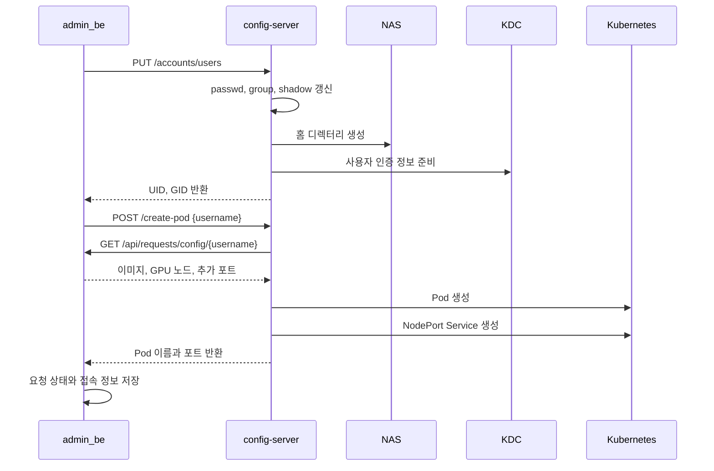
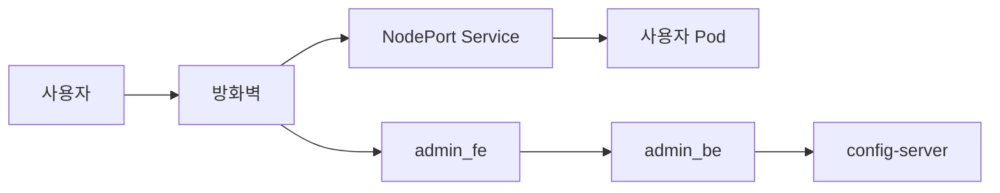
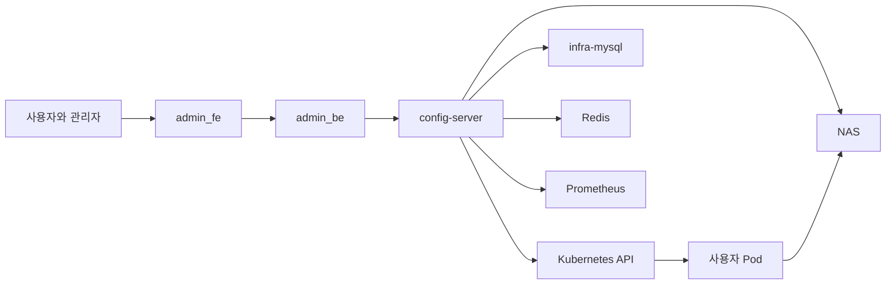
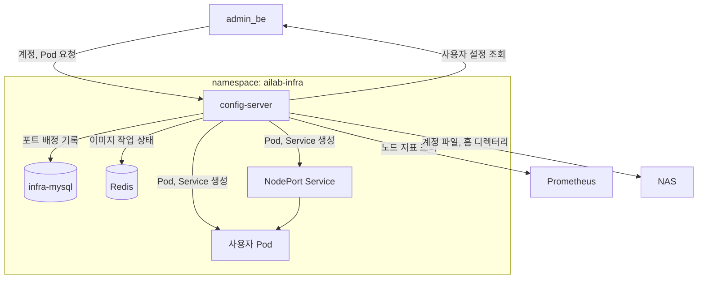

# 시스템 아키텍처

## 이 문서에서 다루는 내용

이 문서는 `admin_infra`의 config-server가 어떤 서버와 저장소를 사용해 사용자 환경을 만드는지 설명한다. 운영 절차와 장애 대응은 [운영 매뉴얼](../operations/운영-매뉴얼.md), HTTP 요청·응답은 [API 레퍼런스](../operations/API-레퍼런스.md), Kerberos 설정은 [kdc-setup](../kdc-setup/index.md)에서 다룬다.

## 1. 서버별 역할

사용자 신청과 승인, 사용자 환경 생성, 파일과 인증 관리는 서로 다른 서버가 맡는다.

| 하는 일 | 서버 또는 서비스 | 설명 |
| --- | --- | --- |
| 신청·승인 | `admin_fe`, `admin_be` | 신청을 받고 승인 상태와 사용자 설정을 관리한다. |
| 실행 | `config-server` | 계정, 홈 디렉터리, Pod, NodePort Service를 생성하거나 삭제한다. |
| 함께 사용하는 시스템 | Kubernetes, NAS, KDC, Prometheus | 컨테이너 실행, 파일 저장, Kerberos 인증, GPU 노드 상태 조회를 제공한다. |

중요한 정보는 다음 위치에 저장한다.

| 정보 | 저장 위치 | 사용하는 곳 |
| --- | --- | --- |
| 신청 상태와 사용자 설정 | `admin_be` DB | `admin_be`, `config-server` |
| NodePort 배정 | `infra-mysql`의 `nodeport_allocations` | `config-server` |
| UID, GID, 그룹 | `/kube_share`의 계정 파일 | `config-server`, 사용자 Pod |
| 사용자 홈과 이미지 저장소 | NAS | Kubernetes 노드, `config-server` |

`admin_be`는 어떤 사용자의 환경을 만들지 결정하고, `config-server`는 Pod, 홈 디렉터리, 접속 포트를 만든다. `config-server`가 Pod를 만들 때 필요한 이미지, GPU 노드, 추가 포트는 `admin_be`에서 다시 조회한다.

## 2. 승인 후 사용자 환경을 만드는 순서

승인이 완료되면 `admin_be`는 계정 생성과 Pod 생성을 차례로 요청한다.



### 2.1 계정과 홈 디렉터리

`PUT /accounts/users`는 `/kube_share`의 `passwd`, `group`, `shadow` 파일을 갱신한다. UID와 GID는 이 계정 파일을 기준으로 배정한다.

홈 디렉터리는 NAS에 먼저 만든다. NFS export에 `root_squash`가 적용되어 있으므로 사용자 Pod가 직접 홈 디렉터리를 만들 수 없다. config-server가 NAS 관리 경로를 통해 디렉터리를 만들고, 해당 UID와 GID로 소유권을 설정한다.

### 2.2 사용자 설정과 Pod 생성

`POST /create-pod`의 입력은 사용자 이름이다. config-server는 `admin_be`의 `GET /api/requests/config/{username}`을 호출해 다음 값을 가져온다.

- 사용할 이미지
- 사용할 GPU 수와 후보 노드
- 기본 포트 외에 열 포트

config-server는 이 값을 바탕으로 Pod와 NodePort Service를 만든다. Pod가 Ready 상태가 된 뒤에 Service를 만들며, 생성 결과의 Pod 이름과 NodePort 목록을 `admin_be`에 돌려준다.

### 2.3 Pod와 계정 삭제

사용자 환경을 지울 때는 Pod 관련 작업과 계정 관련 작업을 나누어 처리한다.

| 구분 | API | 정리 대상 |
| --- | --- | --- |
| Pod 관련 작업 | `POST /delete-pod` | Pod, NodePort Service, NodePort 배정 기록 |
| 계정 관련 작업 | `DELETE /accounts/users/{username}` | 계정 파일, NAS 홈, Kerberos 관련 파일 |

두 요청을 모두 처리해야 사용자 환경이 제거된다. 요청 형식과 응답은 [API 레퍼런스](../operations/API-레퍼런스.md)를 기준으로 한다.

## 3. GPU 노드와 포트 고르는 방식

### 3.1 노드 선택

config-server는 `admin_be`가 전달한 `gpu_nodes`의 노드 이름을 후보로 사용한다. 노드 이름은 소문자로 바꾼 뒤 전달된 순서대로 비교한다. `gpu_nodes`가 비어 있으면 Kubernetes API에서 Ready 상태인 워커 노드를 조회한다. 이때 `NoSchedule` control-plane taint가 있는 노드는 후보에서 제외한다.

| 지표 | 사용 방식 |
| --- | --- |
| `DCGM_FI_DEV_GPU_UTIL` | 노드 GPU 사용률 평균을 그대로 사용한다. |
| `DCGM_FI_DEV_FB_USED` | GPU 메모리 사용량 평균을 GiB 단위로 환산한다. |
| `DCGM_FI_DEV_GPU_TEMP` | GPU 온도 평균을 보조 값으로 사용한다. |

```text
score = avg(GPU_UTIL) + avg(FB_USED) / 1024 + avg(GPU_TEMP) / 100
```

점수가 가장 낮은 노드를 선택한다. 점수가 같으면 후보 목록에서 먼저 나온 노드를 선택한다.

각 지표 쿼리에는 `or vector(0)`이 포함되어 있다. 따라서 특정 지표가 없으면 그 지표의 값은 0으로 계산한다. Prometheus 요청이 실패하거나 결과가 비어 있으면 해당 노드의 점수는 무한대로 처리한다. 모든 후보의 조회에 실패하면 선택할 노드가 없어 Pod를 만들지 않는다.

선택된 노드가 `gpu_nodes` 목록에 있으면 그 항목의 CPU, 메모리, GPU 개수를 Pod spec에 적용한다. 후보 목록 없이 워커 노드를 조회한 경우에는 config-server의 기본 리소스 값을 사용한다.

### 3.2 NodePort 배정

사용자 Pod에는 SSH(22), Jupyter(8888), `admin_be`가 전달한 추가 포트마다 NodePort Service가 하나씩 연결된다. 추가 포트는 전달된 순서대로 기본 포트 뒤에 붙는다. NodePort 배정 기록은 `infra-mysql`의 `nodeport_allocations` 테이블에 저장한다.

배정 전에는 5분 간격으로 MySQL 장부와 Kubernetes Service를 비교한다. `app=ailab-nodeport` Service가 Kubernetes에는 없고 MySQL에만 남은 Pod의 배정 행은 제거한다.

배정 과정은 하나의 트랜잭션으로 처리한다.

1. `nodeport_allocations`의 현재 포트 행을 `SELECT ... FOR UPDATE`로 잠근다.
2. MySQL 장부에 있는 포트와 클러스터 전체 Service가 사용하는 NodePort를 합친다.
3. 30000부터 32767까지 오름차순으로 훑어 빈 포트를 필요한 개수만큼 고른다.
4. 각 포트를 `username`, `pod_name`, `node_name`, 내부 포트, 용도와 함께 MySQL에 기록하고 커밋한다.
5. Pod가 Ready 상태가 되면 기록된 포트마다 NodePort Service를 만든다.

Pod 또는 Service 생성에 실패하면 해당 Pod의 Service, NodePort 배정 행, 생성된 Pod를 정리한다.

| 구분 | 저장 위치 | 의미 |
| --- | --- | --- |
| 요청 포트 | `admin_be` DB의 `port_requests` | 사용자가 요청한 컨테이너 내부 포트 |
| 확정 포트 | `admin_be` DB의 `pod_external_ports` | 실제 NodePort와 내부 포트의 연결 정보 |
| 배정 장부 | `infra-mysql`의 `nodeport_allocations` | Pod와 NodePort Service를 정리할 때 사용하는 기록 |

### 3.3 외부 접근 경로

외부 사용자는 방화벽을 거쳐 `admin_fe` 또는 사용자 Pod의 NodePort Service에 접속한다. 방화벽 개방 범위와 실제 NodePort 배정 범위는 운영 설정으로 관리한다.



## 4. 계정, 홈 디렉터리, 인증

### 4.1 계정 정보

UID와 GID의 기준은 `/kube_share`의 계정 파일이다. 파일 소유권은 UID와 GID 숫자로 저장되므로, 별도의 데이터베이스에 UID와 GID를 따로 관리하지 않는다.

계정 생성 시 config-server는 `passwd` 파일을 배타적으로 잠근다. `/home/`을 홈으로 쓰는 사용자 가운데 UID가 20000 이상인 값의 최댓값에 1을 더해 새 UID 후보를 만든다. 후보가 시스템 계정을 포함한 기존 `passwd` 항목과 겹치면, 겹치지 않는 값이 나올 때까지 1씩 증가시킨다.

새 사용자의 기본 GID는 새 UID와 같은 값으로 정한다. 기본 그룹 이름은 요청의 `primary_group_name`을 사용하며, 이 값이 없으면 사용자 이름을 사용한다. 보조 그룹은 요청에 포함된 `{name, gid}` 목록으로 처리한다. 같은 GID의 그룹이 있으면 사용자를 멤버로 추가하고, 없으면 지정된 GID로 새 그룹을 만든다. 보조 그룹의 GID는 이 요청에서 자동으로 배정하지 않는다.

`passwd`, `group`, `shadow` 파일을 갱신한 뒤 NAS 홈 디렉터리의 소유권도 같은 UID와 GID로 설정한다. 이후 Pod를 만들 때 config-server는 UID, 기본 GID, 그룹 목록을 환경 변수로 넣고, 컨테이너의 entrypoint가 그 값으로 컨테이너 안의 사용자를 만든다. 사용자 Pod는 `/kube_share`를 직접 마운트하지 않는다.

### 4.2 홈 디렉터리와 이미지 저장소

사용자 홈은 NAS의 NFS 공유를 노드에 마운트한 뒤 Pod의 `/home`에 연결한다. 사용자별 PVC는 사용하지 않으며, 홈 디렉터리의 소유권과 권한으로 접근을 구분한다.

사용자 이미지 tar 파일은 별도의 `pvc-image-store`에 저장한다. config-server가 이미지 저장과 로드를 담당하고, Redis에는 이미지 작업의 진행 상태를 기록한다.

### 4.3 Kerberos를 사용하는 방식

FARM 환경에서는 NFS 홈을 사용하기 전에 Kerberos 인증을 준비한다. config-server는 사용자 keytab을 관리하고, Pod가 배치된 노드에는 갱신용 keytab과 ccache를 준비한다. Pod에는 장기 자격 증명인 keytab을 전달하지 않고 ccache만 사용한다.

Kerberos 서버와 설정 값은 [kdc-setup](../kdc-setup/index.md)에서 설명한다.

## 5. 서버와 서비스가 연결되는 모습

### 5.1 전체 연결



### 5.2 config-server가 연결하는 서비스



### 5.3 사용자 Pod

```mermaid
flowchart LR
    S1[SSH Service] --> POD[사용자 Pod]
    S2[Jupyter Service] --> POD
    S3[추가 포트 Service] --> POD

    subgraph NODE[GPU 노드]
        POD
        GPU[GPU 디바이스]
        HOME[/home]
    end

    POD --- GPU
    POD --> HOME
    HOME --> NAS[NAS NFS]
```

사용자 Pod는 접속용 Service, GPU 디바이스, 홈 디렉터리를 사용한다. Pod의 계정 정보는 생성 시 주입되고, 홈 디렉터리는 노드의 NFS 마운트를 통해 제공된다.

## 6. 어떤 정보를 어디에 저장하는가

| 정보 | 저장하거나 처리하는 곳 |
| --- | --- |
| 신청 상태 | `admin_be`가 관리한다. |
| Pod, 홈 디렉터리, 접속 포트 만들기 | `config-server`가 Kubernetes와 NAS에 반영한다. |
| 포트 배정 | `infra-mysql`에 기록하고 Kubernetes Service와 함께 관리한다. |
| UID, GID, 그룹 | `/kube_share`의 계정 파일에 기록한다. |
| 사용자 데이터 | NAS의 홈 디렉터리와 이미지 저장소에 둔다. |
| 노드 선택 | Prometheus의 GPU 지표를 사용한다. |
