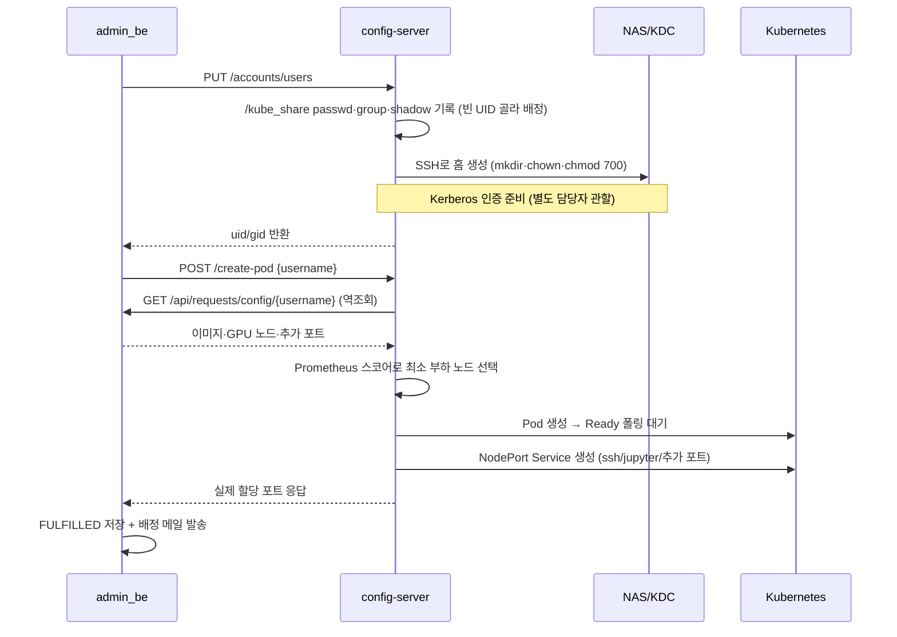
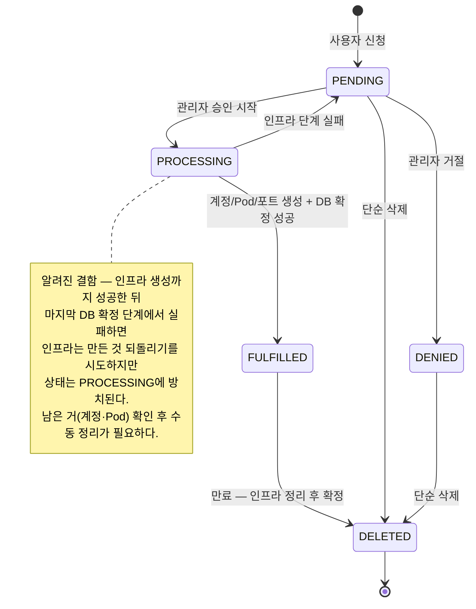
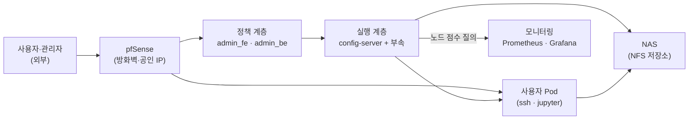
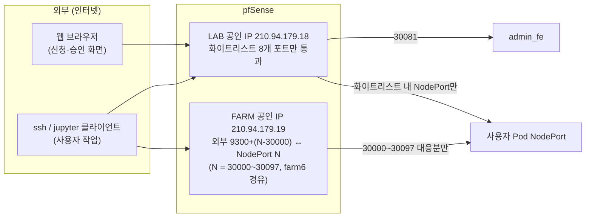
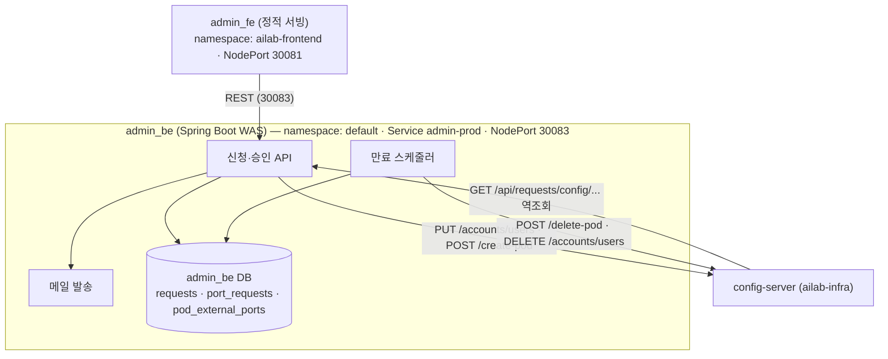
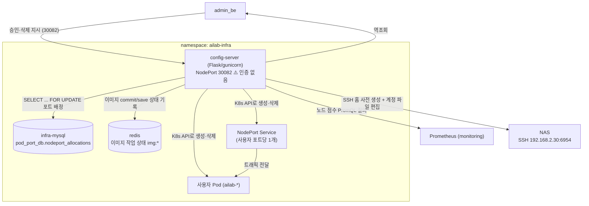
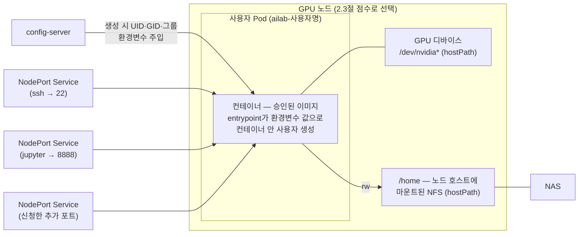
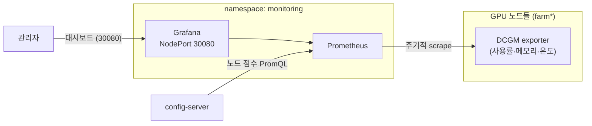
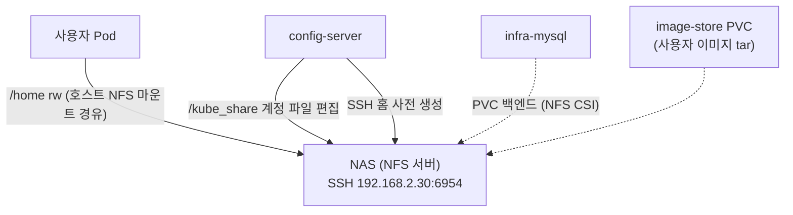

# 시스템 아키텍처

## 문서 목적

이 문서는 admin_infra가 담당하는 인프라 계층의 전체 구조와 각 컴포넌트의 책임을 설명하는 문서.

다음 내용을 중심으로 시스템을 이해할 수 있도록 구성한다.

1. 시스템이 현재와 같은 계층 구조를 가지게 된 이유
2. 관리자 승인 이후 사용자 Pod가 생성되는 전체 과정
3. config-server, API, 포트, 계정, 스토리지의 역할과 연결 관계
4. 각 컴포넌트가 실제로 배포된 위치와 의존 관계

본문에 나오는 개념(Pod, NodePort, NFS, root_squash, PromQL 등)의 배경 설명은 [기초 개념](기초-개념.md) 페이지 참고할 것.

---

## 1. 계층 구조와 책임 경계

### 1.1 세 개의 계층

전체 시스템은 세 개의 층으로 나뉜다. admin_infra는 이 중 **인프라를 조작하는 실행 계층**을 담당한다.

| 계층 | 컴포넌트 | 책임 |
|------|----------|------|
| 정책 (Control Plane) | admin_be (Spring Boot) | 신청·승인·만료 스케줄링·알림. "무엇이 존재해야 하는가"라는 목표 상태를 자기 DB에 기록해 관리한다 |
| 실행 (Data Plane) | **config-server (Flask)** | Pod와 NodePort Service 생성·삭제, NFS 계정 파일 기록, NAS에 SSH로 홈 폴더 미리 만들기, Prometheus 기반 노드 선택 |
| 자원 | Kubernetes + NAS + KDC | 실제 컨테이너·스토리지·인증. Pod 홈은 NAS의 NFS 공유가 마운트되며, FARM에서는 krb5 인증이 마운트의 전제 조건이다 |

정보별 기준 장부는 다음과 같다.

| 확인할 정보 | 기준 장부 |
|------------|----------|
| 이 요청이 승인됐는가 | admin_be DB `requests` 테이블 |
| 이 NodePort를 누가 쓰는가 | infra-mysql `nodeport_allocations` |
| 이 UID가 누구 것인가 | `/kube_share`의 passwd 파일 |

### 1.2 config-server를 별도 서비스로 분리한 이유

- **자격 증명 격리** — 인프라 자격 증명(K8s 토큰, NAS SSH 키, KDC 권한)이 config-server 한 곳에만 존재한다. admin_be가 침해되거나 오동작해도 인프라를 직접 조작할 열쇠는 admin_be에 없다.
- **독립 배포** — 인프라 계층을 동결한 채 WAS(admin_be)만 독립 배포할 수 있다. 실제로 config-server 동결 기간에 admin_be만 배포한 운영 사례가 있다.
- **장애 절단면** — "정책 계층 문제인가 실행 계층 문제인가"를 API 경계에서 자를 수 있다. admin_be가 create-pod를 호출했는지, 호출은 왔는데 config-server가 실패했는지를 HTTP 요청 로그로 구분한다.

대가는 통신 복잡성이다. 2절 E2E 흐름의 **accept-info 역조회**(config-server가 반대로 admin_be를 호출해 사용자 설정을 받아오는 경로)로 호출 방향이 양방향이 되면서, 한쪽 장애의 증상도 두 가지(지시가 안 감 / 역조회가 안 됨)로 늘었다.

### 1.3 Kubernetes Pod를 쓰는 이유

과거에는 관리자가 물리 서버에서 Docker 스크립트로 컨테이너를 만들었다. Pod로 옮긴 이유는 "띄우고 지우는 일의 자동화"이다.

- **생성·삭제가 API 호출이다.** config-server가 kubernetes-client로 스펙을 제출하면 끝이다. 스크립트 방식은 서버마다 SSH로 명령을 실행하고 결과 문자열을 파싱해야 한다.
- **배치 노드를 자동으로 고른다.** 후보 노드의 Prometheus 부하 스코어로 최소 부하 노드에 배치한다(2.3절).
- **GPU 할당이 Pod 스펙에 선언된다.** 노드에 들어가 실행 옵션을 손으로 맞출 필요가 없다.
- **접속 통로가 리소스 단위로 관리된다.** 사용자별 접속 포트는 NodePort Service라는 독립 리소스로 열리고, 회수도 리소스 삭제로 끝난다.
- **만료 회수가 결정적이다.** Pod를 삭제하면 내부 프로세스·컨테이너가 함께 정리된다.

대가로 Kubernetes 러닝커브가 생겼고, NFS 홈·krb5 인증 결합으로 FailedMount 같은 새 장애 유형이 생겼다.

### 1.4 ⚠️ 운영 경고 — 인증 없는 API

config-server API에는 요청자 인증 계층이 없다. NodePort(30082)가 외부에 열리면 `/create-pod`, `/accounts/*` 호출만으로 계정 생성·Pod 생성·타인 Pod 삭제가 가능하다.

- 내부망 제한·NetworkPolicy가 이 구조의 **전제 조건**이다.
- 방화벽 정책을 변경할 때는 30082가 외부에 열리지 않는지 반드시 확인한다.
- Swagger(`/apidocs/`)의 "Try it out"도 실제 인프라를 조작한다.

---

## 2. 승인 → Pod 생성 End-to-End

관리자가 승인 버튼을 누른 순간부터 사용자가 접속 정보를 받을 때까지의 전체 체인이다. 장애 대응은 이 체인의 어느 마디에서 끊겼는지 확인하는 것에서 출발한다.

### 2.1 전체 시퀀스



큰 그림은 두 번의 호출이다. admin_be가 **계정 생성**(`PUT /accounts/users`)을 시키고, 성공하면 **Pod 생성**(`POST /create-pod`)을 시킨다. 둘 다 성공해야 FULFILLED로 확정되고 사용자에게 메일이 간다.

### 2.2 단계별 상세

#### ① 계정 생성 — `PUT /accounts/users`

파일 락을 잡고, passwd에서 관리 범위 안 가장 큰 UID+1을 새 UID로 배정해 **passwd → group → shadow** 순으로 기록한다. sudo 허용 명령이 설정된 경우에만 `sudoers.d`에 사용자별 정책 파일을 추가한다. 중간에 실패하면 그때까지 쓴 기록을 되돌린다.

운영에서 중요한 세부 사항은 세 가지이다.

- **락은 로컬에 잡는다.** NFS 파일 락(lockd 의존)은 불안정하므로 `LockedFile`은 실제 락을 로컬 `/tmp/cssh_lock*` 파일에 잡는다. config-server가 계정 파일의 유일한 편집 주체라는 전제 위의 설계이다([기초 개념](기초-개념.md) 2절).
- **passwd가 UID의 SSOT이다.** admin_be가 uid 값을 실어 보내도 config-server는 무시하고, passwd 기준으로 빈 UID를 배정해 응답으로 되돌려 준다(6.1절).
- **shadow에는 SHA-512 해시**가 기록된다.

#### ② NAS 홈 미리 만들기

NFS export가 `root_squash`라서 **Pod 스스로는 자기 홈을 만들 수 없다.** config-server가 NAS(운영 배포 기준 `192.168.2.30:6954` — 코드에서는 `NAS_SSH_HOST`/`NAS_SSH_PORT` 환경변수)에 SSH로 접속해 mkdir → chown(배정 UID) → chmod 700 순으로 홈을 미리 만든다. 이 chmod 700이 사용자 간 홈 격리의 실체이다(6.2절).

#### ③ Kerberos 인증 준비

FARM NAS 홈 마운트에는 krb5 인증이 전제된다. 별도 담당자 관할이므로 이 wiki에서는 다루지 않는다. 이 체인이 끊기면 신규 Pod가 FailedMount로 Ready에 도달하지 못한다(6.3절).

#### ④ create-pod와 역조회

`POST /create-pod`는 `{"username": ...}` 수준의 최소 입력만 받는다. 나머지 정보(이미지·GPU 개수·추가 포트)는 config-server가 admin_be에 **역조회**해 받아온다. 경로는 클러스터 내부 DNS `admin-prod.default`를 향한 `GET /api/requests/config/{username}`이다.

요청 설정의 기준 장부가 admin_be DB이므로, 호출 시점의 스냅샷 대신 "만드는 순간의 최신 승인 설정"을 장부에서 읽는 설계이다. 대가로 **이 경로가 끊기면 승인은 되는데 Pod 생성만 실패**한다 — admin_be가 내려가 있거나 `admin-prod` Service 이름 해석이 안 될 때 나타난다.

#### ⑤ 노드 선택

후보 GPU 노드들의 Prometheus 지표로 부하 스코어를 계산해 최소 부하 노드를 고른다(2.3절).

#### ⑥ Ready 대기 → NodePort 생성

config-server는 Pod가 Ready가 될 때까지 폴링으로 기다린 뒤에야 NodePort Service를 만들고 성공을 응답한다. 뜨지 못한 Pod에 포트부터 열면 "포트는 배정됐는데 접속은 안 되는" 반쪽 성공이 사용자에게 전달되기 때문이다.

Ready 대기 상한은 현재 main 기준 300초(`POD_READY_MAX_WAIT_SEC`)이지만, **대기 시간과 imagePullPolicy는 배포 브랜치에 따라 다르므로 배포본에서 실측**해야 한다. 이미지가 커서 pull이 오래 걸리면 이 타임아웃에 걸릴 수 있다.

#### ⑦ 실패 시 되돌리기

Pod 생성이 실패하면 config-server는 잡아둔 NodePort 배정을 해제하고 생성된 Pod를 삭제한다. admin_be는 만들어 둔 계정을 지우고 요청을 PENDING으로 되돌린다. 관리자는 원인 해소 후 재승인하면 된다. 이 되돌리기가 완전하지 못한 알려진 결함이 하나 있다(2.4절).

### 2.3 노드 선택 스코어링 상세

후보는 admin_be가 역조회 응답에 실어 준 GPU 노드 목록이고, gpu_nodes가 없으면 Ready 상태 워커 노드 전체로 폴백한다(control-plane 제외). 스코어는 DCGM 메트릭 세 개로 계산한다(`utils.py`의 실제 PromQL 기준).

| 메트릭 | 의미 | 반영 방식 |
|--------|------|----------|
| `DCGM_FI_DEV_GPU_UTIL` | GPU 사용률 (%) | 노드 내 GPU 평균값 그대로 |
| `DCGM_FI_DEV_FB_USED` | 프레임버퍼(GPU 메모리) 사용량 (MiB) | 평균값 ÷ 1024 (GiB 단위로 축소) |
| `DCGM_FI_DEV_GPU_TEMP` | GPU 온도 (°C) | 평균값 ÷ 100 (미세 가중) |

```
score = avg(GPU_UTIL) + avg(FB_USED)/1024 + avg(GPU_TEMP)/100
```

**점수가 낮을수록 한가한 노드로 선택된다.** 계수 설계상 사용률(0~100)이 지배 항이고, 메모리(GiB)가 보조 항, 온도(0.3~0.8 수준)가 미세 가중이다 — "사용률이 비슷하면 메모리가 널널한 쪽, 그것도 비슷하면 시원한 쪽" 순의 우선순위이다.

폴백 동작이 두 가지 있고, 방향이 서로 반대이다.

- **메트릭 부재 → 0점 (과소평가)** — 쿼리에 `or vector(0)`이 붙어 있어 DCGM 메트릭이 없는 노드는 0점이 된다. 즉 **exporter가 죽은 노드는 "한가한 노드"로 오인되어 선택될 수 있다.** 특정 노드에만 Pod가 몰리면 그 노드의 exporter 생사부터 확인한다.
- **쿼리 실패 → 무한대 점수 (배제)** — Prometheus 통신 자체가 실패한 노드는 배제된다. 후보 전체가 실패하면 create-pod가 실패한다(로그에 `no suitable node selected`).

점수 재료는 Grafana(`http://210.94.179.18:30080`)에서 보거나, port-forward 후 PromQL로 조회한다.

```bash
kubectl -n monitoring port-forward svc/monitoring-kube-prometheus-prometheus 9090:9090
# 브라우저 http://localhost:9090 에서 예시 쿼리:
# avg(DCGM_FI_DEV_GPU_UTIL{Hostname="farm5"})
```

### 2.4 요청 상태 전이 (admin_be 관할)

상태 기준 장부는 admin_be DB의 `requests` 테이블이다. **config-server는 상태를 알지 못한다** — 인프라 작업의 성공/실패만 응답하고, 상태 전이는 전부 admin_be가 수행한다. "상태가 이상하다"는 문제는 항상 admin_be 쪽 장부의 문제이다.



인프라 실패(계정·Pod 생성 실패)는 되돌리기 후 PENDING으로 복귀시키지만, 인프라가 전부 성공한 뒤 **DB 확정 단계에서 실패한 경우에는 PENDING 복귀가 누락**되어 요청이 PROCESSING에 남는 알려진 결함이 있다. 이 경우 인프라 잔재(계정·Pod·NodePort)를 확인한 뒤 상태를 수동 정리한다.

| 상태 | 뜻 | 인프라 존재 여부 |
|------|-----|----------------|
| PENDING | 신청 접수, 승인 대기 (실패로 되돌린 뒤 복귀한 경우 포함) | 없음 |
| PROCESSING | 승인 진행 중 — 계정·Pod·포트를 만드는 중 | 만들어지는 중 (부분 존재 가능) |
| FULFILLED | 승인 완료, 자원 배정 확정 | Pod·NodePort·계정·홈 존재 |
| DENIED | 관리자 거절 | 없음 (승인 전 거절) |
| DELETED | 삭제 확정 (soft delete) | 없음이 원칙 — 단 외부 정리 실패 시에도 DELETED로 확정되므로 잔재 가능 (운영 가이드 만료 흐름 절 참조) |

만료 시 FULFILLED → DELETED 전이가 동반하는 API 호출은 [운영 가이드](../operations/운영-매뉴얼.md)의 만료 스케줄러 절을 참고한다.

---

## 3. config-server 파일맵

| 파일 | 역할 |
|------|------|
| `main.py` | 운영용 Flask API 서버이다. Pod 생성/삭제/마이그레이션, `/accounts` 계정 CRUD, Swagger 문서를 제공한다 |
| `utils.py` | Kubernetes·MySQL·Docker 이미지·계정 파일·NFS 디렉토리 보조 함수 모음이다. `LockedFile`(NFS+로컬 이중 락), NodePort Service 생성, Prometheus 노드 스코어링을 포함한다 |
| `bg_img_redis.py` | 사용자 이미지 저장/로드 상태를 Redis key `img:<username>`에 기록·조회한다 |
| `test.py` | WAS/Prometheus 의존성을 mock으로 대체한 레거시/실험용 서버이다. helper 이름이 현재 `utils.py`와 다를 수 있어 실행 전 점검이 필요하다 |
| `base_etc/` | NFS 계정 파일이 비어 있을 때 seed로 쓰는 기본 passwd/group/shadow/bash 템플릿이다 |
| `Chart/` | config-server 배포용 Helm chart이다. Deployment, Service, RBAC, ServiceAccount를 만든다. 키 상세는 [Helm 차트 레퍼런스](../operations/Helm-차트-레퍼런스.md)를 참고한다 |
| `Dockerfile` / `requirements.txt` | Python 3.10 slim 기반 gunicorn 운영 이미지를 빌드한다 |
| `Makefile` | Helm 배포 shortcut(`make deploy`)이다 |

HTTP 엔드포인트와 요청 흐름은 `main.py`에, 파일 락·포트 배정·노드 스코어링 같은 헬퍼는 `utils.py`에 있다.

---

## 4. 주요 API와 책임 분리

전체 명세는 [API 레퍼런스](../operations/API-레퍼런스.md)와 Swagger(`http://210.94.179.18:30082/apidocs/`)에서 확인한다.

| API | 역할 |
|-----|------|
| `PUT /accounts/users` | NFS 계정 파일(passwd/group/shadow/sudoers)에 사용자를 추가하고 빈 UID를 배정해 반환한다 |
| `DELETE /accounts/users/<username>` | passwd·shadow·group(멤버십, 비게 된 그룹 포함)에서 사용자를 제거하고, NAS 홈 삭제(실패해도 계속 진행)와 krb5 정리를 수행한다. sudoers 정책 파일은 지우지 않는다 |
| `POST /create-pod` | admin_be 역조회로 사용자 설정을 받아 최적 GPU 노드를 골라 Pod와 NodePort Service를 생성한다 |
| `POST /delete-pod` | Pod, NodePort Service, NodePort DB row를 정리한다 |
| `POST /migrate` | 실행 중인 사용자 Pod를 Prometheus 점수가 충분히 더 좋은 노드로 옮긴다 (사용자 이미지 commit/save 포함) |
| `GET /health` | 헬스체크이다 (`"OK"`) |

**삭제는 두 API의 합이다.**

- `POST /delete-pod` — Service·NodePort·Pod만 정리한다.
- `DELETE /accounts/users` — 계정 파일·NAS 홈·KDC principal을 정리한다.
- 하나만 호출하면 반쪽 삭제가 된다. delete-pod만 부르면 계정과 홈이 남고, accounts 삭제만 부르면 주인 없는 Pod가 돌아간다.
- 수동 삭제도 kubectl 대신 이 API를 쓴다. kubectl로 Pod만 지우면 NodePort Service와 `nodeport_allocations` 행이 남는데, reconcile(5.1절)은 **Service의 존재**를 기준으로 판단하므로 Service가 살아 있는 한 이 유령 배정을 영영 정리하지 못한다.

---

## 5. 포트 할당

### 5.1 포트 배정 구조

NodePort 배정 장부는 infra-mysql `pod_port_db`의 `nodeport_allocations` 테이블이다. 배정 절차는 다음 순서이다.

1. 트랜잭션을 열고 `SELECT ... FOR UPDATE`로 사용 중인 포트 행들을 잠근다. 동시에 들어온 두 create-pod가 같은 포트를 고르는 일을 막는다.
2. 30000~32767 범위에서 빈 포트를 골라 insert하고 커밋한다.
3. 포트당 NodePort Service 1개를 만든다. 기본 포트는 22(ssh)와 8888(jupyter)이고, admin_be가 내려준 추가 포트가 있으면 함께 배정한다.

배정 전에 `reconcile_nodeport_allocations()`가 **MySQL에는 남아 있지만 Kubernetes에는 Service가 없는** 배정 행을 정리한다. 장부(MySQL)와 현실(K8s)이 어긋나면 현실 기준으로 장부를 맞추는 자가 치유 장치이며, 5분에 한 번으로 제한된다.

두 종류의 포트 개념을 구분한다.

| 개념 | 저장 위치 | 의미 |
|------|----------|------|
| 요청 포트 (`port_requests`) | admin_be DB | 사용자가 신청서에 적은 컨테이너 내부 포트 (희망 사항) |
| 실제 포트 (`pod_external_ports`) | admin_be DB | create-pod 응답으로 확정된 NodePort 매핑 (사실). FE 접속 정보의 원천이다 |

접속 포트 표시 문제는 `pod_external_ports`를, 신청 포트 미반영 문제는 `port_requests` → 역조회 → 배정 체인을 본다. 스키마 상세는 [데이터베이스](데이터베이스.md)를 참고한다.

### 5.2 방화벽 함정 — 배정 범위와 외부 개방 범위는 다르다

클러스터는 30000~32767 범위에서 자유롭게 포트를 배정하지만, **외부(pfSense)에서 실제로 열려 있는 것은 일부뿐**이다.

- LAB 공인 IP(`210.94.179.18`) — 화이트리스트 8개 포트만 통과한다.
- FARM 공인 IP(`210.94.179.19`) — farm6 경유 오프셋 매핑이다. 외부 포트 `9300+(NodePort−30000)`이 NodePort `30000~30097`에 대응한다. 예: NodePort 30042 = 외부 `210.94.179.19:9342`.

배정된 NodePort가 이 범위를 벗어나면 **내부는 정상인데 외부 접속만 안 되는** 상태가 된다. 버그가 아니라 정책 공백이다 — 배정 로직은 방화벽 개방 범위를 모르고, 방화벽은 배정 현황을 모른다. "교내에서는 되는데 집에서는 안 된다"는 문의는 코드보다 먼저 배정 포트가 개방 범위 안인지 확인한다(7.2절).

---

## 6. 계정·스토리지 설계

### 6.1 파일 기반 passwd가 기준 원본인 이유

UID/GID의 존재 이유는 **NFS 파일 소유권**이고, 그 파일들은 FARM 물리 서버와 K8s Pod가 공유하는 NAS에 있다. 파일 소유권은 디스크에 UID 숫자로 기록되므로([기초 개념](기초-개념.md) 1절), UID 기록을 DB로 분리하면 파일시스템의 실제 소유권과 어긋날 수 있는 두 번째 기록이 생긴다.

그래서 `/kube_share`의 passwd/group 파일이 SSOT이다. admin_be가 계정 생성 요청에 uid를 실어 보내도 config-server는 무시하고 passwd 기준으로 배정한다.

이 장부가 컨테이너에 전달되는 방식은 다음과 같다.

- **현행 Pod 스펙은 `/kube_share` 파일을 컨테이너에 마운트하지 않는다.**
- config-server가 Pod 생성 시 passwd에서 읽은 값을 환경변수(`TARGET_UID`·`TARGET_GID`·`USER_GROUPS` 등)로 주입한다.
- 컨테이너 entrypoint가 그 값으로 컨테이너 안에 사용자를 만든다. 즉 컨테이너 안 `/etc/passwd`는 생성 시점 사본이며, 장부의 이후 변경이 실시간 반영되지 않는다.

### 6.2 개별 PVC를 폐기하고 NFS 직접 마운트로 간 이유

초기 설계는 사용자마다 PVC를 만들었으나 26-06-19에 폐기가 결정되고 26-07-02에 운영 반영됐다. 폐기 근거는 두 가지이다.

- **관리 부담과 잔해** — 사용자 수만큼 PVC/PV 객체가 늘고, Terminating 잔류·템플릿 미치환 쓰레기 디렉터리 같은 잔해가 누적됐다.
- **격리 착시** — 모든 PVC가 같은 NFS 서버의 같은 공간을 바라보므로 PVC 간접층은 격리를 제공하지 못했다. 실질 격리는 처음부터 UID와 `chmod 700`이 담당했다.

그래서 NFS 공유를 `/home`에 직접 마운트하되, `root_squash` + 홈 사전 생성(NAS SSH)으로 안전을 확보하는 현행 구조가 됐다. image-store(사용자 이미지 tar 보관)만 PVC로 남았다.

### 6.3 Kerberos와 FARM NFS

FARM NAS 홈 마운트에는 krb5 인증이 전제된다. 별도 담당자 관할이라 이 wiki에서는 다루지 않는다. 관리자가 알아야 할 사실은 두 가지이다 — 인증 체인이 끊기면 신규 Pod가 FailedMount로 생성되지 못하며, 이 경우 담당자에게 문의한다([운영 가이드](../operations/운영-매뉴얼.md) 장애 표 참조).

---

## 7. 배포 뷰 (Deployment View)

"무엇이 어디에 떠 있는가"의 지도이다. 러프한 전체 그림으로 뼈대를 잡고 컴포넌트별 상세 그림으로 내려간다. namespace 구성의 의도는 [운영 가이드](../operations/운영-매뉴얼.md) 네임스페이스 절을 참고한다.

### 7.1 러프 전체 그림




### 7.2 상세 — 외부 접근 경로 (pfSense)



### 7.3 상세 — 정책 계층 (admin_fe / admin_be)



정책 계층은 장부(requests·port_requests·pod_external_ports)와 스케줄을 쥔다. 승인과 만료라는 두 트리거가 config-server API를 호출하고, 반대 방향으로 역조회 화살표 하나가 돌아온다. 역조회가 클러스터 내부 DNS 이름 `admin-prod.default`를 향하므로, admin_be의 Service 이름이나 namespace를 바꾸면 시퀀스 다시 확인 할 것.

### 7.4 상세 — 실행 계층 (namespace: ailab-infra)



config-server의 의존성이 총 6개인데 — admin_be(역조회), infra-mysql(포트 장부), redis(이미지 상태), Prometheus(노드 점수), NAS(계정 파일·홈), 쿠버네티스 API(Pod·Service). **승인 실패의 원인은 거의 항상 이 6개 의존성 중 하나가 에러인 것**이므로, create-pod 실패 로그를 볼 때 이 그림을 체크리스트로 쓴다. 의존성 별 증상은 [운영 가이드](../operations/운영-매뉴얼.md)의 장애 진단 결정 트리와 연결된다.

### 7.5 상세 — 사용자 Pod 내부



사용자 Pod 하나에 붙는 것은 접속 통로(포트당 Service 1개), 홈 스토리지, GPU 디바이스이다. `/home`은 **노드 호스트가 마운트해 둔 NFS를 Pod가 hostPath로 물려받는** 구조이고(쓰기 가능), GPU는 승인 개수만큼 `/dev/nvidia*` 디바이스가 hostPath로 붙는다. 계정 정보는 파일 마운트가 아니라 생성 시 환경변수로 주입된다(6.1절). **Pod가 Pending·NotReady에서 멈추면 홈 마운트 문제(FailedMount 계열) 아니면 GPU 자원 부족**이 대부분이므로, `kubectl describe pod` 이벤트에서 어느 쪽인지 먼저 본다.

### 7.6 상세 — 모니터링 (namespace: monitoring)



모니터링은 조회 전용이 아니라 **노드 선택이라는 실행 경로에 물려 있다.** DCGM exporter가 죽으면 그 노드가 0점(가장 한가함)으로 오인되고, Prometheus 자체가 죽으면 create-pod가 실패한다(2.3절 폴백). 즉 모니터링 장애는 "그래프가 안 보임"이 아니라 "승인이 안 됨"으로 나타날 수 있다.

### 7.7 상세 — NAS 의존선 (단일 장애점)



NAS에는 사용자 홈, `/kube_share` 계정 파일, infra-mysql 데이터, image-store가 전부 걸려 있다. NAS 장애 시 기존 Pod의 홈 I/O가 멈추고, 신규 계정 생성이 실패하고, 포트 장부(infra-mysql)까지 흔들릴 수 있다. **서로 무관해 보이는 여러 상자가 동시에 이상하면 NAS부터 본다.**

### 7.8 장애 시 이 지도를 읽는 법

- 내부(교내망)는 정상인데 외부 접속만 안 되면 → 7.2 (pfSense 개방 범위).
- 화면·표시·상태 값 문제 → 7.3 (admin_fe / admin_be와 그 장부).
- 승인·Pod 생성 실패 → 7.4의 의존선을 체크리스트로 (역조회·MySQL·Prometheus·NAS·K8s API).
- Pod가 Pending/FailedMount → 7.5 (마운트 두 가닥, GPU 자원).
- 특정 노드로 Pod 쏠림, 혹은 create-pod가 노드를 못 고름 → 7.6 (exporter·Prometheus).
- 여러 증상 동시다발 → 7.7 (NAS 단일 장애점).
