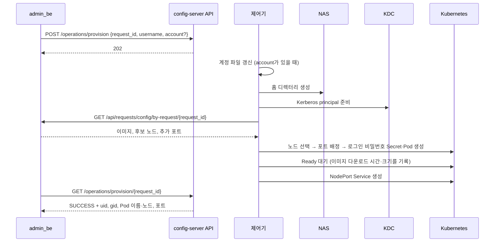
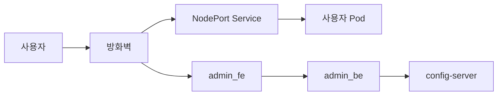
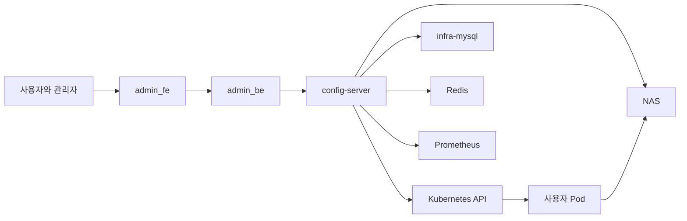
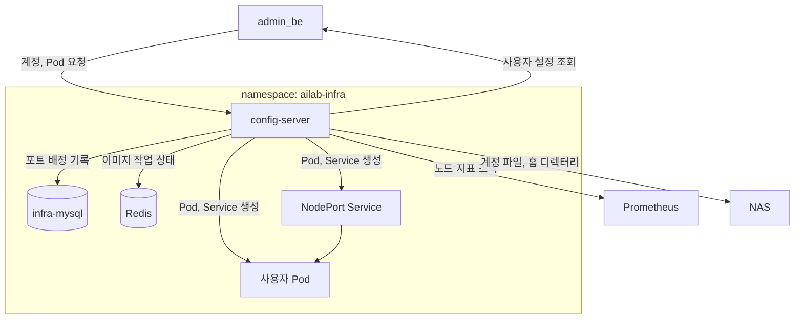
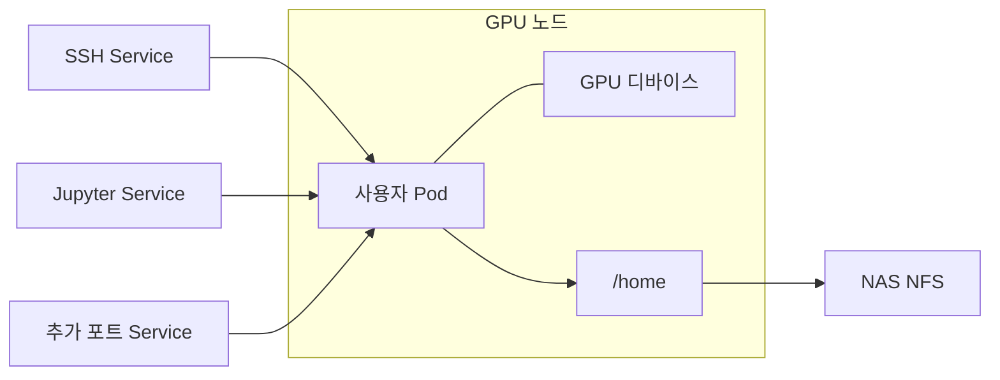

# 시스템 아키텍처

## 이 문서에서 다루는 내용

- `admin_infra`의 config-server가 계정, 홈 디렉터리, Pod, NodePort를 어떤 순서로 만드는지
- 어떤 정보가 `admin_be`, infra-mysql, `/kube_share`, NAS에 나뉘어 저장되는지
- 계정 생성, Pod 생성, 삭제 흐름에서 어디서 실패할 수 있는지

## 빠른 이동

| 필요할 때 | 문서 |
| --- | --- |
| 실제 운영 명령과 점검 순서를 본다 | [운영 매뉴얼](../operations/운영-매뉴얼.md) |
| 요청 형식과 응답을 확인한다 | [API 레퍼런스](../operations/API-레퍼런스.md) |
| Kerberos 준비 단계를 자세히 본다 | [kdc-setup](../kdc-setup/index.md) |

## 1. 서버마다 하는 일

신청을 받고 승인하는 일, Pod와 계정을 만드는 일, 파일과 인증을 제공하는 일은 서로 다른 서버가 맡는다.

| 하는 일 | 서버 또는 서비스 | 설명 |
| --- | --- | --- |
| 신청과 승인 | `admin_fe`, `admin_be` | 신청을 받고 승인 결과와 사용자 설정을 저장한다. |
| Pod와 계정 만들기 | `config-server` | 계정, 홈 디렉터리, Pod, NodePort Service를 만들거나 지운다. |
| Pod를 만드는 데 필요한 서비스 | Kubernetes, NAS, KDC, Prometheus | 컨테이너를 실행하고, 파일을 저장하고, Kerberos 인증과 GPU 노드 정보를 제공한다. |

중요한 정보는 다음 위치에 저장한다.

| 정보 | 저장 위치 | 사용하는 곳 |
| --- | --- | --- |
| 신청 상태와 사용자 설정 | `admin_be` DB | `admin_be`, `config-server` |
| NodePort 배정 | `infra-mysql`의 `nodeport_allocations` | `config-server` |
| UID, GID, 그룹 | `/kube_share`의 계정 파일 | `config-server`, 사용자 Pod |
| 사용자 홈과 이미지 저장소 | NAS | Kubernetes 노드, `config-server` |

`admin_be`는 어떤 사용자에게 Pod를 만들지 정한다. `config-server`는 그 요청을 받아 Pod, 홈 디렉터리, 접속 포트를 만든다. Pod를 만들 때 필요한 이미지, GPU 노드, 추가 포트는 `admin_be`에서 다시 받는다.

## 2. 승인 후 사용자 환경을 만드는 순서

v2.0부터 `admin_be`는 계정과 Pod를 직접 순서대로 부르지 않고 **작업을 등록**한다. config-server API는 등록만 받고 202로 응답하며, 같은 이미지로 뜨는 **제어기**(별도 Deployment)가 등록된 작업을 단계별로 실행한다. 단계마다 결과를 작업 이력(`operation_log`)에 남기므로, 도중에 제어기가 재시작돼도 남은 단계부터 이어간다.


```mermaid
sequenceDiagram
    participant BE as admin_be
    participant CS as config-server API
    participant CT as 제어기
    participant NAS as NAS
    participant KDC as KDC
    participant K as Kubernetes

    BE->>CS: POST /operations/provision {request_id, username, account?}
    CS-->>BE: 202
    CT->>CT: 계정 파일 갱신 (account가 있을 때)
    CT->>NAS: 홈 디렉터리 생성
    CT->>KDC: Kerberos principal 준비
    CT->>BE: GET /api/requests/config/by-request/{request_id}
    BE-->>CT: 이미지, 후보 노드, 추가 포트
    CT->>K: 노드 선택 → 포트 배정 → 로그인 비밀번호 Secret·Pod 생성
    CT->>K: Ready 대기 (이미지 다운로드 시간·크기를 기록)
    CT->>K: NodePort Service 생성
    BE->>CS: GET /operations/provision/{request_id}
    CS-->>BE: SUCCESS + uid, gid, Pod 이름·노드, 포트
```

| 작업 | 단계 순서 |
|------|----------|
| 생성 | 계정 생성 → 홈 생성 → Kerberos principal (계정이 이미 있으면 건너뜀) → 사용자 설정 조회 → Pod 준비 → 노드 선택 → Pod 스펙 → Pod 생성 → Ready 대기 → 접속 포트 연결 |
| 회수 | 접속 포트 해제 → 포트 배정 반환 → Pod 삭제 → 그 노드 keytab 정리 → (`delete_account`면) 회수 가능 확인 → 계정 삭제 → Kerberos 정리. **홈 디렉터리는 보존** |
| 마이그레이션 | 옮길 노드 선택(옮길 이유가 없으면 건너뜀으로 성공) → 사용자 설정 조회 → 기존 Pod 로그인 비밀번호 이어받기 → Pod 준비 → Pod 스펙 → Pod 생성 → Ready 대기 → 접속 포트 연결 → (`full`이면) 접근 시험 → 기존 Pod 정리(기존 노드 keytab 포함, 그 노드에 같은 사용자의 다른 Pod가 있으면 keytab 유지) |

컨테이너 준비 대기는 안에서 이미지 다운로드(`PULL_IMAGE`) → 컨테이너 시작(`START_CONTAINER`)으로 나뉘고, 볼륨 마운트를 재시도하면 `MOUNT_VOLUME`이 끼어든다. 세 세부 단계도 다른 단계처럼 시작·성공·실패와 걸린 시간이 작업 이력에 남는다. Redis 진행 상황은 마지막 단계만 1시간 보관하므로, 중간 과정은 작업 이력으로 확인한다.

실행 방식(`RUN_MODE`)은 세 가지이고 같은 제어기·같은 단계 함수를 쓴다.

| 방식 | 차이 |
|------|------|
| `baseline` | 재시도·결과 확인·이어하기 없이 운영과 같은 뒷정리 후 종료 |
| `noprobe` | 단계 실패 시 재시도·자원 재조회·이어하기 |
| `full` | noprobe + 생성·마이그레이션 뒤 실제 접근 시험(UID, Kerberos 티켓, 홈 읽기·쓰기, GPU, 외부 SSH)과 회수 뒤 차단 시험. 시험을 통과해야 완료로 기록 |

### 2.1 계정과 홈 디렉터리

계정 생성 단계는 `/kube_share`의 `passwd`, `group`, `shadow` 파일에 새 사용자 정보를 쓴다. 새 UID와 GID를 정하는 방법은 [계정 정보](#account-information)에서 확인한다. UID 대역(`accounts.uidMin`/`uidMax`)과 계정 접두어(`accounts.prefix`)는 배포 값으로 정한다. 접두어가 설정된 환경은 그 접두어로 시작하지 않는 계정 요청을 403으로 거절한다.

홈 디렉터리는 Pod보다 먼저 NAS에 만든다. NFS의 `root_squash` 설정 때문에 Pod 안의 root 사용자는 NAS에 홈 디렉터리를 만들 수 없다. config-server가 NAS에 SSH로 접속해 디렉터리를 만들고, 새 UID와 GID로 소유자를 지정한 뒤 권한을 `700`으로 설정한다.

### 2.2 사용자 설정과 Pod 생성

생성 작업은 `admin_be`의 `GET /api/requests/config/by-request/{request_id}`로 이미지, GPU 수와 후보 노드, 추가 포트를 받는다. 추가 포트에 내부 포트 `6080`이 있거나 용도가 `novnc`, `vnc`이면 Pod 환경 변수에 `ENABLE_VNC=true`도 넣는다.

로그인 비밀번호는 환경 변수 평문이 아니라 **Pod마다 만드는 Secret**으로 넘긴다(Pod가 소유자라 Pod를 지우면 함께 지워진다). 비밀번호가 비어 있으면 컨테이너를 만들지 않고 `LOGIN_PASSWORD_MISSING`(422)으로 실패한다. 컨테이너 시작 스크립트는 비밀번호가 없으면 비밀번호 로그인을 잠근다.

Pod가 Ready가 되면 NodePort Service를 만들고 작업 결과에 Pod 이름과 포트 목록을 남긴다.

### 2.3 회수

컨테이너 회수와 계정 회수는 같은 `/operations/revoke`로 등록한다. `delete_account`가 거짓이면 Pod 관련 자원만, 참이면 계정과 Kerberos까지 정리한다. 계정을 지울 farm 노드(`node_name`)를 모르면 회수를 보류한다. 요청 형식은 [API 레퍼런스](../operations/API-레퍼런스.md)에서 확인한다.

### 2.4 외부 서버 접속 확인

config-server가 farm 노드·AD·NAS에 SSH로 접속할 때는 배포 때 수집한 호스트 키(Secret `config-server-ssh-known-hosts`)로 상대 서버를 확인한다. 키 파일이 없는 환경만 예전처럼 확인하지 않는다.

## 3. GPU 노드와 포트 고르는 방식

### 3.1 노드 선택

config-server는 `admin_be`가 전달한 `gpu_nodes` 목록에서 Pod를 올릴 GPU 노드를 고른다. 노드 이름은 소문자로 바꾸고, 목록에 들어 있던 순서대로 비교한다. `gpu_nodes`가 비어 있으면 Kubernetes에서 준비가 끝난 워커 노드를 가져온다. control-plane 노드에 붙은 `NoSchedule` 표시는 관리용 노드라는 뜻이므로 후보에서 뺀다.

| 지표 | 사용 방식 |
| --- | --- |
| `DCGM_FI_DEV_GPU_UTIL` | 노드 GPU 사용률 평균을 그대로 사용한다. |
| `DCGM_FI_DEV_FB_USED` | GPU 메모리 사용량 평균을 GiB 단위로 환산한다. |
| `DCGM_FI_DEV_GPU_TEMP` | GPU 온도 평균을 보조 값으로 사용한다. |

```text
score = avg(GPU_UTIL) + avg(FB_USED) / 1024 + avg(GPU_TEMP) / 100
```

점수가 가장 낮은 노드를 고른다. 점수가 같으면 후보 목록에서 앞에 있던 노드를 고른다.

각 지표 조회에는 `or vector(0)`이 들어 있다. 어떤 지표가 없으면 그 값은 0으로 계산한다. Prometheus에 연결하지 못했거나 결과가 비어 있으면 그 노드는 고르지 않는다. 모든 후보를 조회하지 못하면 Pod를 만들지 않는다.

고른 노드가 `gpu_nodes` 목록에 있으면 그 항목의 CPU, 메모리, GPU 개수를 Pod 설정에 넣는다. `gpu_nodes` 없이 워커 노드를 찾은 경우에는 config-server에 설정된 기본값을 사용한다.

### 3.2 NodePort 배정

사용자 Pod에는 SSH(22), Jupyter(8888), `admin_be`가 전달한 추가 포트마다 NodePort Service를 하나씩 만든다. 추가 포트는 받은 순서대로 SSH와 Jupyter 뒤에 붙인다. 어떤 Pod에 어떤 NodePort를 줬는지는 `infra-mysql`의 `nodeport_allocations` 테이블에 적는다.

포트를 고르기 전에는 MySQL 기록과 Kubernetes Service를 비교한다. 이 비교는 마지막 시도 뒤 5분이 지나야 다시 실행되며, 성공하지 못한 시도도 5분 간격에 포함한다. `app=ailab-nodeport` 라벨과 같은 `pod_name`을 가진 Service가 Kubernetes에 하나도 없고 MySQL에만 남아 있으면 그 Pod의 포트 기록을 지운다. 이 비교는 포트별이 아니라 Pod별로 한다.

포트를 고르고 MySQL에 기록하는 일은 한 번의 DB 작업으로 처리한다. 중간에 실패하면 새 기록은 저장하지 않는다.

1. `nodeport_allocations`의 포트 기록을 잠가, 동시에 들어온 요청이 같은 번호를 고르지 못하게 한다.
2. MySQL에 적힌 포트와 클러스터 전체 Service가 이미 쓰는 NodePort를 모은다. 클러스터 전체 Service 조회가 실패하면 오류를 로그에 남기고 MySQL 기록만으로 계속 진행한다. 이 경우 다른 Service가 이미 쓰는 포트를 고를 수 있고, 뒤의 Service 생성 단계가 실패할 수 있다.
3. 30000부터 32767까지 오름차순으로 훑어 빈 포트를 필요한 개수만큼 고른다.
4. 고른 포트를 `username`, `pod_name`, `node_name`, 내부 포트, 용도와 함께 MySQL에 저장한다.
5. Pod가 Ready 상태가 되면 기록된 포트마다 NodePort Service를 만든다.

Pod 또는 Service 생성에 실패하면 해당 Pod의 Service, NodePort 배정 행, 생성된 Pod를 정리한다.

| 구분 | 저장 위치 | 의미 |
| --- | --- | --- |
| 요청 포트 | `admin_be` DB의 `port_requests` | 사용자가 요청한 컨테이너 내부 포트 |
| 확정 포트 | `admin_be` DB의 `pod_external_ports` | 실제 NodePort와 내부 포트의 연결 정보 |
| 배정 기록 | `infra-mysql`의 `nodeport_allocations` | Pod와 NodePort Service를 정리할 때 사용하는 기록 |

### 3.3 외부 접근 경로

외부 사용자는 방화벽을 거쳐 `admin_fe` 또는 사용자 Pod의 NodePort Service에 접속한다. 방화벽은 외부 포트를 NodePort로 매핑하므로 외부 포트와 NodePort 번호가 같을 필요는 없다. 외부 접속이 되지 않으면 해당 Service의 NodePort와 pfSense 매핑 대상이 같은지 확인한다.


```mermaid
flowchart LR
    U[사용자] --> FW[방화벽]
    FW --> FE[admin_fe]
    FW --> SVC[NodePort Service]
    SVC --> POD[사용자 Pod]
    FE --> BE[admin_be]
    BE --> CS[config-server]
```

## 4. 계정, 홈 디렉터리, 인증

### 4.1 계정 정보 {#account-information}

UID와 GID는 `/kube_share`의 계정 파일에 적힌 값을 사용한다. NAS 파일의 소유자도 이 숫자로 표시되므로, UID와 GID를 다른 데이터베이스에 따로 저장하지 않는다.

계정을 추가할 때는 `passwd` 파일을 잠가, 동시에 들어온 요청이 같은 UID를 고르지 못하게 한다. `/home/`을 쓰는 사용자 중 UID가 20000 이상인 값 가운데 가장 큰 값에 1을 더해 새 UID 후보를 만든다. 이 번호가 시스템 계정을 포함해 이미 쓰이고 있으면, 비어 있는 번호가 나올 때까지 1씩 올린다. 요청에 UID가 들어 있어도 config-server는 사용하지 않고 이 방식으로 정한 값을 반환한다.

새 사용자의 기본 GID는 새 UID와 같은 번호로 정한다. 기본 그룹 이름은 요청의 `primary_group_name`을 쓰고, 이 값이 없으면 사용자 이름을 쓴다. 추가 그룹은 요청에 들어 있는 `{name, gid}` 목록으로 처리한다. 같은 GID의 그룹이 이미 있으면 사용자를 그 그룹에 넣고, 없으면 요청에 적힌 GID로 그룹을 새로 만든다. 추가 그룹의 GID는 config-server가 새로 정하지 않는다.

`passwd`에 사용자 항목을 쓴 뒤 기본 그룹과 추가 그룹을 `group`에 기록하고, SHA-512 암호 해시를 `shadow`에 기록한다. sudo 허용 명령이 설정된 경우에만 사용자별 sudoers 파일도 만든다. 이 단계에서 실패하면 앞에서 쓴 계정·그룹 정보를 지운다. NAS 홈 디렉터리의 소유자도 같은 UID와 GID로 바꾼다. Pod를 만들 때 config-server는 UID, 기본 GID, 그룹 목록을 환경 변수로 넣는다. 컨테이너가 시작할 때 실행하는 스크립트는 이 값으로 컨테이너 안의 사용자를 만든다. 사용자 Pod는 `/kube_share`를 직접 마운트하지 않는다.

### 4.2 홈 디렉터리와 이미지 저장소

사용자 홈은 NAS의 NFS 공유를 노드에 마운트한 뒤 Pod의 `/home`에 연결한다. 사용자마다 PVC를 만들지는 않는다. 홈 디렉터리의 소유자와 권한으로 사용자별 접근을 나눈다.

사용자 이미지 tar 파일은 별도의 `pvc-image-store`에 저장한다. config-server가 이미지 저장과 로드를 담당하고, Redis에는 이미지 작업의 진행 상태를 기록한다.

### 4.3 Kerberos를 사용하는 방식

FARM 환경에서는 NFS 홈을 쓰기 전에 Kerberos 인증을 준비한다. 계정을 만들 때 config-server는 사용자 principal을 만들고 keytab을 Kubernetes Secret에 저장한다. Pod를 만들 때는 선택된 노드에 keytab과 갱신용 설정을 두고 ccache를 만든다. Pod에는 keytab을 넣지 않고 ccache만 연결한다.

Kerberos 서버와 설정 값은 [kdc-setup](../kdc-setup/index.md)에서 확인한다.

## 5. 서버와 서비스가 연결되는 모습

### 5.1 전체 연결


```mermaid
flowchart LR
    USER[사용자와 관리자] --> FE[admin_fe]
    FE --> BE[admin_be]
    BE --> CS[config-server]
    CS --> K8S[Kubernetes API]
    CS --> NAS[NAS]
    CS --> DB[infra-mysql]
    CS --> REDIS[Redis]
    CS --> PROM[Prometheus]
    K8S --> POD[사용자 Pod]
    POD --> NAS
```

### 5.2 config-server가 연결하는 서비스


```mermaid
flowchart TB
    BE[admin_be]
    PROM[Prometheus]
    NAS[NAS]
    subgraph INFRA[namespace: ailab-infra]
        CS[config-server]
        DB[(infra-mysql)]
        REDIS[(Redis)]
        SVC[NodePort Service]
        POD[사용자 Pod]
    end

    BE -->|계정, Pod 요청| CS
    CS -->|사용자 설정 조회| BE
    CS -->|포트 배정 기록| DB
    CS -->|이미지 작업 상태| REDIS
    CS -->|노드 지표 조회| PROM
    CS -->|Pod, Service 생성| POD
    CS -->|Pod, Service 생성| SVC
    SVC --> POD
    CS -->|계정 파일, 홈 디렉터리| NAS
```

### 5.3 사용자 Pod


```mermaid
flowchart LR
    subgraph NODE[GPU 노드]
        direction TB
        POD[사용자 Pod]
        GPU[GPU 디바이스]
        HOME["/home"]
    end

    S1[SSH Service] --> POD
    S2[Jupyter Service] --> POD
    S3[추가 포트 Service] --> POD
    POD --- GPU
    POD --> HOME
    HOME --> NAS[NAS NFS]
```

사용자 Pod는 접속용 Service, GPU 디바이스, 홈 디렉터리를 사용한다. UID와 GID, 그룹 정보는 Pod를 만들 때 넣고, 홈 디렉터리는 노드의 NFS 마운트를 통해 연결한다.
