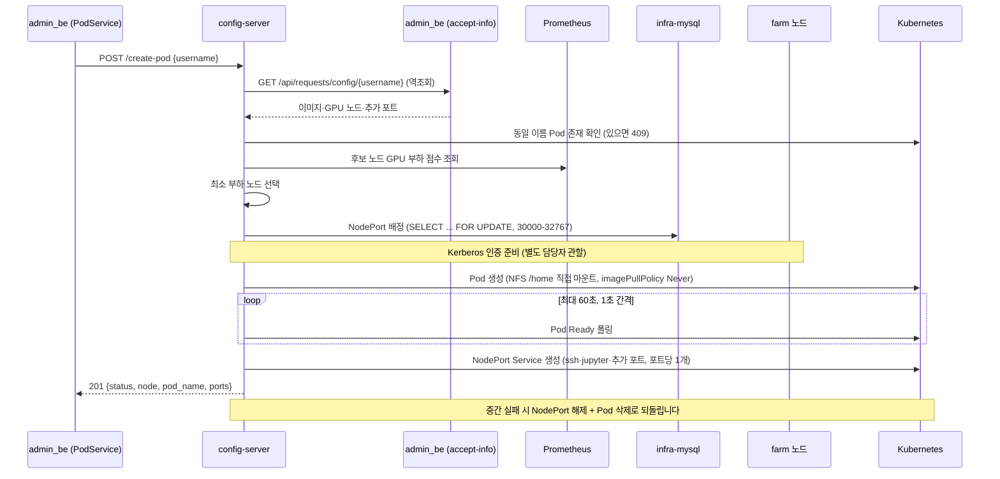
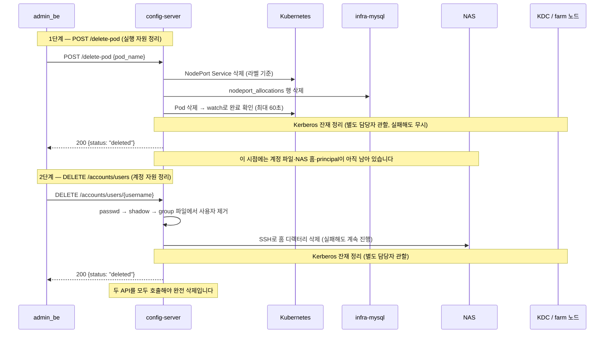

# API 레퍼런스

config-server의 전체 HTTP API 명세입니다. `main.py`의 `@app.route`와 `/accounts` 블루프린트(Blueprint, Flask에서 라우트를 묶어 관리하는 단위)를 전수 조사해 작성했습니다. 총 **11개 엔드포인트**입니다.

라이브 명세는 Swagger(API 명세를 웹 화면으로 보여주는 도구) UI `http://210.94.179.18:30082/apidocs/`에서도 확인할 수 있습니다.

> ℹ️ 이 문서는 배포본 코드(`config-server/main.py`)를 원전으로 합니다. 구(舊) 문서와 다른 부분은 코드를 우선했습니다. 대표적인 차이 두 가지입니다. (1) Pod·Service 이름 prefix가 `containerssh-`가 아니라 **`ailab-`**입니다. (2) `PUT /accounts/users`는 `uid`/`passwd_sha512`를 받지 않고 **`passwd_base64`를 받고, UID는 서버가 빈 번호를 골라 자동 배정**합니다.

---

## 1. 공통 사항

| 항목 | 값 |
|------|-----|
| Base URL (운영) | `http://210.94.179.18:30082` (namespace `ailab-infra`, Service `containerssh-config-service`) |
| 요청/응답 형식 | JSON (`Content-Type: application/json`) |
| 인증 | **없음** — 내부망 제한이 전제 조건입니다 |
| 에러 응답 형태 | Pod 계열은 `infra_error()` 포맷(`step`, `error`, `detail`, `progress` 등), 계정 계열은 `{"error": "..."}` 단순 포맷 |

호출 주체는 admin_be(Spring Boot WAS)의 서비스 클래스입니다. admin_be 실코드 기준으로 확인한 매핑입니다.

| admin_be 서비스 | 호출 엔드포인트 | 시점 |
|------|------|------|
| `AdminRequestCommandService` | `PUT /accounts/users` | 관리자 승인 시 |
| `PodService` | `POST /create-pod`, `POST /delete-pod` | 승인 시 / 만료 또는 실패를 되돌리는 삭제 시 |
| `UbuntuAccountService` | `DELETE /accounts/users/{username}` | 만료 또는 실패를 되돌리는 삭제 시 |
| `GroupService` | `PUT /accounts/groups` | 그룹 생성 시 |
| (호출처 없음 — 미확인) | `POST /migrate`, `GET /accounts/*`, `DELETE /accounts/groups`, `PUT /accounts/users/{u}/groups` | admin_be 코드에서 호출처가 발견되지 않았습니다. 운영자 수동 호출·실험용으로 보입니다 |

---

## 2. GET /health

| 항목 | 값 |
|------|-----|
| 메서드·경로 | `GET /health` |
| 호출 주체 | 헬스체크(서버 생존 확인). admin_be 서비스 호출은 없습니다 |

**입력.** 없습니다.

**처리 순서.** 즉시 응답합니다. 외부 의존성(DB, Kubernetes)을 검사하지 않으므로, 200이 와도 DB 연결 실패 상태일 수 있습니다.

**성공 응답.** `200` 본문 `"OK"` (문자열).

**대표 실패.** 없습니다(무조건 200).

---

## 3. POST /create-pod

| 항목 | 값 |
|------|-----|
| 메서드·경로 | `POST /create-pod` |
| 호출 주체 | admin_be `PodService` (승인 트랜잭션의 마지막 단계) |

**입력.**

```json
{"username": "user2100"}
```

`username` 하나만 받습니다. 이미지·GPU 노드·추가 포트 같은 상세 정보는 admin_be에 **역조회**(config-server가 거꾸로 admin_be를 호출하는 것)로 가져옵니다.

**처리 순서.**

1. `username` 없으면 400을 반환합니다.
2. WAS(admin_be) 역조회 — `GET http://admin-prod.default/api/requests/config/{username}`으로 사용자 설정(이미지, GPU 노드 목록, 추가 포트)을 받아옵니다. 통신 실패·JSON 파싱 실패는 502, 사용자 없음은 404입니다.
3. Pod 이름을 `ailab-<username>-<랜덤>` 형식으로 생성합니다.
4. 같은 이름의 Pod가 이미 있으면 409를 반환합니다. (⚠️ 같은 username의 **다른 이름** Pod는 막지 않습니다 — 중복 방지는 호출자 책임입니다)
5. 후보 노드 목록을 만듭니다. WAS가 준 `gpu_nodes`를 쓰고, 비어 있으면 Ready 상태의 워커 노드 전체로 폴백(fallback, 대체 경로)합니다.
6. Prometheus(서버 지표를 수집하는 모니터링 시스템)에 각 후보 노드의 GPU 부하를 물어 **가장 한가한 노드**를 고릅니다.
7. Pod 스펙을 조립합니다(`build_pod_spec`). 이 단계 안에서 아래 일이 함께 일어납니다.
   - `/kube_share` 계정 파일 확인 — **passwd에 사용자가 없으면 실패**합니다(계정 생성이 선행 조건).
   - 저장된 사용자 이미지(`/image-store/images/user-<username>.tar`)가 있으면 로드하고, 없으면 WAS가 준 base 이미지를 씁니다.
   - 기본 포트 22(ssh)·8888(jupyter)에 추가 포트를 더해, NodePort(클러스터 밖에서 접속할 수 있게 노드에 여는 고정 포트)를 DB에서 빈 번호를 골라 배정합니다(30000~32767, `SELECT ... FOR UPDATE` 행 잠금).
   - Kerberos 인증 준비가 실행됩니다. FARM NAS 홈 마운트에는 Kerberos 인증이 전제되며, 이 영역은 별도 담당자 관할이라 이 wiki에서는 다루지 않습니다. 실패하면 여기서 중단됩니다.
   - NFS(네트워크 너머의 저장소를 내 디스크처럼 마운트하는 프로토콜) user-share를 `/home`에 직접 마운트하도록 볼륨을 구성합니다. `imagePullPolicy: Never`(이미지를 절대 원격에서 받지 않고 노드에 있는 것만 사용)입니다.
8. Kubernetes에 Pod를 생성합니다.
9. 최대 60초 동안 1초 간격으로 Pod가 Ready(트래픽을 받을 준비 완료 상태)가 되기를 기다립니다.
10. Ready가 되면 포트마다 NodePort Service(`ailab-<username>-<용도>-<외부포트>`)를 생성합니다.
11. 성공 응답을 반환합니다. 8~10단계 어디서든 실패하면 배정한 NodePort 해제 + 만든 Pod 삭제(+Service 삭제)로, 그때까지 만든 것을 되돌립니다.



**성공 응답.** `201`

```json
{
  "status": "created",
  "node": "farm5",
  "pod_name": "ailab-user2100-1a2b3c4d",
  "ports": [
    {"internal_port": 22, "external_port": 30000, "usage_purpose": "ssh"},
    {"internal_port": 8888, "external_port": 30001, "usage_purpose": "jupyter"}
  ]
}
```

**대표 실패.**

| 상태 | 의미 |
|:---:|------|
| 400 | `username` 누락, 또는 스펙 조립 단계의 검증 실패(알 수 없는 노드, passwd에 사용자 없음 등) |
| 404 | WAS에 해당 사용자가 없음 (`USER_CONFIG_NOT_FOUND`) |
| 409 | 동일 이름 Pod가 이미 존재 (`POD_ALREADY_EXISTS`) |
| 502 | WAS 역조회 실패 — 통신 오류·비정상 응답 (`USER_CONFIG_FETCH_FAILED`) |
| 500 | 노드 선택·NodePort 배정·Kerberos 준비·Pod 생성·Ready 대기·Service 생성 실패. 응답의 `rollback` 필드로 어디까지 되돌렸는지 알 수 있습니다 |

---

## 4. POST /delete-pod

| 항목 | 값 |
|------|-----|
| 메서드·경로 | `POST /delete-pod` |
| 호출 주체 | admin_be `PodService` (만료 스케줄러, 실패를 되돌리는 삭제) |

**입력.**

```json
{"pod_name": "ailab-user2100-1a2b3c4d"}
```

**처리 순서.**

1. `pod_name` 없으면 400, `ailab-` prefix가 아니면 400(`INVALID_POD_NAME`)을 반환합니다. 이름에서 username을 파싱합니다.
2. 해당 Pod의 NodePort Service들을 라벨(`app=ailab-nodeport, pod_name=<pod>`) 기준으로 삭제합니다.
3. `nodeport_allocations` 테이블에서 해당 Pod의 포트 배정 기록 행을 삭제합니다.
4. Kubernetes Pod를 삭제하고, watch(쿠버네티스 이벤트 스트림 구독)로 **실제 삭제 완료**를 최대 60초 기다립니다. Pod가 원래 없었으면(404) `already_absent: true`로 200을 반환합니다.
5. Kerberos 관련 잔재 정리가 실행됩니다(별도 담당자 관할 영역, 실패해도 무시하는 best-effort).

**여기서 지워지는 것과 남는 것을 구분해야 합니다.** 이 API는 Pod·Service·NodePort DB 행만 정리합니다. **계정 파일(passwd 등)·NAS 홈·Kerberos principal은 그대로 남습니다.** 그것들은 아래 8절 `DELETE /accounts/users`의 몫입니다. 하나만 호출하면 반쪽 삭제가 됩니다.



**성공 응답.** `200`

```json
{
  "status": "deleted",
  "pod_name": "ailab-user2100-1a2b3c4d",
  "progress": {
    "servicesDeleted": true,
    "nodeportsReleased": true,
    "podDeleteRequested": true,
    "podDeleted": true
  }
}
```

`progress`는 롤백 결과가 아니라 **각 단계의 완료 여부**입니다. Pod가 원래 없던 경우 `already_absent: true`가 추가됩니다.

**대표 실패.**

| 상태 | 의미 |
|:---:|------|
| 400 | `pod_name` 누락, 또는 `ailab-` prefix가 아닌 이름 |
| 500 | Service 삭제·NodePort 해제·Pod 삭제 실패, 또는 60초 내 삭제 미완료(`POD_DELETE_TIMEOUT`) |

---

## 5. POST /migrate

| 항목 | 값 |
|------|-----|
| 메서드·경로 | `POST /migrate` |
| 호출 주체 | admin_be 호출처 없음 — 운영자 수동·실험용 (미확인) |

**입력.**

```json
{
  "username": "user2100",
  "nodes": ["farm5", "farm6"],
  "min_improvement_ratio": 0.2
}
```

`username`과 `nodes`(후보 노드 목록)가 필수이고, `min_improvement_ratio`(이만큼은 좋아져야 옮긴다는 개선 문턱, 기본 0.2)는 선택입니다.

**처리 순서.**

1. 사용자별 락 파일(`/tmp/migrate-<username>.lock`)을 잡아 같은 사용자의 동시 마이그레이션을 막습니다.
2. 후보 노드 이름을 실제 클러스터 노드 이름으로 정규화합니다. 모르는 노드가 있으면 400입니다.
3. 실행 중인 사용자 Pod를 찾습니다. 없으면 404입니다. 현재 노드가 후보 목록에 없으면 400입니다.
4. 현재 노드를 뺀 후보가 없으면 `skipped`(no_candidate_node)로 200을 반환합니다.
5. Prometheus GPU 점수를 현재 노드와 후보들에 대해 계산합니다. 최고 후보가 `min_improvement_ratio`만큼 충분히 좋지 않으면 `skipped`(no_significant_improvement)로 200을 반환합니다.
6. WAS에서 사용자 설정을 다시 조회합니다.
7. 기존 Pod 안에서 이미지 commit/save를 실행해 사용자 상태를 image-store에 저장합니다. 실패하면 500입니다.
8. 새 Pod 이름을 만들고, 새 노드에 Pod를 생성한 뒤 Ready를 최대 60초 기다리고 NodePort Service를 만듭니다. 실패하면 새 Pod와 새로 배정한 포트를 정리하고 500입니다.
9. 새 Pod가 완전히 성공한 뒤에야 기존 Pod의 Service·포트 배정·Pod를 삭제합니다.

**성공 응답.** `200`

```json
{
  "status": "migrated",
  "from": "farm5",
  "to": "farm6",
  "new_pod": "ailab-user2100-9z8y7x6w",
  "ports": [{"internal_port": 22, "external_port": 30005, "usage_purpose": "ssh"}]
}
```

건너뛴 경우에도 200이며 `{"status": "skipped", "reason": ...}` 형태입니다.

**대표 실패.**

| 상태 | 의미 |
|:---:|------|
| 400 | `username`/`nodes` 누락, 알 수 없는 노드, 현재 노드가 후보 목록에 없음 |
| 404 | 실행 중인 Pod 없음 |
| 500 | 이미지 commit 실패(`image_commit_failed`), 새 Pod 기동 실패, Service 생성 실패 |

---

## 6. GET /accounts/users

| 항목 | 값 |
|------|-----|
| 메서드·경로 | `GET /accounts/users` |
| 호출 주체 | admin_be 호출처 없음 — 운영자 점검용 (미확인) |

**입력.** 없습니다.

**처리 순서.** NFS 계정 파일 `/kube_share/passwd`(리눅스 계정 목록 파일)를 읽어 전체 사용자를 반환합니다.

**성공 응답.** `200`

```json
{
  "users": [
    {"name": "user2100", "uid": 20001, "gid": 20001, "gecos": "GPU User", "home": "/home/user2100", "shell": "/bin/bash"}
  ]
}
```

**대표 실패.** 파일 읽기 예외 시 500(`{"error": ...}`).

---

## 7. GET /accounts/users/&lt;username&gt;

| 항목 | 값 |
|------|-----|
| 메서드·경로 | `GET /accounts/users/<username>` |
| 호출 주체 | admin_be 호출처 없음 — 운영자 점검용 (미확인) |

**입력.** 경로의 `username`.

**처리 순서.**

1. passwd에서 사용자를 찾습니다. 없으면 404입니다.
2. group 파일을 훑어 primary group(사용자의 기본 그룹)과 supplementary group(추가로 소속된 그룹)을 함께 반환합니다.

**성공 응답.** `200`

```json
{
  "user": {"name": "user2100", "uid": 20001, "gid": 20001, "gecos": "", "home": "/home/user2100", "shell": "/bin/bash"},
  "groups": [
    {"name": "user2100", "gid": 20001, "type": "primary"},
    {"name": "developers", "gid": 20005, "type": "supplementary"}
  ]
}
```

**대표 실패.**

| 상태 | 의미 |
|:---:|------|
| 404 | 사용자 없음 |
| 500 | 파일 읽기 예외 |

---

## 8. PUT /accounts/users

| 항목 | 값 |
|------|-----|
| 메서드·경로 | `PUT /accounts/users` |
| 호출 주체 | admin_be `AdminRequestCommandService` (승인 시) |

**입력.**

```json
{
  "name": "user2100",
  "passwd_base64": "cGFzc3dvcmQ=",
  "gecos": "GPU User",
  "primary_group_name": "user2100",
  "supplementary_groups": [{"name": "ailab", "gid": 20005}]
}
```

필수는 `name`, `passwd_base64`(Base64로 감싼 평문 비밀번호)입니다. 나머지는 선택입니다.

> ℹ️ 구 문서에는 `uid`, `gid`, `passwd_sha512`가 필수로 적혀 있으나 현행 코드와 다릅니다. UID/GID는 서버가 빈 번호를 골라 자동 배정하고, 비밀번호 해시(SHA-512 crypt)도 서버가 만듭니다.

**처리 순서.**

1. 필수 필드와 `supplementary_groups` 형식(`{name, gid}` 목록)을 검증합니다. `passwd_base64` 디코딩에 실패하면 400입니다.
2. `/kube_share` 계정 파일 구조가 비어 있으면 `base_etc/` 템플릿으로 초기화합니다.
3. passwd 파일에 배타 락(다른 요청이 동시에 못 쓰게 잠금. NFS 락이 불안정해 실제 락은 로컬 `/tmp` 파일로 잡습니다)을 걸고 — 중복 사용자면 409, 아니면 **빈 UID를 골라 자동 배정**(관리 범위 20000 이상, `/home/` 밑 계정의 최댓값+1)해 passwd에 추가합니다. GID는 UID와 같은 값입니다.
4. group 파일에 primary group을 만들고, supplementary group에 멤버로 추가합니다. 실패하면 passwd까지 되돌리고 500입니다.
5. shadow(암호 해시 파일)에 SHA-512 crypt 해시를 기록합니다. 실패하면 롤백 후 500입니다.
6. `SUDO_ALLOWED_COMMANDS` 설정이 있으면 사용자별 sudoers(sudo 사용 권한을 정의하는 파일)를 0440 권한으로 만듭니다.
7. NAS(`192.168.2.30:6954`)에 SSH로 접속해 홈 디렉터리를 만듭니다(mkdir + chown + chmod 700). NFS가 root_squash(NFS에서 클라이언트 root를 권한 없는 사용자로 강등시키는 안전장치)라서 Pod 스스로는 홈을 만들 수 없기 때문입니다. 실패하면 롤백 후 500입니다.
8. Kerberos 인증 준비가 실행됩니다. FARM NAS 홈 마운트에는 Kerberos 인증이 전제되며, 이 영역은 별도 담당자 관할이라 이 wiki에서는 다루지 않습니다. 실패하면 홈 삭제 + 계정 롤백 후 500입니다.

**성공 응답.** `201`

```json
{
  "status": "created",
  "user": {"name": "user2100", "uid": 20001, "gid": 20001, "home": "/home/user2100", "shell": "/bin/bash"},
  "group": {"name": "user2100", "gid": 20001},
  "supplementary_groups": [{"name": "ailab", "gid": 20005}],
  "sudoers": "/kube_share/sudoers.d/user2100"
}
```

**대표 실패.**

| 상태 | 의미 |
|:---:|------|
| 400 | 필수 필드 누락, `passwd_base64` 디코딩 실패, supplementary_groups 형식 오류 |
| 409 | 사용자 이미 존재 |
| 500 | group/shadow/sudoers 기록 실패, NAS SSH 실패(`NAS_SSH_FAILED`), KDC 실패(`KDC_FAILED`) — 모두 계정 파일을 되돌린 뒤 반환합니다 |

---

## 9. DELETE /accounts/users/&lt;username&gt;

| 항목 | 값 |
|------|-----|
| 메서드·경로 | `DELETE /accounts/users/<username>` |
| 호출 주체 | admin_be `UbuntuAccountService` (만료, 실패를 되돌리는 삭제) |

**입력.** 경로의 `username`.

**처리 순서.**

1. passwd에서 사용자를 제거합니다. 없으면 404입니다.
2. shadow에서 해당 행을 제거합니다.
3. group 파일을 정리합니다 — 모든 그룹의 멤버 목록에서 사용자를 빼고, 이 사용자가 쓰던 그룹(명시적 멤버였거나 primary GID 그룹)이 비게 되면 그룹 자체를 삭제합니다.
4. NAS 홈 디렉터리를 SSH로 삭제합니다. **실패해도 경고 로그만 남기고 계속 진행**합니다(계정 파일은 이미 지워진 상태).
5. Kerberos 잔재 정리가 실행됩니다(별도 담당자 관할, 실패는 무시).

`POST /delete-pod`와 짝으로 호출해야 완전 삭제가 됩니다(4절의 시퀀스 다이어그램 참조). 이 API만 부르면 Pod·NodePort가 남고, delete-pod만 부르면 계정·홈·principal이 남습니다.

**성공 응답.** `200` — `{"status": "deleted", "user": "user2100"}`

**대표 실패.**

| 상태 | 의미 |
|:---:|------|
| 404 | 사용자 없음 |
| 500 | Kerberos 정리 등 처리 중 예외 (NAS 홈 삭제 실패는 500이 아니라 경고 후 진행) |

---

## 10. PUT /accounts/groups

| 항목 | 값 |
|------|-----|
| 메서드·경로 | `PUT /accounts/groups` |
| 호출 주체 | admin_be `GroupService` |

**입력.**

```json
{"name": "developers", "gid": 20005, "members": ["user2100", "user2101"]}
```

필수는 `name`입니다. `gid`는 생략하면 group 파일 기준으로 빈 번호를 골라 자동 배정(20000 이상)하고, `members`는 생략 가능합니다.

**처리 순서.**

1. `gid` 타입을 검증합니다(정수 또는 정수 문자열만 허용, 아니면 400).
2. `members`에 적힌 사용자가 passwd에 전부 존재하는지 확인합니다. 없는 사용자가 있으면 400입니다.
3. group 파일에 락을 걸고 — 같은 이름이 있으면 409, 지정한 gid가 이미 쓰이면 409, 아니면 새 그룹 행을 추가합니다.

**성공 응답.** `201` — `{"group": {"name": "developers", "gid": 20005}}`

**대표 실패.**

| 상태 | 의미 |
|:---:|------|
| 400 | `name` 누락, `gid` 타입 오류, 존재하지 않는 멤버 |
| 409 | 그룹 이름 또는 gid 중복 |

---

## 11. DELETE /accounts/groups/&lt;groupname&gt;

| 항목 | 값 |
|------|-----|
| 메서드·경로 | `DELETE /accounts/groups/<groupname>` |
| 호출 주체 | admin_be 호출처 없음 (미확인) |

**입력.** 경로의 `groupname`.

**처리 순서.**

1. group 파일에서 그룹을 찾습니다. 없으면 404입니다.
2. 이 그룹을 primary group으로 쓰는 사용자가 passwd에 있으면 삭제를 거부하고 400을 반환합니다(어느 사용자인지 에러 메시지에 나열).
3. 그룹 행을 삭제합니다.

**성공 응답.** `200` — `{"status": "deleted", "group": "developers", "gid": 20005}`

**대표 실패.**

| 상태 | 의미 |
|:---:|------|
| 400 | primary group으로 사용 중 |
| 404 | 그룹 없음 |

---

## 12. PUT /accounts/users/&lt;username&gt;/groups

| 항목 | 값 |
|------|-----|
| 메서드·경로 | `PUT /accounts/users/<username>/groups` |
| 호출 주체 | admin_be 호출처 없음 (미확인) |

**입력.**

```json
{"groups": ["developers", "ai-lab"]}
```

**처리 순서.**

1. `groups` 목록이 비어 있으면 400입니다.
2. 사용자가 passwd에 없으면 404입니다.
3. 지정한 그룹들의 멤버 목록에 사용자를 추가합니다(이미 있으면 그대로 둡니다).
4. 요청한 그룹 중 존재하지 않는 것이 있으면 404를 반환합니다.

**성공 응답.** `200` — `{"status": "updated", "user": "user2100", "groups": ["ai-lab", "developers"]}`

**대표 실패.**

| 상태 | 의미 |
|:---:|------|
| 400 | `groups` 누락 |
| 404 | 사용자 없음, 또는 존재하지 않는 그룹 포함 |

---

## 13. 운영 주의 사항

- **인증이 없습니다.** 위 11개 전부 요청자 검증 없이 동작합니다. 내부망 제한·NetworkPolicy(Pod 간 통신을 제한하는 쿠버네티스 방화벽 규칙)가 전제 조건입니다.
- **create-pod는 멱등하지 않습니다.** 같은 사용자로 반복 호출하면 Pod와 Service가 여러 벌 생깁니다. username 단위 중복 방지는 호출자(admin_be)의 책임입니다.
- **삭제는 두 API가 한 쌍입니다.** `POST /delete-pod`(Pod·Service·포트) + `DELETE /accounts/users`(계정·홈·principal)를 모두 호출해야 완전 삭제입니다.
- **jupyter NodePort 보안.** 8888 포트도 다른 포트와 동일하게 NodePort Service로 열립니다. 게스트 이미지의 Jupyter가 무인증 설정이면 외부 개방 시 우회 접근 경로가 되므로 내부망 제한이 필요합니다.
- 만료 스케줄러가 이 API들을 어떤 순서로 부르는지는 [운영 가이드](운영-매뉴얼.md)의 만료 흐름 절을 참고합니다.
