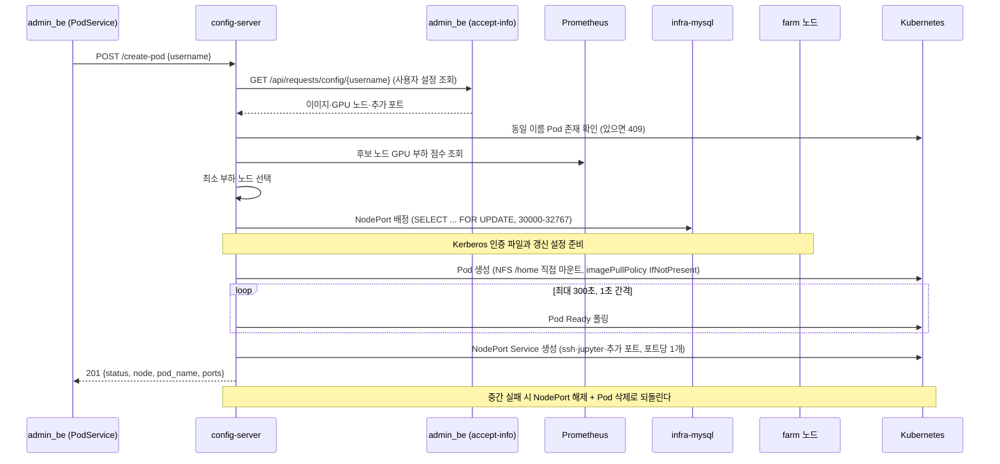
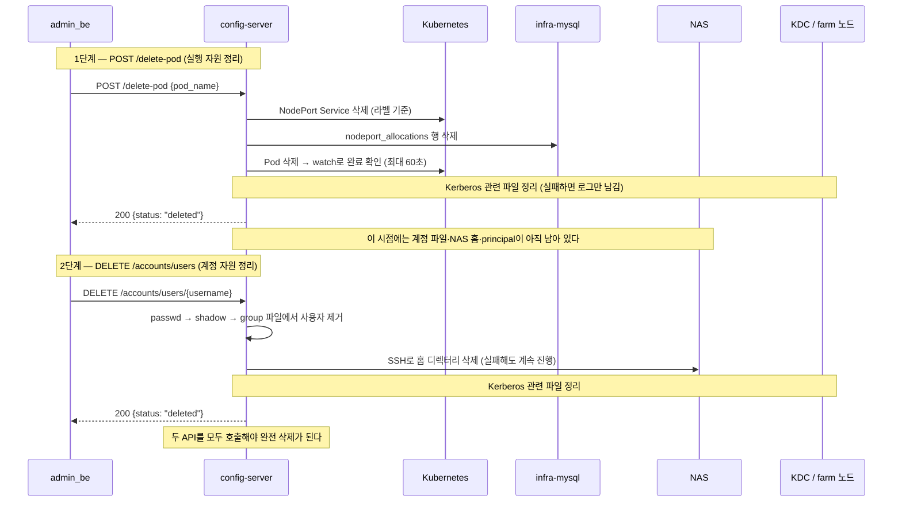

# API 레퍼런스

config-server의 HTTP API 명세다. `main.py`의 Flask route와 `/accounts` blueprint를 합쳐 총 **12개 엔드포인트**를 제공한다.

현재 배포된 API 목록은 Swagger UI `http://210.94.179.18:30082/apidocs/`에서도 확인할 수 있다.

---

## 1. 공통 사항

| 항목 | 값 |
|------|-----|
| Base URL (운영) | `http://210.94.179.18:30082` (namespace `ailab-infra`, Service `containerssh-config-service`) |
| 요청/응답 형식 | JSON (`Content-Type: application/json`) |
| 인증 | **없음** — 내부망 제한이 전제 조건이다 |
| 에러 응답 형태 | Pod 계열은 `infra_error()` 포맷(`step`, `error`, `detail`, `progress` 등), 계정 계열은 `{"error": "..."}` 단순 포맷 |

호출 주체는 admin_be(Spring Boot WAS)의 서비스 클래스이다. admin_be 실코드 기준으로 확인한 매핑이다.

| admin_be 서비스 | 호출 엔드포인트 | 시점 |
|------|------|------|
| `AdminRequestCommandService` | `PUT /accounts/users` | 관리자 승인 시 |
| `PodService` | `POST /create-pod`, `POST /delete-pod` | 승인 시 / 만료 또는 실패를 되돌리는 삭제 시 |
| `UbuntuAccountService` | `DELETE /accounts/users/{username}` | 만료 또는 실패를 되돌리는 삭제 시 |
| `GroupService` | `PUT /accounts/groups` | 그룹 생성 시 |
| (호출처 없음 — 미확인) | `GET /pods/{username}/status`, `POST /migrate`, `GET /accounts/*`, `DELETE /accounts/groups`, `PUT /accounts/users/{u}/groups` | admin_be 코드에서 호출처가 발견되지 않았다. 운영자 수동 호출·실험용으로 보인다 |

---

## 2. GET /health

| 항목 | 값 |
|------|-----|
| 메서드·경로 | `GET /health` |
| 호출 주체 | 헬스체크(서버 생존 확인). admin_be 서비스 호출은 없다 |

**입력.** 없다.

**처리 순서.** 즉시 응답한다. 외부 의존성(DB, Kubernetes)을 검사하지 않으므로, 200이 와도 DB 연결 실패 상태일 수 있다.

**성공 응답.** `200` 본문 `"OK"` (문자열).

**대표 실패.** 없다(무조건 200).

---

## 3. POST /create-pod

| 항목 | 값 |
|------|-----|
| 메서드·경로 | `POST /create-pod` |
| 호출 주체 | admin_be `PodService` (승인 트랜잭션의 마지막 단계) |

**입력.**

```json
{"username": "user2100"}
```

`username` 하나만 받는다. 이미지, GPU 노드, 추가 포트는 config-server가 admin_be에 다시 요청해 가져온다.

**처리 순서.**

1. `username` 없으면 400을 반환한다.
2. admin_be에 `GET http://admin-prod.default/api/requests/config/{username}`을 요청해 사용자 설정(이미지, GPU 노드 목록, 추가 포트)을 받아온다. 통신 실패나 JSON 파싱 실패는 502, 사용자가 없으면 404이다.
3. Pod 이름을 `ailab-<username>-<랜덤>` 형식으로 생성한다.
4. 같은 이름의 Pod가 이미 있으면 409를 반환한다. 같은 username이라도 이름이 다른 Pod는 막지 않으므로, 사용자 단위 중복 호출은 admin_be가 막아야 한다.
5. 후보 노드 목록을 만든다. admin_be가 준 `gpu_nodes`를 사용하고, 비어 있으면 Ready 상태의 워커 노드 전체를 사용한다.
6. Prometheus(서버 지표를 수집하는 모니터링 시스템)에 각 후보 노드의 GPU 부하를 물어 **가장 한가한 노드**를 고른다.
7. Pod 스펙을 조립한다(`build_pod_spec`). 이 단계 안에서 아래 일이 함께 일어난다.
   - `/kube_share` 계정 파일 확인 — **passwd에 사용자가 없으면 실패**한다(계정 생성이 선행 조건).
   - 저장된 사용자 이미지(`/image-store/images/user-<username>.tar`)가 있으면 로드하고, 없으면 WAS가 준 base 이미지를 쓴다.
   - 기본 포트 22(ssh), 8888(jupyter), 추가 포트에 NodePort를 배정한다. DB에서 30000~32767 중 빈 번호를 고르고 `SELECT ... FOR UPDATE`로 동시에 같은 번호를 고르지 못하게 한다.
   - Kerberos 설정이 켜져 있으면 선택된 FARM 노드에 인증 파일과 갱신 설정을 준비한다. 실패하면 여기서 중단된다. 점검과 복구는 [kdc-setup 운영 문서](../kdc-setup/operations.md)를 따른다.
   - NFS user-share를 `/home`에 직접 마운트하도록 볼륨을 구성한다. 사용자 Pod의 `imagePullPolicy`는 `IfNotPresent`이므로 노드에 이미지가 없을 때만 레지스트리에서 가져온다.
8. Kubernetes에 Pod를 생성한다.
9. 최대 300초 동안 1초 간격으로 Pod가 Ready 상태가 되기를 기다린다.
10. Ready가 되면 포트마다 NodePort Service(`ailab-<username>-<용도>-<외부포트>`)를 생성한다.
11. 성공 응답을 반환한다. 8~10단계 어디서든 실패하면 배정한 NodePort 해제 + 만든 Pod 삭제(+Service 삭제)로, 그때까지 만든 것을 되돌린다.



**성공 응답.** `201`

```json
{
  "status": "created",
  "node": "farm5",
  "pod_name": "ailab-user2100-1a2b3c4d",
  "ports": [
    {"internal_port": 22, "external_port": 30000, "usage_purpose": "ssh"},
    {"internal_port": 8888, "external_port": 30001, "usage_purpose": "jupyter"}
  ]
}
```

**대표 실패.**

| 상태 | 의미 |
|:---:|------|
| 400 | `username` 누락, 또는 스펙 조립 단계의 검증 실패(알 수 없는 노드, passwd에 사용자 없음 등) |
| 404 | WAS에 해당 사용자가 없음 (`USER_CONFIG_NOT_FOUND`) |
| 409 | 동일 이름 Pod가 이미 존재 (`POD_ALREADY_EXISTS`) |
| 502 | admin_be 사용자 설정 조회 실패 — 통신 오류·비정상 응답 (`USER_CONFIG_FETCH_FAILED`) |
| 500 | 노드 선택·NodePort 배정·Kerberos 준비·Pod 생성·Ready 대기·Service 생성 실패. 응답의 `rollback` 필드로 어디까지 되돌렸는지 알 수 있다 |

---

## 4. GET /pods/&lt;username&gt;/status

| 항목 | 값 |
|------|-----|
| 메서드·경로 | `GET /pods/<username>/status` |
| 호출 주체 | 생성 진행 상황을 조회하는 운영자·클라이언트용 API. admin_be 호출처는 미확인 |

`POST /create-pod`는 Pod 준비가 끝날 때까지 최대 300초 동안 기다리는 동기 API이다. 이 API는 생성 요청이 끝나기 전에도 사용자별 진행 상황을 가볍게 조회한다.

**입력.** 경로의 `username`.

**성공 응답.** `200`

```json
{
  "username": "user2100",
  "stage": "waiting_ready",
  "message": "이미지 pull / 컨테이너 기동 대기 중",
  "updated_at": "2026-07-22T01:23:45+00:00"
}
```

`stage`는 `unknown`, `started`, `selecting_node`, `building_pod_spec`, `allocating_nodeport`, `deploying_krb5`, `creating_pod`, `waiting_ready`, `creating_services`, `ready`, `failed` 중 하나이다. 생성 이력이 없으면 `stage`는 `unknown`이고 `updated_at`은 없다. `failed`의 `message`에는 보안을 위해 상세 예외나 Kubernetes 오류 원문을 넣지 않으므로, 원인은 config-server 로그에서 확인한다.

**대표 실패.** 상태 저장소 조회에 실패하면 `500`(`POD_STATUS_LOOKUP_FAILED`)을 반환한다.

---

## 5. POST /delete-pod

| 항목 | 값 |
|------|-----|
| 메서드·경로 | `POST /delete-pod` |
| 호출 주체 | admin_be `PodService` (만료 스케줄러, 실패를 되돌리는 삭제) |

**입력.**

```json
{"pod_name": "ailab-user2100-1a2b3c4d"}
```

**처리 순서.**

1. `pod_name` 없으면 400, `ailab-` prefix가 아니면 400(`INVALID_POD_NAME`)을 반환한다. 이름에서 username을 파싱한다.
2. 해당 Pod의 NodePort Service들을 라벨(`app=ailab-nodeport, pod_name=<pod>`) 기준으로 삭제한다.
3. `nodeport_allocations` 테이블에서 해당 Pod의 포트 배정 기록 행을 삭제한다.
4. Kubernetes Pod를 삭제하고, watch(쿠버네티스 이벤트 스트림 구독)로 **실제 삭제 완료**를 최대 60초 기다린다. Pod가 원래 없었으면(404) `already_absent: true`로 200을 반환한다.
5. Kerberos 관련 파일을 정리한다. 이 정리가 실패해도 Pod 삭제 결과는 실패로 바꾸지 않고 로그만 남긴다.

이 API는 Pod, Service, NodePort DB 행만 정리한다. 계정 파일(passwd 등), NAS 홈, Kerberos principal은 그대로 남고, 아래 10절의 `DELETE /accounts/users`가 정리한다. 두 API 중 하나만 호출하면 Pod 관련 자원이나 계정 관련 파일이 남는다.



**성공 응답.** `200`

```json
{
  "status": "deleted",
  "pod_name": "ailab-user2100-1a2b3c4d",
  "progress": {
    "servicesDeleted": true,
    "nodeportsReleased": true,
    "podDeleteRequested": true,
    "podDeleted": true
  }
}
```

`progress`는 롤백 결과가 아니라 **각 단계의 완료 여부**이다. Pod가 원래 없던 경우 `already_absent: true`가 추가된다.

**대표 실패.**

| 상태 | 의미 |
|:---:|------|
| 400 | `pod_name` 누락, 또는 `ailab-` prefix가 아닌 이름 |
| 500 | Service 삭제·NodePort 해제·Pod 삭제 실패, 또는 60초 내 삭제 미완료(`POD_DELETE_TIMEOUT`) |

---

## 6. POST /migrate

| 항목 | 값 |
|------|-----|
| 메서드·경로 | `POST /migrate` |
| 호출 주체 | admin_be 호출처 없음 — 운영자 수동·실험용 (미확인) |

**입력.**

```json
{
  "username": "user2100",
  "nodes": ["farm5", "farm6"],
  "min_improvement_ratio": 0.2
}
```

`username`과 `nodes`(후보 노드 목록)가 필수이고, `min_improvement_ratio`(이만큼은 좋아져야 옮긴다는 개선 문턱, 기본 0.2)는 선택이다.

**처리 순서.**

1. 사용자별 락 파일(`/tmp/migrate-<username>.lock`)을 잡아 같은 사용자의 동시 마이그레이션을 막는다.
2. 후보 노드 이름을 실제 클러스터 노드 이름으로 정규화한다. 모르는 노드가 있으면 400이다.
3. 실행 중인 사용자 Pod를 찾는다. 없으면 404이다. 현재 노드가 후보 목록에 없으면 400이다.
4. 현재 노드를 뺀 후보가 없으면 `skipped`(no_candidate_node)로 200을 반환한다.
5. Prometheus GPU 점수를 현재 노드와 후보들에 대해 계산한다. 최고 후보가 `min_improvement_ratio`만큼 충분히 좋지 않으면 `skipped`(no_significant_improvement)로 200을 반환한다.
6. WAS에서 사용자 설정을 다시 조회한다.
7. 기존 Pod 안에서 이미지 commit/save를 실행해 사용자 상태를 image-store에 저장한다. 실패하면 500이다.
8. 새 Pod 이름을 만들고, 새 노드에 Pod를 생성한 뒤 Ready를 최대 60초 기다리고 NodePort Service를 만든다. 실패하면 새 Pod와 새로 배정한 포트를 정리하고 500이다.
9. 새 Pod가 완전히 성공한 뒤에야 기존 Pod의 Service·포트 배정·Pod를 삭제한다.

**성공 응답.** `200`

```json
{
  "status": "migrated",
  "from": "farm5",
  "to": "farm6",
  "new_pod": "ailab-user2100-9z8y7x6w",
  "ports": [{"internal_port": 22, "external_port": 30005, "usage_purpose": "ssh"}]
}
```

건너뛴 경우에도 200이며 `{"status": "skipped", "reason": ...}` 형태이다.

**대표 실패.**

| 상태 | 의미 |
|:---:|------|
| 400 | `username`/`nodes` 누락, 알 수 없는 노드, 현재 노드가 후보 목록에 없음 |
| 404 | 실행 중인 Pod 없음 |
| 500 | 이미지 commit 실패(`image_commit_failed`), 새 Pod 기동 실패, Service 생성 실패 |

---

## 7. GET /accounts/users

| 항목 | 값 |
|------|-----|
| 메서드·경로 | `GET /accounts/users` |
| 호출 주체 | admin_be 호출처 없음 — 운영자 점검용 (미확인) |

**입력.** 없다.

**처리 순서.** NFS 계정 파일 `/kube_share/passwd`(리눅스 계정 목록 파일)를 읽어 전체 사용자를 반환한다.

**성공 응답.** `200`

```json
{
  "users": [
    {"name": "user2100", "uid": 20001, "gid": 20001, "gecos": "GPU User", "home": "/home/user2100", "shell": "/bin/bash"}
  ]
}
```

**대표 실패.** 파일 읽기 예외 시 500(`{"error": ...}`).

---

## 8. GET /accounts/users/&lt;username&gt;

| 항목 | 값 |
|------|-----|
| 메서드·경로 | `GET /accounts/users/<username>` |
| 호출 주체 | admin_be 호출처 없음 — 운영자 점검용 (미확인) |

**입력.** 경로의 `username`.

**처리 순서.**

1. passwd에서 사용자를 찾는다. 없으면 404이다.
2. group 파일을 읽어 기본 그룹과 추가 그룹을 함께 반환한다.

**성공 응답.** `200`

```json
{
  "user": {"name": "user2100", "uid": 20001, "gid": 20001, "gecos": "", "home": "/home/user2100", "shell": "/bin/bash"},
  "groups": [
    {"name": "user2100", "gid": 20001, "type": "primary"},
    {"name": "developers", "gid": 20005, "type": "supplementary"}
  ]
}
```

**대표 실패.**

| 상태 | 의미 |
|:---:|------|
| 404 | 사용자 없음 |
| 500 | 파일 읽기 예외 |

---

## 9. PUT /accounts/users

| 항목 | 값 |
|------|-----|
| 메서드·경로 | `PUT /accounts/users` |
| 호출 주체 | admin_be `AdminRequestCommandService` (승인 시) |

**입력.**

```json
{
  "name": "user2100",
  "passwd_base64": "cGFzc3dvcmQ=",
  "gecos": "GPU User",
  "primary_group_name": "user2100",
  "supplementary_groups": [{"name": "ailab", "gid": 20005}]
}
```

필수는 `name`, `passwd_base64`(Base64로 감싼 평문 비밀번호)이다. 나머지는 선택이다.

이전 문서에는 `uid`, `gid`, `passwd_sha512`가 필수라고 적혀 있지만 현재 코드와 다르다. UID/GID는 서버가 빈 번호를 골라 정하고, 비밀번호 해시(SHA-512 crypt)도 서버가 만든다.

**처리 순서.**

1. 필수 필드와 `supplementary_groups` 형식(`{name, gid}` 목록)을 검증한다. `passwd_base64` 디코딩에 실패하면 400이다.
2. `/kube_share` 계정 파일 구조가 비어 있으면 `base_etc/` 템플릿으로 초기화한다.
3. passwd 파일을 잠가 다른 요청이 동시에 같은 UID를 고르지 못하게 한다. NFS 파일에는 잠금을 걸지 않고 로컬 `/tmp` 잠금 파일을 쓴다. 사용자가 이미 있으면 409를 반환한다. 없으면 20000 이상이고 `/home/`을 쓰는 사용자 중 가장 큰 UID 다음 번호를 찾아 passwd에 추가한다. GID는 UID와 같은 값이다.
4. group 파일에 기본 그룹을 만들고, 요청에 든 추가 그룹에는 사용자를 구성원으로 넣는다. 실패하면 passwd에 쓴 내용도 되돌리고 500을 반환한다.
5. shadow(암호 해시 파일)에 SHA-512 crypt 해시를 기록한다. 실패하면 롤백 후 500이다.
6. `SUDO_ALLOWED_COMMANDS` 설정이 있으면 사용자별 sudoers(sudo 사용 권한을 정의하는 파일)를 0440 권한으로 만든다.
7. NAS(`192.168.2.30:6954`)에 SSH로 접속해 홈 디렉터리를 만든다(`mkdir`, `chown`, `chmod 700`). NFS의 `root_squash` 설정 때문에 Pod는 홈 디렉터리를 직접 만들 수 없다. 실패하면 계정 파일을 되돌리고 500을 반환한다.
8. Kerberos 설정이 켜져 있으면 사용자 principal과 keytab Secret을 만든다. 실패하면 홈 디렉터리를 지우고 계정 파일을 되돌린 뒤 500을 반환한다. 점검과 복구는 [kdc-setup 운영 문서](../kdc-setup/operations.md)를 따른다.

**성공 응답.** `201`

```json
{
  "status": "created",
  "user": {"name": "user2100", "uid": 20001, "gid": 20001, "home": "/home/user2100", "shell": "/bin/bash"},
  "group": {"name": "user2100", "gid": 20001},
  "supplementary_groups": [{"name": "ailab", "gid": 20005}],
  "sudoers": "/kube_share/sudoers.d/user2100"
}
```

**대표 실패.**

| 상태 | 의미 |
|:---:|------|
| 400 | 필수 필드 누락, `passwd_base64` 디코딩 실패, supplementary_groups 형식 오류 |
| 409 | 사용자 이미 존재 |
| 500 | group/shadow/sudoers 기록 실패, NAS SSH 실패(`NAS_SSH_FAILED`), KDC 실패(`KDC_FAILED`) — 모두 계정 파일을 되돌린 뒤 반환한다 |

---

## 10. DELETE /accounts/users/&lt;username&gt;

| 항목 | 값 |
|------|-----|
| 메서드·경로 | `DELETE /accounts/users/<username>` |
| 호출 주체 | admin_be `UbuntuAccountService` (만료, 실패를 되돌리는 삭제) |

**입력.** 경로의 `username`.

**처리 순서.**

1. passwd에서 사용자를 제거한다. 없으면 404이다.
2. shadow에서 해당 행을 제거한다.
3. group 파일을 정리한다 — 모든 그룹의 멤버 목록에서 사용자를 빼고, 이 사용자가 쓰던 그룹(명시적 멤버였거나 primary GID 그룹)이 비게 되면 그룹 자체를 삭제한다.
4. NAS 홈 디렉터리를 SSH로 삭제한다. **실패해도 경고 로그만 남기고 계속 진행**한다(계정 파일은 이미 지워진 상태).
5. Kerberos 관련 파일을 정리한다. 이 단계가 실패하면 오류를 기록하고 다음 작업을 계속한다.

`POST /delete-pod`도 함께 호출해야 Pod와 계정이 모두 정리된다(5절의 시퀀스 다이어그램 참조). 이 API만 호출하면 Pod와 NodePort가 남고, `delete-pod`만 호출하면 계정, 홈, principal이 남는다.

**성공 응답.** `200` — `{"status": "deleted", "user": "user2100"}`

**대표 실패.**

| 상태 | 의미 |
|:---:|------|
| 404 | 사용자 없음 |
| 500 | Kerberos 정리 등 처리 중 예외 (NAS 홈 삭제 실패는 500이 아니라 경고 후 진행) |

---

## 11. PUT /accounts/groups

| 항목 | 값 |
|------|-----|
| 메서드·경로 | `PUT /accounts/groups` |
| 호출 주체 | admin_be `GroupService` |

**입력.**

```json
{"name": "developers", "gid": 20005, "members": ["user2100", "user2101"]}
```

필수는 `name`이다. `gid`는 생략하면 group 파일 기준으로 빈 번호를 골라 자동 배정(20000 이상)하고, `members`는 생략 가능하다.

**처리 순서.**

1. `gid` 타입을 검증한다(정수 또는 정수 문자열만 허용, 아니면 400).
2. `members`에 적힌 사용자가 passwd에 전부 존재하는지 확인한다. 없는 사용자가 있으면 400이다.
3. group 파일에 락을 걸고 — 같은 이름이 있으면 409, 지정한 gid가 이미 쓰이면 409, 아니면 새 그룹 행을 추가한다.

**성공 응답.** `201` — `{"group": {"name": "developers", "gid": 20005}}`

**대표 실패.**

| 상태 | 의미 |
|:---:|------|
| 400 | `name` 누락, `gid` 타입 오류, 존재하지 않는 멤버 |
| 409 | 그룹 이름 또는 gid 중복 |

---

## 12. DELETE /accounts/groups/&lt;groupname&gt;

| 항목 | 값 |
|------|-----|
| 메서드·경로 | `DELETE /accounts/groups/<groupname>` |
| 호출 주체 | admin_be 호출처 없음 (미확인) |

**입력.** 경로의 `groupname`.

**처리 순서.**

1. group 파일에서 그룹을 찾는다. 없으면 404이다.
2. 이 그룹을 기본 그룹으로 쓰는 사용자가 passwd에 있으면 삭제를 거부하고 400을 반환한다. 오류 응답에는 해당 사용자 이름이 들어간다.
3. 그룹 행을 삭제한다.

**성공 응답.** `200` — `{"status": "deleted", "group": "developers", "gid": 20005}`

**대표 실패.**

| 상태 | 의미 |
|:---:|------|
| 400 | 기본 그룹으로 사용 중 |
| 404 | 그룹 없음 |

---

## 13. PUT /accounts/users/&lt;username&gt;/groups

| 항목 | 값 |
|------|-----|
| 메서드·경로 | `PUT /accounts/users/<username>/groups` |
| 호출 주체 | admin_be 호출처 없음 (미확인) |

**입력.**

```json
{"groups": ["developers", "ai-lab"]}
```

**처리 순서.**

1. `groups` 목록이 비어 있으면 400이다.
2. 사용자가 passwd에 없으면 404이다.
3. 지정한 그룹들의 멤버 목록에 사용자를 추가한다(이미 있으면 그대로 둔다).
4. 요청한 그룹 중 존재하지 않는 것이 있으면 404를 반환한다.

**성공 응답.** `200` — `{"status": "updated", "user": "user2100", "groups": ["ai-lab", "developers"]}`

**대표 실패.**

| 상태 | 의미 |
|:---:|------|
| 400 | `groups` 누락 |
| 404 | 사용자 없음, 또는 존재하지 않는 그룹 포함 |

---

## 14. 호출 전에 알아둘 점

- 위 12개 API는 요청자를 확인하지 않는다. 내부망 제한과 NetworkPolicy가 적용되어 있어야 한다.
- `create-pod`를 같은 사용자에게 여러 번 호출하면 Pod와 Service가 여러 개 만들어질 수 있다. 사용자 단위 중복 호출은 admin_be가 막아야 한다.
- `POST /delete-pod`(Pod, Service, 포트)와 `DELETE /accounts/users`(계정, 홈, principal)를 모두 호출해야 관련 자원이 남지 않는다.
- 8888 포트도 다른 포트처럼 NodePort Service로 열린다. 게스트 이미지의 Jupyter에 인증이 없으면 외부에서 접속할 수 있으므로 내부망에서만 접근하게 해야 한다.
- 만료 스케줄러가 이 API들을 어떤 순서로 부르는지는 [운영 가이드](운영-매뉴얼.md)의 만료 흐름 절을 참고한다.
