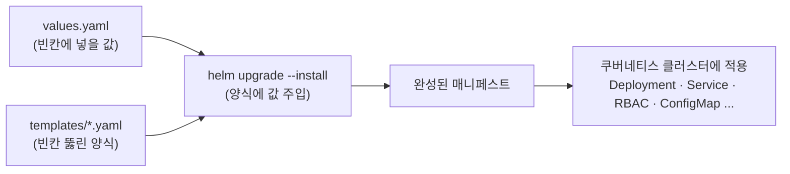

# Helm 차트 레퍼런스

쿠버네티스 기본 용어(Pod, Service, PVC, namespace 등)는 [기초 개념](../design/기초-개념.md)을 참고한다.

---

## 0. Helm 기본 개념

### 0.1 왜 Helm을 쓰는가

쿠버네티스에 무언가를 배포하려면 YAML 파일(매니페스트)을 여러 장 써야 한다. config-server 하나만 해도 Deployment, Service, 권한(RBAC), 설정(ConfigMap) 등 파일이 많다. 문제는 이 파일들 곳곳에 **배포 환경마다 달라지는 값**(이미지 태그, NFS 서버 주소, 포트 번호)이 박혀 있다는 점이다. 값이 바뀔 때마다 여러 파일을 뒤져 고치는 것은 실수하기 좋다.

- **템플릿(templates/)** — 매니페스트의 구조를 적어 둔 양식이다. 달라지는 자리는 `{{ .Values.image.tag }}`처럼 빈칸으로 뚫어 둔다.
- **values.yaml** — 그 빈칸에 채워 넣을 값들의 모음이다. "이번 배포의 설정 전체"가 이 파일 한 장에 모인다.
- **차트(Chart)** — 템플릿 묶음 + values.yaml + 메타데이터(Chart.yaml)를 합친 패키지이다.
- **릴리스(release)** — 차트를 클러스터에 설치한 결과물의 이름이다. 같은 차트를 이름만 다르게 여러 번 설치할 수도 있다. 이 시스템의 릴리스 이름은 `containerssh-config-server`이다.



배포 명령(`helm upgrade`)을 실행하면 Helm이 값을 양식에 주입해 완성된 매니페스트를 만들고, 그것을 클러스터에 적용한다. 그래서 "NFS 서버 주소가 바뀌었다" 같은 변경은 템플릿을 건드리지 않고 values.yaml 한 곳만 고치면 된다.

### 0.2 자주 쓰는 명령

```bash
# 배포(설치+업데이트 겸용) — ./Chart 디렉터리의 차트를 릴리스에 반영한다
helm upgrade --install containerssh-config-server ./Chart -n ailab-infra

# 새 Pod가 정상적으로 떴는지 확인한다
kubectl rollout status deploy/containerssh-config-server -n ailab-infra

# 잘못됐으면 직전 배포 상태로 되돌린다 (Helm이 릴리스 이력을 기억한다)
helm rollback containerssh-config-server -n ailab-infra
```

`upgrade --install`은 "릴리스가 없으면 설치하고, 있으면 갱신하라"는 겸용 명령이라 설치와 업데이트를 구분해 외울 필요가 없다. `rollback`이 가능한 이유는 Helm이 릴리스마다 배포 이력을 버전으로 쌓아 두기 때문이다.

### 0.3 `--set`으로 바꾼 값

`helm upgrade ... --set image.tag=abc123`처럼 명령어 뒤에 값을 직접 붙이면 values.yaml을 고치지 않고 그 배포 한 번에만 값을 바꿀 수 있다. 다음 배포 때 values.yaml의 값으로 돌아가므로, 계속 유지할 변경은 values.yaml이나 별도 운영 values 파일에 기록한다.

---

## 1. Chart/ — config-server 차트 (현행)

config-server 배포용 Helm 차트이다. 위치는 저장소의 `config-server/Chart/`이다.

### 1.1 이 차트가 클러스터에 만드는 것

| 리소스 | 이름 | 왜 필요한가 |
|--------|------|------------|
| Deployment | `containerssh-config-server` | config-server 컨테이너 1개(replicas: 1)를 실행한다. 15초 뒤부터 10초마다 `/health`를 확인해 Ready 상태를 판단한다. |
| Service (NodePort) | `containerssh-config-service` | config-server의 고정 접속 주소이다. 내부 80 → 컨테이너 8000(gunicorn), 외부 NodePort 30082 |
| ServiceAccount | `config-server` | config-server가 Kubernetes API를 호출할 때 사용하는 계정이다. |
| Role + RoleBinding | `config-server-role` / `config-server-rolebinding` | `ailab-infra` namespace 안에서 Pod(exec·log 하위 리소스 포함)·Service·PVC·Secret을 만들고 지울 권한을 위 ServiceAccount에 붙인다. 사용자 Pod 생성·삭제뿐 아니라 Pod 안에서 명령 실행(exec)·로그 조회까지 이 권한으로 이뤄진다 |
| ClusterRole + Binding | `...-node-reader` | 노드 목록 조회 권한이다. 노드는 namespace에 속하지 않는(cluster-scoped) 리소스라서 Role로는 못 주고 ClusterRole이 따로 필요하다 |
| ConfigMap | `krb5-conf` | Kerberos 클라이언트 설정(`krb5.conf`)을 담아 config-server Pod에 주입한다 |
| CronJob | `...-krb5-reconcile` | 30분마다 `reconcile_krb5.py`를 실행한다. `krb5_cleanup_pending`에 남은 실패 건을 다시 정리하고, FARM 노드의 keytab 목록과 `nodeport_allocations`를 비교해 Pod가 없는 사용자의 keytab도 지운다. |

### 1.2 파일 구성

| 파일 | 역할 |
|------|------|
| `Chart.yaml` | 차트 이름(`containerssh-config-server`)·버전 메타데이터이다 |
| `values.yaml` | 배포마다 달라지는 설정값 모음이다 (1.3절 카탈로그) |
| `templates/deployment.yaml` | Deployment 양식이다 — 이미지·환경변수·마운트가 여기서 조립된다. values의 값 대부분이 컨테이너 **환경변수**로 주입된다 |
| `templates/service.yaml` | NodePort Service 양식이다 |
| `templates/rbac.yaml` | Role/RoleBinding + ClusterRole/ClusterRoleBinding 양식이다 |
| `templates/serviceaccount.yaml` | ServiceAccount 양식이다 |
| `templates/configmap.yaml` | krb5.conf ConfigMap 양식이다 |
| `templates/cronjob-krb5-reconcile.yaml` | 30분마다 Kerberos 정리 재시도와 남은 keytab 확인을 실행하는 CronJob 설정이다. |
| `templates/_helpers.tpl` | 리소스 이름 조립 헬퍼이다 — 릴리스 이름을 그대로 리소스 이름으로 쓴다 |

값은 `values.yaml`에서 `deployment.yaml` 템플릿의 `env`를 거쳐 컨테이너 환경 변수로 들어간다. `main.py`, `utils.py`는 이 환경 변수를 읽는다. 예를 들어 `nas.ssh.host`는 `NAS_SSH_HOST`가 되어 NAS SSH 접속에 사용된다.

### 1.3 values.yaml 키 카탈로그

아래 기본값은 저장소 `values.yaml` 실측 기준이다. `""`(빈 값)인 키는 실제 배포 시 별도 values 파일이나 `--set`으로 주입된다는 뜻이다 — 저장소에는 주소·계정 같은 민감값을 남기지 않는 관례이다.

#### image — 무엇을 배포하나

CI/CD가 새 이미지를 push한 뒤 이 값 기준으로 배포된다.

| 키 | 의미 | 기본값 |
|----|------|--------|
| `image.repository` | 운영 이미지 저장소 | `dguailab/config-server` |
| `image.tag` | 이미지 태그 (CI가 latest + commit hash 이중 태깅) | `latest` |
| `image.pullPolicy` | 이미지를 매번 새로 받을지 정하는 정책 | `Always` |

#### service — 어떻게 접속하나

admin_be와 관리자가 이 포트로 API를 호출한다.

| 키 | 의미 | 기본값 |
|----|------|--------|
| `service.type` | Service 타입 | `NodePort` |
| `service.port` | 클러스터 내부 포트 | `80` |
| `service.targetPort` | 컨테이너 포트 (gunicorn) | `8000` |
| `service.nodePort` | 외부 노출 NodePort | `30082` (README의 9732는 오기, kubectl 실측) |

#### resources — config-server 자신의 몫

사용자 Pod의 리소스가 아니라 **관리 서버 본인**이 쓸 CPU/메모리이다. requests는 스케줄링 시 보장받는 최소치, limits는 상한이다.

| 키 | 의미 | 기본값 |
|----|------|--------|
| `resources.requests` | CPU/메모리 요청 | `500m` / `512Mi` |
| `resources.limits` | CPU/메모리 상한 | `2000m` / `1024Mi` |

#### nfs / nas / farm — 연결할 서버 설정

사용자 홈 NFS 주소, NAS SSH 접속 정보, keytab을 배포할 FARM 노드 목록을 정한다.

| 키 | 의미 | 기본값 |
|----|------|--------|
| `nfs.server` | NFS 서버 주소 | `""` (배포 시 주입) |
| `nfs.userSharePath` | 사용자 홈 루트 export 경로 | `""` |
| `nfs.kubeSharePath` | 계정 파일(`/kube_share`) export 경로 — config-server Pod 자신이 이 NFS를 마운트한다 | `""` |
| `nas.ssh.host` / `port` / `user` / `keyPath` | NAS 홈 생성용 SSH 접속 정보 (키 실체는 Secret, 1.4절) | `""` |
| `farm.ssh.user` / `keyPath` / `nodes` | farm 노드 keytab 배포용 SSH 정보와 대상 노드 목록 | `""` / `[]` |
| `farm.adSsh.user` / `keyPath` / `nodes` | AD/DC(krb5 principal 발급) 노드용 SSH 정보 | `""` / `[]` |
| `farm.homeMountRoot` | 노드 호스트에 마운트된 홈 루트 — 사용자 Pod `/home`의 hostPath 원천이다 ([시스템 아키텍처](../design/시스템-아키텍처.md)의 사용자 Pod 그림) | `""` |

#### security / krb5 — 권한과 인증

| 키 | 의미 | 기본값 |
|----|------|--------|
| `security.sudoAllowedCommands` | 사용자별 sudoers whitelist 명령 목록. **비어 있으면 sudoers 파일 자체를 만들지 않는다** | `""` |
| `krb5.realm` | Kerberos realm(인증 도메인 이름) — 운영은 `AILAB.DGU`이다 | `""` |
| `krb5.kdcHost` | KDC(티켓 발급 서버) 호스트. **기본 `values.yaml`과 현재 CI 배포 명령에는 이 값이 없다.** ConfigMap 템플릿은 이 값을 읽으므로, 현재 배포 결과의 `krb5.conf`에는 kdc와 admin_server 값이 비어 있다. 이 ConfigMap을 실제 Kerberos 클라이언트 설정으로 쓸 계획이면 values와 CI에 주입 경로를 추가해야 한다. | (키 없음) |

주의: `krb5.realm`이 비어 있으면 config-server는 사용자 keytab과 ccache를 준비하지 않는다. NAS의 Kerberos NFS 설정에 필요한 경우 새 Pod가 홈에 접근하지 못할 수 있다. 실제 NFS mount 옵션은 FARM 노드에서 확인한다.

#### db / redis — 상태 저장소

NodePort 배정 장부는 MySQL에, 이미지 저장/로드 상태는 Redis에 둔다([시스템 아키텍처](../design/시스템-아키텍처.md)의 NodePort 배정 방식).

| 키 | 의미 | 기본값 |
|----|------|--------|
| `db.host` | infra-mysql 호스트 | `infra-mysql` |
| `db.name` | 데이터베이스명 | `pod_port_db` |
| `db.user` | DB 사용자 | `pod_port_user` |
| `redis.host` | 이미지 상태용 Redis | `redis-bg-master.ailab-infra.svc.cluster.local` |
| `redis.port` | Redis 포트 | `6379` |

DB 비밀번호는 values에 없다 — Secret `config-server-db-secret`에서 주입된다(1.4절).

#### 배치 관련 — config-server가 어디에 뜨나

| 키 | 의미 | 기본값 |
|----|------|--------|
| `namespace` / `config.namespace` | 배포 대상 namespace. ConfigMap 템플릿은 `.Values.namespace`를 읽고 나머지 템플릿은 `.Values.config.namespace`를 읽는다. 두 값은 항상 같게 둔다. | `ailab-infra` |
| `nodeSelector` | config-server 배포 노드 고정 | `kubernetes.io/hostname: csid-dgu-desktop` |
| `tolerations` | control-plane의 NoSchedule taint 허용. taint는 노드에 걸린 "여기 배치 금지" 표식이고, toleration은 그 금지를 통과하는 허가증이다. 고정 대상 노드가 control-plane이라 nodeSelector와 반드시 짝으로 있어야 Pod가 뜬다 | `node-role.kubernetes.io/control-plane` |
| `cleanup.image` | 현재 템플릿에서는 읽지 않는 값이다. 지워도 배포 결과는 달라지지 않는다. | `config-server:latest` |

### 1.4 미리 만들어 둘 Secret

민감값(비밀번호, SSH 개인키)은 values.yaml에 넣지 않고 쿠버네티스 Secret으로 관리한다. Secret은 차트가 만들어 주지 않으므로 **클러스터에 미리 존재해야** 하며, 없으면 Pod가 뜨지 못한다.

| Secret 이름 | 내용 | 소비처 |
|-------------|------|--------|
| `config-server-db-secret` | DB 비밀번호 (key: `password`) | Deployment·CronJob의 `DB_PASSWORD` 환경변수 |
| `nas-ssh-key` | NAS 접속용 SSH 개인키 | `/etc/nas-ssh`에 read-only 마운트 |
| `farm-ssh-key` | farm 노드 접속용 SSH 개인키 | `/etc/farm-ssh`에 read-only 마운트 |
| `farm-ad-ssh-key` | AD/DC 노드 접속용 SSH 개인키 | `/etc/farm-ad-ssh`에 read-only 마운트 |

이 외에 config-server는 사용자별 `krb5-keytab-<user>` Secret을 만든다. `rbac.yaml`의 Secret 생성 권한은 이 작업에 필요하다.

### 1.5 값 수정 표준 절차

먼저 위치부터 잡는다. `config-server/`는 GitHub 저장소(CSID-DGU/admin_infra) 안의 폴더이다. 저장소를 내려받아(`git clone https://github.com/CSID-DGU/admin_infra.git`) 그 안의 `config-server/`로 이동한 상태에서 아래를 실행한다. 단, ②~④는 클러스터에 연결된 관리 서버(kubectl과 helm이 설정된 컴퓨터)에서만 동작한다 — 개인 노트북에서 clone만 받아서는 ①(파일 수정)까지만 가능하다.

```bash
# ① values.yaml에서 값을 수정한다
vi Chart/values.yaml

# ② 릴리스에 반영한다 (재배포)
helm upgrade --install containerssh-config-server ./Chart -n ailab-infra

# ③ 새 Pod가 정상적으로 떴는지 확인한다
kubectl rollout status deploy/containerssh-config-server -n ailab-infra

# ④ 잘못됐으면 직전 배포 상태로 되돌린다
helm rollback containerssh-config-server -n ailab-infra
```

반영 뒤에는 [운영 매뉴얼](운영-매뉴얼.md)의 배포 확인 절차를 따른다. 일회성 실험에는 `--set`을 쓸 수 있지만, 계속 유지할 값은 0.3절처럼 파일에 남긴다.

---

## 2. pvc-image-chart/ — 이미지 저장소 (현행)

사용자 컨테이너 이미지를 tar로 보관하는 공용 PVC `pvc-image-store`를 배포하는 작은 차트이다. **현행 구조에서 이 PVC를 마운트하는 것은 config-server뿐이다**(`/image-store` — 사용자별 이미지 저장/로드 경로는 `/image-store/images/user-<username>.tar`). 과거에는 게스트 Pod에도 붙였지만 마운트 실패 문제로 사용자 Pod 스펙에서는 제거됐다. 사용자별 홈 PVC가 폐기된 뒤에도 **image-store만 PVC로 남았다**([시스템 아키텍처](../design/시스템-아키텍처.md)의 홈 디렉터리와 이미지 저장소).

| 키/장치 | 값 | 의미 |
|---------|-----|------|
| `imageStore.size` | `500Gi` | PVC 요청 용량 |
| `storageClass` | `nfs-nas-v3-expandable` | NFS CSI 기반 StorageClass — 어떤 방식으로 저장소를 만들지 정한 템플릿 |
| accessModes | `ReadWriteMany` | 여러 Pod가 동시에 마운트할 수 있는 모드. 현행 소비자는 config-server이지만, 이미지 저장소를 공유 스토리지로 유지하는 계약을 나타낸다 |
| `helm.sh/resource-policy: keep` | annotation | **릴리스를 지워도 PVC는 남긴다.** 차트를 실수로 삭제해도 이미지 저장소 PVC가 함께 지워지지 않게 한다. |

---

## 3. pvc-chart/ (폐기)

사용자/그룹별 홈 PVC를 동적 생성하던 Helm 차트(`containerssh-pvc-chart`)의 잔재이다. 개별 사용자 PVC 방식은 26-07-02에 폐기되어 현행 흐름에서는 사용하지 않는다(현행은 NFS 직접 마운트 — [시스템 아키텍처](../design/시스템-아키텍처.md)의 홈 디렉터리와 이미지 저장소 참조).

이 디렉터리는 저장소에 남아 있지만 현재 배포에는 쓰지 않는다. `Chart.yaml`, `values.yaml`, `README.md`, StorageClass 매니페스트 두 장(`sc-nfs-nas-v3-resizable.yaml`, `old-sc.yaml`)은 이전 클러스터 상태를 확인할 때만 본다. 새로 배포하거나 복구할 때는 이 차트를 쓰지 않고 NFS 직접 마운트와 `pvc-image-chart/`를 사용한다.

---

## 4. infra-sql/ (현행)

config-server의 NodePort 배정 장부 등 인프라 상태를 저장하는 MySQL을 배포하는 **순수 매니페스트**(Helm 차트가 아니라 `kubectl apply`로 적용하는 YAML)이다.

| 파일 | 역할 |
|------|------|
| `nfs-mysql.yaml` | MySQL용 NFS CSI StorageClass `sc-mysql`을 만든다 (NFS server `192.168.2.30`, share `/volume1/share`, reclaimPolicy `Retain` — PVC를 지워도 데이터 볼륨을 삭제하지 않고 남긴다) |
| `infra-mysql.yaml` | `ailab-infra` namespace에 `infra-mysql` StatefulSet(고정 이름과 저장소를 유지하는 Pod 관리 객체, 저장소 10Gi) + ClusterIP Service(클러스터 내부 전용 접속 주소)를 생성한다 |

StatefulSet을 쓰는 이유는 DB이기 때문이다 — Deployment와 달리 Pod가 재생성되어도 같은 이름과 같은 저장소(PVC)를 다시 물려받으므로 데이터가 이어진다. Service가 ClusterIP(내부 전용)인 것도 의도이다 — 포트 장부 DB를 클러스터 밖에 노출할 이유가 없다.

주의: `nodeport_allocations` 테이블은 infra-mysql이 자동으로 만들지 않는다. DB를 다시 만들면 테이블 생성 SQL을 직접 실행해야 한다. 스키마는 [데이터베이스](../design/데이터베이스.md)를 참고한다.
