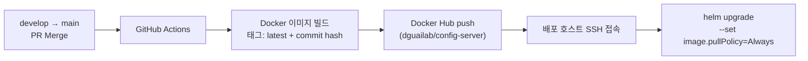
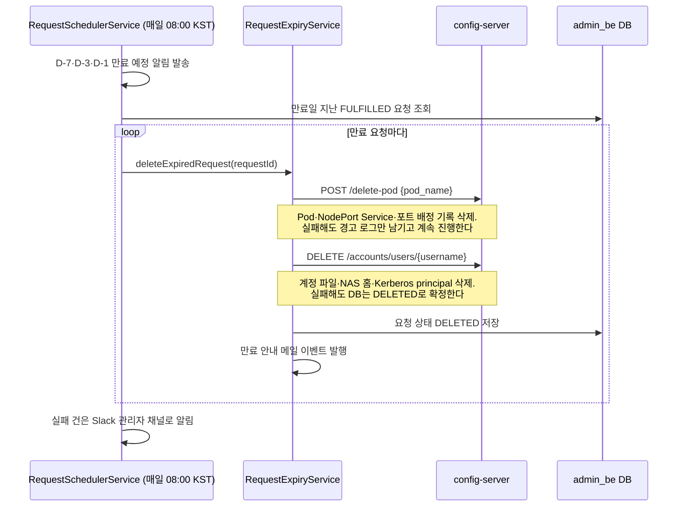
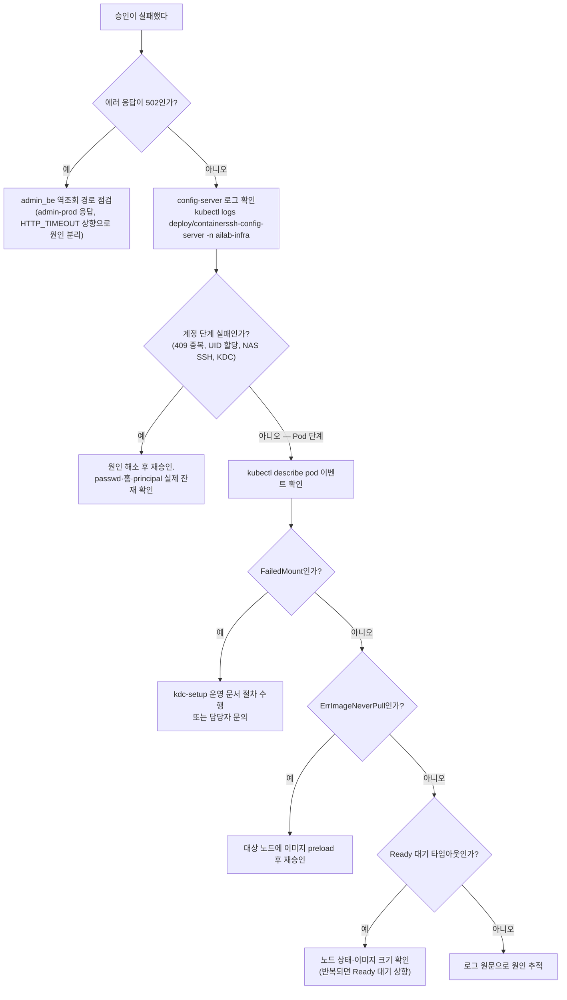
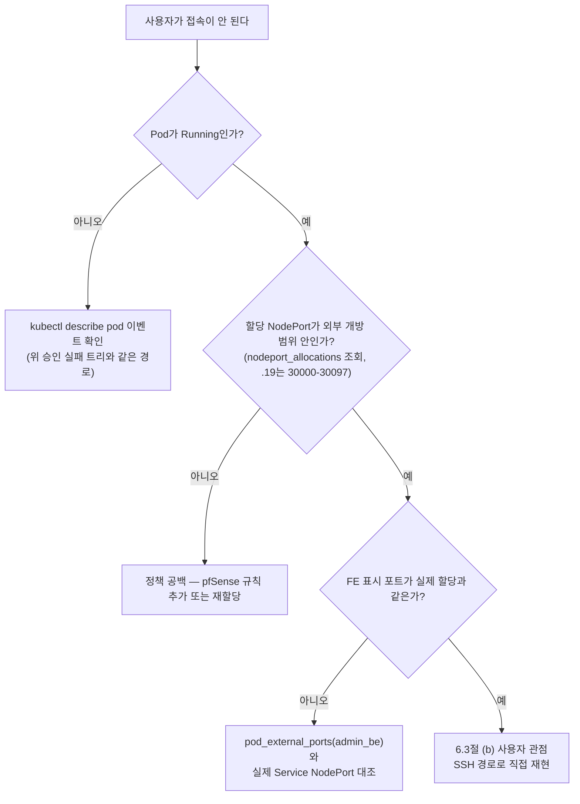

# 운영 매뉴얼

config-server 배포, 계정·Pod 운영, 일상 점검, 장애 격리와 복구 절차를 현재 코드와 Kubernetes 구조에 맞춰 정리한 통합 매뉴얼이다. 구조와 용어가 낯설면 [시스템 아키텍처](../design/시스템-아키텍처.md)와 [기초 개념](../design/기초-개념.md)을 먼저 읽고 돌아오는 것을 권한다. 설정값과 Secret의 전체 카탈로그는 [Helm 차트 레퍼런스](Helm-차트-레퍼런스.md)를 기준으로 하되, **자격 증명 원문은 어디에도 출력하지 않는다**.

---

## 1. 운영 원칙

작업을 시작하기 전에 몸에 익혀야 할 원칙들이다. 각 원칙은 실제 사고 패턴에서 나왔다.

1. **계정과 Pod는 따로 관리한다.** 생성·삭제 기준이 다른 두 자산이다 — 계정을 지웠는데 Pod가 돌거나, Pod를 지웠는데 계정·홈이 남는 반쪽 상태가 사고의 시작이다.
2. **작업 전후에 기록을 남긴다.** 사용자 이름, Pod 이름, UID/GID, 선택 노드, NodePort를 적어 둔다. 장애가 나면 이 기록이 부검의 출발점이다.
3. **API 오류가 나면 같은 요청을 바로 반복하지 않는다.** 계정·Pod 생성은 여러 외부 저장소를 순차로 갱신하므로, 오류 응답의 `stage`(어느 단계까지 갔는지)와 `rollback`(무엇을 되돌렸는지)부터 확인해 부분 생성 여부를 판단한다.
4. **비밀 값은 출력하지 않는다.** keytab, SSH 개인키, DB 비밀번호, shadow 내용은 화면·로그·티켓 어디에도 남기지 않는다.
5. **Kubernetes 리소스를 직접 삭제하기 전에 장부를 본다.** config-server와 MySQL에 남은 포트 할당 기록을 먼저 확인한다. 장부와 현실이 어긋난 채 한쪽만 지우면 어긋남이 더 커진다.
6. **예전 chart·스크립트는 복구에 쓰지 않는다.** 레포에 남아 있는 레거시(ContainerSSH, 사용자 PVC chart, restart_*.sh)는 현행 구조와 무관하다(10절 금지 사항).
7. **config-server 제어 API는 승인된 경로에서만 접근한다.** 이 API에는 인증이 없으므로([API 레퍼런스](API-레퍼런스.md)의 공통 사항), WAS와 승인된 운영망 밖으로 노출되지 않게 유지한다.
8. **머지는 배포가 아니고, 배포는 완료가 아니다.** 배포 후 실제 승인 1건을 스모크 테스트(핵심 경로를 한 번 통과시켜 보는 최소 검증)로 통과시키기 전에는 완료로 보지 않는다.

---

## 2. 기본 정보

### 2.1 핵심 값 한눈에

| 항목 | 값 |
| --- | --- |
| 운영 네임스페이스 | `ailab-infra` |
| Helm release | `containerssh-config-server` |
| config-server Deployment | `containerssh-config-server` |
| config-server Service | `containerssh-config-service` |
| config-server HTTP 포트 | Service 80 → 컨테이너 8000 |
| config-server 외부 NodePort | 30082 |
| 사용자 Pod 접두사 | `ailab-` |
| 사용자 NodePort 범위 | 30000–32767 |
| Pod Ready 최대 대기 | 300초 (배포 브랜치에 따라 다를 수 있음) |
| Pod 삭제 최대 대기 | 60초 |
| 진행 상태 보존 | 최종 갱신 후 1시간 |

이름에 `containerssh`가 들어간 리소스는 현재 config-server의 배포 이름일 뿐이다. 별도의 SSH 프록시가 실행되고 있다는 뜻으로 해석하지 않는다(과거 ContainerSSH 시대의 이름이 남은 것이다).

### 2.2 namespace 구성과 의도

namespace는 하나의 Kubernetes 클러스터를 논리적으로 나누는 칸막이이다. 이 클러스터의 namespace는 우연이 아니라 의도를 가지고 나뉘어 있다.

| namespace | 무엇이 사는가 | 왜 분리했는가 |
|-----------|--------------|--------------|
| `ailab-infra` | config-server, infra-mysql, redis, **사용자 Pod 전체** | 인프라 실행 계층. 사용자 워크로드와 그것을 만드는 인프라를 한 곳에 모아 조회·정리를 한 번에 하기 위함이다 |
| `ailab-frontend` | admin_fe (정적 서빙) | 정적 파일 서빙만 하는 계층이라 분리 — 배포·롤백을 다른 계층과 독립적으로 수행한다 |
| `default` (`admin-prod`) | admin_be (Spring Boot WAS) | 정책 계층. config-server의 역조회 대상(`admin-prod.default`)이 이 이름에 고정되어 있다 |
| `monitoring` | kube-prometheus-stack (Prometheus·Grafana) | 관측은 앱과 수명주기를 분리 — 앱을 재배포해도 모니터링 이력이 끊기지 않게 한다 |

⚠️ 레거시 namespace `containerssh`·`cssh`가 아직 클러스터에 남아 있을 수 있다. 현행 운영과 무관하며 삭제 대상 후보이므로, 이 안에서 무언가 발견해도 운영 서비스로 오인하지 않는다.

### 2.3 관리자 접근점

| 접근점 | 방법 | 비고 |
|--------|------|------|
| Grafana 대시보드 | `http://210.94.179.18:30080` | admin 로그인. 비밀번호는 K8s Secret에서 kubectl로 조회한다 |
| Swagger (config-server API) | `http://210.94.179.18:30082/apidocs/` | 엔드포인트 라이브 명세. 인증이 없으므로 "Try it out"은 실탄이다. repo README에는 9732 포트로 표기되어 있으나 오기이다 — kubectl 실측 기준 NodePort는 30082이다 |
| infra-mysql (pod_port_db) | `kubectl exec -it infra-mysql-0 -n ailab-infra -- mysql -u pod_port_user -p pod_port_db` | 비밀번호는 K8s Secret에서 kubectl로 조회한다 |
| config-server 로그 | `kubectl logs -f deploy/containerssh-config-server -n ailab-infra` | 승인·삭제 실패의 1차 확인 지점 |

Secret 값 조회는 이름을 찾은 뒤 jsonpath로 디코딩한다.

```bash
kubectl get secrets -n ailab-infra                 # Secret 이름 확인
kubectl get secret <이름> -n ailab-infra -o jsonpath='{.data.<키>}' | base64 -d
```

---

## 3. 일상 점검

매일 또는 작업 전에 훑는 항목이다. "정상이 어떤 모습인지"를 알아야 이상을 알아볼 수 있으므로, 각 절에 정상 기준을 함께 적었다.

### 3.1 제어면 (config-server와 부속)

```bash
kubectl -n ailab-infra get deploy,sts,pod
kubectl -n ailab-infra get svc
kubectl -n ailab-infra get events --sort-by=.lastTimestamp
kubectl -n ailab-infra rollout status deploy/containerssh-config-server
```

정상 기준은 다음과 같다.

- config-server Deployment가 1/1 Ready이다.
- infra-mysql과 Redis 구성요소가 Ready이다.
- config-server Service가 30082 NodePort를 유지한다.
- 새 Warning 이벤트와 반복 재시작이 없다.

### 3.2 Deployment·설정 확인

비밀 값을 출력하지 않고 배포 구조를 확인한다.

```bash
kubectl -n ailab-infra get deploy containerssh-config-server -o custom-columns=IMAGE:.spec.template.spec.containers[0].image,SA:.spec.template.spec.serviceAccountName,NODE:.spec.template.spec.nodeSelector
kubectl -n ailab-infra describe deploy containerssh-config-server
kubectl -n ailab-infra get svc containerssh-config-service
helm -n ailab-infra get manifest containerssh-config-server
```

확인 기준이다.

| 영역 | 기대 값 |
| --- | --- |
| replica | 1 |
| 프로세스 | gunicorn worker 4개, timeout 700초 |
| ServiceAccount | `config-server` |
| config-server 배치 | 지정 control-plane 노드의 nodeSelector와 NoSchedule toleration |
| 컨테이너 포트 | 8000 |
| readiness | `GET /health`, 초기 15초, 10초 주기 |
| liveness | 별도 probe 없음 |
| 리소스 | request 500m/512Mi, limit 2000m/1024Mi |
| API Service | NodePort 30082, Service 80 → container 8000 |
| 계정 저장소 | NFS kube_share → `/kube_share` |
| 비밀 mount | NAS, FARM, FARM AD SSH Secret이 read-only |
| Kerberos 설정 | `krb5-conf` ConfigMap → `/etc/krb5.conf` |
| image-store | `pvc-image-store` → `/image-store` |

ServiceAccount 권한도 확인한다. `kubectl auth can-i`는 "이 계정으로 이 동작이 되는가"를 물어보는 명령이다.

```bash
kubectl auth can-i list pods -n ailab-infra --as=system:serviceaccount:ailab-infra:config-server
kubectl auth can-i create services -n ailab-infra --as=system:serviceaccount:ailab-infra:config-server
kubectl auth can-i list nodes --as=system:serviceaccount:ailab-infra:config-server
kubectl auth can-i list services --all-namespaces --as=system:serviceaccount:ailab-infra:config-server
```

마지막 조회(전체 namespace의 Service 목록)가 가능해야 다른 namespace에서 이미 쓰는 NodePort까지 피해서 배정할 수 있다. `no`가 나오면 권한을 바로 바꾸지 말고 미해결 항목으로 기록해 두고 논의한다.

### 3.3 API와 로그

```bash
config_server_url='운영_config-server_URL'

curl -fsS "$config_server_url/health"
kubectl -n ailab-infra logs deploy/containerssh-config-server --since=30m
```

주의할 점 — `/health`는 HTTP 프로세스가 살아 있는지만 확인한다. WAS, MySQL, Redis, Prometheus, NAS, FARM SSH, AD까지 검증하지 않으므로 "health가 OK인데 승인이 실패하는" 상황은 얼마든지 있다. 구성요소 점검을 함께 수행한다.

로그에서는 다음 범주가 반복적으로 찍히는지 본다. 각 범주는 승인 흐름의 한 마디에 대응한다.

- `FETCH_USER_CONFIG` — admin_be 역조회
- `SELECT_NODE` — Prometheus 점수 기반 노드 선택
- `NODEPORT` — 포트 배정
- `WAIT_POD_READY` — Pod Ready 폴링
- `FARM SSH`, `FARM AD SSH` — 노드·AD 원격 작업

### 3.4 사용자 Pod와 Service

```bash
kubectl -n ailab-infra get pod -l username
kubectl -n ailab-infra get svc -l app=ailab-nodeport
kubectl -n ailab-infra get pod -o wide
```

각 사용자 Service의 `pod_name` 라벨이 실제 Pod를 가리키는지 확인한다. Error·Failed Pod와 대상 Pod가 없는 Service를 발견해도 **바로 삭제하지 않는다** — 사용자, 포트 할당 기록, 생성·삭제 로그를 먼저 대조한다(1절 원칙 5).

특정 사용자 Pod의 실행 설정과 마운트를 확인할 때는 jsonpath로 필요한 필드만 뽑는다.

```bash
pod_name='점검할_ailab_Pod_이름'

kubectl -n ailab-infra get pod "$pod_name" -o jsonpath='{.spec.nodeName}{"\n"}{.spec.restartPolicy}{"\n"}{.spec.containers[0].image}{"\n"}{.spec.containers[0].resources}{"\n"}'
kubectl -n ailab-infra get pod "$pod_name" -o jsonpath='{range .spec.volumes[*]}{.name}{"\t"}{.hostPath.path}{"\t"}{.hostPath.type}{"\n"}{end}'
kubectl -n ailab-infra get pod "$pod_name" -o jsonpath='{range .spec.containers[0].volumeMounts[*]}{.name}{"\t"}{.mountPath}{"\t"}{.readOnly}{"\n"}{end}'
kubectl -n ailab-infra get pod "$pod_name" -o jsonpath='{range .spec.containers[0].env[*]}{.name}{"\n"}{end}'
```

현재 Pod는 [시스템 아키텍처](../design/시스템-아키텍처.md)의 사용자 Pod 그림과 같이 구성한다.

- FARM 홈이 `/home`에 연결되어 있다 (노드 호스트의 NFS 마운트를 hostPath로 물려받음).
- Kerberos 활성 시 `/run/user/<uid>`가 같은 경로로 연결되어 있다.
- GPU 승인 시 `/dev/nvidia<N>`과 보조 디바이스가 있다.
- **사용자 Pod에는 keytab, kube_share, image-store가 없어야 한다.** 이 셋이 보이면 잘못된 스펙이다.

Pod securityContext와 사용자 probe는 현재 지정되지 않는다. 실제 사용자 프로세스의 UID/GID, SSH, Jupyter, noVNC 동작은 guest image의 진입 스크립트(entrypoint)까지 봐야 확인된다.

중복 NodePort가 없는지도 훑는다. 아래 명령은 중복된 포트 번호만 출력하므로, **출력이 없어야 정상**이다.

```bash
kubectl -n ailab-infra get svc -l app=ailab-nodeport -o jsonpath='{range .items[*].spec.ports[*]}{.nodePort}{"\n"}{end}' | sort -n | uniq -d
```

### 3.5 모니터링 접근

| 대상 | 방법 |
|------|------|
| 통합 대시보드 (Grafana) | `http://210.94.179.18:30080` admin 로그인 |
| 스토리지 응답성 | Grafana 대시보드 `storage-latency-health` — NFS 장애 의심 시 가장 먼저 본다 |
| Prometheus 직접 질의 | `kubectl -n monitoring port-forward svc/monitoring-kube-prometheus-prometheus 9090:9090` |

Prometheus는 관측뿐 아니라 **Pod 배치 노드 선택의 입력**이기도 한다. 모니터링이 죽으면 대시보드가 안 보이는 것에 그치지 않고 Pod 생성의 노드 선택 품질이 저하되며, 전부 죽으면 create-pod 자체가 실패한다([시스템 아키텍처](../design/시스템-아키텍처.md)의 GPU 노드 선택 방식).

---

## 4. 배포와 롤백

### 4.1 정상 배포 경로

배포 자동화는 GitHub Actions를 사용하며, **`main` 브랜치에 push 이벤트가 발생할 때만** 실행된다. 즉 `develop` → `main` PR이 Merge 되는 순간 운영 배포가 시작된다.



CI가 수행하는 일을 순서대로 풀면 다음과 같다.

1. `config-server/Dockerfile`로 이미지를 빌드한다.
2. `latest`와 소스 버전 기반 불변 태그(commit hash) 두 가지로 레지스트리에 푸시한다.
3. `config-server/Chart`를 배포 호스트로 전달한다.
4. CI Secret의 NFS, NAS, FARM, AD, Realm 값을 Helm에 주입한다.
5. `ailab-infra`의 release를 불변 이미지 태그로 갱신한다.

CI/CD용 GitHub Secrets는 `DOCKER_USERNAME`, `DOCKER_PASSWORD`, `K8S_HOST`, `K8S_USERNAME`, `K8S_PRIVATE_KEY`, `K8S_PORT`이다. 현재 username이 toni 기준으로 등록되어 있어 관리자 변경 시 인수인계가 필요하다. 비밀 값은 repository 파일, 일반 운영 절차, 로그에 복사하지 않는다.

### 4.2 배포 전 확인

코드를 머지하기 전에 사람이 확인할 것이 있다.

1. **동결 여부** — 타인이 인프라 테스트 중이면 코드/Helm 무변경 원칙이 걸려 있을 수 있다.
2. **배포 브랜치** — main과 hotfix 계열 브랜치가 분기된 이력이 있어 Ready 대기·krb5 방식·마운트 구성이 브랜치마다 다르다. "지금 클러스터에 떠 있는 이미지가 어느 커밋인가"부터 확정한다.

기계적 확인은 다음 명령으로 한다.

```bash
helm lint config-server/Chart
git diff -- config-server .github/workflows/deploy-config-server.yaml
kubectl -n ailab-infra get deploy/containerssh-config-server -o jsonpath='{.spec.template.spec.containers[0].image}{"\n"}'
helm -n ailab-infra history containerssh-config-server
```

확인 기준이다.

- 변경 범위가 config-server와 chart 의도에 맞다.
- 이미지 태그가 불변 값(commit hash)이다.
- chart가 참조하는 Secret과 ConfigMap 이름이 운영 네임스페이스에 존재한다([Helm 차트 레퍼런스](Helm-차트-레퍼런스.md) 1.4절).
- FARM 노드 목록과 AD DC 목록의 이름이 실제 Kubernetes 노드 이름과 일치한다.
- `FARM_HOME_MOUNT_ROOT`가 모든 후보 노드에서 동일한 FARM 홈을 가리킨다.

### 4.3 배포 후 확인

```bash
kubectl -n ailab-infra rollout status deploy/containerssh-config-server --timeout=5m
kubectl -n ailab-infra get pod -l app=containerssh-config-server -o wide
kubectl -n ailab-infra logs deploy/containerssh-config-server --since=10m
kubectl -n ailab-infra get svc containerssh-config-service
```

로그의 주요 체크 포인트이다.

- `ModuleNotFoundError` — requirements.txt 누락 또는 파일명 불일치이다.
- `WORKER TIMEOUT` — 초기 로딩 시간이 긴 경우이다 (Dockerfile 타임아웃 설정 확인).

이후 canary(실제 트래픽을 소량 흘려 보는 검증)를 수행한다. 1절 원칙 8의 "머지는 배포가 아니다"를 실행하는 절차이다.

1. `/health`를 호출한다.
2. 사용자 조회 API를 호출한다.
3. 시험 사용자 또는 승인된 기존 사용자로 Pod 생성 단계를 확인한다.
4. NodePort Service와 실제 접속을 확인한다.
5. 선택 노드의 Kerberos ccache와 FARM 홈 읽기·쓰기를 확인한다.
6. Pod 삭제 후 Service, 포트 예약, 노드 타이머가 정리되는지 확인한다.

### 4.4 롤백

배포 직후 회귀(전에 되던 것이 안 되는 상태)가 확인되면 Helm release 이력을 기준으로 되돌린다.

```bash
helm -n ailab-infra history containerssh-config-server
helm -n ailab-infra rollback containerssh-config-server '정상_리비전'
kubectl -n ailab-infra rollout status deploy/containerssh-config-server --timeout=5m
```

⚠️ 롤백이 되돌리는 것은 **config-server 프로세스뿐**이다. 계정 파일, MySQL 포트 할당 기록, Kubernetes Service, FARM 노드의 keytab 상태는 자동으로 이전 상태로 돌아가지 않는다. 배포 사이에 오류가 발생한 요청이 있다면 그 요청의 `stage`와 `rollback`을 기준으로 잔재를 따로 확인한다.

---

## 5. 계정 운영

계정 작업은 `/kube_share`의 passwd 파일을 기준으로 한다([시스템 아키텍처](../design/시스템-아키텍처.md)의 계정 정보). 아래 API가 그 장부를 안전하게 고치는 유일한 경로이므로, 파일을 손으로 편집하지 않는다.

### 5.1 조회

```bash
config_server_url='운영_config-server_URL'
target_user='사용자명'

curl -fsS "$config_server_url/accounts/users"
curl -fsS "$config_server_url/accounts/users/$target_user"
```

계정 상세에서 사용자 이름, UID, GID, 홈, 셸을 확인한다. shadow와 keytab 내용은 조회하지 않는다(1절 원칙 4).

### 5.2 생성

계정 생성은 승인된 WAS 흐름(관리자 승인 → admin_be가 호출)을 우선한다. 운영자가 직접 호출하는 것은 예외 상황이며, 요청 전에 동일 사용자가 없는지 확인한다.

```bash
curl -fsS -X PUT "$config_server_url/accounts/users" -H 'Content-Type: application/json' --data '{
    "name": "사용자명",
    "passwd_base64": "BASE64로_인코딩한_비밀번호",
    "gecos": "사용자 설명",
    "supplementary_groups": [
      {"name": "그룹명", "gid": 20050}
    ]
  }'
```

성공 응답의 UID/GID를 기록하고(1절 원칙 2) 다음 순서로 확인한다.

1. 사용자 조회 API
2. NAS 홈 디렉터리의 숫자 소유권과 `0700`
3. FARM AD 사용자와 `<user>_gid`
4. Kubernetes keytab Secret의 **존재 여부만** 확인 (내용은 보지 않는다)

```bash
target_user='사용자명'
kubectl -n ailab-infra get secret "krb5-keytab-$target_user" -o custom-columns=NAME:.metadata.name,CREATED:.metadata.creationTimestamp
```

### 5.3 그룹

그룹 생성은 이름을 필수로 받고, GID를 생략하면 다음 사용 가능한 값을 할당한다.

```bash
curl -fsS -X PUT "$config_server_url/accounts/groups" -H 'Content-Type: application/json' --data '{"name":"그룹명","members":["사용자명"]}'
```

기존 그룹에 사용자를 추가한다.

```bash
curl -fsS -X PUT "$config_server_url/accounts/users/사용자명/groups" -H 'Content-Type: application/json' --data '{"groups":["그룹명"]}'
```

기본 그룹(사용자의 primary group)으로 사용 중인 그룹은 삭제할 수 없다.

### 5.4 삭제

**계정 삭제 전에 사용자의 Pod를 먼저 삭제한다**(6.2절). Pod 이름과 선택 노드를 기록하고, Service와 NodePort 정리가 끝난 뒤 계정을 삭제한다. 순서를 지키지 않으면 주인 없는 Pod가 남는다.

```bash
target_user='사용자명'
curl -fsS -X DELETE "$config_server_url/accounts/users/$target_user"
```

삭제 후 확인 목록이다.

- 계정 조회가 404를 반환한다.
- 사용자 Pod와 Service가 없다.
- keytab Secret이 없다.
- 모든 FARM 노드에서 사용자 타이머와 keytab이 없다.
- NAS 홈 처리 결과가 운영 정책과 일치한다.

⚠️ NAS 홈 삭제가 실패해도 계정 삭제 전체는 중단되지 않고 계속 진행된다. 즉 "삭제 성공" 응답 뒤에 홈이 남아 있을 수 있으므로 로그 확인이 필요하다.

---

## 6. Pod 운영

### 6.1 생성

생성 전 계정과 WAS 설정을 확인한 뒤 호출한다.

```bash
target_user='사용자명'

curl -fsS "$config_server_url/accounts/users/$target_user"
curl -fsS -X POST "$config_server_url/create-pod" -H 'Content-Type: application/json' --data '{"username":"'"$target_user"'"}'
```

생성은 노드 선택 → 포트 배정 → krb5 배포 → Pod 생성 → Ready 대기의 긴 체인이라 응답까지 시간이 걸린다. 기다리는 동안 다른 터미널에서 진행 상태를 조회할 수 있다.

```bash
curl -fsS "$config_server_url/pods/$target_user/status"
```

성공 응답에서 `pod_name`, `node`, `ports`를 기록하고(1절 원칙 2), 실제 리소스를 확인한다.

```bash
pod_name='응답의_Pod_이름'

kubectl -n ailab-infra get pod "$pod_name" -o wide
kubectl -n ailab-infra get svc -l "pod_name=$pod_name"
kubectl -n ailab-infra describe pod "$pod_name"
```

정상 기준은 Pod가 Ready이고, 응답의 각 포트에 대응하는 NodePort Service가 있으며, SSH·Jupyter·선택 기능이 실제로 연결되는 상태이다.

### 6.2 삭제

삭제 전 사용자에게 중단 사실을 확인하고 Pod 이름을 정확히 기록한다.

```bash
pod_name='삭제할_ailab_Pod_이름'

curl -fsS -X POST "$config_server_url/delete-pod" -H 'Content-Type: application/json' --data '{"pod_name":"'"$pod_name"'"}'
```

응답의 `progress`에서 각 단계의 완료 여부를 확인한다.

| 필드 | 의미 |
| --- | --- |
| `servicesDeleted` | 연결된 NodePort Service 삭제 완료 |
| `nodeportsReleased` | MySQL 예약 해제 완료 |
| `podDeleteRequested` | Kubernetes 삭제 요청 접수 |
| `podDeleted` | 실제 Pod 삭제 확인 |

삭제 후 실제로 사라졌는지 조회한다.

```bash
kubectl -n ailab-infra get pod "$pod_name"
kubectl -n ailab-infra get svc -l "pod_name=$pod_name"
```

⚠️ "Pod가 이미 없다"는 성공 응답은 노드 이름을 읽지 못해 Kerberos 노드 정리를 건너뛰었을 수 있다. 이 경우 사용자와 마지막 노드를 기준으로 [kdc-setup 운영 문서](../kdc-setup/operations.md)의 자격 증명 점검을 수행한다.

**수동 삭제 시 kubectl로 Pod만 지우지 않는다.** Service와 MySQL 배정 행이 남고, 배정 정리(reconcile)는 Service 존재를 기준으로 판단하므로 이 유령 배정을 영영 정리하지 못한다([시스템 아키텍처](../design/시스템-아키텍처.md)의 NodePort 배정 방식).

### 6.3 사용자 Pod 접속 (디버깅)

어떤 경로든 Pod 이름 찾기부터 시작한다. 사용자 Pod 이름은 `ailab-<username>-<랜덤>` 형식이다.

```bash
kubectl get pods -n ailab-infra | grep <username>
```

**(a) kubectl exec — 가장 빠른 경로.** 사용자의 SSH 설정·비밀번호와 무관하게 root로 바로 들어간다. 컨테이너 내부 상태(프로세스, 마운트, 홈 권한) 확인에 적합하다.

```bash
kubectl exec -it ailab-user2100-1a2b3c4d -n ailab-infra -- bash
```

**(b) 사용자와 동일한 SSH 경로 — 사용자 관점 재현.** "사용자가 접속이 안 된다"는 문의는 이 경로로 재현한다. NodePort는 Service 목록이나 infra-mysql `nodeport_allocations`에서 확인한다.

```bash
kubectl get svc -n ailab-infra | grep <username>   # ssh 용도 Service의 NodePort 확인
ssh -p <NodePort> <username>@210.94.179.18
```

⚠️ 포트 배정 범위(30000~32767)와 외부 개방 범위는 다르다. 교내망에서는 되는데 외부에서만 안 되면 개방 범위 문제이다 — [시스템 아키텍처](../design/시스템-아키텍처.md)의 외부 접근 경로를 참고한다.

**(c) 로그·노드 레벨 — 컨테이너에 못 들어갈 때.** Pod가 CrashLoop 등으로 exec이 불가능하면 밖에서 본다.

```bash
kubectl logs ailab-user2100-1a2b3c4d -n ailab-infra          # 컨테이너 stdout 로그
kubectl describe pod ailab-user2100-1a2b3c4d -n ailab-infra  # 이벤트(FailedMount 등)
```

노드에 SSH로 들어가 컨테이너 런타임을 직접 보는 방법도 있다.

```bash
crictl ps | grep <username>        # 해당 노드의 컨테이너 목록
crictl logs <container-id>
```

### 6.4 Pod crash 또는 노드 장애

현재 config-server에는 crash를 감지해 자동으로 다른 노드에 재생성하는 완성된 제어 루프가 없다. 운영자가 다음 순서로 상태를 보존하고 수동 복구를 판단한다.

1. 사용자 이름, 기존 Pod 이름, resource group, 노드, 이미지, NodePort를 기록한다.
2. Pod가 Failed인지, 노드가 NotReady인지, 애플리케이션만 응답하지 않는지 구분한다.
3. 같은 사용자의 다른 Running Pod가 없는지 확인한다.
4. FARM 홈과 AD·keytab Secret은 삭제하지 않는다 — 데이터와 신원은 Pod보다 수명이 길다.
5. 장애 노드가 후보에서 다시 선택되지 않도록 WAS resource group 또는 노드 상태를 먼저 정리한다.
6. `/create-pod`로 대체 Pod를 만들고 새 노드의 ccache, 홈, SSH·Jupyter를 확인한다.
7. 현재 구현은 새 NodePort를 할당하므로 **새 접속 정보를 사용자에게 전달한다**.
8. 대체 Pod가 정상인지 확인한 뒤에야 기존 Service·Pod·NodePort 할당 기록·노드 자격 증명을 정리한다.

```bash
target_user='사용자명'

kubectl -n ailab-infra get pod -l "username=$target_user" -o wide
kubectl -n ailab-infra get svc -l "username=$target_user"
curl -fsS "$config_server_url/pods/$target_user/status"
```

자동 복구가 완성되기 전에는, Failed Pod를 발견했다는 이유만으로 기존 Service를 먼저 삭제하지 않는다.

### 6.5 계획 migration

`/migrate`는 같은 resource group의 다른 노드가 충분히 여유 있을 때 새 Pod를 먼저 만들려는 설계이다. 그러나 사용자 image-store 연결과 동일 NodePort 유지가 완성되지 않았으므로 **운영 사용자에게 일반 실행하지 않는다**.

canary로 시험할 때는 다음을 모두 준비한다.

- 삭제해도 되는 시험 사용자와 재현 가능한 이미지
- 두 개 이상의 정상 GPU 후보 노드
- FARM 홈 백업 또는 시험 데이터
- 현재 Pod·Service·NodePort·선택 노드 기록
- 새 Pod 실패 시 기존 Pod를 유지하는 확인 절차
- 새·이전 노드의 Kerberos 자산 점검

성공 판정은 새 Pod Ready만이 아니라 홈 데이터, 설치 패키지, SSH·Jupyter·noVNC, 포트 연속성, 이전 노드 정리까지 포함한다.

### 6.6 만료 자동 회수

자원 회수는 admin_be의 일일 스케줄러가 자동 수행한다. `RequestSchedulerService`가 매일 **08:00(KST)** 에 돌면서 만료 예정 알림을 보내고, 만료일이 지난 요청을 `RequestExpiryService`에 넘겨 config-server API 두 개를 순서대로 호출한다. (사용자 비활성 스케줄러는 별도로 09:00에 돈다.)



주의할 점이 두 가지 있다.

1. **삭제는 두 API가 한 쌍이다.** `POST /delete-pod`는 Pod·Service·포트만, `DELETE /accounts/users`는 계정·홈·principal만 지운다. 상세 명세는 [API 레퍼런스](API-레퍼런스.md)를 참고한다.
2. **외부 정리가 실패해도 DB는 DELETED로 확정된다.** 즉 인프라에 잔재가 남아도 admin_be 화면에서는 삭제 완료로 보인다. 그래서 만료가 있었던 날은 8절의 상태 일치 점검으로 잔류 자원을 훑어야 한다. (과거에 만료 처리가 계정만 지우고 Pod/NodePort를 남기는 결함 T-KI-01이 있었고 26-07-06에 수정 배포됐으나, 만료 경로의 실검증은 미수행 상태이다.)

---

## 7. 장애 진단

### 7.1 공통 진단 순서

어디부터 볼지 헤매지 않도록, 항상 바깥(API 응답)에서 안(실제 상태)으로 파고든다.

```text
API HTTP 상태
  └─ error stage / error code / rollback
      └─ config-server 로그
          └─ 외부 의존성 (WAS·MySQL·Redis·Prometheus·NAS·FARM)
              └─ Kubernetes 실제 리소스
                  └─ MySQL·FARM 노드 잔존 상태
```

같은 요청을 재시도하기 전에 부분 생성 여부를 확인한다. 특히 계정 생성과 Pod 생성은 여러 외부 저장소를 순차 갱신하므로, 중간 실패는 "일부만 만들어진" 상태를 남긴다.

### 7.2 증상별 1차 분류표

자주 만나는 장애의 요약표이다. 각 행의 상세 절차는 이어지는 절에 있다.

| 장애 | 증상 | 확인 | 해결 |
|------|------|------|------|
| Pod Pending / ErrImageNeverPull | 승인 후 Pod가 Pending, Ready 대기 초과로 승인 롤백 | `kubectl -n ailab-infra describe pod <pod>` 이벤트, 대상 노드 `crictl images \| grep decs` | 노드에 이미지 사전 pull 또는 preload. GPU 부족이면 다른 노드 확보 후 재승인 |
| FailedMount (krb5) | `mount.nfs: Key has expired`로 신규 Pod 홈 마운트 실패 | `kubectl -n ailab-infra describe pod <pod>`의 FailedMount 이벤트 | FARM NAS 홈 마운트에는 Kerberos 인증이 전제된다. [kdc-setup 운영 문서](../kdc-setup/operations.md) 절차를 따르거나 담당자에게 문의한다 |
| 계정 생성 실패 | 승인이 계정 단계에서 실패(409, UID 할당 실패), PENDING 복귀 | `kubectl -n ailab-infra logs deploy/containerssh-config-server`, `/kube_share/passwd`, NAS SSH 수동 확인 | 원인(중복 username, NAS SSH, KDC) 해소 후 재승인. 롤백 로그를 맹신하지 말고 passwd·홈·principal의 실제 잔재를 확인한다 |
| NodePort 외부 접속 불가 | 내부(교내망)는 정상인데 외부 접속만 안 됨 | `nodeport_allocations`에서 할당 포트 확인 → 개방 범위(.19는 30000-30097) 밖인지 | 버그가 아니라 정책 공백이다. pfSense 규칙 추가 또는 재할당 |

### 7.3 장애 진단 결정 트리

위 분류표를 흐름으로 바꾼 것이다. 대표 문의 두 가지에서 출발한다.

**트리 1 — 승인이 실패했다**



**트리 2 — 사용자가 접속이 안 된다**



### 7.4 사용자 설정 조회 실패 (`FETCH_USER_CONFIG`)

역조회가 끊긴 경우이다. "승인은 되는데 Pod 생성만 실패"하는 특유의 증상을 만든다.

1. `admin-prod` Deployment와 Service 상태
2. 대상 사용자 승인·설정 존재 여부
3. config-server에서 WAS Service DNS와 HTTP 응답
4. 응답 JSON의 image, gpu_nodes, additional_ports 형식
5. config-server의 3초 외부 HTTP 제한(`HTTP_TIMEOUT_SEC`) 안에 응답하는지

WAS가 HTTP 200 본문에 404 상태를 넣는 경우도 사용자 없음으로 처리된다.

### 7.5 노드 선택 실패 (`SELECT_NODE`, `NODE_LIST_FAILED`)

```bash
kubectl get node
kubectl get node -o custom-columns=NAME:.metadata.name,TAINTS:.spec.taints
kubectl -n ailab-infra logs deploy/containerssh-config-server --since=20m
```

- WAS가 내려준 후보 이름이 실제 Kubernetes 노드와 일치하는지 확인한다.
- 후보가 없을 때 폴백으로 잡을 Ready 비 control-plane 워커가 존재하는지 확인한다.
- Prometheus가 각 후보의 GPU 지표를 반환하는지 확인한다. exporter가 죽은 노드는 0점으로 오인 선택될 수 있다([시스템 아키텍처](../design/시스템-아키텍처.md)의 GPU 노드 선택 방식).
- 선택된 노드에 FARM 홈과 Kerberos 관리 채널이 준비되어 있는지 확인한다.

### 7.6 NodePort 할당 또는 Service 생성 실패 (`NODEPORT`, `CREATE_NODEPORT_SERVICE`)

1. 요청 포트가 숫자이며 내부 포트가 중복되지 않는지 확인한다.
2. 30000–32767 범위의 실제 Service 사용 포트를 조회한다.
3. MySQL `nodeport_allocations`의 같은 Pod·포트 예약을 조회한다([데이터베이스](../design/데이터베이스.md)).
4. 오류 응답의 `nodeportsReleased`와 `servicesDeleted`를 확인한다.
5. Pod가 남아 있으면 연결된 Service 라벨을 대조한다.

포트 할당 기록과 Service가 다르다는 이유만으로 DB 행이나 Service를 바로 삭제하지 않는다. 사용자 접속 여부와 생성·삭제 로그를 먼저 확인한다.

### 7.7 Pod Ready 실패

```bash
kubectl -n ailab-infra describe pod "$pod_name"
kubectl -n ailab-infra logs "$pod_name" --all-containers
kubectl -n ailab-infra get events --field-selector "involvedObject.name=$pod_name"
```

증상별로 볼 곳이 다르다.

| 증상 | 우선 확인 |
| --- | --- |
| `ImagePullBackOff`, `ErrImagePull`, `ErrImageNeverPull` | 이미지 이름, 태그, 레지스트리 접근, 노드 캐시 (`crictl images`) |
| `CreateContainerConfigError` | 환경 변수, hostPath, Secret, ConfigMap |
| `CrashLoopBackOff` | guest image entrypoint, UID/GID, ccache, 셸 설정 |
| Pending | 직접 지정된 nodeName, 노드 Ready, hostPath, 디바이스 |
| Ready 시간 초과 | 이미지 크기, 노드 I/O, 컨테이너 readiness 상태 |

생성 실패 응답이 Pod와 NodePort를 실제로 정리했는지 반드시 확인한다.

### 7.8 Kerberos 배포 또는 홈 접근 실패

`deploying_krb5` 단계에서 실패하면 다음을 확인한다.

1. 사용자 keytab Secret 메타데이터
2. 선택 노드와 FARM 노드 설정의 일치
3. `ailab-krb5` forced-command SSH 채널
4. 선택 노드의 `decs-krb-refresh@<user>` 로그
5. ccache 소유권과 FARM TGT
6. FARM 홈 마운트와 NAS 소유권

상세 명령과 머신 ccache 안전 규칙은 [kdc-setup 운영 문서](../kdc-setup/operations.md)를 따른다.

### 7.9 MySQL 또는 Redis 장애

**MySQL 장애**는 NodePort 예약 실패로 Pod 생성을 중단시킨다. infra-mysql Pod, Service, PVC, 연결 제한과 config-server DB 오류를 확인한다.

**Redis 장애**는 진행 상태 기록만 누락시킨다 — 생성 자체는 성공할 수 있다. 생성 API와 Kubernetes 리소스가 성공했는데 상태 API가 `unknown`이거나 오래된 단계라면 Redis 연결과 TTL을 확인한다. Redis 복구를 위해 정상 사용자 Pod를 삭제하지 않는다.

### 7.10 삭제가 부분 완료된 경우

오류 응답의 `progress`와 실제 상태를 대조해 어디까지 진행됐는지 판단한다.

| 실제 상태 | 다음 조치 |
| --- | --- |
| Service만 삭제됨 | 사용자 접속 중단을 알리고 포트 할당 기록과 Pod 상태를 확인한다 |
| Service·예약 삭제, Pod 남음 | 같은 Pod 이름으로 삭제 API 재시도 여부를 판단한다 |
| Pod 삭제, 노드 자격 증명 남음 | Kerberos 재조정 상태를 확인하고 대상 노드 범위에서 정리한다 |
| 계정 삭제, NAS 홈 남음 | 데이터 보존 여부를 확인한 뒤 NAS 운영 절차로 처리한다 |

수동 정리는 자동 흐름(만료 스케줄러, krb5 reconcile)이 다시 같은 자산을 처리하지 않는지 확인한 후 수행한다.

---

## 8. 상태 일치 점검

장부(MySQL·계정 파일)와 현실(Kubernetes·NAS·AD)이 어긋나지 않았는지 정기적으로, 그리고 만료가 있었던 날에는 반드시 대조한다.

### 8.1 Pod·Service

```bash
kubectl -n ailab-infra get pod -l username -o custom-columns=NAME:.metadata.name,USER:.metadata.labels.username,NODE:.spec.nodeName,PHASE:.status.phase
kubectl -n ailab-infra get svc -l app=ailab-nodeport -o custom-columns=NAME:.metadata.name,USER:.metadata.labels.username,POD:.metadata.labels.pod_name,NODEPORT:.spec.ports[0].nodePort
```

Pod가 없는 Service, Service가 없는 Running Pod, 같은 Pod의 중복 목적 포트를 찾아 보고서로 만든다. **이 점검 단계에서는 삭제하지 않는다** — 판단은 기록 대조 후에 한다.

만료가 있었던 날의 간이 확인 명령이다.

```bash
kubectl get pods -n ailab-infra                  # 만료 사용자 Pod 잔류 여부
kubectl get svc -n ailab-infra | grep ailab-     # NodePort Service 잔류 여부
```

잔류가 보이면 수동 정리는 `POST /delete-pod` → `DELETE /accounts/users` 순서를 지킨다(6.2절, 5.4절).

### 8.2 계정·AD·NAS

시험 사용자 또는 문제 사용자에 대해 다음 값을 계층별로 한 줄씩 대조한다. 어긋난 계층이 곧 문제의 위치이다.

| 계층 | 비교 값 |
| --- | --- |
| config-server | 사용자 이름, UID, GID |
| FARM AD | sAMAccountName, uidNumber, gidNumber, 전용 그룹 |
| NAS | 홈 경로, 숫자 소유권, 모드 |
| 선택 노드 | ccache 소유 UID, principal |
| Pod | `id`, 홈 소유권, ccache 경로 |

---

## 9. 변경 시 확인표

코드·설정을 바꿀 때 회귀를 막기 위한 체크리스트이다.

### 9.1 API 또는 계정 로직

- 기존 응답 코드와 `stage`, `error_code`, `rollback` 형식을 유지한다.
- passwd·group·shadow 쓰기 순서와 실패했을 때 되돌리는 처리를 함께 시험한다.
- NAS, AD, Secret 중간 실패를 각각 시험한다.
- 사용자 이름과 그룹 입력 검증을 우회할 경로가 없는지 확인한다.

### 9.2 Pod 명세 또는 guest image

- UID/GID와 보조 그룹 환경 변수를 양쪽에서 같은 이름으로 사용한다.
- `/home`과 `/run/user/<uid>` hostPath를 함께 검증한다.
- SSH 22, Jupyter 8888, noVNC 6080, 추가 포트 회귀 시험을 수행한다.
- GPU 디바이스와 nodeName 변경이 자원 격리에 미치는 영향을 확인한다.

### 9.3 Helm과 권한

- ServiceAccount의 namespaced 권한과 Node 조회 권한을 최소 범위로 유지한다.
- Secret 값은 values 파일과 로그에 남기지 않는다.
- 배포 후 실제 이미지 태그와 source 버전을 기록한다.

### 9.4 디버깅용 설정값 카탈로그

원인을 분리할 때 바꿔 가며 실험하는 값들이다. 위치는 두 곳 — `config-server/main.py` 상단 `app.config`(코드 상수와 env)와 `config-server/Chart/values.yaml`(Helm 배포값)이다.

| 키 | 위치 | 역할 | 디버깅 때 언제 바꾸나 |
|----|------|------|------|
| `NAMESPACE` (`ailab-infra`) | main.py 상수 | 모든 Pod·Service 생성 대상 namespace | 실험용 클러스터에서 격리 테스트할 때만 |
| `POD_READY_MAX_WAIT_SEC` (300초) | main.py | Ready 대기 초과 시 생성 롤백. 배포 브랜치에 따라 값이 다를 수 있음 | 큰 이미지 첫 기동으로 타임아웃 롤백이 반복될 때 상향 |
| `imagePullPolicy` | main.py 사용자 Pod 스펙 | 배포본에 따라 `Never`(노드 preload 전제) 또는 `IfNotPresent` — 배포본에서 실측 확정 | ErrImageNeverPull 원인 분리 시 임시 변경 실험 |
| `PROM_URL` | main.py 상수 | 노드 선택용 Prometheus 주소 | 모니터링 스택 주소·포트가 바뀌었을 때 |
| `WAS_URL_TEMPLATE` | main.py 상수 | admin_be 역조회 주소 | admin_be 배포 위치(namespace·Service명) 변경 시 |
| `HTTP_TIMEOUT_SEC` (3.0) | main.py 상수 | 역조회·Prometheus 호출 타임아웃 | 느린 응답으로 502가 날 때 상향해 원인 분리 |
| `BASE_ETC_DIR` (`/kube_share`) | main.py 상수 | 계정 파일(passwd 등) 루트 경로 | 사실상 불변 — 테스트 환경 실험 시에만 |
| `NFS_SERVER` / `NFS_USER_SHARE_PATH` | env ← values.yaml `nfs.*` | 사용자 홈 NFS 마운트 원천 | NAS 이전·export 경로 변경 시 |
| `KRB5_REALM` | env ← values.yaml `krb5.*` | 비우면 Kerberos 인증 준비 비활성 | kdc-setup 관할 — 변경 전 반드시 협의 |
| `db.*` 블록 | values.yaml | NodePort 배정 DB(infra-mysql) 접속점 | 포트 배정 실패 시 접속 대상이 맞는지 확인 |
| `redis.*` 블록 | values.yaml | 사용자 이미지 저장/로드 상태 Redis | 이미지 상태 조회 실패 시 접속 대상 확인 |
| `namespace` / `nodeSelector` | values.yaml | 배포 namespace·config-server 배치 노드 고정 | 고정 노드 점검으로 임시 이전 시 (tolerations 짝 확인) |

변경 방법은 재배포 1회이다. values.yaml 값은 `helm upgrade`로 반영하고, main.py 상수는 이미지 재빌드가 필요하므로 CI/CD(main 머지) 경로를 쓴다.

```bash
helm upgrade --install containerssh-config-server ./Chart -n ailab-infra
```

---

## 10. 금지 사항

한 줄 요약 — "장부를 우회하는 지름길은 전부 금지"이다.

- shadow, keytab, SSH 개인키, DB 비밀번호를 화면·로그·티켓·일반 운영 문서에 붙이지 않는다. 관리자 전용 문서 외에는 원문을 남기지 않는다.
- 사용자 확인 없이 Running Pod와 홈을 삭제하지 않는다.
- MySQL NodePort 행만 지우거나 Service만 지워 상태를 억지로 맞추지 않는다.
- 대체된 ContainerSSH·사용자 PVC chart를 현재 복구 경로로 재배포하지 않는다.
- **레거시 restart 스크립트(`restart_auth.sh`·`restart_containerssh.sh`·`restart_pvc.sh`)를 운영 배포에 사용하지 않는다.** 전부 레거시 namespace(`containerssh`·`cssh`)를 향하던 것으로 레거시 차트 정리와 함께 레포에서 제거됐다. 과거 체크아웃에 남아 있어도 쓰지 않는다. 운영 서비스는 전부 `ailab-infra`에 있으며, config-server 재배포는 4.1절 CI/CD 또는 `config-server/Makefile`(`make deploy`) 경로를 쓴다.
- 이미지 저장·마이그레이션 경로를 검증 없이 운영 사용자에게 실행하지 않는다(6.5절).
- D-state(디스크 I/O에 걸려 죽지도 살지도 못하는 프로세스 상태)가 있는 FARM 노드에서 NFS 복구를 반복하지 않는다.

---

## 11. 관련 문서

- 구조와 상태 소유권 — [시스템 아키텍처](../design/시스템-아키텍처.md)
- 배경 용어 — [기초 개념](../design/기초-개념.md)
- API 전체 명세 — [API 레퍼런스](API-레퍼런스.md)
- 배포값·Secret 이름·차트 구조 — [Helm 차트 레퍼런스](Helm-차트-레퍼런스.md)
- 포트 장부 스키마 — [데이터베이스](../design/데이터베이스.md)
- FARM AD·Kerberos·NFS 장애 — [kdc-setup 운영 문서](../kdc-setup/operations.md)
