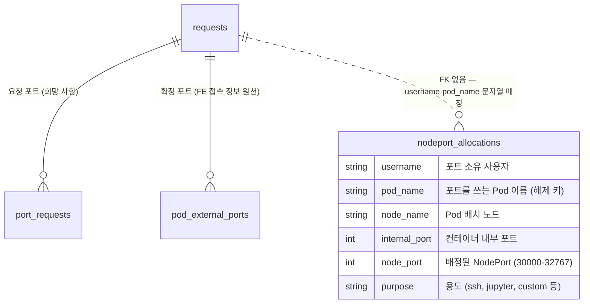

# 데이터베이스

DECS 인프라 계층에서 MySQL이 어디에 몇 개 있고, 스키마·트랜잭션·운영 절차가 어떻게 되는지 정리한 페이지입니다. 배경이 되는 전체 흐름은 [시스템 아키텍처](시스템-아키텍처.md)를 먼저 읽으면 좋습니다.

---

## 1. 전체 그림 — MySQL은 두 개입니다

| DB | 소유 | 용도 | 관할 |
|----|------|------|------|
| infra-mysql `pod_port_db` | config-server 전용 | NodePort 배정 장부 — 어떤 포트를 누가 쓰는지 기록하는 표(`nodeport_allocations`) | 이 저장소(admin_infra) |
| admin_be MySQL | admin_be(WAS) | 신청·사용자 관리 | 별도 repo — 여기서는 이름만 언급합니다 |

DB를 나눈 이유는 "무엇이 기준이 되는 원본(SSOT)인가"의 경계 때문입니다. NodePort 배정은 "동시에 두 요청이 와도 같은 포트를 두 번 주면 안 된다"는 문제라, 요청이 동시에 들어와도 한 번에 하나씩 처리되도록 만들어야 하고, 그 잠금은 배정을 실제로 수행하는 config-server 쪽 DB에서 해결해야 합니다. 신청·사용자 정보는 admin_be의 관심사이므로 그쪽 DB에 두고, 두 시스템은 API로만 대화합니다. 배정 장부가 한쪽에만 있으니 "포트가 왜 두 번 나갔지?"를 조사할 곳도 한 곳으로 좁혀집니다.

---

## 2. infra-mysql 배포 형태

`infra-sql/` 디렉토리의 manifest 두 장이 전부입니다.

| 리소스 | 내용 |
|--------|------|
| StatefulSet `infra-mysql` | `mysql:8.0.36` 이미지, replicas 1, namespace `ailab-infra` |
| Service `infra-mysql` | ClusterIP, 3306 포트. config-server는 `db.host: "infra-mysql"`로 접속합니다 |
| StorageClass `sc-mysql` | NFS CSI(`nfs.csi.k8s.io`), NAS의 export를 백엔드로 사용, `reclaimPolicy: Retain`, nfsvers=3 |
| PVC (volumeClaimTemplate) | `mysql-data` 10Gi — `/var/lib/mysql`에 마운트 |

StatefulSet(파드 이름과 스토리지가 고정되는 K8s 워크로드 형태)이라 파드 이름은 항상 `infra-mysql-0`입니다.

**계정과 DB는 누가 만드나.** manifest의 env가 답입니다. 공식 mysql 이미지는 데이터 디렉토리가 비어 있는 최초 기동 때 `MYSQL_DATABASE`(여기서는 `pod_port_db`)로 DB를 만들고, `MYSQL_USER`/`MYSQL_PASSWORD`(여기서는 `pod_port_user`)로 계정을 만든 뒤 그 DB 전체 권한을 GRANT합니다. 즉 DCL(계정과 권한을 관리하는 SQL — CREATE USER, GRANT 등)을 이미지 초기화 동작에 위임한 구조입니다. manifest에도 코드에도 수동 GRANT는 없습니다 — "수동 GRANT 없음, 이미지 초기화에 위임"이 현재 상태입니다. init SQL 파일(초기 스키마 스크립트)도 없습니다.

비밀번호 값은 public wiki에 적지 않습니다. config-server 쪽은 K8s Secret `config-server-db-secret`에서 `DB_PASSWORD`로 주입받고, infra-mysql 쪽 값은 배포 manifest·Secret에서 kubectl로 조회합니다.

---

## 3. 스키마와 DDL 관리

테이블은 **`nodeport_allocations` 하나**입니다. 코드 전체를 확인한 결과 다른 테이블(예: server_nodes)은 사용하지 않습니다.

| 컬럼 | 역할 |
|------|------|
| `username` | 포트 소유 사용자 |
| `pod_name` | 포트를 쓰는 사용자 Pod 이름 — 해제·동기화의 키 |
| `node_name` | Pod가 배치된 노드 |
| `internal_port` | 컨테이너 내부 포트 (22, 8888 등) |
| `node_port` | 배정된 NodePort (30000~32767) |
| `purpose` | 용도 문자열 (ssh, jupyter, custom 등) |

**DDL(테이블 구조를 만들고 바꾸는 SQL — CREATE TABLE, ALTER 등)은 누가 만드나.** 코드에는 `CREATE TABLE`이 없습니다. 즉 **자동 bootstrap 없음 — DB를 재구축하면 테이블은 수동 DDL로 직접 만들어야 합니다.** 위 컬럼 표는 코드의 INSERT/SELECT가 실제로 사용하는 컬럼에서 역산한 목록입니다(코드의 사용 컬럼 기준). 자동 증가 id나 PK 구성 등 코드에 드러나지 않는 부분은 미확인이므로, 재구축 시에는 기존 DB의 `SHOW CREATE TABLE nodeport_allocations` 백업본을 우선 사용하고, 그것이 없을 때만 위 컬럼 목록으로 새로 정의합니다.

재구축용 DDL 실행 절차는 다음과 같습니다.

```bash
kubectl exec -it infra-mysql-0 -n ailab-infra -- mysql -u pod_port_user -p pod_port_db
# 접속 후: 위 컬럼 목록 기준으로 CREATE TABLE nodeport_allocations (...) 실행
```

---

## 4. Flask에서의 사용 패턴

**접속 방식.** 드라이버는 PyMySQL이고, `utils.py`의 `get_db_connection()`이 env(`DB_HOST`/`DB_USER`/`DB_PASSWORD`/`DB_NAME`)로 접속합니다. 커넥션 풀은 없습니다 — 포트 배정·해제·동기화 같은 작업 단위마다 새로 열고 `finally`에서 닫습니다. `autocommit=False`이므로 명시적으로 commit해야 반영됩니다.

**포트 배정 트랜잭션.** 트랜잭션(여러 SQL을 하나의 묶음으로 처리해 전부 반영되거나 전부 취소되게 하는 단위)의 실제 주인공은 `main.py`의 `allocate_nodeports()`입니다.

1. `SELECT node_port FROM nodeport_allocations FOR UPDATE` — 사용 중인 포트 전체를 잠급니다.
2. 30000~32767 범위에서 빈 포트를 골라 요청 포트 수만큼 INSERT합니다.
3. `conn.commit()` — 성공 시 확정. 예외가 나면 `conn.rollback()`으로 전부 취소합니다.

**왜 FOR UPDATE인가.** 승인 2건이 거의 동시에 들어오면 두 트랜잭션이 같은 "빈 포트 목록"을 읽고 같은 포트를 INSERT할 수 있습니다. `SELECT ... FOR UPDATE`는 읽은 행에 잠금을 걸어 두 번째 트랜잭션을 첫 번째의 commit까지 기다리게 만들므로, 동시에 들어온 배정 요청도 한 번에 하나씩 줄 서서 처리되어 중복 배정이 원천 차단됩니다.

**해제와 동기화.**

| 함수 | 동작 |
|------|------|
| `release_nodeports(pod_name)` | 해당 Pod의 행을 DELETE 후 commit |
| `reconcile_nodeport_allocations(namespace)` | 장부와 실제 상태 맞추기 — k8s의 실제 NodePort Service 목록(여기서는 k8s가 기준 원본)과 대조해, 실제로는 사라졌는데 DB에만 남은 행을 DELETE. 포트 배정 직전마다 호출되지만 **너무 자주 실행되지 않게 5분(300초) 최소 간격**을 둡니다. 실패 시 rollback하고 배정은 계속 진행합니다(non-fatal) |

---

## 5. 운영 절차

**상태 확인.** 접속 방법은 [관리자 매뉴얼](관리자-매뉴얼.md)의 관리자 접근점 표를 따릅니다(`kubectl exec`로 `infra-mysql-0`에 들어가 mysql 클라이언트 실행, 비밀번호는 Secret에서 조회).

```sql
-- 현재 점유 중인 포트 전체
SELECT username, pod_name, node_port, purpose FROM nodeport_allocations ORDER BY node_port;

-- 특정 사용자의 할당 현황
SELECT * FROM nodeport_allocations WHERE username = '<username>';
```

**백업.** 자동 백업은 구성되어 있지 않습니다 — manifest·코드 어디에도 dump나 cron이 없습니다. 방어선은 StorageClass의 `reclaimPolicy: Retain`(PVC를 지워도 NFS 위의 PV 데이터가 남음)뿐입니다. 데이터가 포트 배정 장부 하나라 유실돼도 장부-실제 맞추기와 재배정으로 복구할 수 있지만, 스키마 보존을 위해 `SHOW CREATE TABLE` 결과는 별도로 남겨 두는 것을 권장합니다.

**재구축 순서.**

1. `nfs-mysql.yaml` 적용 — StorageClass `sc-mysql` 생성.
2. `infra-mysql.yaml` 적용 — StatefulSet·Service 생성. 최초 기동에서 DB·계정이 자동 생성됩니다(2절).
3. `nodeport_allocations` 테이블 수동 DDL 실행(3절 — 자동 bootstrap이 없으므로 필수).
4. config-server 재시작 후 Pod 생성 1건으로 포트 배정이 정상 동작하는지 확인.

---

## 6. ERD — admin_be DB와의 논리 관계

포트를 둘러싼 두 DB의 테이블 관계입니다. `nodeport_allocations`의 컬럼은 3절의 실측 목록이고(타입·PK는 미확인이라 개념 수준 표기), admin_be 쪽 테이블은 별도 repo 관할이므로 이름과 관계 수준만 그리고 컬럼 상세는 생략합니다.



두 DB는 물리적으로 분리되어 있고(infra-mysql ↔ admin_be MySQL) 둘 사이에 외래 키가 없습니다. `nodeport_allocations`는 admin_be 테이블과 `username`·`pod_name` 문자열로만 느슨하게 연결되므로, 대조가 필요할 때는 조인이 아니라 양쪽을 각각 조회해 맞춰 봐야 합니다. 점선 관계가 그 느슨한 연결을 뜻합니다.
