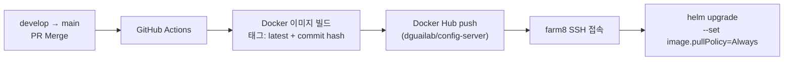
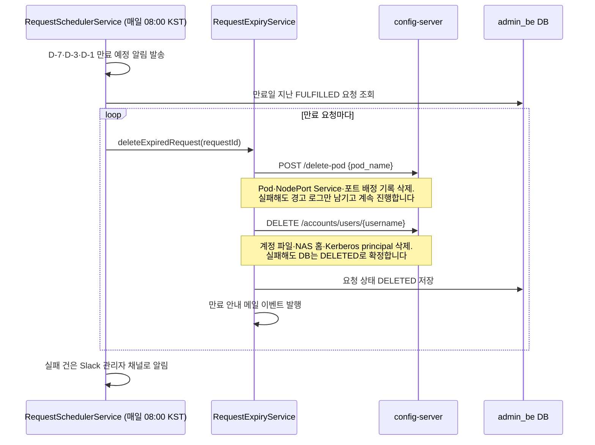
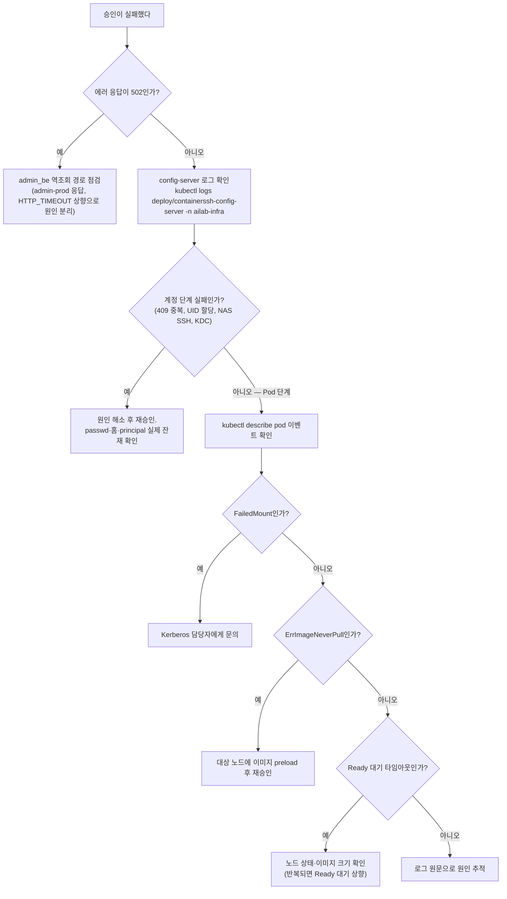
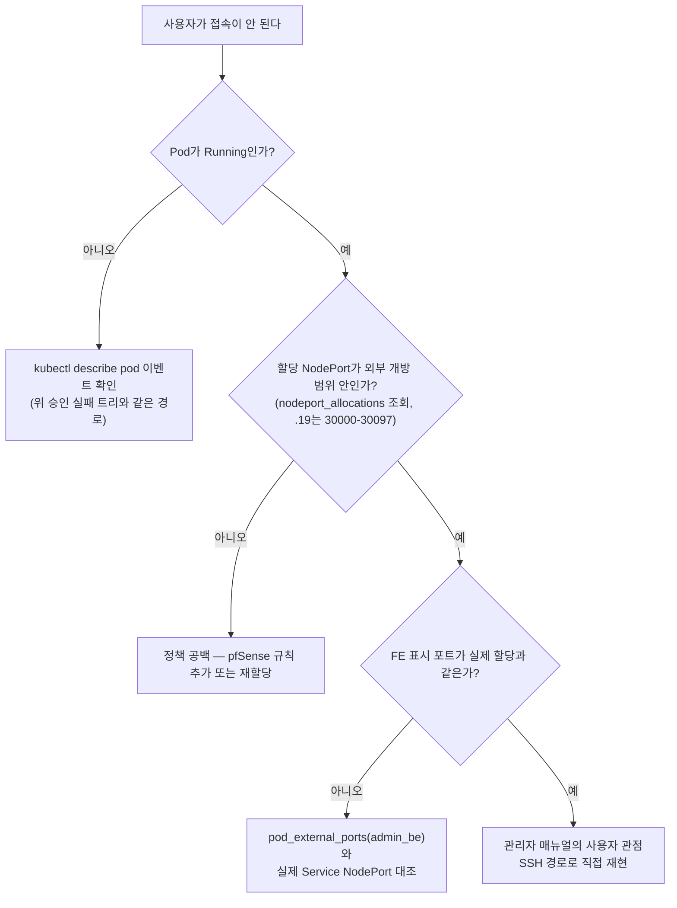

# 운영 가이드

---

## 1. CI/CD 파이프라인

배포 자동화는 GitHub Actions(GitHub이 제공하는 자동 빌드·배포 도구)를 사용하며, **`main` 브랜치에 push 이벤트가 발생할 때만** 실행됩니다. 즉 `develop` → `main` PR이 Merge 되는 순간 운영 배포가 시작됩니다.



- 이미지 태그는 `latest`와 Git Commit Hash 두 가지로 생성됩니다.
- `--set image.pullPolicy=Always`(배포 때마다 항상 최신 이미지를 받도록 강제하는 옵션)를 사용합니다.
- CI/CD용 GitHub Secrets는 `DOCKER_USERNAME`, `DOCKER_PASSWORD`, `K8S_HOST`, `K8S_USERNAME`, `K8S_PRIVATE_KEY`, `K8S_PORT`입니다. 현재 username이 toni 기준으로 등록되어 있어 관리자 변경 시 인수인계가 필요합니다.

공통 원칙은 **머지는 배포가 아니다**입니다. 배포 후 실제 승인 1건을 스모크 테스트(핵심 경로 한 번 통과시켜 보는 최소 검증)로 통과시키기 전에는 완료로 보지 않습니다.

배포 전에 두 가지를 확인합니다.

1. **동결 여부** — 타인이 인프라 테스트 중이면 코드/Helm 무변경 원칙이 걸려 있을 수 있습니다.
2. **배포 브랜치** — main과 hotfix 계열 브랜치가 분기된 이력이 있어 Ready 대기·krb5 방식·마운트 구성이 브랜치마다 다릅니다. "지금 클러스터에 떠 있는 이미지가 어느 커밋인가"부터 확정합니다.

---

## 2. 배포 확인

운영 config-server는 namespace(쿠버네티스 리소스를 묶는 논리적 공간) `ailab-infra`에 있습니다.

```bash
# Pod 상태 확인 — 정상: Running (READY 1/1)
kubectl get pods -n ailab-infra | grep config-server

# 실시간 로그 확인 (서버가 뜨지 않거나 동작이 이상할 때)
kubectl logs -f deploy/containerssh-config-server -n ailab-infra

# 배포된 이미지 버전 확인 — 태그가 commit hash면 정상 배포
kubectl describe pod <POD_NAME> -n ailab-infra | grep Image
```

로그의 주요 체크 포인트입니다.

- `ModuleNotFoundError`: requirements.txt 누락 또는 파일명 불일치입니다
- `WORKER TIMEOUT`: 초기 로딩 시간이 긴 경우입니다 (Dockerfile 타임아웃 설정 확인)

서비스 응답을 확인합니다.

```bash
# Health check (내부망)
curl http://210.94.179.18:30082/health
```

Swagger UI는 `http://210.94.179.18:30082/apidocs/`입니다.

> ℹ️ repo README에는 9732 포트로 표기되어 있으나 오기입니다. kubectl 실측 기준 NodePort는 30082입니다(Service `containerssh-config-service`).

---

## 3. 네임스페이스 구성과 의도

namespace는 하나의 Kubernetes 클러스터를 논리적으로 나누는 칸막이입니다. 같은 이름의 리소스도 namespace가 다르면 충돌하지 않고, 권한(RBAC)·정책(NetworkPolicy 등)·정리 작업을 namespace 단위로 걸 수 있습니다. 즉 "무엇을 한 묶음으로 조회하고, 권한을 주고, 지울 것인가"의 단위입니다.

이 클러스터의 namespace는 우연이 아니라 의도를 가지고 나뉘어 있습니다. 무엇이 어디에 사는지, 왜 분리했는지를 알아야 리소스를 엉뚱한 곳에 만들거나 레거시를 되살리는 실수를 피할 수 있습니다.

| namespace | 무엇이 사는가 | 왜 분리했는가 |
|-----------|--------------|--------------|
| `ailab-infra` | config-server, infra-mysql, redis, **사용자 Pod 전체** | 인프라 실행 계층. 사용자 워크로드와 그것을 만드는 인프라를 한 곳에 모아 조회·정리를 한 번에 하기 위함입니다 |
| `ailab-frontend` | admin_fe (정적 서빙) | 정적 파일 서빙만 하는 계층이라 분리 — 배포·롤백을 다른 계층과 독립적으로 수행합니다 |
| `default` (`admin-prod`) | admin_be (Spring Boot WAS) | 정책 계층. config-server의 역조회 대상(`admin-prod.default`)이 이 이름에 고정되어 있습니다 |
| `monitoring` | kube-prometheus-stack (Prometheus·Grafana) | 관측은 앱과 수명주기를 분리 — 앱을 재배포해도 모니터링 이력이 끊기지 않게 합니다 |

⚠️ **레거시 namespace `containerssh`·`cssh`가 아직 클러스터에 남아 있을 수 있습니다.** 아래 4절의 restart_*.sh 스크립트가 향하는 곳이 바로 여기입니다. 현행 운영과 무관하며 삭제 대상 후보이므로, 이 안에서 무언가 발견해도 운영 서비스로 오인하지 않습니다.

새 리소스를 만들 때는 이 표의 의도에 맞는 namespace를 고릅니다. 예를 들어 사용자 Pod 관련 실험 리소스는 `ailab-infra`, 모니터링 실험은 `monitoring`입니다.

---

## 4. restart_*.sh 스크립트 ⚠️

> **⚠️ 경고: 레포 루트의 restart 스크립트들은 운영 배포에 사용하면 안 됩니다.**
>
> | 스크립트 | 대상 namespace | 운영 namespace |
> |----------|:---:|:---:|
> | `restart_auth.sh` | `containerssh` | — (auth-server는 미배포 레거시) |
> | `restart_containerssh.sh` | `containerssh` | — (ContainerSSH는 운영 흐름에서 제거됨) |
> | `restart_pvc.sh` | `cssh` | — (사용자 PVC는 폐기됨) |
>
> 운영 서비스는 전부 namespace **`ailab-infra`**에 있습니다. 위 스크립트들은 레거시 namespace(`containerssh`, `cssh`)를 대상으로 하므로 실행해도 운영 서비스에는 아무 효과가 없거나, 레거시 잔재를 되살리는 혼란만 만듭니다. config-server 재배포는 1절의 CI/CD 또는 `config-server/Makefile`(`make deploy`) 경로를 씁니다.

---

## 5. 만료 스케줄러 → 삭제 흐름

자원 회수는 admin_be의 일일 스케줄러가 자동 수행합니다. `RequestSchedulerService`가 매일 **08:00(KST)** 에 돌면서 만료 예정 알림을 보내고, 만료일이 지난 요청을 `RequestExpiryService`에 넘겨 config-server API 두 개를 순서대로 호출합니다. (사용자 비활성 스케줄러는 별도로 09:00에 돕니다.)



주의할 점이 두 가지 있습니다.

1. **삭제는 두 API가 한 쌍입니다.** `POST /delete-pod`는 Pod·Service·포트만, `DELETE /accounts/users`는 계정·홈·principal만 지웁니다. 상세 명세와 삭제 체인 다이어그램은 [API 레퍼런스](API-레퍼런스.md)를 참고합니다.
2. **외부 정리가 실패해도 DB는 DELETED로 확정됩니다.** 즉 인프라에 잔재가 남아도 admin_be 화면에서는 삭제 완료로 보입니다. 그래서 만료가 있었던 날은 아래 6절처럼 잔류 자원을 훑어야 합니다. (과거에 만료 처리가 계정만 지우고 Pod/NodePort를 남기는 결함 T-KI-01이 있었고 26-07-06에 수정 배포됐으나, 만료 경로의 실검증은 미수행 상태입니다.)

---

## 6. 장애 대응 요약

증상별 1차 분류표입니다.

| 장애 | 증상 | 확인 | 해결 |
|------|------|------|------|
| Pod Pending / ErrImageNeverPull | 승인 후 Pod가 Pending, Ready 대기 초과로 승인 롤백 | `kubectl -n ailab-infra describe pod <pod>` 이벤트, 대상 노드 `crictl images \| grep decs` | 노드에 이미지 사전 pull 또는 preload. GPU 부족이면 다른 노드 확보 후 재승인 |
| FailedMount (krb5) | `mount.nfs: Key has expired`로 신규 Pod 홈 마운트 실패 | `kubectl -n ailab-infra describe pod <pod>`의 FailedMount 이벤트 | FARM NAS 홈 마운트에는 Kerberos 인증이 전제됩니다. 이 영역은 별도 담당자 관할이므로 담당자에게 문의합니다 |
| 계정 생성 실패 | 승인이 계정 단계에서 실패(409, UID 할당 실패), PENDING 복귀 | `kubectl -n ailab-infra logs deploy/containerssh-config-server`, `/kube_share/passwd`, NAS SSH 수동 확인 | 원인(중복 username, NAS SSH, KDC) 해소 후 재승인. 롤백 로그를 맹신하지 말고 passwd·홈·principal의 실제 잔재를 확인합니다 |
| NodePort 외부 접속 불가 | 내부(교내망)는 정상인데 외부 접속만 안 됨 | `nodeport_allocations`에서 할당 포트 확인 → 개방 범위(.19는 30000-30097) 밖인지 | 버그가 아니라 정책 공백입니다. pfSense 규칙 추가 또는 재할당 |

만료가 있었던 날은 잔류 자원도 훑습니다.

```bash
kubectl get pods -n ailab-infra                  # 만료 사용자 Pod 잔류 여부
kubectl get svc -n ailab-infra | grep ailab-     # NodePort Service 잔류 여부
```

잔류가 보이면 수동 정리는 `POST /delete-pod` → 계정 삭제(`DELETE /accounts/users`) 순서를 지킵니다. Pod만 kubectl로 지우면 Service와 DB allocation이 남습니다.

### 장애 진단 결정 트리

위 장애 표를 흐름으로 바꾼 것입니다. 대표 문의 두 가지에서 출발합니다.

**트리 1 — 승인이 실패했다**



**트리 2 — 사용자가 접속이 안 된다**



말단 처치의 상세는 다음을 참고합니다. 502 역조회와 create-pod 에러 코드는 [API 레퍼런스](API-레퍼런스.md), 개방 범위 상세와 방화벽 함정은 [시스템 아키텍처](시스템-아키텍처.md) 5절, Ready 대기·imagePullPolicy 조정과 사용자 관점 SSH 재현은 [관리자 매뉴얼](관리자-매뉴얼.md), FailedMount·ErrImageNeverPull의 확인 명령은 위 장애 표와 같습니다.

---

## 7. 모니터링 접근

| 대상 | 방법 |
|------|------|
| 통합 대시보드 (Grafana) | `http://210.94.179.18:30080` admin 로그인 |
| 스토리지 응답성 | Grafana 대시보드 `storage-latency-health` — NFS 장애 의심 시 가장 먼저 봅니다 |
| Prometheus 직접 질의 | `kubectl -n monitoring port-forward svc/monitoring-kube-prometheus-prometheus 9090:9090` |

Prometheus는 관측뿐 아니라 **Pod 배치 노드 선택의 입력**이기도 합니다. 모니터링 장애 시 대시보드 소실에 더해 Pod 생성 시 노드 선택 품질이 저하됩니다.
