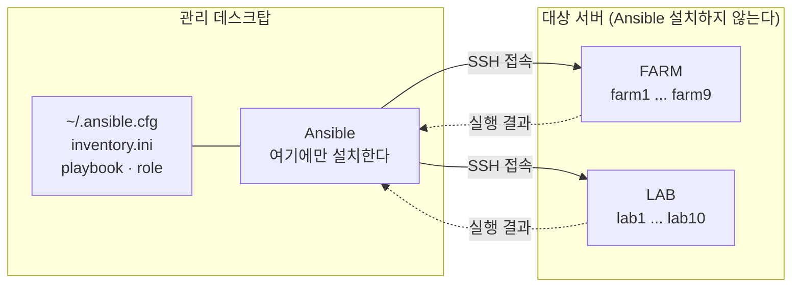
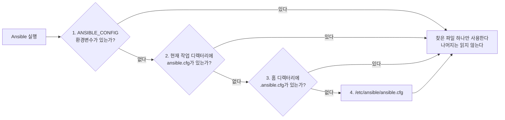
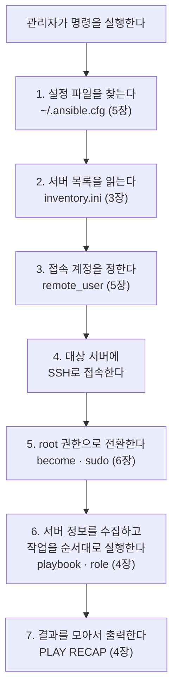

# Ansible 기초 개념

> [개요](index.md) · [설정](config.md)

이 문서는 Ansible을 처음 다루는 관리자를 위해 [설정](config.md) 문서를 읽는 데
필요한 개념만 모아 둔다. 실제 설정 절차는 [설정](config.md)에 있다.

이 문서에서 반복해서 쓰는 표현은 다음과 같다.

| 표현 | 뜻 |
| --- | --- |
| 관리 데스크탑 | 관리자가 명령을 입력하는 자신의 컴퓨터. Ansible은 여기에만 설치한다 |
| 대상 서버 | 명령을 받아 실제 작업이 실행되는 FARM/LAB 서버 |
| 저장소 | `admin_infra_server`를 `git clone`으로 내려받은 폴더. Git이 관리하는 프로젝트 폴더이며, 내려받은 위치는 관리자마다 다를 수 있다 |

---

## 1. Ansible이 하는 일 {#1-ansible}

관리자가 서버 16대에 같은 작업을 해야 한다고 하자. 서버마다 SSH로 접속해서
같은 명령을 반복하면 시간이 오래 걸리고, 중간에 한 대를 빠뜨리거나 명령을 잘못
입력하기 쉽다.

Ansible은 이 과정을 대신한다. 관리 데스크탑에서 명령을 한 번 실행하면 Ansible이
대상 서버들에 SSH로 접속해 작업을 수행하고 결과를 모아서 보여준다.

대상 서버에 Ansible을 설치할 필요는 없다. 관리 데스크탑에만 설치하면 되고,
서버 쪽에는 SSH 접속과 Python만 있으면 된다. 이런 방식을 **agentless**라고 한다.



설정 파일과 작업 내용은 모두 관리 데스크탑에 있고, 대상 서버에는 아무것도 두지
않는다. 서버를 새로 추가해도 그 서버에 준비할 것은 SSH 접속과 sudo 권한뿐이다.


Ansible 작업은 같은 작업을 여러 번 실행해도 결과가 달라지지 않는다.

예를 들어 "서버에 패키지 `ethtool`이 설치되어 있어야 한다"는 작업을 실행하면, 없을 때는
설치하고 이미 있으면 아무것도 하지 않는다. 그래서 실행 결과에 `changed`(바꿈)와
`ok`(이미 맞음)가 구분되어 표시된다.

---

## 2. 실행에 필요한 세 가지

Ansible 명령 하나를 실행하려면 다음 세 가지가 필요하다.

| 필요한 것 | 내용 | 기록하는 곳 |
| --- | --- | --- |
| 어느 서버에 | host 이름, IP, SSH port | `inventory.ini` |
| 무슨 작업을 | 설치·점검·설정 내용 | `playbook.yml`과 `role` |
| 누구로 접속할지 | 접속 계정, SSH 키 | `inventory.ini` 또는 `ansible.cfg` |

`admin_infra_server`에서 관리자가 직접 준비하는 것은 첫 번째와 세 번째다. 두 번째는
각 모듈에 이미 정의되어 있다.

이 세 가지가 실제 실행에서 어떤 순서로 쓰이는지는 뒤의
[7. 전체 흐름 정리](#run-order)에 정리되어 있다.

---

## 3. inventory {#3-inventory}

inventory는 대상 서버 목록이다. Ansible은 여기에 없는 서버에는 접속하지 않는다.

### 파일 위치

admin_infra_server에서는 저장소의 `ansible/inventory.ini` 하나를 관리자 전원이
공유한다. 관리자는 이 파일을 직접 지정하는 대신, 자신의 `~/.ansible.cfg`에 경로를
적어 두고 Ansible이 알아서 읽게 한다.

```ini
# ~/.ansible.cfg
[defaults]
inventory = /home/suhyeon/CSID-DGU/admin_infra_server/ansible/inventory.ini
```

경로가 관리자마다 다른 이유는 저장소를 내려받은 위치가 다르기 때문이다.

### 파일 형식

`inventory.ini` 형식은 다음과 같다.

```ini
[FARM]
farm1 ansible_host=192.168.2.11 ansible_port=8081
farm2 ansible_host=192.168.2.12 ansible_port=8082

[LAB]
lab1 ansible_host=192.168.1.11 ansible_port=8081
```

| 요소 | 의미 |
| --- | --- |
| `[FARM]` | **group**. 서버들을 묶는 이름이다. 명령에서 `FARM`이라고 쓰면 그 아래 서버 전체를 뜻한다. |
| `farm1` | **host 별칭**. 명령에서 서버를 가리킬 때 쓰는 이름이며 실제 hostname과 달라도 된다. |
| `ansible_host` | 실제 접속할 IP 주소 |
| `ansible_port` | SSH port |

### group 변수

group 전체에 같은 값을 적용할 때는 `[group이름:vars]` 절을 쓴다.

```ini
[FARM:vars]
ansible_user=someone
```

`ansible_user`는 접속 계정을 지정하는 변수다. admin_infra_server의 공용
inventory에는 **이 변수를 쓰지 않는다.** 관리자마다 접속 계정이 다르기 때문이며,
이유는 [5. 설정 우선순위](#5)에서 설명한다.

### 대상 지정

명령에서 대상은 group 이름, host 이름, 또는 `:`로 이어 붙여 지정한다.

```bash
ansible FARM -m ping          # FARM group 전체
ansible farm8 -m ping         # farm8 한 대
ansible 'FARM:LAB' -m ping    # FARM과 LAB 전체
```

여기 쓰인 `-m ping`은 네트워크 `ping` 명령이 아니라 Ansible의 `ping` **모듈**이다.
대상 서버에 SSH로 접속한 뒤 Python이 정상 동작하는지까지 확인하고 `pong`을 돌려준다.
설정이 제대로 됐는지 확인할 때 가장 먼저 쓰는 명령이며, 서버 상태를 바꾸지 않는다.

```
farm8 | SUCCESS => {
    "changed": false,
    "ping": "pong"
}
```

---

## 4. playbook과 role

### YAML 형식 {#yaml}

playbook은 **YAML** 형식으로 쓴다. 들여쓰기로 구조를 나타내는 텍스트 형식이며,
읽는 데 필요한 규칙은 세 가지다.

| 표기 | 의미 |
| --- | --- |
| `키: 값` | 항목 하나를 나타낸다 |
| `-` (하이픈) | 목록의 항목 하나를 나타낸다 |
| 들여쓰기 | 위 항목에 속한다는 뜻이다. 공백만 사용하고 탭은 쓰지 않는다 |

자세한 문법은 [Ansible 공식 YAML 문서](https://docs.ansible.com/ansible/latest/reference_appendices/YAMLSyntax.html)에 있다.

### playbook {#playbook}

**playbook**은 수행할 작업을 순서대로 적어 둔 YAML 파일이다. 다음은
`server-state`의 점검 playbook 앞부분이다.

```yaml
- name: Audit standard GPU server policy
  hosts: "{{ server_state_hosts | default('all') }}"
  become: true
  gather_facts: true

  tasks:
    - name: Audit baseline access
      ansible.builtin.import_role:
        name: baseline_access
        tasks_from: audit
```

| 항목 | 의미 |
| --- | --- |
| `name` | 사람이 읽기 위한 이름이다. 실행 결과에 그대로 표시된다 |
| `hosts` | 이 playbook을 실행할 대상. inventory의 group 이름이나 host 이름을 쓴다 |
| `become` | 대상 서버에서 root 권한으로 실행할지 여부. [6. become과 sudo](#6-become-sudo) 참고 |
| `gather_facts` | 시작할 때 대상 서버의 OS·네트워크·패키지 정보를 수집할지 여부 |
| `tasks` | 실제로 수행할 작업 목록 |

### hosts에 쓰인 변수 표기

위 예시의 `hosts` 값은 그냥 서버 이름이 아니라 변수 표기다.

```yaml
hosts: "{{ server_state_hosts | default('all') }}"
```

| 표기 | 의미 |
| --- | --- |
| `{{ }}` | 안에 있는 변수를 실제 값으로 바꿔 넣으라는 표시다 |
| `server_state_hosts` | 실행할 때 밖에서 전달받는 변수다. `server-state` 명령이 `--hosts farm8`을 받으면 이 변수에 `farm8`을 넣어서 실행한다 |
| `\| default('all')` | 그 변수가 전달되지 않았을 때 대신 쓸 값이다. 여기서는 `all`, 즉 inventory의 모든 서버를 뜻한다 |

정리하면 "대상이 지정되면 그 서버에만, 지정되지 않으면 전체에" 실행하라는 뜻이다.
playbook 파일을 고치지 않고도 실행할 때마다 대상을 바꿀 수 있게 하는 방식이다.

### role {#role}

playbook에는 "무엇을 어떤 순서로 할지"만 적고, **실제 작업 내용은 role로 나눠서**
보관한다. role은 관련된 작업들을 모아 둔 디렉터리다.

```
server-state/ansible/
├── playbooks/
│   └── audit.yml                     ← playbook: 점검 순서만 적혀 있다
└── roles/
    ├── baseline_access/
    │   └── tasks/
    │       ├── main.yml              ← 설정할 때 쓰는 작업
    │       └── audit.yml             ← 점검할 때 쓰는 작업
    ├── docker_engine/
    │   └── tasks/ ...
    └── nvidia_driver/
        └── tasks/ ...
```

playbook의 다음 부분이 role을 불러오는 표기다.

```yaml
    - name: Audit baseline access
      ansible.builtin.import_role:
        name: baseline_access      # 이 role의 작업을
        tasks_from: audit          # audit.yml 파일에서 가져와 실행한다
```

role로 나누는 이유는 세 가지다.

- 같은 작업을 여러 playbook에서 다시 쓸 수 있다. 점검용 playbook과 설정용 playbook이
  같은 role을 공유한다.
- 구성요소 단위로 골라 실행할 수 있다. Docker만 점검하고 싶으면 해당 role만 실행한다.
- 구성요소별로 파일이 나뉘어 있어 내용을 찾기 쉽다.

실행 결과에 나오는 다음 줄에서 `baseline_access`가 role 이름이고 뒤가 개별 작업
이름이다. 어떤 role의 어떤 작업인지 여기서 확인할 수 있다.

```
TASK [baseline_access : Verify non-interactive sudo] ***************************
```

playbook과 role은 **저장소에서 관리하는 작업 내용**이므로 관리자가 개인적으로
수정하거나 옮기지 않는다. 관리자가 준비하는 것은 inventory와 접속 계정뿐이다.

### 실행 결과 읽기

playbook을 실행하면 각 작업의 결과가 순서대로 나오고 마지막에 요약이 붙는다.

```
TASK [baseline_access : Verify non-interactive sudo] ***************************
ok: [farm8]

PLAY RECAP *********************************************************************
farm8   : ok=4  changed=0  unreachable=0  failed=1  skipped=0  rescued=0  ignored=0
```

마지막 `PLAY RECAP` 줄은 대상 서버별 요약이며, 각 숫자의 의미는 다음과 같다.

| 표시 | 의미 |
| --- | --- |
| `ok` | 작업이 성공했고 바꿀 것이 없었다 |
| `changed` | 작업이 성공했고 서버 상태를 바꿨다 |
| `failed` | 작업이 실패했다. 서버 상태가 기대와 다르거나 명령이 오류를 냈다 |
| `unreachable` | 서버에 접속하지 못했거나 접속 직후 준비 단계에서 실패했다 |
| `skipped` | 조건에 맞지 않아 건너뛰었다 |
| `rescued` | 실패했지만 미리 정해 둔 복구 작업이 대신 성공했다 |
| `ignored` | 실패했지만 "실패해도 넘어간다"고 지정되어 있어 무시했다 |

`rescued`와 `ignored`는 playbook이 실패를 미리 대비해 둔 경우에만 나타난다.
admin_infra_server의 점검 작업에서는 보통 `0`이다.

### 실패한 줄 읽기

실패는 `fatal:` 또는 `failed:`로 시작하는 줄에 나타나고, `"msg"` 값이 원인이다.

```
TASK [os_common : Verify common packages] **************************************
ok: [farm8] => (item=curl) => {
    "item": "curl",
    "msg": "All assertions passed"
}
failed: [farm8] (item=ethtool) => {
    "changed": false,
    "item": "ethtool",
    "msg": "required package is missing: ethtool"
}
```

위 예시는 `os_common` role의 "공통 패키지 확인" 작업에서 `curl`은 통과했고
`ethtool`은 설치되어 있지 않아 실패했다는 뜻이다. `(item=...)`은 목록을 반복해서
검사하는 작업에서 지금 어떤 항목을 검사했는지를 나타낸다.

| 표시 | 의미 |
| --- | --- |
| `failed:` | 반복 작업에서 개별 항목 하나가 실패했다 |
| `fatal:` | 해당 작업이 최종 실패했고, 그 서버에 대한 이후 작업은 중단된다 |

확인할 것은 `fatal:`과 `failed:` 줄의 `"msg"`뿐이다. 그 위에 나오는 `ok:` 줄들은
이미 통과한 작업이므로 읽지 않아도 된다.

실패했다고 해서 항상 서버 설정이 잘못된 것은 아니다. 원인은 크게 세 가지로 나뉘며,
대응 방법이 서로 다르다.

| 실패 유형 | 예시 `msg` | 대응 |
| --- | --- | --- |
| 서버 상태가 기준과 다름 | `required package is missing: ethtool` | 해당 항목을 설정한다 |
| 실행 환경 문제 | `Missing sudo password`, `No space left on device` | 권한이나 서버 자원 문제를 먼저 해결한다 |
| 점검 자체가 불가능 | `ethtool: not found` (점검에 쓸 명령이 없음) | 선행 항목을 먼저 해결한 뒤 다시 점검한다 |

---

## 5. 설정 파일과 우선순위 {#5}

### 5.1 설정 파일을 찾는 순서 {#51}

Ansible은 실행될 때마다 **설정 파일(`ansible.cfg`)을 찾는다.** 이 파일에는 접속
계정, 사용할 inventory 경로, 임시 디렉터리 위치처럼 매번 입력하기 번거로운 기본값이
들어 있다. 설정 파일이 없으면 Ansible은 내장된 기본값으로 동작한다.

설정 파일을 둘 수 있는 곳은 네 곳이고, Ansible은 이 순서대로 확인한다.

| 순위 | 위치 | 용도 |
| --- | --- | --- |
| 1 | `ANSIBLE_CONFIG` 환경변수가 가리키는 파일 | 특정 파일을 그때그때 직접 지정할 때 |
| 2 | 현재 작업 디렉터리의 `ansible.cfg` | 프로젝트 폴더마다 다른 설정을 쓸 때 |
| 3 | 홈 디렉터리의 `~/.ansible.cfg` | 관리자 개인의 기본 설정 |
| 4 | `/etc/ansible/ansible.cfg` | 시스템 전체 공통 기본 설정 |



중요한 점이 두 가지 있다.

**먼저 찾은 파일 하나만 사용한다.** 여러 파일의 내용을 합치지 않는다. 1순위 파일이
있으면 2·3·4순위는 아예 읽지 않는다. 따라서 `~/.ansible.cfg`에 아무리 정확히 적어도
`ANSIBLE_CONFIG` 환경변수가 다른 파일을 가리키고 있으면 그 내용은 사용되지 않는다.

**위치마다 찾는 파일 이름이 정해져 있다.** 홈 디렉터리에서는 이름이 반드시
`.ansible.cfg`여야 한다. 앞의 점(`.`)은 리눅스에서 숨김 파일을 뜻하며 설정 파일에
흔히 쓰는 관례다. `~/ansible/ansible.cfg`처럼 홈 디렉터리 아래 **폴더를 만들어 그
안에** 둔 파일은 네 곳 중 어디에도 해당하지 않아 그냥 무시된다.

예를 들어 관리자가 `~/ansible/ansible.cfg`를 정성껏 작성해도, Ansible은 그 파일을
건너뛰고 4순위인 `/etc/ansible/ansible.cfg`를 사용한다. 설정을 바꿨는데 아무 변화가
없다면 대부분 이런 경우다.

현재 어떤 파일이 실제로 사용되고 있는지는 다음 명령으로 확인한다.

```bash
ansible --version | grep "config file"
```

```
config file = /home/suhyeon/.ansible.cfg
```

### 5.2 같은 값을 여러 곳에서 지정했을 때

Ansible에서는 하나의 값을 **여러 방법으로 지정할 수 있다.** 예를 들어 사용할 서버
목록은 명령줄 옵션으로도, 환경변수로도, 설정 파일로도 지정할 수 있다.

문제는 두 곳 이상에 서로 다른 값이 적혀 있을 때다. 이때 Ansible은 정해진 순서에
따라 **한 가지만 골라서 적용한다.** 순위가 높은 쪽이 이기고, 낮은 쪽은 무시된다.

이 규칙을 알아야 하는 이유는 단순하다. **설정을 고쳤는데 반영되지 않는 대부분의
경우가, 더 높은 순위에 다른 값이 남아 있기 때문**이다.

#### 서버 목록

| 순위 | 지정 방법 | 예 |
| --- | --- | --- |
| 1 | 명령줄 `-i` 옵션 | `ansible-playbook -i /A/inventory.ini ...` |
| 2 | `ANSIBLE_INVENTORY` 환경변수 | `export ANSIBLE_INVENTORY=/B/inventory.ini` |
| 3 | `ansible.cfg`의 `inventory =` | `inventory = /C/inventory.ini` |
| 4 | 지정하지 않았을 때의 기본값 | `/etc/ansible/hosts` |

세 곳에 모두 적혀 있으면 `/A/inventory.ini`가 쓰인다. 명령줄이 1순위이기 때문이다.

`server-state`는 예전에 명령을 만들 때 `-i` 옵션에 저장소 안의 특정 inventory를
넣어서 실행했다. 그래서 관리자가 `~/.ansible.cfg`에 자신의 inventory를 적어도
적용되지 않았다. 지금은 `-i`를 넣지 않도록 바꿔서 3순위인 개인 설정이 적용된다.

#### 접속 계정

| 순위 | 지정 방법 | 예 |
| --- | --- | --- |
| 1 | inventory의 `ansible_user` | `[FARM:vars]` 아래 `ansible_user=jy` |
| 2 | `ansible.cfg`의 `remote_user` | `remote_user = suhyeon` |

**inventory에 적은 계정이 설정 파일보다 우선한다.** 위 예시처럼 두 곳에 다르게
적혀 있으면 `jy` 계정으로 접속을 시도한다.

공용 inventory는 관리자 전원이 함께 쓰는 파일이므로, 여기에 `ansible_user`가 남아
있으면 어떤 관리자도 자신의 계정으로 접속할 수 없다. admin_infra_server의 공용
inventory에서 `ansible_user`를 쓰지 않고, 계정은 각자의 `~/.ansible.cfg`에 있는
`remote_user`로만 지정하는 이유가 이것이다.

현재 어떤 값이 적용되고 있는지는 다음 명령으로 확인한다.

```bash
ansible-config dump --only-changed
```

```
DEFAULT_HOST_LIST(/home/suhyeon/.ansible.cfg) = ['/home/suhyeon/CSID-DGU/admin_infra_server/ansible/inventory.ini']
DEFAULT_REMOTE_USER(/home/suhyeon/.ansible.cfg) = suhyeon
```

괄호 안에 그 값이 **어느 파일에서 왔는지**가 함께 표시된다.

### 5.3 자주 쓰는 설정값

```ini
[defaults]
inventory          = /path/to/inventory.ini
remote_user        = <관리자계정>
local_tmp          = /tmp/ansible-local-<관리자계정>
remote_tmp         = /tmp/.ansible-<관리자계정>/tmp
interpreter_python = auto_silent
host_key_checking  = False
retry_files_enabled = False

[ssh_connection]
control_path_dir = /tmp/ansible-cp-<관리자계정>
pipelining = True
```

| 설정 | 의미 |
| --- | --- |
| `inventory` | 사용할 서버 목록 파일 |
| `remote_user` | 서버에 접속할 계정 |
| `local_tmp` | 관리 데스크탑에서 쓰는 임시 디렉터리 |
| `remote_tmp` | 대상 서버에서 쓰는 임시 디렉터리 |
| `interpreter_python` | 대상 서버의 Python 경로를 자동으로 찾고 경고를 표시하지 않는다 |
| `host_key_checking` | SSH host key를 확인할지 여부. `False`면 접속할 때마다 확인을 묻지 않는다 |
| `control_path_dir` | SSH 연결을 재사용하기 위한 소켓 디렉터리 |
| `pipelining` | 대상 서버에 임시 파일을 덜 만들어 실행을 빠르게 한다 |

임시 디렉터리 경로에 계정 이름을 넣는 이유는 [설정](config.md)에 있다. 요약하면
Ansible이 이 디렉터리를 소유자만 접근 가능한 권한으로 만들기 때문에, 여러 관리자가
같은 경로를 쓰면 먼저 만든 사람 외에는 사용할 수 없게 된다.

---

## 6. become과 sudo {#6-become-sudo}

`become: true`는 "이 작업을 대상 서버에서 root 권한으로 실행한다"는 뜻이다.
내부적으로 `sudo`를 사용한다.

문제는 Ansible이 사람이 지켜보지 않는 상태로 실행된다는 점이다. `sudo`가 비밀번호를
물어봐도 입력해 줄 사람이 없다. 그래서 대상 서버에서 해당 계정이 **비밀번호 없이
sudo를 쓸 수 있도록** 미리 설정해 두어야 한다. 이를 **NOPASSWD sudo** 또는
비대화형 sudo라고 한다.

설정되어 있지 않으면 다음과 같이 실패한다.

```
TASK [Gathering Facts] *********************************************************
fatal: [farm8]: FAILED! => {"msg": "Missing sudo password"}
```

`Gathering Facts` 단계에서 실패하는 것은 playbook이 play 전체에 `become: true`를
선언한 경우다. 이때는 정보 수집부터 root 권한이 필요하므로, 읽기만 하는 점검
작업이라도 NOPASSWD sudo가 있어야 한다.

권한은 **명령을 실행하는 관리자 각자의 계정**에 필요하다. 다른 관리자에게 설정되어
있어도 본인 계정에 없으면 실행할 수 없다. 설정 방법은 [설정](config.md)에 있다.

`ansible` 명령을 직접 쓸 때는 `-K` 옵션으로 sudo 비밀번호를 한 번 입력해 진행할 수
있다. 다만 모듈이 제공하는 명령(`server-state` 등)에는 이 옵션이 없으므로 NOPASSWD
설정이 필요하다.

---

## 7. 전체 흐름 정리 {#run-order}

앞에서 본 요소들이 실제 실행에서 어떤 순서로 쓰이는지 정리하면 다음과 같다.
괄호 안은 그 단계를 설명한 장이다.



1~3번은 관리 데스크탑에서만 일어나고, 4번부터 대상 서버가 관여한다. 실행이 실패했을
때 어느 단계에서 멈췄는지 알면 원인을 좁힐 수 있다. 단계별 오류와 대응 방법은
[설정](config.md)의 "문제 해결"에 정리되어 있다.

---

## 8. 자주 쓰는 명령

```bash
# 접속 확인
ansible farm8 -m ping

# 설정 파일 위치와 적용된 값 확인
ansible --version | grep "config file"
ansible-config dump --only-changed

# inventory에서 특정 host가 어떻게 해석되는지 확인
ansible-inventory --host farm8

# playbook 문법만 검사 (서버에 접속하지 않음)
ansible-playbook --syntax-check <playbook>

# 실제로 바꾸지 않고 무엇이 바뀔지만 확인
ansible-playbook --check --diff <playbook>
```

| 옵션 | 의미 |
| --- | --- |
| `-i` | 사용할 inventory 파일 지정 |
| `-m` | 실행할 모듈 지정 (`ping`, `command`, `lineinfile` 등) |
| `-a` | 모듈에 전달할 인자 |
| `-b` | 권한 상승(become) 사용 |
| `-K` | sudo 비밀번호를 입력받는다 |
| `--limit` | 대상 중 일부로 범위를 좁힌다 |
| `--check` | 실제로 바꾸지 않고 예상 결과만 확인한다 |

---

## 9. 용어 정리

| 용어 | 의미 | 설명 위치 |
| --- | --- | --- |
| agentless | 대상 서버에 별도 프로그램을 설치하지 않는 방식 | [1장](#1-ansible) |
| inventory | 대상 서버 목록 파일 | [3장](#3-inventory) |
| group | inventory에서 서버들을 묶은 이름 | [3장](#3-inventory) |
| host | inventory에 등록된 개별 서버 | [3장](#3-inventory) |
| YAML | 들여쓰기로 구조를 나타내는 텍스트 형식. playbook을 쓸 때 사용한다 | [4장](#yaml) |
| playbook | 수행할 작업을 순서대로 적은 YAML 파일 | [4장](#playbook) |
| task | playbook 안의 개별 작업 하나 | [4장](#playbook) |
| role | 관련된 task들을 재사용할 수 있게 묶은 디렉터리 | [4장](#role) |
| facts | 실행 시작할 때 대상 서버에서 수집하는 OS·네트워크·패키지 정보 | [4장](#playbook) |
| `ansible.cfg` | 접속 계정과 inventory 경로 등 실행 기본값을 적어 두는 설정 파일 | [5장](#51) |
| become | 대상 서버에서 root 권한으로 실행하는 것 | [6장](#6-become-sudo) |
| NOPASSWD sudo | 비밀번호 없이 sudo를 쓸 수 있게 해 둔 설정. 비대화형 sudo라고도 한다 | [6장](#6-become-sudo) |
