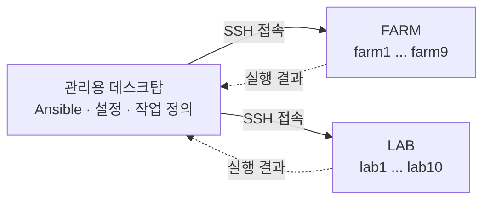

# ansible 개요

> [기초 개념](basic.md) · [설정](config.md) · [GitHub](https://github.com/CSID-DGU/admin_infra_server)

`ansible` 매뉴얼은 admin_infra_server의 모듈들이 공통으로 사용하는 **실행 기반**을
설명한다. `container-images`, `kerberos-nfs`, `monitoring`, `remote-operations`,
`server-state`는 각각 담당하는 기능이 다르지만, 서버에 실제로 명령을 보내는 방식은
모두 같다. 그 방식이 Ansible이고, 이 매뉴얼은 Ansible을 사용하기 위한 준비 과정을 다룬다.

처음 보는 사람은 이 페이지에서 "어떤 매뉴얼을 먼저 읽어야 하는지"를 잡고, 각 매뉴얼
안에서 세부 내용을 내려가면 된다.

## Ansible이 무엇을 하나

관리자가 FARM/LAB 서버 16대에 같은 작업을 해야 한다고 하자. 서버마다 SSH로 접속해
같은 명령을 반복하면 시간이 오래 걸리고, 한 대를 빠뜨리거나 잘못 입력하기 쉽다.

Ansible은 이 과정을 대신한다. **관리용 데스크탑에서 명령을 한 번 실행하면 Ansible이 대상
서버들(FARM/LAB)에 SSH로 접속해 작업을 수행하고 결과를 모아서 보여준다.**

대상 서버(FARM/LAB)에는 Ansible을 설치하지 않는다. 관리용 데스크탑에만 설치하고, 서버 쪽에는 SSH
접속과 Python만 있으면 된다. 설정 파일과 작업 내용도 모두 관리용 데스크탑에 있다.

**admin_infra_server의 모듈 명령은 전부 내부적으로 이 방식으로 동작한다.** 예를 들어
`server-state audit --hosts farm8`을 실행하면, `server-state`가 Ansible 명령을 조립해
farm8에 접속하고 점검을 수행한다. 그래서 Ansible 설정이 없으면 어떤 모듈 명령도
서버에 접속하지 못하고 실패한다.

Ansible 설정과 각 모듈의 코드는 GitHub의
`admin_infra_server`(<https://github.com/CSID-DGU/admin_infra_server>)에 있다.
관리용 데스크탑의 관리자 각자 홈 디렉터리에 clone해서 쓰며, 자세한 절차는
[설정 2.3](config.md#clone)에 있다.

## 상황별로 볼 곳

| 상황 | 확인할 매뉴얼 |
| --- | --- |
| 관리용 데스크탑을 처음 준비한다 | [설정](config.md) 2장부터 순서대로 따라간다 |
| Ansible이라는 도구가 낯설거나 `inventory`, `playbook`, `become` 같은 용어를 모르겠다 | [기초 개념](basic.md) |
| 모듈 명령이 서버 접속에서 실패한다 | [설정](config.md) 8장 문제 해결 |
| 설정이 제대로 됐는지 확인하고 싶다 | [설정](config.md) 6장 설정 확인 |
| 서버를 새로 추가했다 | [설정](config.md) 3장 공용 inventory |
| 다른 관리자가 새로 합류한다 | [설정](config.md) 9장 신규 관리자 체크리스트 |

## 매뉴얼 읽기 순서

### 1. Ansible을 모르면 기초 개념부터 본다

- [기초 개념](basic.md)은 Ansible이 무엇을 어떤 순서로 하는지 설명한다.
- inventory(대상 서버 목록), playbook과 role(작업 내용), 설정 파일 탐색 순서,
  권한 상승(`become`)을 다룬다.
- 이미 Ansible을 다뤄봤다면 건너뛰고 [설정](config.md)으로 가도 된다. 다만 설정
  파일 우선순위(6장)와 전체 흐름 정리(8장)는 이 GitHub의 구조를 이해하는 데 필요하다.

### 2. 실제 준비는 설정 매뉴얼에서 한다

- [설정](config.md)이 Anible 매뉴얼 중 핵심 내용을 담고 있다.
- 관리용 데스크탑에서 무엇을 설치하고, 어떤 파일을 만들고, 서버에 어떤 권한을 준비해야
  하는지를 순서대로 다룬다.
- 준비가 끝났는지 확인하는 절차(6장)와 실패했을 때 원인을 찾는 표(8장)도 여기 있다.

### 3. 설정이 끝나면 각 모듈 매뉴얼로 간다

- Ansible 설정은 한 번만 하면 되고, 그다음부터는 각 모듈 매뉴얼의 절차를 따른다.
- 모듈 매뉴얼은 Ansible 설정이 끝나 있다고 전제하고 쓰여 있다.

## 매뉴얼 지도

| 매뉴얼 | 역할 | 여기서 이해하는 내용 |
| --- | --- | --- |
| 개요 (현재 페이지) | 출발점 | Ansible이 하는 일, 설정을 두 곳으로 나누는 이유, 매뉴얼 순서 |
| [기초 개념](basic.md) | 배경지식 보충 | inventory, playbook, role, 설정 파일 우선순위, `become`, 실행 결과 읽는 법 |
| [설정](config.md) | 중심 매뉴얼 | `~/.ansible.cfg` 작성, 공용 inventory, NOPASSWD sudo 준비, 확인과 문제 해결 |

## 설정 구조

관리용 데스크탑은 여러 관리자가 함께 사용하고, 각 관리자는 **자신의 계정과 SSH 키로** 서버(FARM/LAB)에
접속한다. 공용 계정은 쓰지 않는다. 따라서 설정을 성격에 따라 두 곳으로 나눈다.

| 구분 | 내용 | 파일 | 누가 만드나 |
| --- | --- | --- | --- |
| 서버 목록 | host 이름, IP, SSH port | `~/admin_infra_server/ansible/inventory.ini` | GitHub에 이미 있다. `git pull`로 받는다 |
| 접속 계정과 실행 환경 | 접속 계정, 임시 디렉터리 경로 | `~/.ansible.cfg` | **관리자가 직접 만든다** ([설정](config.md) 4장) |

기준은 "이 값이 관리자마다 다른가"이다. 서버 목록은 모두 같으므로 GitHub에서 공유하고,
접속 계정은 각자 다르므로 홈 디렉터리에 둔다. **공유 파일에는 접속 계정을 기록하지
않는다.**

관리자가 직접 준비할 것은 결국 다음 세 가지다. 자세한 절차는 모두 [설정](config.md)에 있다.

1. `~/.ansible.cfg` 파일 작성 (4장)
2. 대상 서버에 본인 계정의 SSH 키 등록 (2장)
3. 대상 서버에 본인 계정의 NOPASSWD sudo 설정 (5장)

## 이 매뉴얼이 다루는 범위

- 관리용 데스크탑에서 FARM/LAB 서버에 접속하기 위한 **공통 준비**를 다룬다. 접속 대상,
  접속 계정, 권한, 그리고 준비가 됐는지 확인하는 방법이다.
- 각 모듈이 **무엇을 점검하고 무엇을 바꾸는지**는 다루지 않는다. 그건 모듈 매뉴얼의
  내용이다. 예를 들어 서버 상태 점검 기준은
  [server-state 설계](../server-state/design.md)에 있다.
- Ansible의 모든 기능을 설명하지 않는다. 이 GitHub의 모듈을 쓰는 데 필요한 개념과
  절차만 다룬다.
- SSH 개인키, 비밀번호, keytab 같은 실제 값은 적지 않는다. 준비 절차와 확인 방법만 적는다.
