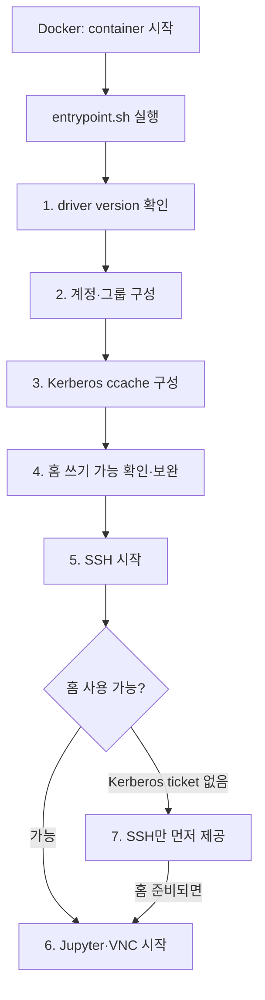

# container-images 설계

> [개요](index.md) · [운영](operations.md)

> **GitHub 코드 링크:** `admin_infra_server`는 비공개 저장소다. 코드 링크를
> 누르면 GitHub 로그인 화면을 거쳐 원래 파일과 line으로 이동한다. 조직 저장소에
> 접근 권한이 있는 계정으로 로그인해야 한다.

## 1. 개요

`container-images`의 목표는 GPU container가 시작된 직후 사용자가 자신의
계정과 공유 홈으로 접속하고, 선택한 GPU software 환경에서 바로 작업을 시작할
수 있게 하는 것이다.

`container-images`는 GPU container용 image(`Dockerfile`과
`image-variants.json`)와, 그 image에 담겨 있다가 container가 시작될 때 자동
실행되는 `entrypoint.sh`를 관리하는 모듈이다. 실제로 container를 만들고
실행하는 행위(`docker run`)는 `infra`라는 별도 시스템이 수행하며,
`container-images`의 역할은 그 실행이 시작된 뒤 image에 포함된
`entrypoint.sh`가 넘겨받은 입력으로 사용자 환경을 구성하는 지점부터다.

모든 container는 전달받은 UID/GID로 계정과 그룹을 구성한다. 홈 디렉터리는 
컨테이너 밖의 공유 스토리지이므로, 그 안에 이미 있는 `.bashrc` 같은
사용자 설정 파일이나 `vnc_password.txt` 같은 서비스별 password 파일이 있으면
새로 만들지 않고 그대로 이어서 사용한다. SSH와 Jupyter를 기본으로 제공하고,
필요한 경우 VNC와 Kerberos ccache 환경도 함께 구성한다. UID/GID와 홈이 항상
같은 값으로 전달되므로, container를 재시작하거나 다른 이미지 버전을 선택해도
같은 사용자(identity)와 작업 환경을 유지한다.

계정, supplemental group, 홈 디렉터리와 Kerberos 정보처럼 사용자와 host마다
달라지는 값은 공통 `entrypoint.sh`가 시작 시 반영한다. CUDA, TensorFlow,
Python과 Ubuntu 조합은 각각의 이미지 버전으로 제공한다. 따라서 사용자는 필요한
GPU software 조합을 선택하면서도 모든 이미지 버전에서 동일한 방식으로 SSH, Jupyter,
VNC와 공유 홈을 사용할 수 있다.

## 2. 사용자 실행 환경

`Dockerfile`은 모든 이미지 버전에 필요한 프로그램과 `entrypoint.sh`를 image에
포함한다. 실제 사용자 정보와 실행 옵션은 container를 생성하는 외부 시스템이
전달하며, entrypoint가 이를 검증하고 런타임 환경을 구성한다.

`container-images`는 사용자 identity, group membership, host mount, port와 Kerberos
ticket을 결정하지 않는다. 즉 image에는 특정 사용자의 계정이나 홈을
미리 넣지 않는다 — 이 값들은 container 생성 전에 외부 시스템이 정해 전달하는
runtime 입력이다. 이 문서에서는 그 입력이 만들어지는 과정이 아니라, image와
`entrypoint.sh`가 입력을 받아 container 내부 환경을 구성하는 동작을 설명한다.

| 구분 | 이 문서에서 다루는 범위 |
| --- | --- |
| 외부에서 전달되는 입력 | UID/GID와 그룹 목록, `/home` mount, Kerberos ccache, port mapping과 실행 option |
| `container-images`가 수행하는 작업 | image에 필요한 프로그램을 포함하고, 전달된 입력을 container 내부 계정·파일·service 설정에 반영한다. |

같은 image를 사용하더라도, 외부 시스템이 container를 생성할 때 넘겨주는
identity, mount와 실행 옵션에 따라 entrypoint가 각 사용자의 환경을 구성한다.

### 2.1 컨테이너 시작 흐름

Docker가 `entrypoint.sh`를 container의 시작 프로세스로 실행한다(image에 Docker
`ENTRYPOINT`로 지정되어 있다). 아래 7단계는 전부 이 하나의 스크립트 안에서
순서대로 호출되는 함수이며, 별도의 `.py`나 다른 프로세스가 아니다. 다음 순서는
`container-images` 내부에서 수행하는 작업만 나타낸다.



1. image에 기록된 CUDA/TensorFlow version을 출력하고 host NVIDIA driver가 최소
   version을 충족하는지 확인한다.
2. 전달받은 UID/GID로 사용자, primary group과 supplemental group을 구성한다.
3. 전달받은 Kerberos ccache를 shell과 사용자 process에서 사용할 수 있게 구성한다.
4. mount되어 있는 홈 디렉터리의 쓰기 가능 여부를 사용자 권한으로 확인하고 초기
   설정을 보완한다.
5. SSH 로그인, audit와 login message를 구성하고 SSH service를 시작한다.
6. 홈을 사용할 수 있으면 Jupyter와 선택적인 VNC/noVNC를 시작한다.
7. Kerberos ticket이 없어 홈을 쓸 수 없다면 SSH만 먼저 제공하고, 홈이 준비된
   뒤 사용자 서비스를 시작한다.

이 순서를 하나의 entrypoint에서 관리하므로 이미지 버전마다 사용자 환경을
별도로 구현하지 않는다.

**관련 코드**

- [entrypoint의 전체 실행 순서](https://github.com/login?return_to=%2FCSID-DGU%2Fadmin_infra_server/blob/main/container-images/entrypoint.sh%23L636-L648):
  계정, Kerberos, 홈, SSH와 사용자 service를 순서대로 호출한다.
- [`start_user_apps`](https://github.com/login?return_to=%2FCSID-DGU%2Fadmin_infra_server/blob/main/container-images/entrypoint.sh%23L604-L609):
  사용자 shell 환경을 보완한 뒤 Jupyter와 VNC/noVNC를 시작한다.

### 2.2 계정, 그룹과 권한

사용자 계정과 group membership은 외부에서 결정되고, 공유 스토리지는 그 결과인
UID/GID를 기준으로 파일 권한을 판단한다. container 안에서 실행되는 process도 같은
권한을 사용하려면 Linux 사용자와 그룹이 동일한 UID/GID를 가져야 한다.

따라서 entrypoint는 전달된 값으로 container 내부 사용자와 primary group을 만들고,
전달된 supplemental group만 같은 GID로 추가한다. 사용자가 어떤 그룹에 속해야
하는지는 판단하지 않는다. 같은 이름의 사용자나 그룹이 다른 UID/GID로 이미
존재하면 외부 권한과 다르게 동작할 수 있으므로 container 시작을 중단한다.

계정과 그룹을 만드는 것 외에, entrypoint는 사용자가 나중에 직접 쓸 수 있는
그룹 공유 도구도 하나 설치해 둔다. Kerberos 공유 스토리지에서는 사용자가 자신의
홈 directory를 배정된 그룹과 공유할 수 있도록 `group-dir-share` 명령을
제공한다. `Dockerfile`은 ACL 도구를 포함하고, entrypoint는 Kerberos 환경을
구성할 때 이 명령을 `/usr/local/bin`에 생성해 둔다. 이 명령을 실행하는 주체는
entrypoint가 아니라 로그인한 사용자다.

```bash
group-dir-share ~/project vision
```

이 명령은 사용자가 해당 그룹에 속하는지와 경로가 사용자 홈 안에 있는지를 확인한
뒤 group owner, `2770` mode와 ACL을 설정한다. 별도의 권한을 부여하는 명령이 아니라
실행한 사용자가 이미 가진 group membership 범위에서만 동작한다.

계정·그룹 구성과 별개로, entrypoint는 sudo 권한도 함께 제어한다. 기본 sudo
mode인 `restricted`는 package 설치에 필요한 명령은 허용하지만 사용자
전환, mount, 권한 변경, root shell과 우회 가능한 interpreter 실행은 막는다. 기존
사용자의 password는 재시작할 때 변경하지 않으며, `USER_PW`는 사용자를 처음 생성할
때만 적용한다.

entrypoint가 입력으로 받는 주요 값은 다음과 같다.

| 값 | 의미 |
| --- | --- |
| `USER_ID` | container에 생성하거나 확인할 사용자 이름 |
| `UID`, `GID` | DB·AD·NFS와 일치하는 숫자 identity |
| `USER_GROUP` | primary group 이름 |
| `DECS_SUPPLEMENTAL_GROUPS` | 추가할 `group:GID` 목록 |
| `DECS_USER_SUDO_MODE` | `disabled`, `restricted`, `allowed` 중 하나 |

`TARGET_UID`나 `TARGET_GID` 같은 두 번째 identity 체계를 만들지 않는다. 하나의
`UID`/`GID`만 사용해야 container, 공유 홈과 DB의 소유권이 서로 달라지는 오류를
시작 단계에서 찾을 수 있다.

**관련 코드**

- [`ensure_group_and_user`](https://github.com/login?return_to=%2FCSID-DGU%2Fadmin_infra_server/blob/main/container-images/entrypoint.sh%23L234-L282):
  primary group과 사용자를 생성·검증하고 sudo mode를 적용한다.
- [`ensure_supplemental_groups`](https://github.com/login?return_to=%2FCSID-DGU%2Fadmin_infra_server/blob/main/container-images/entrypoint.sh%23L154-L185):
  추가 그룹의 이름과 GID가 전달값과 일치하는지 확인한다.
- [`Dockerfile`의 ACL package 설치](https://github.com/login?return_to=%2FCSID-DGU%2Fadmin_infra_server/blob/main/container-images/Dockerfile%23L41-L68):
  `group-dir-share`가 ACL을 구성할 때 사용하는 `setfacl`을 image에 포함한다.
- [`install_kerberos_share_helper`](https://github.com/login?return_to=%2FCSID-DGU%2Fadmin_infra_server/blob/main/container-images/entrypoint.sh%23L91-L152):
  `/usr/local/bin/group-dir-share` script의 검증과 권한 설정 동작을 정의하고
  container 시작 시 파일을 생성한다.
- [`ensure_kerberos_runtime`](https://github.com/login?return_to=%2FCSID-DGU%2Fadmin_infra_server/blob/main/container-images/entrypoint.sh%23L332-L366):
  Kerberos ccache가 전달된 경우에만 그룹 공유 명령을 생성한다.
- [`write_restricted_sudoers`](https://github.com/login?return_to=%2FCSID-DGU%2Fadmin_infra_server/blob/main/container-images/entrypoint.sh%23L44-L69):
  제한적 sudo에서 허용하지 않을 권한 상승 경로를 정의한다.

### 2.3 홈 디렉터리와 공유 스토리지

공유 스토리지를 host에 mount하고 Docker bind mount로 container에 연결하는 작업은
container 시작 전에 외부에서 수행한다. `container-images`는 NFS를 mount하거나
mount source를 선택하지 않는다. entrypoint가 동작할 때는 다음 경로가 이미
container에 연결되어 있다고 가정한다.

| 전달되는 mount | entrypoint에서 사용하는 위치 | 사용 목적 |
| --- | --- | --- |
| 사용자 홈의 상위 공유 경로 | `/home` | `/home/<USER_ID>`를 사용자 홈으로 사용한다. |
| 사용자 Kerberos ccache directory | host와 같은 경로 | 사용자 process에 `KRB5CCNAME`으로 전달한다. |
| `krb5.conf` | `/etc/krb5.conf` (read-only) | Kerberos client 설정으로 사용한다. |

entrypoint가 담당하는 작업은 mount된 `/home/<USER_ID>`를 실제 사용자 권한으로
검증하고 container 실행에 필요한 최소 설정을 보완하는 것이다. 홈이 없으면 생성을
시도하고, 전달받은 UID/GID의 사용자로 파일을 직접 써 보아 사용 가능 여부를
확인한다. 공유 홈 전체의 소유권을 변경하지 않으며 `.profile`, `.bashrc`,
`.bash_logout`은 없는 경우에만 추가하며 기존 사용자 파일을 덮어쓰지 않는다.

NFS가 `root_squash`를 사용하면 container root도 홈의 owner를 임의로 바꿀 수
없다. 이는 외부 스토리지의 조건이며 entrypoint는 이를 우회하지 않는다. Kerberos
ccache가 전달되었지만 아직 홈을 쓸 수 없다면 SSH만 먼저 시작하고, 홈이 쓰기
가능해진 뒤 초기 설정과 Jupyter·VNC 시작을 이어서 수행한다.

**관련 코드**

- [`ensure_user_home`](https://github.com/login?return_to=%2FCSID-DGU%2Fadmin_infra_server/blob/main/container-images/entrypoint.sh%23L284-L330):
  홈 생성, 쓰기 권한, 기본 shell 파일과 history 저장 설정을 처리한다.
- [`start_kerberos_home_watcher`](https://github.com/login?return_to=%2FCSID-DGU%2Fadmin_infra_server/blob/main/container-images/entrypoint.sh%23L611-L634):
  Kerberos ticket을 기다리면서 홈이 쓰기 가능해지는 시점을 확인한다.

### 2.4 SSH, Jupyter와 VNC

host port mapping, firewall과 `ENABLE_VNC` 같은 실행 option은 container 시작 전에
외부에서 정한다. `container-images`는 host port를 할당하거나 network 접근 정책을
설정하지 않고, container 내부 service만 구성한다.

entrypoint는 SSH가 사용자와 관리 계정만 로그인할 수 있도록 `AllowUsers`를
구성하고, PAM·command audit·login message를 적용한 뒤 SSH service를
재시작한다. 홈이 아직 Kerberos 인증을 기다리는 상태여도 SSH는 먼저 사용할 수
있으므로 사용자가 로그인하여 ticket 상태를 확인할 수 있다.

Jupyter 설정은 사용자 홈의 `.jupyter`에 둔다. 관리하는 network·notebook 경로
항목만 갱신하고 나머지 사용자 설정은 유지한다. 시작할 때 임의 token을 만들고
권한이 `0600`인 `jupyter_token.txt`에 저장한 뒤 사용자 권한으로 JupyterLab을
실행한다.

VNC/noVNC는 `ENABLE_VNC=true`일 때만 시작한다. TigerVNC는 container 내부의
localhost에 bind하고, noVNC가 지정된 web port를 통해 연결한다. 기존 홈에
`vnc_password.txt`가 있으면 재사용하므로 container 재시작만으로 password가
바뀌지 않는다.

**관련 코드**

- [`configure_system_login`](https://github.com/login?return_to=%2FCSID-DGU%2Fadmin_infra_server/blob/main/container-images/entrypoint.sh%23L404-L445):
  SSH 접근 사용자, PAM, audit와 login message를 구성한다.
- [`ensure_jupyter_config`](https://github.com/login?return_to=%2FCSID-DGU%2Fadmin_infra_server/blob/main/container-images/entrypoint.sh%23L447-L478):
  사용자 설정을 보존하면서 Jupyter의 공통 항목을 갱신한다.
- [`start_jupyter`](https://github.com/login?return_to=%2FCSID-DGU%2Fadmin_infra_server/blob/main/container-images/entrypoint.sh%23L489-L509):
  접근 token을 저장하고 사용자 권한으로 JupyterLab을 시작한다.
- [`start_novnc`](https://github.com/login?return_to=%2FCSID-DGU%2Fadmin_infra_server/blob/main/container-images/entrypoint.sh%23L511-L602):
  VNC password를 준비하고 TigerVNC와 noVNC proxy를 시작한다.

### 2.5 Kerberos 사용자 환경

Kerberos principal, ticket 발급·갱신, ccache 생성과 host NFS 인증은
`container-images` 밖에서 준비한다. host의 machine keytab도 container에 전달하지
않는다.

`container-images`가 담당하는 작업은 전달받은 ccache를 container의 사용자
process에서 사용할 수 있게 만드는 것이다. entrypoint는 `KRB5CCNAME`이 있을 때
ccache directory의 접근 권한, shell 환경 변수와 `decs-kerberos-status` 명령을
구성하고 Jupyter와 VNC에도 같은 환경 변수를 전달한다. 사용자는
`decs-kerberos-status`로 ticket 상태를 확인할 수 있지만, entrypoint가 ticket을
직접 발급하거나 갱신하지는 않는다.

Kerberos keytab과 ccache를 분리하는 이유와 credential 경계는
[Kerberos/NFS의 keytab과 ccache 모델](../kerberos-nfs/design.md#keytab-ccache)을 따른다.

**관련 코드**

- [`ensure_kerberos_runtime`](https://github.com/login?return_to=%2FCSID-DGU%2Fadmin_infra_server/blob/main/container-images/entrypoint.sh%23L332-L366):
  ccache 경로의 권한과 Kerberos 환경 변수, ticket 확인 helper를 구성한다.

## 3. 이미지 구성

사용자 실행 환경은 모든 image에서 같지만 GPU software stack은 workload에 따라
달라진다. `container-images`는 공통 image 구성과 CUDA/TensorFlow 조합만 분리해
관리한다.

### 3.1 모든 이미지 버전의 공통 build 구성

모든 이미지 버전은 하나의 `Dockerfile`을 사용하고 다음 프로그램을 공통으로
포함한다.

| 영역 | 공통 구성 |
| --- | --- |
| 기본 도구 | ACL, audit, network, certificate와 package repository 도구 |
| 원격 접근 | OpenSSH server와 Kerberos client |
| 개발 환경 | Miniforge, conda, pip, JupyterLab과 Notebook |
| GUI | Chrome, Xfce, TigerVNC, noVNC와 websockify |
| 사용자 환경 | 한국어 글꼴과 입력기, 공통 entrypoint와 Jupyter config 위치 |

이미지 버전별 Dockerfile을 복제하지 않는 이유는 보안 patch와 공통 package 변경을
한 번만 적용하기 위해서다. 실제 차이는 build argument로 전달하며 공통 설치와
시작 흐름은 모든 이미지 버전에서 동일하게 유지한다.

### 3.2 CUDA/TensorFlow 조합별 이미지

이미지 버전 간 차이는 `image-variants.json`에 정의한다.

| manifest 값 | 이미지 버전마다 달라지는 내용 |
| --- | --- |
| `base_image` | CUDA, cuDNN과 Ubuntu가 포함된 NVIDIA base image |
| `cuda_version` | image가 제공하는 CUDA major/minor version |
| `tensorflow_version`, `tensorflow_package` | CUDA 조합에 맞춰 설치할 TensorFlow version과 package 형태 |
| `python_version`, `conda_packages` | Python version과 TensorFlow/Jupyter 호환을 위한 package 제약 |
| `min_nvidia_driver` | 해당 CUDA image를 실행할 host의 최소 NVIDIA driver |
| `support` | 실장비 검증을 마친 `stable` 또는 검증 중인 `experimental` 상태 |
| `aliases` | version alias와 `stable`, `latest` 같은 권장 tag |

현재 Python은 모두 3.10, Ubuntu는 모두 22.04를 사용한다. CUDA 조합에 따라
TensorFlow package, conda 제약과 최소 host driver가 달라진다.

| CUDA | TensorFlow | 주요 package 차이 | 최소 NVIDIA driver | 지원 상태와 alias |
| --- | --- | --- | --- | --- |
| 11.8 | 2.13.0 | 구버전 Jupyter·IPython과 `typing_extensions=4.5` 제약 | 520.61.05 | `stable`, `legacy` |
| 12.2 | 2.15.0 | 기본 TensorFlow package와 공통 Jupyter package | 535.104.05 | `stable` |
| 12.3 | 2.16.1 | `tensorflow[and-cuda]` package 사용 | 545.23.08 | `stable` |
| 12.5 | 2.20.0 | TensorFlow 2.20 기준 이미지 | 555.42.06 | `stable`, `latest` |
| 12.8 | 2.20.0 | H200 대상 실험 이미지 | 570.124.06 | `experimental`, `h200-experimental` |

로컬 빌드 도구와 GitHub Actions는 같은 manifest를 읽어 build argument와 tag를
만든다. 따라서 지원 조합을 한곳에서 검토하고 로컬과 CI가 서로 다른 image를
생성하는 것을 막는다.

### 3.3 GPU 호환성 처리

image는 시작할 때 build에 기록된 최소 NVIDIA driver와 `nvidia-smi` 결과를
출력한다. 기본값은 경고 중심이며 `STRICT_CUDA_COMPAT=true`일 때만 최소
driver보다 낮은 host에서 시작을 실패시킨다.

기본을 강제 실패로 두지 않은 이유는 GPU가 없는 검증 환경이나 긴급 진단
container까지 막지 않기 위해서다. 운영 배포에서 호환성을 반드시 보장해야
하면 strict mode를 명시한다.

**관련 코드**

- [`Dockerfile`](https://github.com/login?return_to=%2FCSID-DGU%2Fadmin_infra_server/blob/main/container-images/Dockerfile):
  공통 package를 설치하고 manifest 값을 build argument로 받는다.
- [`image-variants.json`](https://github.com/login?return_to=%2FCSID-DGU%2Fadmin_infra_server/blob/main/container-images/image-variants.json):
  지원하는 이미지 버전별 CUDA/TensorFlow 조합, 최소 driver와 tag를 정의한다.
- [`print_image_runtime_info`](https://github.com/login?return_to=%2FCSID-DGU%2Fadmin_infra_server/blob/main/container-images/entrypoint.sh%23L196-L232):
  image의 요구 driver와 실제 host driver를 비교한다.

## 4. 디렉터리 지도

| 경로 | 핵심 기능 |
| --- | --- |
| [`Dockerfile`](https://github.com/login?return_to=%2FCSID-DGU%2Fadmin_infra_server/blob/main/container-images/Dockerfile) | 모든 이미지 버전이 공유하는 단일 image 정의 |
| [`image-variants.json`](https://github.com/login?return_to=%2FCSID-DGU%2Fadmin_infra_server/blob/main/container-images/image-variants.json) | base image, CUDA/TensorFlow, 최소 driver와 alias 목록 |
| [`entrypoint.sh`](https://github.com/login?return_to=%2FCSID-DGU%2Fadmin_infra_server/blob/main/container-images/entrypoint.sh) | 시작 시 계정·그룹·홈·SSH·Jupyter·VNC·Kerberos 환경 구성 |
| `scripts/variant_matrix.py` | manifest를 Docker/GitHub Actions build matrix로 변환 |
| `scripts/build_variants.py` | 로컬 build/push 명령 생성과 실행 |
| `scripts/test_image_variants.py` | image metadata, TensorFlow와 선택적 GPU smoke test |
| `scripts/test_uid_create_container.py` | `infra`가 전달하는 container 생성 입력값의 dry-run 계약 검증 |
| `tests/` | `root_squash`, Kerberos, sudo와 build 설정 회귀 test |
| `.github/workflows/docker-publish.yml` | PR merge 또는 수동 실행 시 matrix build/push |
