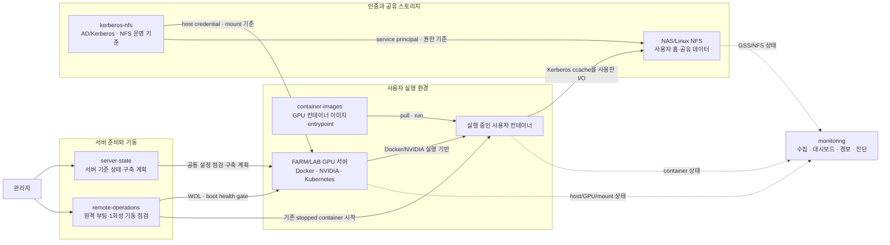

# System

> DECS GPU 서버를 **같은 기준으로 준비하고**, **안전하게 기동하며**,
> **컨테이너 실행 환경과 공유 스토리지 접근을 제공하고**, 그 상태를
> **지속적으로 관측**하는 운영 영역이다.

System 영역은 하나의 애플리케이션이 아니라 서로 다른 운영 책임을 가진 다섯
모듈로 구성된다. 각 모듈은 같은 GPU 서비스 환경을 다루지만, 변경 권한과 실행
시점이 겹치지 않도록 역할을 나눈다.

## 전체 구조

핵심은 다음 세 가지 흐름을 구분하는 것이다.

- **준비와 기동:** `server-state`가 서버의 목표 상태와 구축 순서를 정의하고,
  `remote-operations`가 전원이 꺼진 서버를 깨워 부팅 시점의 준비 상태를 확인한다.
- **실행과 접근:** `container-images`가 사용자 작업 환경의 실행 내용을 제공하고,
  `kerberos-nfs`가 컨테이너에서 공유 스토리지까지 이어지는 인증·권한 기준을
  제공한다.
- **관측과 대응:** `monitoring`이 서버, GPU, 컨테이너, NFS의 상태를 지속적으로
  수집해 대시보드와 경보로 연결한다.

## 구성요소별 역할

| 구성요소 | 답하는 질문 | 담당 범위 | 담당하지 않는 범위 |
| --- | --- | --- | --- |
| [`container-images/`](container-images/index.md) | 컨테이너 안에는 무엇이 들어가고, 시작할 때 무엇을 설정하는가? | CUDA/TensorFlow image variant, Dockerfile, entrypoint, UID/GID·VNC·Kerberos ccache 런타임 계약, 이미지 테스트·배포 | GPU 서버 자체의 드라이버 설치, 서버 부팅 순서, 상시 상태 관측 |
| [`server-state/`](server-state/index.md) | FARM/LAB 서버가 어떤 공통 상태여야 하는가? | 서버 profile, Docker/NVIDIA/Kubernetes/network/NFS 전제조건, 신규 서버 bootstrap 순서, 기존 서버 drift 점검과 remediation 계획 | 상시 monitoring, 전원 제어, 개별 운영 모듈의 구현 대체 |
| [`remote-operations/`](remote-operations/index.md) | 꺼져 있는 서버를 어떻게 서비스 가능한 상태까지 올리는가? | Wake-on-LAN, 부팅 시 1회 health gate, 필수 mount·GPU·SSH 확인, 기존 stopped container 시작과 사후 점검 | 주기적 상태 수집, 서버의 목표 상태 정의, 새 컨테이너 생성 |
| [`monitoring/`](monitoring/index.md) | 지금 서버와 서비스에 어떤 일이 일어나고 있는가? | exporter, Prometheus, Grafana, Alertmanager, GPU/container/NFS 상태, 경보, forensics와 제한된 안전 복구 | 서버 구축 기준 정의, 전체 부팅 orchestration, AD/NFS의 위험한 상태 변경 |
| [`kerberos-nfs/`](kerberos-nfs/index.md) | 사용자가 어떤 신원으로 공유 스토리지에 안전하게 접근하는가? | AD Kerberos, UID/GID 일치, keytab·ccache, RPCSEC_GSS, FARM/LAB NFS 기준 문서, 명시적 repair·rotation·mount 절차 | 공통 host 설정의 전체 적용, 지속 monitoring, 컨테이너 이미지 빌드 |

## 운영 흐름

새 서버를 추가하거나 전체 환경을 다시 확인할 때는 다음 순서로 보면 된다.

1. **서버 기준 확정:** `server-state`에서 대상 서버 profile과 필요한 공통 설정,
   담당 모듈을 확인한다.
2. **인증·스토리지 준비:** `kerberos-nfs` 기준에 따라 host principal, credential,
   NFS mount와 UID/GID 일치를 검증한다.
3. **실행 환경 준비:** 대상 GPU와 driver에 맞는 `container-images` variant를
   빌드·배포하고 entrypoint 계약을 검증한다.
4. **기동:** `remote-operations`로 서버를 깨우고 boot health gate를 통과한 뒤
   기존 컨테이너를 시작한다.
5. **지속 관측:** `monitoring`에서 metric, dashboard와 alert를 확인하고, 장애가
   발생하면 상태를 바꾸기 전에 진단 자료를 수집한다.

이 순서는 책임 관계를 이해하기 위한 기준이다. 일상 운영에서는 문제 유형에
따라 필요한 모듈부터 진입하면 된다.

## 어디서 시작할까

| 상황 | 먼저 볼 문서 |
| --- | --- |
| CUDA/TensorFlow 조합 추가, 이미지 빌드, entrypoint 변경 | [`container-images`](container-images/index.md) |
| 신규 GPU 서버 구축, 공통 설정 확인, 서버 간 drift 점검 | [`server-state`](server-state/index.md) |
| 서버 원격 부팅, boot gate 실패, 부팅 후 컨테이너 시작 문제 | [`remote-operations`](remote-operations/index.md) |
| metric 누락, dashboard·alert 확인, GPU/container/NFS 장애 진단 | [`monitoring`](monitoring/index.md) |
| Kerberos ticket, keytab, UID/GID, NFS mount·권한 문제 | [`kerberos-nfs`](kerberos-nfs/index.md) |

## 문서와 PDF

| 문서 | 웹 문서 | PDF |
| --- | --- | --- |
| 전체 통합 매뉴얼 | - | [PDF 열기](../../pdf/system/server-manage-manual.pdf) |
| 전체 구조 | 현재 페이지 | [PDF 열기](../../pdf/system/server-manage-index.pdf) |
| `container-images/` | [문서 열기](container-images/index.md) | [PDF 열기](../../pdf/system/container-images-manual.pdf) |
| `server-state/` | [문서 열기](server-state/index.md) | [PDF 열기](../../pdf/system/server-state-manual.pdf) |
| `remote-operations/` | [문서 열기](remote-operations/index.md) | [PDF 열기](../../pdf/system/remote-operations-manual.pdf) |
| `monitoring/` | [문서 열기](monitoring/index.md) | [PDF 열기](../../pdf/system/monitoring-manual.pdf) |
| `kerberos-nfs/` | [문서 열기](kerberos-nfs/index.md) | [PDF 열기](../../pdf/system/kerberos-nfs-manual.pdf) |
