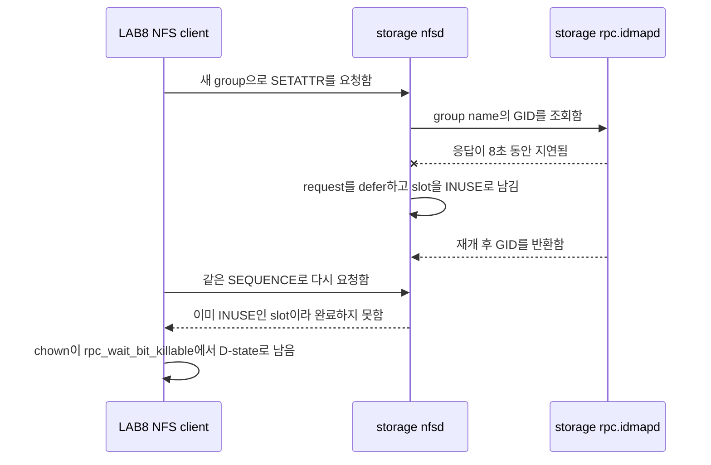

# NFSv4.1 session slot 고착

> 상태: 2026-07-16에 slot leak 경로 재현 완료. 2026-06-29 LAB5 장애의 강한
> 원인 후보이지만, LAB5 장애 시작 시점의 storage trace가 없어 과거 장애의
> 최초 원인으로 확정하지는 않는다.

## 1. 요약

LAB storage의 구형 kernel `3.10.0-862.el7.x86_64`에서 NFSv4 `SETATTR`가 새로운
group 이름을 UID/GID로 해석하던 중 `rpc.idmapd` 응답이 지연되면 request가
defer될 수 있다. 이때 NFSv4.1 `SEQUENCE`는 slot을 `INUSE`로 표시하지만 response
encode와 `nfsd4_sequence_done()`이 실행되지 않아 slot이 반환되지 않는 경로를
실제로 재현했다.



한 slot만 leak한 최소 재현에서는 `ForeChannel` waiter가 0일 수도 있다. 따라서
waiter가 없다는 사실만으로 slot 문제를 배제하면 안 된다. session reset이나
recovery가 모든 slot의 drain을 기다리는 상황에서는 고착된 한 slot이 전체 복구를
막을 수 있다.

## 2. 어떤 증상이었나

2026-07-16 재현에서는 LAB8의 `chown` worker가 173초 이상 D-state에 남았다.

```text
chown
  -> nfs4_proc_setattr
  -> nfs4_call_sync_sequence
  -> rpc_wait_bit_killable
```

storage trace에서는 첫 처리와 재방문이 다음처럼 달랐다.

| 단계 | 관측 |
| --- | --- |
| 첫 idmap decode | `RQ_USEDEFERRAL`, `RQ_DROPME`가 설정됨 |
| 첫 SEQUENCE 확인 | `seqid=0x5f`, `slot_seqid=0x5e`, `INUSE=0` |
| 첫 request 종료 | dispatcher가 0을 반환했고 encode와 `sequence_done`이 실행되지 않음 |
| `rpc.idmapd` 재개 후 | 같은 request가 `seqid=0x5f`, `slot_seqid=0x5f`, `INUSE=1`로 재방문 |
| 이후 retry | 약 15초마다 같은 `INUSE=1`을 확인하고 완료하지 못함 |

## 3. 왜 이 실험을 했나

조사는 다음 순서로 가설을 좁혔다.

1. 2026-06-29 LAB5에서는 NFS user home을 읽는 `sshd: ... [priv]`가 D-state에
   누적됐다.
2. 2026-07-10 LAB8에서 TCP/2049 transport를 일시 차단하자 같은
   `rpc_wait_bit_killable` 계열 증상을 재현했지만, network가 복구된 뒤 process도
   자연 복구됐다.
3. keytab, `rpc-gssd`, readiness와 mount 순서를 바로잡은 clean boot에서도 구형
   storage kernel의 session state가 영구 고착될 수 있는지는 별도 검증이
   필요했다.
4. upstream의 idmap deferral 수정 내용이 “NFSv4 decode 중 request drop으로
   `NFSD4_SLOT_INUSE`가 해제되지 않는다”는 경로를 설명하므로, 실제 LAB kernel과
   mount에서 그 primitive를 최소 workload로 확인했다.

실험 목적은 많은 client를 동시에 멈추게 하는 것이 아니라, **idmap miss 하나가
slot 하나를 반환 불가능하게 만들 수 있는지**를 확인하는 것이었다.

## 4. 실험 결과

### 4.1 실제 LAB 환경의 최소 재현

첫 pass에서 `RQ_DROPME`가 설정된 뒤 slot이 `INUSE`로 바뀌었지만 encode와
`nfsd4_sequence_done()`이 호출되지 않았다. 8초 뒤 `rpc.idmapd`가 재개된 후에도
같은 sequence는 이미 사용 중인 slot으로 판단됐다. client retry도 동일 상태를
반복했고 worker는 D-state에서 끝나지 않았다.

따라서 다음 좁은 결론은 확정할 수 있다.

- 당시 storage kernel에서는 idmap decode deferral이 NFSv4.1 session slot 하나를
  leak할 수 있다.
- keytab 발급, `rpc-gssd` 시작 순서나 client mount 순서만 고쳐서는 이 server-side
  kernel 경로를 제거할 수 없다.
- 한 slot leak은 재현했지만 LAB5에서 나중에 관측한 전체 session recovery/drain
  stall까지 이 최소 실험 하나로 재현한 것은 아니다.
- LAB5 장애 시작 시점의 trace가 없으므로 어떤 실제 operation이 최초 idmap miss를
  만들었는지는 알 수 없다.

### 4.2 A–G: 8초 idmap 지연 kernel matrix

최소 재현과 같은 `idmap-setattr`, NFSv4.1, `sec=krb5p` 조건에서 server와 client
kernel 조합을 바꿔 각 5회 실행했다. client OS는 모두 Ubuntu 22.04.5 LTS이며,
F/G만 client kernel을 `6.18.38`로 올렸다.

| Case | NFS server OS | Server kernel | Client kernel | 결과 |
| --- | --- | --- | --- | --- |
| A | CentOS Linux 7.9.2009 | `3.10.0-862.el7.x86_64` | `6.8.0-134-generic` | slot 고착 5/5 |
| B | CentOS Linux 7.9.2009 | `3.10.0-1160.el7.x86_64` | `6.8.0-134-generic` | slot 고착 5/5 |
| C | CentOS Stream 10 | `6.12.74` | `6.8.0-134-generic` | slot 고착 5/5 |
| D | CentOS Stream 10 | `6.12.75` | `6.8.0-134-generic` | 자동 복구 5/5 |
| E | CentOS Stream 10 | `6.12.0-248.el10.x86_64` | `6.8.0-134-generic` | 자동 복구 5/5 |
| F | CentOS Linux 7.9.2009 | `3.10.0-862.el7.x86_64` | `6.18.38` | slot 고착 5/5 |
| G | CentOS Linux 7.9.2009 | `3.10.0-1160.el7.x86_64` | `6.18.38` | slot 고착 5/5 |

구형 server kernel에서는 client kernel을 `6.18.38`로 올린 F/G도 모두 고착됐다.
반대로 idmap/slot fix가 포함된 D와 signed Stream kernel E는 모두 자동 복구했다.
이 결과는 문제와 복구 여부를 가르는 주된 변수가 client가 아니라 **NFS server
kernel의 idmap deferral 처리**임을 지지한다.

### 4.3 D/E: 120·300·600초 장시간 idmap 지연 추가 실험

8초 지연만으로는 수정된 kernel이 짧은 지연에서만 우연히 복구한 것인지 판단하기
어려웠다. 그래서 자동 복구한 D/E만 대상으로 idmap cache miss 응답을 120초,
300초, 600초까지 지연하고 각 조건을 3회씩 다시 실행했다.

| Case | Server kernel | idmap 지연 | 원래 `chgrp` | 신규 RPC | 최종 snapshot D / FC / lease |
| --- | --- | ---: | --- | --- | --- |
| D-120s | `6.12.75-nfs-slot` | 120초 | 성공 3/3 | 성공 3/3 | 모두 0 / 0 / 0* |
| D-300s | `6.12.75-nfs-slot` | 300초 | 성공 3/3 | 성공 3/3 | 모두 0 / 0 / 0 |
| D-600s | `6.12.75-nfs-slot` | 600초 | `EINVAL` 3/3 | 성공 3/3 | 모두 0 / 0 / 0 |
| E-120s | `6.12.0-248.el10.x86_64` | 120초 | 성공 3/3 | 성공 3/3 | 모두 0 / 0 / 0 |
| E-300s | `6.12.0-248.el10.x86_64` | 300초 | 성공 3/3 | 성공 3/3 | 모두 0 / 0 / 0 |
| E-600s | `6.12.0-248.el10.x86_64` | 600초 | `EINVAL` 3/3 | 성공 3/3 | 모두 0 / 0 / 0 |

여기서 `FC`는 NFSv4.1 ForeChannel waiter 수다. 600초 조건의 `EINVAL`은 원래
`chgrp` 요청의 application 결과이며, slot 고착 판정과 분리해야 한다. 같은 run에서
idmap 지연을 해제한 뒤 실행한 신규 RPC는 모두 성공했고, 최종 snapshot의 D-state,
ForeChannel waiter와 `lease_expired`도 모두 0이었다. 따라서 600초에서 원래 작업이
실패했더라도 **session slot은 반환됐고 후속 요청을 막지 않았다**.

> * D-120s 2회차의 2초 sampler는 종료 직전 D-state `1`을 한 번 기록했다.
> 그러나 직후 final snapshot은 D-state `0`이었고, 신규 RPC 성공, ForeChannel
> `0`, `lease_expired=0`, analyzer `verdict=pass`였다. 지속된 NFS slot 고착으로
> 판정하지 않았다.

## 5. 실제 재현 조건

| 항목 | 2026-07-16 조건 |
| --- | --- |
| client | LAB8, `100.100.100.108` |
| server | `lab-storage.lab.decs.internal`, `100.100.100.100` |
| mount | `/home/tako8/share`, NFSv4.1, `sec=krb5p`, `hard` |
| storage kernel | `3.10.0-862.el7.x86_64` |
| client 시작 상태 | D-state 0, NFS RPC task 0, readiness `ready` |
| test identity | LAB8 local group `decs_idmap_repro_424242`, GID `424242` |
| test object | `/home/tako8/share/.decs-idmap-slot-repro-20260716` |
| fault | storage `rpc.idmapd`에 8초간 `SIGSTOP` |
| workload | test file에 GID `424242`를 지정하는 `chown(2)` 한 번 |
| 안전장치 | storage-local 8초·20초 `SIGCONT` timer를 먼저 예약 |
| 금지한 복구 | 재현 후 client reboot, unmount, signal, service restart를 하지 않음 |

boot 순서도 별도로 확인했다. LAB8은 `rpc-gssd` active → Kerberos/NFS readiness
완료 → mount 순서였고, 기존 `/etc/krb5.keytab`의 KVNO는 2였다. 따라서 이번
결과를 keytab 생성 누락이나 잘못된 mount 시작 순서로 설명할 수 없다.

## 6. 당시 실행한 명령

> **경고:** 아래 명령은 2026-07-16의 승인된 실제 실행 기록이다. storage의
> `rpc.idmapd`를 멈추므로 일반 점검이나 운영 재현 절차로 다시 실행하면 안 된다.
> 재실험은 8절의 격리 VM harness를 사용한다. 특히 kprobe 인자 register는 당시
> x86_64 kernel symbol에만 맞춘 값이라 다른 kernel에서 그대로 사용하지 않는다.

### 6.1 client 사전 확인과 test 값 준비

LAB8에서 D-state와 RPC task가 없는지 확인한 뒤, storage에 없던 group 이름을
client가 encode하도록 local group과 test file을 준비했다.

```bash
ps -eo stat= | awk '$1 ~ /^D/ {n++} END {print "d_state=" (n+0)}'
grep -c '^RPC task' /proc/net/rpc/nfs 2>/dev/null || true
findmnt -T /home/tako8/share -n -o TARGET,SOURCE,FSTYPE,OPTIONS

sudo groupadd -g 424242 decs_idmap_repro_424242

sudo bash -c '
  p=/home/tako8/share/.decs-idmap-slot-repro-20260716
  rm -f "$p"
  touch "$p"
  chmod 0666 "$p"
  stat -c "path=%n uid=%u gid=%g mode=%a ino=%i" "$p"
'
```

fault 전에 GID `424241`을 사용한 정상 `chown`을 실행해 같은 경로가 idmap 지연
없이는 encode와 `sequence_done`까지 완료되는 것을 먼저 확인했다.

```bash
sudo python3 -c 'import os; p="/home/tako8/share/.decs-idmap-slot-repro-20260716"; print("before", os.stat(p).st_gid); os.chown(p, -1, 424241); print("after", os.stat(p).st_gid)'
```

### 6.2 storage trace 설정

당시 storage에서 idmap decode, slot 검사, dispatcher return, response encode와
slot 반환 여부를 한 trace instance에 기록했다.

```bash
T=/sys/kernel/debug/tracing
I="$T/instances/decs-idmap-slot-repro"
sudo mkdir -p "$I"

for event in uid gid check_slot dispatch dispatch_ret encode sequence sequence_done; do
  echo "-:decs_idmap/$event" | sudo tee -a "$T/kprobe_events" >/dev/null || true
done

echo 'p:decs_idmap/uid nfsd_map_name_to_uid rqstp=%di name=+0(%si):string namelen=%dx:u32' \
  | sudo tee -a "$T/kprobe_events" >/dev/null
echo 'p:decs_idmap/gid nfsd_map_name_to_gid rqstp=%di name=+0(%si):string namelen=%dx:u32' \
  | sudo tee -a "$T/kprobe_events" >/dev/null
echo 'p:decs_idmap/check_slot check_slot_seqid seqid=%di:u32 slot_seqid=%si:u32 slot_inuse=%dx:u32' \
  | sudo tee -a "$T/kprobe_events" >/dev/null
echo 'p:decs_idmap/dispatch nfsd_dispatch rqstp=%di' \
  | sudo tee -a "$T/kprobe_events" >/dev/null
echo 'r:decs_idmap/dispatch_ret nfsd_dispatch ret=$retval:s32' \
  | sudo tee -a "$T/kprobe_events" >/dev/null
echo 'p:decs_idmap/encode nfs4svc_encode_compoundres rqstp=%di' \
  | sudo tee -a "$T/kprobe_events" >/dev/null
echo 'p:decs_idmap/sequence nfsd4_sequence rqstp=%di cstate=%si seq=%dx' \
  | sudo tee -a "$T/kprobe_events" >/dev/null
echo 'p:decs_idmap/sequence_done nfsd4_sequence_done resp=%di' \
  | sudo tee -a "$T/kprobe_events" >/dev/null

echo 0 | sudo tee "$I/tracing_on" >/dev/null
echo 0 | sudo tee "$I/events/enable" >/dev/null
sudo sh -c ": > '$I/trace'"
echo 8192 | sudo tee "$I/buffer_size_kb" >/dev/null

for event in \
  decs_idmap/uid decs_idmap/gid decs_idmap/check_slot decs_idmap/dispatch \
  decs_idmap/dispatch_ret decs_idmap/encode decs_idmap/sequence \
  decs_idmap/sequence_done sunrpc/svc_process sunrpc/svc_defer \
  sunrpc/svc_revisit_deferred sunrpc/svc_drop sunrpc/svc_send
do
  echo 1 | sudo tee "$I/events/$event/enable" >/dev/null
done
echo 1 | sudo tee "$I/tracing_on" >/dev/null
```

### 6.3 fault와 단일 workload 실행

storage에서 반드시 자동 재개 timer 두 개가 active인지 확인한 뒤
`rpc.idmapd`를 멈췄다.

```bash
pid="$(pgrep -xo rpc.idmapd)"

sudo systemd-run --unit=decs-idmapd-auto-resume-8s \
  --on-active=8s --timer-property=AccuracySec=1s \
  /bin/kill -CONT "$pid"
sudo systemd-run --unit=decs-idmapd-auto-resume-20s \
  --on-active=20s --timer-property=AccuracySec=1s \
  /bin/kill -CONT "$pid"

sudo systemctl is-active --quiet decs-idmapd-auto-resume-8s.timer
sudo systemctl is-active --quiet decs-idmapd-auto-resume-20s.timer
sudo kill -STOP "$pid"
```

그 직후 LAB8의 별도 systemd worker에서 `chown(2)` 한 번만 실행했다.

```bash
sudo systemd-run --unit=decs-idmap-slot-repro-worker --no-block \
  /usr/bin/python3 -c \
  "import os; os.chown('/home/tako8/share/.decs-idmap-slot-repro-20260716', -1, 424242)"
```

### 6.4 결과 확인과 trace 보존

새로운 NFS I/O를 만들지 않고 worker, local kernel state와 이미 동작 중이던
forensics state를 확인했다.

```bash
systemctl --no-pager --full status decs-idmap-slot-repro-worker.service
ps -eo pid=,ppid=,stat=,comm=,wchan:32=,args= \
  | awk '$3 ~ /^D/ {print}'
grep -E 'lease_expired|RPC task|xprt_pending|ForeChannel' \
  /proc/net/rpc/nfs 2>/dev/null || true

cat /run/decs-nfs-forensics/status.json
cat /var/lib/decs-nfs-gss/recovery.state
cat /var/lib/decs-nfs-gss/canary.state
```

storage trace는 다음 pattern을 기준으로 추렸다.

```bash
I=/sys/kernel/debug/tracing/instances/decs-idmap-slot-repro
sudo sh -c "echo 0 > '$I/tracing_on'"
sudo cp "$I/trace" /var/tmp/decs-idmap-slot-repro-20260716.trace

sudo grep -E \
  'decs_idmap_gid|svc_defer|svc_revisit_deferred|svc_drop:|check_slot|sequence_done|dispatch_ret' \
  /var/tmp/decs-idmap-slot-repro-20260716.trace
```

## 7. Monitoring과 운영 대응

재현 당시 guardrail은 의도대로 동작했다.

- forensics watcher가 `nfs_d_state` 이유로 incident snapshot을 보존했다.
- recovery는 `status=blocked`, `diagnosis=nfs_d_state_detected`,
  `retry_inhibited=1`로 바뀌었다.
- canary도 같은 진단으로 차단돼 추가 NFS request를 만들지 않았다.
- packet ring과 kernel trace는 계속 증거를 수집했다.

운영에서 같은 증상이 보이면 다음 순서를 따른다.

1. NFS path를 읽는 `find`, `du`, `stat`, canary를 추가 실행하지 않는다.
2. D-state stack, `/proc/net/rpc/nfs`, forensics status와 snapshot을 보존한다.
3. mount가 이미 있으면 자동 remount와 `rpc-gssd` 반복 restart를 차단한다.
4. storage kernel, `rpc.idmapd`, network와 NFS session 증거를 함께 확인한다.
5. 상태가 자연 복구되지 않으면 유지보수 창의 client reboot 또는 storage 조치를
   수동 결정한다. reboot는 상태를 지울 뿐 원인 수정은 아니다.
6. 영구 조치는 해당 idmap deferral fix가 포함된 storage kernel로 올리고 격리
   회귀 실험을 통과시키는 것이다.

운영 mount를 `soft`로 바꾸는 방식은 timeout을 application error로 노출하고 data
integrity 위험을 만들 수 있어 해결책으로 사용하지 않는다.

## 8. 격리 VM에서 다시 검증하는 방법

반복 실험은 LAB8 local disk의 `decs-nfs-slot-isolated` network에서 수행한다.
이 network는 forwarding이 없고 `100.100.100.0/24`, `192.168.1.0/24`와 운영
storage hostname을 거부한다. VM disk, trace와 result도 NFS share가 아니라 LAB8
local filesystem에 둔다.

kernel 비교 기준은 다음과 같다.

| Case | Server kernel | Client kernel | 목적 |
| --- | --- | --- | --- |
| A | CentOS 7 `3.10.0-862` | Ubuntu `6.8.0-134` | 운영 취약 baseline |
| B | CentOS 7 `3.10.0-1160` | Ubuntu `6.8.0-134` | CentOS 7 최종 kernel 비교 |
| C | upstream `6.12.74` | Ubuntu `6.8.0-134` | fix 이전 positive control |
| D | upstream `6.12.75` | Ubuntu `6.8.0-134` | idmap/slot fix 비교 control |
| E | signed Stream `6.12.0-248.el10` | Ubuntu `6.8.0-134` | 운영 후보 |
| F | CentOS 7 `3.10.0-862` | kernel.org `6.18.38` | 새 client kernel 비교 |
| G | CentOS 7 `3.10.0-1160` | kernel.org `6.18.38` | 새 client kernel 비교 |

준비와 격리는 VM lab README의 절차를 따른다.

```bash
cd /home/jy/server_manage/kerberos-nfs/test/lab-kerberos-poc/vm-slot-regression

sudo ./bin/provision_lab8_vms.sh "$PWD"
./bin/configure_vm_stack.sh
sudo ./bin/prefetch_kernel_matrix.sh
sudo ./bin/verify_kernel_sources.sh
sudo ./bin/build_upstream_kernels_vm.sh
sudo ./bin/prepare_centos7_domains.sh "$PWD"
sudo ./bin/isolate_test_vms.sh
```

단일 비교는 같은 `idmap-setattr`, `sec=krb5p`, 8초 조건을 case별로 실행한다.

```bash
./bin/switch_kernel_case.sh A
NFS_SLOT_EXPECT_VULNERABLE=1 \
  ./bin/run_single_case.sh A krb5p idmap-setattr 8 1

./bin/switch_kernel_case.sh D
NFS_SLOT_EXPECT_VULNERABLE=0 \
  ./bin/run_single_case.sh D krb5p idmap-setattr 8 1
```

먼저 실행 수만 확인하려면 plan-only mode를 쓴다.

```bash
MATRIX_PLAN_ONLY=1 \
MATRIX_CASES='A C D E' \
MATRIX_SECURITY='krb5p' \
MATRIX_SCENARIOS='idmap-setattr' \
MATRIX_DURATIONS='8' \
MATRIX_REPETITIONS=3 \
  ./bin/run_matrix.sh
```

취약 case가 고착되면 harness는 evidence를 archive한 뒤 **격리 VM만** reset한다.
그 reset은 자동 복구 성공으로 계산하지 않는다. 운영 LAB8 host와 운영 NFS mount는
이 harness의 복구 대상이 아니다.

## 9. 원본 증거와 코드

- [2026-07-16 실제 재현 결과](https://github.com/CSID-DGU/admin_infra_server/blob/40ba171314d71021f353be8b8f513ba12d97980d/kerberos-nfs/labs/lab-kerberos-poc/results/2026-07-16-lab8-idmap-slot-repro/README.md)
- [curated trace evidence](https://github.com/CSID-DGU/admin_infra_server/blob/40ba171314d71021f353be8b8f513ba12d97980d/kerberos-nfs/labs/lab-kerberos-poc/results/2026-07-16-lab8-idmap-slot-repro/evidence.txt)
- [2026-07-10 NFS transport fault 실험](https://github.com/CSID-DGU/admin_infra_server/blob/40ba171314d71021f353be8b8f513ba12d97980d/kerberos-nfs/labs/lab-kerberos-poc/results/2026-07-10-lab8-nfs-gss-fault/README.md)
- [격리 VM slot regression lab](https://github.com/CSID-DGU/admin_infra_server/blob/40ba171314d71021f353be8b8f513ba12d97980d/kerberos-nfs/labs/lab-kerberos-poc/vm-slot-regression/README.md)
- [single-case harness](https://github.com/CSID-DGU/admin_infra_server/blob/40ba171314d71021f353be8b8f513ba12d97980d/kerberos-nfs/labs/lab-kerberos-poc/vm-slot-regression/bin/run_single_case.sh)
- [result analyzer](https://github.com/CSID-DGU/admin_infra_server/blob/40ba171314d71021f353be8b8f513ba12d97980d/kerberos-nfs/labs/lab-kerberos-poc/vm-slot-regression/bin/analyze_run.sh)
- [upstream stable patch 설명](https://www.spinics.net/lists/stable/msg914991.html)
- [NFS forensics 구현](https://github.com/CSID-DGU/admin_infra_server/tree/40ba171314d71021f353be8b8f513ba12d97980d/monitoring/nfs-forensics)

보존된 storage raw trace의 SHA-256은
`5fe7fbab2b8aa712ff71afe5156438b4e880edcc39cf16a00592e22d578bac59`다.
