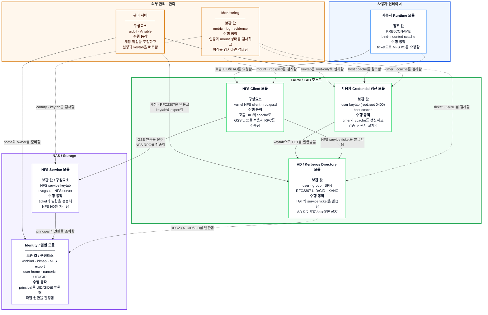
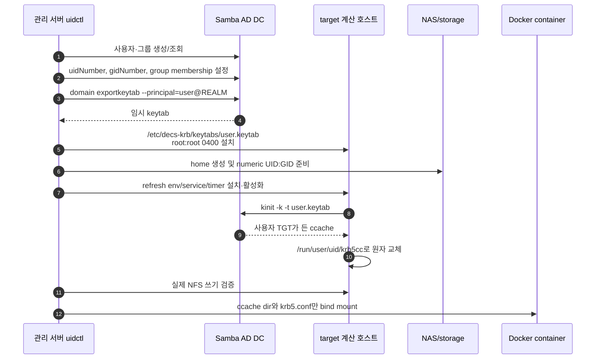
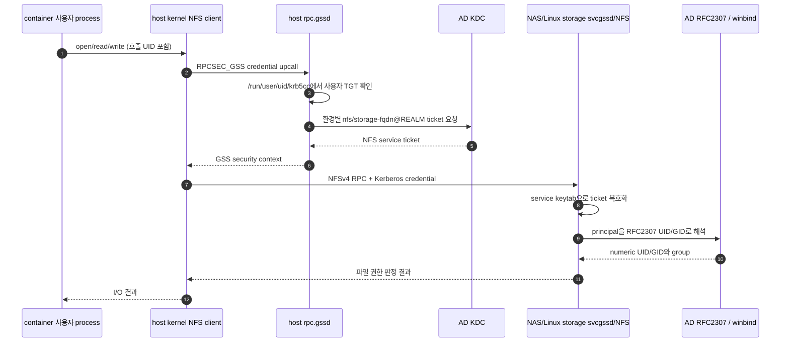

# Kerberos/NFS 설계

이 문서는 keytab이 만들어지는 시점부터 사용자가 NFS 파일을 읽고 쓰는
시점까지, 어느 서버의 어떤 객체와 프로세스가 관여하는지를 설명한다.

## 1. 설계 목표

- 비밀번호를 컨테이너에 저장하지 않고 사용자별 Kerberos 인증을 제공한다.
- DB, AD, 계산 호스트, NAS와 컨테이너가 같은 numeric UID/GID를 사용한다.
- NFS 서버는 FQDN 기반 service principal로 인증하고 client는 `sec=krb5`로
  RPCSEC_GSS context를 만든다.
- keytab 같은 장기 자격증명의 노출 범위를 host root로 제한한다.
- ticket 갱신과 컨테이너 lifecycle을 분리하여 컨테이너 재시작 중에도 credential을
  안정적으로 유지한다.
- monitoring은 drift를 관측하되 공유 NAS와 AD를 자동으로 변경하지 않는다.

## 2. 전체 구성

다이어그램의 **굵은 바깥 제목은 실행 영역**이고, 영역 안 각 카드의 **굵은 첫
줄은 모듈 이름**이다. 카드 안의 `보관·참조 값 / 구성요소`는 명사형으로,
`수행 동작`은 **주체와 동사가 있는 문장**으로 구분했다. 화살표 문장은 출발점의
모듈이 도착점의 모듈에 수행하는 동작을 뜻하며, 점선은 credential 참조나 읽기
전용 조회·관측을 뜻한다. AD/KDC는 모든 계산 host에 있는 것이 아니라 FARM/LAB
중 **AD DC 역할을 맡은 host에만** 있다. 다이어그램에는 핵심 값과 동작만
표시하고 상세 책임은 아래 표에서 설명한다.



### 구성요소별 책임

| 영역 | 모듈 | 내부 구성요소 | 하는 일 |
| --- | --- | --- | --- |
| 외부 관리 | **계정 생성 orchestration** | `uidctl`, Ansible runner | 계정 생성 transaction을 조정하고 AD, host, storage에 필요한 상태를 준비 |
| FARM/LAB 호스트 | **AD/Kerberos Directory** | Samba AD DC, KDC, 사용자·그룹·SPN·RFC2307 객체 | principal과 Unix identity 저장, keytab export, TGT/service ticket 발급; AD DC 역할 host에만 배치 |
| FARM/LAB 호스트 | **사용자 Credential 갱신** | user keytab, `decs-krb-refresh@.service/.timer`, host ccache | root-only keytab으로 ccache를 만들고 검증 후 원자 교체 |
| FARM/LAB 호스트 | **NFS Client** | kernel NFS client, `rpc.gssd` | 호출 UID의 ccache로 RPCSEC_GSS context를 만들고 NFS RPC 전송 |
| 사용자 컨테이너 | **사용자 Runtime** | 사용자 process, bind-mounted ccache, `KRB5CCNAME` | keytab 없이 host가 갱신한 ticket을 사용하여 NFS 파일 I/O 수행 |
| NAS/Storage | **NFS Service** | service keytab, `svcgssd`, NFS server | `nfs/<fqdn>@<realm>` service ticket을 수락하고 NFS 요청 처리 |
| NAS/Storage | **Identity/권한** | Samba, winbind, idmap, NFS export와 filesystem | Kerberos principal을 RFC2307 UID/GID로 해석하여 최종 파일 권한 판정 |
| 외부 관측 | **Monitoring** | readiness, KVNO checker, mount probe, canary, forensics | AD/host/storage 상태를 읽기 전용으로 수집하고 drift와 장애를 경보 |

## 3. FARM과 LAB의 현재 설정 차이

FARM과 LAB은 “사용자 keytab은 host root만 보관하고 container에는 ccache만
전달한다”는 credential 모델은 같다. 그러나 realm, NFS server 구현, mount source,
service principal과 NFS protocol version은 서로 다르다. 한 환경의 값을 다른
환경에 그대로 복사하면 KDC가 잘못된 service ticket을 발급하거나 NFS server가
ticket을 복호화하지 못한다.

### 3.1 Identity와 endpoint

| 항목 | FARM | LAB |
| --- | --- | --- |
| Kerberos realm | `FARM.DECS.INTERNAL` | `LAB.DECS.INTERNAL` |
| DNS domain / NetBIOS | `farm.decs.internal` / `FARM` | `lab.decs.internal` / `LAB` |
| AD/KDC | `dc1.farm.decs.internal`; farm2가 primary이고 farm6·farm7을 replica 경로로 사용 | `dc1.lab.decs.internal`; lab2 |
| NFS server 구현 | Synology NAS가 FARM AD domain member로 동작 | 일반 Linux storage host가 LAB AD domain member와 NFS server로 동작 |
| 관리 SSH | `192.168.2.30:6954` | `192.168.1.20:6953` |
| NFS data 주소 | `100.100.100.120` | `100.100.100.100` |
| 운영 mount source | `nas.farm.decs.internal:/volume1/share` | `lab-storage.lab.decs.internal:/294t/dcloud/share` |
| 계산 host mount target | `/home/tako<번호>/share` | `/home/tako<번호>/share` |
| 사용자 home 원본 | `/volume1/share/user-share/<username>` | `/294t/dcloud/share/user-share/<username>` |

관리 주소는 SSH와 장비 관리에만 사용한다. NFS source에는 반드시 service
principal의 hostname을 사용한다. LAB의 `/294t/dcloud/share/test_krb`와
`/294t/health/nfs-gss-canary`는 각각 격리 PoC와 canary용 export이며 운영 사용자
mount source인 `/294t/dcloud/share`를 대신하지 않는다.

### 3.2 NFS와 Kerberos service identity

| 항목 | FARM | LAB |
| --- | --- | --- |
| 현재 NFS version | `vers=4.0` | `vers=4.1` |
| 기본 security flavor | `sec=krb5` | `sec=krb5` |
| server export flavor | production storage IP에는 `sec=krb5:krb5i:krb5p`; client가 `krb5`를 선택 | 현재 LAB baseline은 `sec=krb5` |
| NFS service principal | `nfs/nas.farm.decs.internal@FARM.DECS.INTERNAL` | `nfs/lab-storage.lab.decs.internal@LAB.DECS.INTERNAL` |
| 추가 principal | `nfs/NAS@FARM.DECS.INTERNAL`, `nfs/nas.ailab.dgu@AILAB.DGU`를 NAS keytab에서 함께 보존 | 현재 profile에는 별도 추가 acceptor 없음 |
| NFS SPN 소유자 | 전용 AD user `svc-nfs-farm`; Synology machine account `NAS$`와 분리 | Linux storage computer account `LAB-STORAGE$` |
| NFS service keytab | `/etc/nfs/krb5.keytab`이 ticket 검증 기준이며 `/etc/krb5.keytab`도 checker가 비교 | `/etc/krb5.keytab` |
| server GSS process | Synology의 `/usr/sbin/svcgssd`; 여러 realm의 `nfs/*`를 받아야 하므로 `-p`로 하나를 고정하지 않음 | Linux `rpc-svcgssd` 또는 NFS server가 관리하는 `rpc.svcgssd` |
| client machine principal 예 | `FARM8$@FARM.DECS.INTERNAL` | `LAB9$@LAB.DECS.INTERNAL` |
| GSS canary | 전용 export가 없어 현재 비활성 | `lab-storage.lab.decs.internal:/294t/health/nfs-gss-canary`, `vers=4.1,sec=krb5`로 활성 |

사용자 principal도 realm에 따라 `<username>@FARM.DECS.INTERNAL` 또는
`<username>@LAB.DECS.INTERNAL`이 된다. 사용자 keytab, host machine keytab과 NFS
service keytab은 서로 다른 principal과 lifecycle을 가지므로 같은 파일처럼
취급해서는 안 된다.

### 3.3 NFS version이 다른 이유

FARM의 Synology NAS는 NFSv4.1을 광고하지만 rollout 중 `vers=4.1`과
RPCSEC_GSS 조합에서 timeout 또는 access denied가 관측됐다. 따라서 현재 운영
baseline은 `vers=4.0,sec=krb5,hard,timeo=600,retrans=2`다. fstab에서 1 MiB
`rsize/wsize`를 요청해도 Synology가 실제 runtime 값을 128 KiB로 낮춰 협상할 수
있다.

LAB은 Linux storage의 NFSv4.1을 사용한다. NFSv4.1 session/slot 상태는
server kernel 구현의 영향을 받으므로, 구형 kernel의 idmap deferral과 slot 고착
문제는 [NFSv4.1 session slot 고착](debugging/nfs-v41-session-slot-stuck.md)에서
별도로 관리한다. FARM이 v4.0이라고 해서 LAB도 v4.0으로 낮추거나, LAB이
v4.1이라고 해서 Synology NAS를 검증 없이 v4.1로 올리지 않는다.

현재 desired 값은
[server-state Kerberos/NFS playbook](https://github.com/CSID-DGU/admin_infra_server/blob/main/server-state/ansible_playbook/kerberos_nfs_client_recovery.yml),
관측 기준은
[monitoring exporter 변수](https://github.com/CSID-DGU/admin_infra_server/blob/main/monitoring/ansible_playbook/group_vars/exporters.yml)를
단일 기준으로 삼는다.

## 4. 사용자 keytab 발급 흐름

keytab은 컨테이너 안에서 만들지 않는다. AD DC에서 export한 뒤 target 계산
호스트의 root-only 경로에 설치한다.



실제 생성 구현은 다음 순서로 동작한다.

1. DB/기존 AD/storage 값을 사용해 UID/GID를 선택한다.
2. AD user/group과 RFC2307 `uidNumber`, `gidNumber`를 보장한다.
3. AD DC에서 사용자 keytab을 임시 파일로 export하고 `0400`으로 만든다.
4. target이 다른 host이면 Ansible `fetch`와 `copy`로 root-only keytab을 옮긴다.
5. NAS/storage home을 동일 UID/GID로 준비한다.
6. target host에 ccache directory, refresh helper, service/timer를 만든다.
7. host에서 사용자 ccache를 발급하고 NFS owner와 실제 write/delete를 검증한다.
8. 검증 후에만 컨테이너와 DB record를 확정한다.

관련 코드는 [AD identity와 keytab 생성](https://github.com/CSID-DGU/admin_infra_server/blob/main/user-lifecycle/script/uid_manager/kerberos/commands.py),
[container 생성 transaction](https://github.com/CSID-DGU/admin_infra_server/blob/main/user-lifecycle/script/uid_manager/services/create_container.py),
[credential 경로 모델](https://github.com/CSID-DGU/admin_infra_server/blob/main/user-lifecycle/script/uid_manager/kerberos/paths.py)에서 확인한다.

## 5. 실제 NFS 인증 흐름

keytab 발급과 매 파일 접근의 인증은 서로 다른 흐름이다. 평상시 파일 I/O에서
컨테이너가 keytab을 직접 읽는 일은 없다.



FARM에서는 `nfs/nas.farm.decs.internal@FARM.DECS.INTERNAL`, LAB에서는
`nfs/lab-storage.lab.decs.internal@LAB.DECS.INTERNAL` ticket을 요청한다. 이 값은
mount source의 hostname에서 결정되며 단순 표시용 설정이 아니다.

인증 실패 위치에 따라 증상이 달라진다.

| 실패 위치 | 대표 증상 |
| --- | --- |
| 사용자 keytab/ccache | `kinit` 또는 `klist` 실패, 사용자 접근만 `Permission denied` |
| DNS/FQDN/SPN | `kvno nfs/<fqdn>` 실패, IP source mount에서 principal 불일치 |
| host machine keytab/`rpc.gssd` | 부팅 시 mount 실패, readiness의 keytab/kinit/rpc-gssd stage 실패 |
| NAS service keytab/KVNO | 여러 client가 동시에 GSS 실패, `kvno -k` 복호화 실패 |
| RFC2307/idmap | 인증은 되지만 owner가 `nobody`이거나 UID/GID가 달라 쓰기 거부 |
| NFS transport/kernel | `not responding`, D-state, mount probe timeout |

## 6. Keytab과 ccache를 분리한 이유

| 구분 | keytab | ccache |
| --- | --- | --- |
| 의미 | principal의 장기 비밀키 | 이미 발급된 TGT/service ticket 묶음 |
| 새 ticket 발급 | 가능 | 제한된 renew 기간 안에서만 가능 |
| 유출 영향 | rotation할 때까지 반복 악용 가능 | ticket lifetime/renew lifetime에 제한 |
| 저장 위치 | host root-only | `/run/user/<uid>/krb5cc`, 사용자 `0600` |
| container 전달 | 금지 | bind mount하여 전달 |

컨테이너 삭제만으로 유출된 keytab을 무효화할 수 없기 때문에 image, Docker
volume, Kubernetes Secret에 사용자 keytab을 그대로 넣지 않는다. 호스트
refresh service는 임시 ccache에서 `klist` 검증을 끝낸 뒤 소유권 `uid:gid`, mode
`0600`을 적용하고 최종 경로로 원자 교체한다.

현재 코드가 구현하는 대상은 Docker container다. Kubernetes Pod도 같은 원칙을
적용해야 하지만, Pod가 다른 node로 이동할 수 있으므로 단순 hostPath와 특정
node의 systemd timer에 의존해서는 안 된다. Pod 지원을 추가할 때는 node 배치,
credential 발급 controller/CSI, rotation과 Pod 종료 시 정리를 별도 설계해야 한다.

## 7. Ticket 갱신 설계

`decs-krb-refresh@<username>.timer`는 기본적으로 boot 2분 뒤 시작하고 사용자별
설정 주기(현재 일반적으로 1시간)마다 oneshot service를 실행한다.

```text
유효 ccache 있음
  ├─ renew deadline이 margin보다 멂 -> 임시 복사본에서 kinit -R
  └─ deadline 임박/renew 실패       -> root-only keytab으로 새 ticket 발급

발급 결과 -> klist 검증 -> uid:gid 0600 -> 최종 ccache로 atomic move
```

기본 재발급 여유는 `DECS_KRB_REISSUE_BEFORE_SECONDS=86400`(24시간)이다. 기존
ticket의 PAC/group 정보는 renew 시 유지될 수 있으므로 AD group 변경 뒤에는
keytab을 이용한 fresh login을 한 번 강제해야 한다.

## 8. NFS service identity와 KVNO

FARM NFS SPN은 Synology domain member의 machine account `NAS$`가 아니라 전용 AD
service account `svc-nfs-farm`이 소유한다.

```text
nfs/nas.farm.decs.internal@FARM.DECS.INTERNAL
nfs/NAS@FARM.DECS.INTERNAL
```

과거에는 `NAS$` machine password가 주기적으로 변경될 때 KVNO도 바뀌어 NAS의
정적 NFS keytab과 어긋날 수 있었다. 이를 service identity와 domain membership의
lifecycle 결합 문제로 보고 NFS SPN을 전용 계정으로 분리했다.

현재 `svc-nfs-farm`에는 자동 password expiration/rotation timer가 없다. 따라서
“NAS KVNO가 지금도 주기적으로 바뀐다”가 아니라 **과거 자동 변경 문제를 전용
계정으로 제거했고, 현재 KVNO는 관리자가 명시적으로 rotation할 때만 바뀐다**가
정확한 운영 모델이다. 별도 5분 checker는 변경을 만들지 않고 AD KVNO와 두 NAS
keytab의 일치만 확인한다.

NAS의 `svcgssd`는 FARM과 AILAB principal을 한 keytab에서 받아들이므로 `-p`로
FARM principal 하나만 강제하지 않는다. keytab repair 시에도 AILAB acceptor를
보존한다.

LAB은 Synology NAS용 전용 service account와 keytab merge 절차를 사용하지 않는다.
현재 LAB keytab checker profile은 `LAB-STORAGE$` computer account의 KVNO와 Linux
storage의 `/etc/krb5.keytab` 안
`nfs/lab-storage.lab.decs.internal@LAB.DECS.INTERNAL`을 비교한다. FARM repair나
rotation script를 LAB storage에 실행하면 안 된다.

## 9. FQDN mount와 service principal

Kerberos의 NFS service identity는 host-based principal이다. FARM mount source는
다음처럼 principal의 hostname과 같아야 한다.

```text
mount source: nas.farm.decs.internal:/volume1/share
service SPN:  nfs/nas.farm.decs.internal@FARM.DECS.INTERNAL
transport:    addr=100.100.100.120
```

`100.100.100.120:/volume1/share`를 source로 쓰면 client가 IP 기반 service
identity를 찾으려 하거나 기대한 FQDN SPN과 연결하지 못할 수 있다. 반면 source를
FQDN으로 유지한 상태에서 runtime option에 `addr=100.100.100.120`이 보이는 것은
정상이다. 관리 SSH 주소 `192.168.2.30`은 NFS transport로 사용하지 않는다.

LAB도 같은 규칙을 적용한다.

```text
mount source: lab-storage.lab.decs.internal:/294t/dcloud/share
service SPN:  nfs/lab-storage.lab.decs.internal@LAB.DECS.INTERNAL
transport:    100.100.100.100
```

LAB 관리 SSH 주소 `192.168.1.20`이나 data IP
`100.100.100.100:/294t/dcloud/share`를 mount source로 직접 쓰지 않는다.

## 10. 보안 flavor와 권한 모델

- `sec=krb5`: 사용자/서비스 인증. RPC payload 무결성·암호화 wrapping 없음.
- `sec=krb5i`: 인증 + RPC payload 무결성.
- `sec=krb5p`: 인증 + 무결성 + privacy encryption.

현재 내부 FARM/LAB 기본은 `sec=krb5`다. packet capture에 payload가 포함될 수
있으므로 NFS forensics 산출물은 root-only로 보관한다.

Kerberos 인증 뒤 최종 파일 권한은 numeric UID/GID와 mode/ACL로 결정된다.
컨테이너 root가 host credential 경계를 우회하지 못하도록 Kerberos mode에서는
`DECS_USER_SUDO_MODE=restricted`를 함께 사용한다. 다만 restricted sudo는 완전한
sandbox가 아니므로 강한 격리가 필요하면 sudo와 `SYS_ADMIN`, host bind mount
범위도 별도로 줄여야 한다.

## 11. 설정과 구현 위치

| 관심사 | 기준 코드/문서 |
| --- | --- |
| FARM endpoint, SPN, mount option, NAS keytab | [FARM runbook](https://github.com/CSID-DGU/admin_infra_server/blob/main/kerberos-nfs/docs/farm.md) |
| LAB topology와 rollout gate | [LAB runbook](https://github.com/CSID-DGU/admin_infra_server/blob/main/kerberos-nfs/docs/lab.md) |
| 사용자 AD/keytab/ccache 명령 생성 | [commands.py](https://github.com/CSID-DGU/admin_infra_server/blob/main/user-lifecycle/script/uid_manager/kerberos/commands.py) |
| keytab·ccache·home 경로 | [paths.py](https://github.com/CSID-DGU/admin_infra_server/blob/main/user-lifecycle/script/uid_manager/kerberos/paths.py) |
| create-container transaction과 Docker bind | [create_container.py](https://github.com/CSID-DGU/admin_infra_server/blob/main/user-lifecycle/script/uid_manager/services/create_container.py) |
| container credential 대기와 restricted sudo | [entrypoint.sh](https://github.com/CSID-DGU/admin_infra_server/blob/main/container-images/entrypoint.sh) |
| host machine keytab/readiness/fstab | [kerberos_nfs_client_recovery.yml](https://github.com/CSID-DGU/admin_infra_server/blob/main/server-state/ansible_playbook/kerberos_nfs_client_recovery.yml) |
| NFS GSS readiness와 recovery | [cluster-monitor-exporter scripts](https://github.com/CSID-DGU/admin_infra_server/tree/main/monitoring/prometheus/exporters/cluster-monitor-exporter/script) |
| NAS service keytab drift checker | [check-nfs-keytab.sh](https://github.com/CSID-DGU/admin_infra_server/blob/main/monitoring/health-checks/kerberos-nfs-keytab/script/check-nfs-keytab.sh) |
