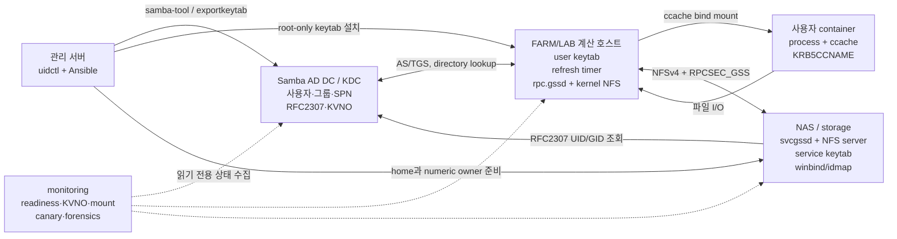
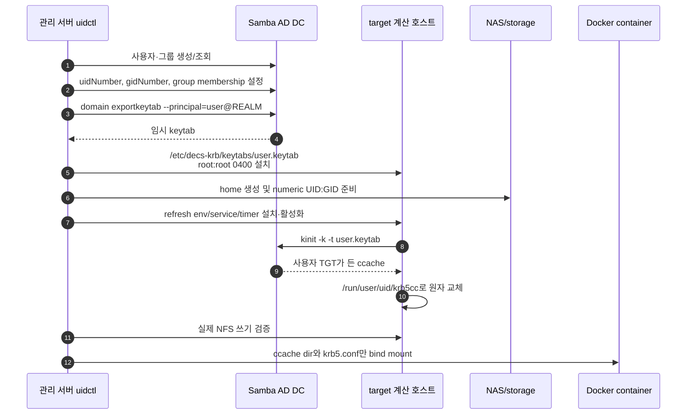
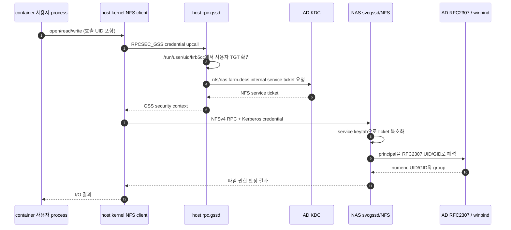

# Kerberos/NFS 설계

이 문서는 keytab이 만들어지는 시점부터 사용자가 NFS 파일을 읽고 쓰는
시점까지, 어느 서버의 어떤 객체와 프로세스가 관여하는지를 설명한다.

## 1. 설계 목표

- 비밀번호를 컨테이너에 저장하지 않고 사용자별 Kerberos 인증을 제공한다.
- DB, AD, 계산 호스트, NAS와 컨테이너가 같은 numeric UID/GID를 사용한다.
- NFS 서버는 FQDN 기반 service principal로 인증하고 client는 `sec=krb5`로
  RPCSEC_GSS context를 만든다.
- keytab 같은 장기 자격증명의 노출 범위를 host root로 제한한다.
- ticket 갱신과 컨테이너 lifecycle을 분리하여 컨테이너 재시작 중에도 credential을
  안정적으로 유지한다.
- monitoring은 drift를 관측하되 공유 NAS와 AD를 자동으로 변경하지 않는다.

## 2. 전체 구성



### 구성요소별 책임

| 위치 | 객체/프로세스 | 하는 일 |
| --- | --- | --- |
| 관리 서버 | `uidctl`, Ansible runner | 계정 생성 transaction을 조정하고 keytab을 필요한 host로 전달 |
| AD DC | 사용자·그룹 객체, `krbtgt`, KDC, `samba-tool` | principal과 RFC2307 속성 저장, keytab export, TGT/service ticket 발급 |
| 계산 호스트 | 사용자 keytab | ticket을 새로 발급할 수 있는 장기 자격증명; root만 읽음 |
| 계산 호스트 | `decs-krb-refresh@.service/.timer` | keytab으로 ccache를 만들고 갱신하여 원자적으로 교체 |
| 계산 호스트 | kernel NFS client, `rpc.gssd` | 호출 UID의 credential로 NFS RPCSEC_GSS context 생성 |
| 컨테이너 | 사용자 process, bind-mounted ccache | `KRB5CCNAME`이 가리키는 ticket을 사용하고 NFS 파일 I/O 수행 |
| NAS/storage | `svcgssd`, NFS server, service keytab | `nfs/<fqdn>@<realm>` service ticket을 수락하고 NFS 요청 처리 |
| NAS/storage | Samba/winbind/idmap | Kerberos 이름을 AD RFC2307 UID/GID로 해석하여 파일 권한 판정 |

## 3. 사용자 keytab 발급 흐름

keytab은 컨테이너 안에서 만들지 않는다. AD DC에서 export한 뒤 target 계산
호스트의 root-only 경로에 설치한다.



실제 생성 구현은 다음 순서로 동작한다.

1. DB/기존 AD/storage 값을 사용해 UID/GID를 선택한다.
2. AD user/group과 RFC2307 `uidNumber`, `gidNumber`를 보장한다.
3. AD DC에서 사용자 keytab을 임시 파일로 export하고 `0400`으로 만든다.
4. target이 다른 host이면 Ansible `fetch`와 `copy`로 root-only keytab을 옮긴다.
5. NAS/storage home을 동일 UID/GID로 준비한다.
6. target host에 ccache directory, refresh helper, service/timer를 만든다.
7. host에서 사용자 ccache를 발급하고 NFS owner와 실제 write/delete를 검증한다.
8. 검증 후에만 컨테이너와 DB record를 확정한다.

관련 코드는 [AD identity와 keytab 생성](https://github.com/CSID-DGU/admin_infra_server/blob/main/user-lifecycle/script/uid_manager/kerberos/commands.py),
[container 생성 transaction](https://github.com/CSID-DGU/admin_infra_server/blob/main/user-lifecycle/script/uid_manager/services/create_container.py),
[credential 경로 모델](https://github.com/CSID-DGU/admin_infra_server/blob/main/user-lifecycle/script/uid_manager/kerberos/paths.py)에서 확인한다.

## 4. 실제 NFS 인증 흐름

keytab 발급과 매 파일 접근의 인증은 서로 다른 흐름이다. 평상시 파일 I/O에서
컨테이너가 keytab을 직접 읽는 일은 없다.



인증 실패 위치에 따라 증상이 달라진다.

| 실패 위치 | 대표 증상 |
| --- | --- |
| 사용자 keytab/ccache | `kinit` 또는 `klist` 실패, 사용자 접근만 `Permission denied` |
| DNS/FQDN/SPN | `kvno nfs/<fqdn>` 실패, IP source mount에서 principal 불일치 |
| host machine keytab/`rpc.gssd` | 부팅 시 mount 실패, readiness의 keytab/kinit/rpc-gssd stage 실패 |
| NAS service keytab/KVNO | 여러 client가 동시에 GSS 실패, `kvno -k` 복호화 실패 |
| RFC2307/idmap | 인증은 되지만 owner가 `nobody`이거나 UID/GID가 달라 쓰기 거부 |
| NFS transport/kernel | `not responding`, D-state, mount probe timeout |

## 5. Keytab과 ccache를 분리한 이유

| 구분 | keytab | ccache |
| --- | --- | --- |
| 의미 | principal의 장기 비밀키 | 이미 발급된 TGT/service ticket 묶음 |
| 새 ticket 발급 | 가능 | 제한된 renew 기간 안에서만 가능 |
| 유출 영향 | rotation할 때까지 반복 악용 가능 | ticket lifetime/renew lifetime에 제한 |
| 저장 위치 | host root-only | `/run/user/<uid>/krb5cc`, 사용자 `0600` |
| container 전달 | 금지 | bind mount하여 전달 |

컨테이너 삭제만으로 유출된 keytab을 무효화할 수 없기 때문에 image, Docker
volume, Kubernetes Secret에 사용자 keytab을 그대로 넣지 않는다. 호스트
refresh service는 임시 ccache에서 `klist` 검증을 끝낸 뒤 소유권 `uid:gid`, mode
`0600`을 적용하고 최종 경로로 원자 교체한다.

현재 코드가 구현하는 대상은 Docker container다. Kubernetes Pod도 같은 원칙을
적용해야 하지만, Pod가 다른 node로 이동할 수 있으므로 단순 hostPath와 특정
node의 systemd timer에 의존해서는 안 된다. Pod 지원을 추가할 때는 node 배치,
credential 발급 controller/CSI, rotation과 Pod 종료 시 정리를 별도 설계해야 한다.

## 6. Ticket 갱신 설계

`decs-krb-refresh@<username>.timer`는 기본적으로 boot 2분 뒤 시작하고 사용자별
설정 주기(현재 일반적으로 1시간)마다 oneshot service를 실행한다.

```text
유효 ccache 있음
  ├─ renew deadline이 margin보다 멂 -> 임시 복사본에서 kinit -R
  └─ deadline 임박/renew 실패       -> root-only keytab으로 새 ticket 발급

발급 결과 -> klist 검증 -> uid:gid 0600 -> 최종 ccache로 atomic move
```

기본 재발급 여유는 `DECS_KRB_REISSUE_BEFORE_SECONDS=86400`(24시간)이다. 기존
ticket의 PAC/group 정보는 renew 시 유지될 수 있으므로 AD group 변경 뒤에는
keytab을 이용한 fresh login을 한 번 강제해야 한다.

## 7. NFS service identity와 KVNO

FARM NFS SPN은 Synology domain member의 machine account `NAS$`가 아니라 전용 AD
service account `svc-nfs-farm`이 소유한다.

```text
nfs/nas.farm.decs.internal@FARM.DECS.INTERNAL
nfs/NAS@FARM.DECS.INTERNAL
```

과거에는 `NAS$` machine password가 주기적으로 변경될 때 KVNO도 바뀌어 NAS의
정적 NFS keytab과 어긋날 수 있었다. 이를 service identity와 domain membership의
lifecycle 결합 문제로 보고 NFS SPN을 전용 계정으로 분리했다.

현재 `svc-nfs-farm`에는 자동 password expiration/rotation timer가 없다. 따라서
“NAS KVNO가 지금도 주기적으로 바뀐다”가 아니라 **과거 자동 변경 문제를 전용
계정으로 제거했고, 현재 KVNO는 관리자가 명시적으로 rotation할 때만 바뀐다**가
정확한 운영 모델이다. 별도 5분 checker는 변경을 만들지 않고 AD KVNO와 두 NAS
keytab의 일치만 확인한다.

NAS의 `svcgssd`는 FARM과 AILAB principal을 한 keytab에서 받아들이므로 `-p`로
FARM principal 하나만 강제하지 않는다. keytab repair 시에도 AILAB acceptor를
보존한다.

## 8. FQDN mount와 service principal

Kerberos의 NFS service identity는 host-based principal이다. FARM mount source는
다음처럼 principal의 hostname과 같아야 한다.

```text
mount source: nas.farm.decs.internal:/volume1/share
service SPN:  nfs/nas.farm.decs.internal@FARM.DECS.INTERNAL
transport:    addr=100.100.100.120
```

`100.100.100.120:/volume1/share`를 source로 쓰면 client가 IP 기반 service
identity를 찾으려 하거나 기대한 FQDN SPN과 연결하지 못할 수 있다. 반면 source를
FQDN으로 유지한 상태에서 runtime option에 `addr=100.100.100.120`이 보이는 것은
정상이다. 관리 SSH 주소 `192.168.2.30`은 NFS transport로 사용하지 않는다.

## 9. 보안 flavor와 권한 모델

- `sec=krb5`: 사용자/서비스 인증. RPC payload 무결성·암호화 wrapping 없음.
- `sec=krb5i`: 인증 + RPC payload 무결성.
- `sec=krb5p`: 인증 + 무결성 + privacy encryption.

현재 내부 FARM/LAB 기본은 `sec=krb5`다. packet capture에 payload가 포함될 수
있으므로 NFS forensics 산출물은 root-only로 보관한다.

Kerberos 인증 뒤 최종 파일 권한은 numeric UID/GID와 mode/ACL로 결정된다.
컨테이너 root가 host credential 경계를 우회하지 못하도록 Kerberos mode에서는
`DECS_USER_SUDO_MODE=restricted`를 함께 사용한다. 다만 restricted sudo는 완전한
sandbox가 아니므로 강한 격리가 필요하면 sudo와 `SYS_ADMIN`, host bind mount
범위도 별도로 줄여야 한다.

## 10. 설정과 구현 위치

| 관심사 | 기준 코드/문서 |
| --- | --- |
| FARM endpoint, SPN, mount option, NAS keytab | [FARM runbook](https://github.com/CSID-DGU/admin_infra_server/blob/main/kerberos-nfs/docs/farm.md) |
| LAB topology와 rollout gate | [LAB runbook](https://github.com/CSID-DGU/admin_infra_server/blob/main/kerberos-nfs/docs/lab.md) |
| 사용자 AD/keytab/ccache 명령 생성 | [commands.py](https://github.com/CSID-DGU/admin_infra_server/blob/main/user-lifecycle/script/uid_manager/kerberos/commands.py) |
| keytab·ccache·home 경로 | [paths.py](https://github.com/CSID-DGU/admin_infra_server/blob/main/user-lifecycle/script/uid_manager/kerberos/paths.py) |
| create-container transaction과 Docker bind | [create_container.py](https://github.com/CSID-DGU/admin_infra_server/blob/main/user-lifecycle/script/uid_manager/services/create_container.py) |
| container credential 대기와 restricted sudo | [entrypoint.sh](https://github.com/CSID-DGU/admin_infra_server/blob/main/container-images/entrypoint.sh) |
| host machine keytab/readiness/fstab | [kerberos_nfs_client_recovery.yml](https://github.com/CSID-DGU/admin_infra_server/blob/main/server-state/ansible_playbook/kerberos_nfs_client_recovery.yml) |
| NFS GSS readiness와 recovery | [cluster-monitor-exporter scripts](https://github.com/CSID-DGU/admin_infra_server/tree/main/monitoring/prometheus/exporters/cluster-monitor-exporter/script) |
| NAS service keytab drift checker | [check-nfs-keytab.sh](https://github.com/CSID-DGU/admin_infra_server/blob/main/monitoring/health-checks/kerberos-nfs-keytab/script/check-nfs-keytab.sh) |
