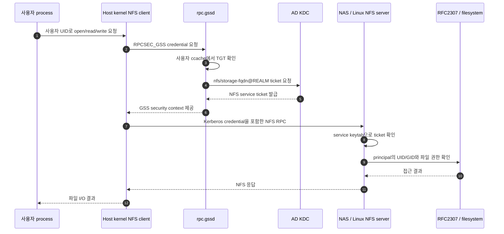

# Kerberos/NFS 설계

> [개요](index.md) · [운영](operations.md) · [디버깅 로그](debugging/index.md)

## 1. 개요

Kerberos/NFS 구성의 목표는 사용자가 자신의 Kerberos identity로 NFS service에
인증하고, AD에 기록된 UID/GID와 스토리지의 파일 권한에 따라 공유 경로를 사용하는
것이다. Kerberos는 사용자와 service의 identity를 확인하고, NFS는 인증 결과와
numeric UID/GID, mode, ACL을 함께 사용해 파일 접근 권한을 결정한다.

이 문서는 다음 내용을 설명한다.

- Kerberos 인증에 사용되는 principal, ticket, keytab과 ccache
- Kerberos ticket이 NFS의 RPCSEC_GSS 인증으로 이어지는 과정
- FARM과 LAB에 적용한 realm, NFS service principal, protocol과 mount 설정
- 사용자 credential과 NFS service keytab을 관리하는 기준
- FQDN mount source, KVNO와 `sec=krb5`를 선택한 이유

환경별 서버를 처음 구성하거나 현재 설정값을 확인할 때는 다음 가이드를 사용한다.

| 환경 | 설정 가이드 | 현재 기준 |
| --- | --- | --- |
| FARM | [FARM Kerberos 설정 가이드](farm-setup.md) | Samba AD, Synology NAS, NFSv4.0, `sec=krb5` |
| LAB | [LAB Kerberos 설정 가이드](lab-setup.md) | Samba AD, Linux storage, NFSv4.1, `sec=krb5` |

## 2. Kerberos 핵심 개념

| 용어 | 의미 | 현재 구성에서의 사용 |
| --- | --- | --- |
| Realm | 하나의 Kerberos 인증 관리 영역 | `FARM.DECS.INTERNAL`, `LAB.DECS.INTERNAL` |
| Principal | Kerberos가 식별하는 사용자 또는 service 이름 | `<username>@REALM`, `nfs/<fqdn>@REALM` |
| KDC | principal의 비밀키를 관리하고 ticket을 발급하는 서버 | FARM/LAB의 Samba AD DC가 KDC 역할을 함께 수행 |
| TGT | 사용자가 다른 service ticket을 요청할 때 사용하는 ticket | host의 사용자 ccache에 저장 |
| Service ticket | 특정 service에 접속하기 위해 KDC가 발급하는 ticket | NFS 접근 시 `nfs/<storage-fqdn>@REALM`용 ticket 발급 |
| SPN | service를 나타내는 principal 이름 | NFS server의 FQDN을 포함한 `nfs/<fqdn>` 등록 |
| Keytab | principal의 장기 비밀키를 파일로 저장한 credential | 사용자 keytab은 계산 host root가 보관하고 NFS service keytab은 storage가 보관 |
| Ccache | 발급된 TGT와 service ticket을 저장하는 credential cache | `/run/user/<uid>/krb5cc`를 사용자 process가 사용 |
| KVNO | principal 비밀키의 version 번호 | AD의 NFS SPN과 storage keytab의 key version 일치 여부 확인 |
| RPCSEC_GSS | Kerberos credential을 NFS RPC 인증에 사용하는 방식 | NFS mount의 `sec=krb5`가 GSS security context를 사용 |
| RFC2307 | AD에 Unix UID/GID를 저장하는 속성 체계 | 사용자·group을 스토리지와 container에서 같은 숫자로 표현 |

Kerberos 인증과 filesystem 권한 판정은 이어지는 두 단계다. Kerberos는 요청자가
어떤 principal인지 확인하고, NFS server는 그 principal에 대응하는 UID/GID와
파일의 owner, group, mode, ACL을 비교해 접근 결과를 결정한다.

## 3. Kerberos가 NFS 접근에 적용되는 과정

사용자 credential은 계산 host에서 준비되고, 실제 파일 접근은 host kernel NFS
client와 `rpc.gssd`가 처리한다.


```mermaid
sequenceDiagram
    autonumber
    participant U as 사용자 process
    participant K as Host kernel NFS client
    participant G as rpc.gssd
    participant KDC as AD KDC
    participant NFS as NAS / Linux NFS server
    participant ID as RFC2307 / filesystem

    U->>K: 사용자 UID로 open/read/write 요청
    K->>G: RPCSEC_GSS credential 요청
    G->>G: 사용자 ccache에서 TGT 확인
    G->>KDC: nfs/storage-fqdn@REALM ticket 요청
    KDC-->>G: NFS service ticket 발급
    G-->>K: GSS security context 제공
    K->>NFS: Kerberos credential을 포함한 NFS RPC
    NFS->>NFS: service keytab으로 ticket 확인
    NFS->>ID: principal의 UID/GID와 파일 권한 확인
    ID-->>NFS: 접근 결과
    NFS-->>K: NFS 응답
    K-->>U: 파일 I/O 결과
```

이 흐름에서 사용하는 credential은 세 종류다.

| Credential | 보관 위치 | 역할 |
| --- | --- | --- |
| 사용자 keytab | 계산 host `/etc/decs-krb/keytabs/<username>.keytab` | 사용자 TGT를 새로 발급 |
| 사용자 ccache | 계산 host `/run/user/<uid>/krb5cc` | NFS service ticket을 요청하고 사용자 process의 NFS 접근에 사용 |
| NFS service keytab | Synology NAS 또는 Linux storage | NFS server가 받은 service ticket을 확인 |

사용자 process에는 `KRB5CCNAME=FILE:/run/user/<uid>/krb5cc`를 전달한다. Host의
refresh timer가 사용자 keytab으로 ccache를 갱신하며, container는 ccache와
읽기 전용 `/etc/krb5.conf`를 사용한다.

## 4. FARM과 LAB에 적용한 설정

FARM과 LAB은 같은 credential 모델과 UID/GID 기준을 사용한다. Storage 구현과
검증된 NFS protocol version에 맞춰 realm, endpoint, service principal과 mount
option을 환경별로 관리한다.

### 4.1 공통 설정 기준

| 항목 | 설정 기준 |
| --- | --- |
| 사용자 identity | DB, AD RFC2307, NFS owner와 container에 같은 UID/GID 적용 |
| 사용자 keytab | 계산 host root 소유, mode `0400` |
| 사용자 ccache | `/run/user/<uid>/krb5cc`, 사용자 UID/GID 소유, mode `0600` |
| NFS mount source | NFS service principal과 같은 FQDN 사용 |
| NFS 인증 | 기본 `sec=krb5` |
| Client GSS | `rpc.gssd`가 호출 UID의 ccache로 GSS context 생성 |
| Storage identity | AD RFC2307 값을 winbind 또는 SSSD/idmap으로 numeric UID/GID에 연결 |

### 4.2 환경별 설정값

| 항목 | FARM | LAB |
| --- | --- | --- |
| Kerberos realm | `FARM.DECS.INTERNAL` | `LAB.DECS.INTERNAL` |
| DNS domain | `farm.decs.internal` | `lab.decs.internal` |
| AD/KDC | `dc1.farm.decs.internal` | `dc1.lab.decs.internal` |
| Storage 구현 | FARM AD에 가입한 Synology NAS | LAB AD에 가입한 Linux NFS server |
| NFS data 주소 | `100.100.100.120` | `100.100.100.100` |
| Mount source | `nas.farm.decs.internal:/volume1/share` | `lab-storage.lab.decs.internal:/294t/dcloud/share` |
| NFS version | `vers=4.0` | `vers=4.1` |
| Security flavor | `sec=krb5` | `sec=krb5` |
| NFS service principal | `nfs/nas.farm.decs.internal@FARM.DECS.INTERNAL` | `nfs/lab-storage.lab.decs.internal@LAB.DECS.INTERNAL` |
| Service keytab | `/etc/nfs/krb5.keytab` | `/etc/krb5.keytab` |
| Server GSS process | Synology `svcgssd` | Linux `rpc.svcgssd` 또는 NFS server가 관리하는 service |
| Identity 연결 | Samba winbind RFC2307 | Storage는 winbind RFC2307, 일반 client는 SSSD RFC2307 |

### 4.3 NFS version 선택

FARM의 Synology NAS는 현재 `vers=4.0,sec=krb5,hard,timeo=600,retrans=2`를 운영
기준으로 사용한다. NFSv4.1과 RPCSEC_GSS 조합에서 확인된 timeout과 access denied
결과를 반영해 NFSv4.0을 선택했다. `rsize/wsize`는 1 MiB를 요청하며 실제 연결값은
Synology와의 협상 결과에 따라 128 KiB로 표시될 수 있다.

LAB의 Linux storage는 `vers=4.1,sec=krb5`를 사용한다. Linux NFS server와 client의
session 동작을 활용하며, session slot 관련 분석은
[NFSv4.1 session slot 고착](debugging/nfs-v41-session-slot-stuck.md)에서 관리한다.

## 5. 사용자 credential 관리

### 5.1 Keytab과 ccache

| 구분 | Keytab | Ccache |
| --- | --- | --- |
| 저장 내용 | principal의 장기 비밀키 | 발급된 TGT와 service ticket |
| 용도 | 새 ticket 발급 | ticket 제시와 service ticket 요청 |
| 수명 | principal key rotation까지 유지 | ticket lifetime과 renew lifetime 적용 |
| 저장 위치 | host root-only 경로 | `/run/user/<uid>/krb5cc` |
| 사용 주체 | host credential refresh service | 사용자 process와 `rpc.gssd` |

Keytab은 새 ticket을 계속 발급할 수 있는 장기 credential이다. Host root가 keytab을
관리하고 사용자 runtime에는 수명이 제한된 ccache를 제공해 credential 노출 범위를
줄인다.

### 5.2 Ccache 갱신

`decs-krb-refresh@<username>.timer`는 사용자별 oneshot service를 주기적으로
실행한다. 현재 일반적인 갱신 주기는 1시간이다.

```text
유효 ccache 확인
  -> renew 기간이 충분하면 임시 ccache에서 kinit -R
  -> renew 기간이 짧거나 갱신이 실패하면 keytab으로 새 TGT 발급
  -> klist로 결과 확인
  -> uid:gid, mode 0600 적용
  -> /run/user/<uid>/krb5cc로 원자 교체
```

AD group이 변경된 사용자는 keytab으로 새 TGT를 발급해 최신 group 정보를 ccache에
반영한다.

## 6. NFS service identity

### 6.1 FQDN과 service principal

Kerberos NFS service는 host-based principal을 사용한다. Mount source의 hostname과
NFS service principal의 hostname을 같은 값으로 유지한다.

```text
FARM mount source: nas.farm.decs.internal:/volume1/share
FARM service SPN:  nfs/nas.farm.decs.internal@FARM.DECS.INTERNAL
FARM transport:    addr=100.100.100.120

LAB mount source:  lab-storage.lab.decs.internal:/294t/dcloud/share
LAB service SPN:   nfs/lab-storage.lab.decs.internal@LAB.DECS.INTERNAL
LAB transport:     100.100.100.100
```

FQDN은 KDC가 발급할 NFS service ticket을 결정하고 data 주소는 실제 packet 전송
경로를 결정한다. 이 구분을 통해 service identity를 유지하면서 storage network를
사용한다.

### 6.2 KVNO와 service keytab

KDC가 발급한 service ticket의 KVNO와 storage keytab에 들어 있는 NFS principal의
KVNO가 일치해야 storage가 ticket을 확인할 수 있다.

FARM은 전용 AD service account `svc-nfs-farm`에 NFS SPN을 등록한다. Synology
machine account password lifecycle과 NFS service key lifecycle을 분리해 관리자가
명시적으로 rotation할 때 KVNO를 변경한다. Synology keytab에는 FARM과 기존 AILAB
NFS principal이 함께 있으므로 rotation 과정에서 두 acceptor를 모두 유지한다.

LAB은 Linux storage computer account `LAB-STORAGE$`의 NFS SPN과
`/etc/krb5.keytab`을 사용한다. 환경별 checker는 AD의 KVNO와 storage keytab의
KVNO를 비교해 drift를 확인한다.

## 7. NFS security flavor와 권한

| Mount option | 제공하는 보호 |
| --- | --- |
| `sec=krb5` | 사용자와 NFS service 인증 |
| `sec=krb5i` | 인증과 RPC payload 무결성 |
| `sec=krb5p` | 인증, 무결성과 RPC payload 암호화 |

현재 FARM/LAB 기본값은 `sec=krb5`다. 내부 storage network에서 Kerberos identity를
확인하고 payload wrapping 비용을 줄이는 설정이다. 무결성 또는 암호화가 필요한
공유 경로는 성능을 측정한 뒤 `krb5i` 또는 `krb5p`를 선택할 수 있다.

Kerberos 인증이 완료된 뒤에는 numeric UID/GID, file mode와 ACL이 최종 권한을
결정한다. 다음 값은 한 사용자에 대해 같은 숫자를 유지한다.

```text
AD RFC2307 uidNumber/gidNumber
  = NFS storage의 파일 owner/group
  = 계산 host가 조회한 UID/GID
  = container process의 UID/GID
```

## 8. 설정 확인 위치

| 설정 | 기준 문서 또는 파일 |
| --- | --- |
| FARM canonical runbook | [kerberos-nfs/docs/farm.md](https://github.com/CSID-DGU/admin_infra_server/blob/main/kerberos-nfs/docs/farm.md) |
| LAB canonical runbook | [kerberos-nfs/docs/lab.md](https://github.com/CSID-DGU/admin_infra_server/blob/main/kerberos-nfs/docs/lab.md) |
| 계산 host mount와 readiness 설정 | [kerberos_nfs_client_recovery.yml](https://github.com/CSID-DGU/admin_infra_server/blob/main/server-state/ansible_playbook/kerberos_nfs_client_recovery.yml) |
| Monitoring 기대값 | [exporters.yml](https://github.com/CSID-DGU/admin_infra_server/blob/main/monitoring/ansible_playbook/group_vars/exporters.yml) |
