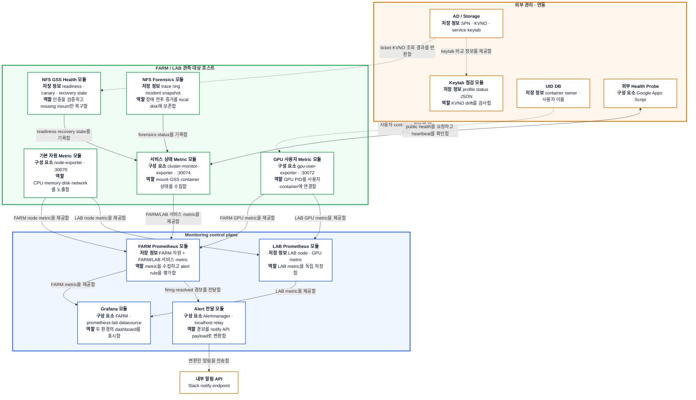
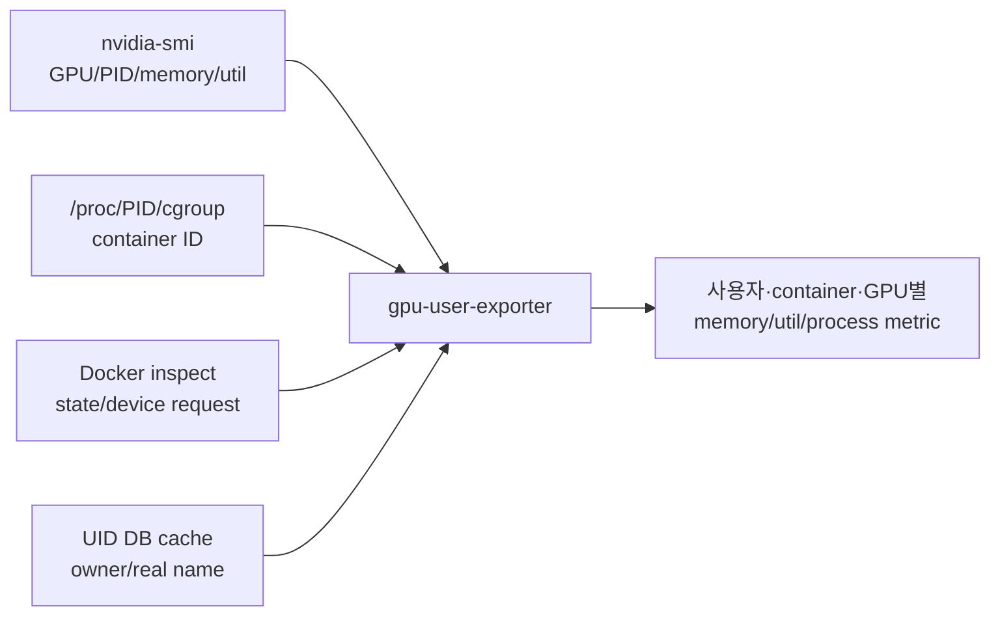

# Monitoring 설계

이 문서는 host의 원시 상태가 metric, alert와 dashboard가 되기까지의 흐름과
자동 복구의 안전 경계를 설명한다.

## 1. 설계 목표

- FARM/LAB host, GPU, container와 storage 상태를 동일한 metric 체계로 관측한다.
- HTTP process가 살아 있는지와 실제 collection이 갱신되는지를 구분한다.
- NFS `hard` mount와 D-state 상황에서도 monitoring loop 전체가 멈추지 않게 한다.
- alert에는 원인 진단에 필요한 stage와 label을 포함하되 cardinality를 제한한다.
- 관측, 증거 수집과 상태 변경을 분리하여 monitoring이 장애 반경을 넓히지 않는다.
- FARM/LAB Prometheus failure domain은 분리하고 공통 Grafana에서 함께 조회한다.

## 2. 전체 데이터와 알림 흐름

다이어그램의 **굵은 바깥 제목은 배치 영역**이고, 각 카드의 **굵은 첫 줄은
모듈 이름**이다. 카드 안의 `저장 정보 / 구성 요소`에는 명사만 적고, `역할`에는
주체가 무엇을 하는지 동사로 적었다. 화살표에는 출발 모듈이 요청하거나 제공하는
동작을 표시했으며, 점선은 외부 값을 읽기 전용으로 조회하는 흐름이다.



### 구성요소별 책임

| 배치 영역 | 모듈 | 내부 구성 요소·정보 | 역할 |
| --- | --- | --- | --- |
| FARM/LAB host | **기본 자원 Metric** | `node-exporter`, `:30070` | CPU, memory, filesystem, disk와 network metric 노출 |
| FARM/LAB host | **GPU 사용자 Metric** | `gpu-user-exporter`, `nvidia-smi`, Docker, UID DB cache | GPU process를 실제 사용자·container·GPU에 연결 |
| FARM/LAB host | **서비스 상태 Metric** | `cluster-monitor-exporter`, `:30074`, public `:N89` | mount, GSS, GPU, Docker, container, 연결성과 D-state 수집 |
| FARM/LAB host | **NFS GSS Health** | readiness, canary, guarded recovery worker와 state | 인증 stage를 검증하고 안전 조건을 통과한 missing mount만 복구 |
| FARM/LAB host | **NFS Forensics** | packet/ftrace ring, watcher, snapshot | user share를 읽거나 복구하지 않고 장애 전후 증거 보존 |
| 관리 host | **Keytab 점검** | profile checker, user systemd timer, status JSON | AD KVNO, storage keytab과 service ticket drift를 읽기 전용 검사 |
| FARM control plane | **FARM Prometheus/Alert** | Prometheus, rule, Alertmanager, relay | FARM 자원과 FARM/LAB 서비스 metric을 수집하고 중앙 경보 전달 |
| LAB control plane | **LAB Prometheus** | Prometheus, local PV, `:30073` | LAB node/GPU metric을 별도 저장; Grafana와 Alertmanager는 실행하지 않음 |
| FARM control plane | **Grafana** | FARM/LAB datasource와 dashboard | 두 Prometheus의 시계열을 공통 UI에서 조회 |

### 데이터 plane과 control plane

| 종류 | 예 | 설계 원칙 |
| --- | --- | --- |
| 관측 data plane | `/proc`, `nvidia-smi`, Docker inspect, mountinfo, state JSON | bounded timeout, read-only 우선 |
| metric plane | exporter `/metrics` → Prometheus | scrape 실패와 collection stale을 별도 표시 |
| alert plane | Prometheus rule → Alertmanager → relay | secret은 Kubernetes Secret, alert label로 credential 전달 금지 |
| visualization plane | FARM/LAB datasource → Grafana | datasource UID와 cluster label로 환경 구분 |
| 제한된 control plane | container start, SSH start, NVML repair, missing mount worker | 명시적 enable, 사전조건, retry/inhibit 필요 |

## 3. Host metric exporter 구성

### 3.1 node-exporter: 일반 host 자원

`node-exporter`는 CPU, memory, filesystem, disk I/O와 network 같은 일반 host
자원을 `:30070/metrics`로 노출한다. FARM과 LAB Prometheus가 각 환경의
node metric을 저장하며, 서비스별 진단은 `cluster-monitor-exporter`가 담당한다.
따라서 CPU 사용량이 보인다는 사실만으로 NFS readiness나 container SSH가
정상이라고 판단하지 않는다.

`node-exporter`는 host systemd 서비스로 배포하는 두 custom exporter와 달리
`kube-prometheus-stack`의 DaemonSet/service 설정으로 배포된다. 포트와 scrape
설정은 FARM/LAB Prometheus values의 `prometheus-node-exporter`에서 확인한다.

### 3.2 cluster-monitor-exporter: 서비스 상태

#### Background collection과 freshness

exporter는 HTTP 요청 때마다 무거운 host 명령을 실행하지 않고 background loop의
마지막 결과를 text format으로 제공한다. `/healthz`는 process 응답뿐 아니라
마지막 성공 collection이 `metrics_stale_after` 이내인지 확인한다.

이 구분이 필요한 이유는 HTTP server는 살아 있지만 child command나 collection
goroutine이 멈춘 상태를 `up=1`만으로는 찾을 수 없기 때문이다. 대표 지표는
`cluster_monitor_exporter_last_collection_timestamp_seconds`와
`cluster_monitor_exporter_metrics_stale_after_seconds`다.

수집/렌더링 구현은 [main.go](https://github.com/CSID-DGU/admin_infra_server/blob/main/monitoring/prometheus/exporters/cluster-monitor-exporter/cmd/cluster-monitor-exporter/main.go)에서
확인한다.

#### 관측 범위

- required mount의 source/target/filesystem/security option과 응답 시간
- storage host 및 peer 연결성, mount failure diagnosis
- 모든 thread를 포함한 host D-state process와 command별 count
- kernel hung-task 증가, NFS lease와 forensic 상태
- host `nvidia-smi`, Docker daemon
- 대상 image container의 running/SSH/GPU readiness
- NVML driver/library mismatch와 제한된 repair 결과
- 외부 connectivity heartbeat와 public inbound health
- NFS GSS readiness/canary/recovery state와 `rpc-gssd` journal

#### D-state와 명령 timeout

NFS `hard` mount에서 child process가 D-state에 들어가면 `SIGKILL`에도 즉시
끝나지 않고 `cmd.Wait()`가 무기한 block될 수 있다. exporter는 외부 명령마다
timeout을 두고 collection loop가 한 NFS probe 때문에 완전히 멈추지 않게 한다.

D-state는 발생 즉시 total과 command별 metric으로 기록하되 alert는 30분 연속
지속을 기다린다. `sshd`, `find`, `du`, `chown`, `chmod`, `codex`, `claude`,
`python`, `python3`은 0인 시계열도 유지하고, 다른 command는 실제 관측될 때만
동적으로 노출한다. hung-task alert는 과거 누적 line이 아니라 최근 5분
증가분을 사용한다.

#### 제한된 container 복구

설정으로 허용된 경우에만 다음을 수행한다.

- stopped target container 시작
- container 내부 SSH service 시작
- host driver version 검증 뒤 `libnvidia-ml.so.1` symlink repair

임의 image/container, user data, host mount를 변경하지 않는다. 복구 시도와 결과는
별도 metric으로 남겨 “정상”과 “복구되어 정상”을 구분한다.

## 4. gpu-user-exporter

`nvidia-smi`는 PID와 GPU 사용량만 제공하므로 실제 사용자와 container를 알기
위해 여러 정보를 join한다.



주요 지표:

- `docker_gpu_user_memory_used_bytes`
- `docker_gpu_user_sm_utilization_percent`
- `docker_gpu_user_process_count`
- device 전체 utilization/memory
- ignored process count
- DB cache entry/refresh success
- exporter scrape success/duration

DB에 없는 process를 임의의 사용자와 연결하지 않고 ignored count로 분리한다.
매 scrape마다 DB를 조회하지 않도록 활성 container owner를 cache하고 refresh 성공과
cache 크기를 metric으로 노출한다. 구현은
[gpu-user-exporter main.go](https://github.com/CSID-DGU/admin_infra_server/blob/main/monitoring/prometheus/exporters/gpu-user-exporter/main.go)에 있다.

## 5. NFS GSS readiness, canary와 recovery

### Readiness

부팅 시 NFS mount가 Kerberos host identity보다 먼저 실행되는 race를 막기 위해
다음 stage를 순서대로 확인한다.

```text
host keytab -> machine kinit -> NFS service kvno
-> rpc_pipefs -> rpc-gssd -> (환경별 canary)
```

각 stage와 diagnosis는 state file에 기록되고 exporter가 metric으로 변환한다.
구현은 [readiness script](https://github.com/CSID-DGU/admin_infra_server/blob/main/monitoring/prometheus/exporters/cluster-monitor-exporter/script/decs_nfs_gss_ready.sh)와
[NFS GSS collector](https://github.com/CSID-DGU/admin_infra_server/blob/main/monitoring/prometheus/exporters/cluster-monitor-exporter/cmd/cluster-monitor-exporter/nfs_gss_health.go)에 있다.

### Canary

canary는 실제 user share가 아니라 전용 read-only export에서 service path를
확인한다. LAB은 canary를 사용하며 FARM은 전용 export가 준비되기 전까지 canary
gate만 비활성화하고 나머지 readiness를 유지한다.

### Guarded missing-mount recovery

exporter는 recovery state를 관측하고 loopback API로 worker를 queue할 수 있지만
실제 `mount`는 별도 systemd service가 수행한다. worker gate는 다음과 같다.

1. 기대 source/filesystem/security로 이미 mount되어 있으면 즉시 healthy로 종료한다.
2. mount가 없을 때만 fstab 기대 entry를 확인한다.
3. NFS/RPC D-state가 있으면 새 mount 시도를 보류한다.
4. DNS와 storage RPC를 확인한다.
5. Kerberos readiness를 확인한다.
6. 환경에서 요구하는 canary를 확인한다.
7. retry/backoff/inhibit가 허용할 때만 `mount <target>`을 실행한다.

healthy mount를 unmount/remount하지 않으며, mount timeout이나 관련 D-state가
생기면 현재 boot에서 반복 시도를 inhibit할 수 있다. 구현은
[mount recovery script](https://github.com/CSID-DGU/admin_infra_server/blob/main/monitoring/prometheus/exporters/cluster-monitor-exporter/script/decs_nfs_gss_mount_recovery.sh)에 있다.

## 6. NFS forensics

NFS 장애는 재시작 후 증거가 사라질 수 있으므로 recovery와 독립된 passive
forensics를 둔다.

- TCP/2049 packet의 크기 제한 ring
- 저용량 ftrace instance
- 5초 간격 kernel/NFS/D-state 상태 관측
- incident threshold에서 pre-incident ring을 local snapshot으로 보존
- PID와 process start time을 함께 사용해 PID 재사용으로 duration이 이어지지 않게 함

forensics는 mount/unmount, user share 읽기, NFS/GSS restart, recovery, reboot를
하지 않는다. exporter는 `/run/decs-nfs-forensics/status.json`만 읽는다.
`sec=krb5`는 payload privacy를 제공하지 않으므로 capture와 incident directory는
root-only다.

구현은 [trace buffer](https://github.com/CSID-DGU/admin_infra_server/blob/main/monitoring/nfs-forensics/bin/decs_nfs_trace_buffer.sh),
[watcher](https://github.com/CSID-DGU/admin_infra_server/blob/main/monitoring/nfs-forensics/bin/decs_nfs_forensics_watch.sh),
[snapshot](https://github.com/CSID-DGU/admin_infra_server/blob/main/monitoring/nfs-forensics/bin/decs_nfs_forensics_snapshot.sh),
[metric adapter](https://github.com/CSID-DGU/admin_infra_server/blob/main/monitoring/prometheus/exporters/cluster-monitor-exporter/cmd/cluster-monitor-exporter/nfs_forensics.go)에서 확인한다.

## 7. Keytab health check

AD/NAS service keytab은 exporter의 자동 복구 대상이 아니다. 별도 user systemd
timer가 profile별 checker를 실행한다.

```text
AD KVNO + required SPN
  vs storage keytab KVNO/principal
  + 실제 service ticket 복호화
  + GSS service process/forbidden option
  -> profile status JSON
```

exit code는 정상 `0`, 점검 오류 `1`, drift `2`다. keytab이나 credential 원문은
status에 기록하지 않는다. 코드는
[check-nfs-keytab.sh](https://github.com/CSID-DGU/admin_infra_server/blob/main/monitoring/health-checks/kerberos-nfs-keytab/script/check-nfs-keytab.sh)에 있다.

## 8. Prometheus, Alertmanager와 Grafana

### Cluster 분리

- FARM: `kube-prometheus-stack`, Prometheus/Grafana local PV, 공통 Grafana 제공
- LAB: LAB8 control plane의 독립 Prometheus, NodePort `30073`
- Grafana: LAB datasource UID `prometheus-lab`으로 LAB dashboard 조회

retention, storage, target, Alertmanager routing과 control-plane failure domain이
다르므로 Prometheus release와 values를 분리한다. dashboard는 운영자가 한 UI에서
비교하므로 공통 디렉터리에 둔다.

### Alert delivery

Prometheus rule은 Alertmanager로 전달되고, Alertmanager는 localhost relay
sidecar에 native payload를 보낸다. relay가 내부 notify API contract로 변환하여
`/api/internal/slack/notify`로 전달한다. Grafana password와 Slack webhook은
values가 아니라 Kubernetes Secret으로 관리한다.

canonical FARM rule과 routing은
[prometheus-farm-values.yaml](https://github.com/CSID-DGU/admin_infra_server/blob/main/monitoring/prometheus/config/prometheus-farm-values.yaml),
relay 구현은 [Alertmanager relay ConfigMap](https://github.com/CSID-DGU/admin_infra_server/blob/main/monitoring/prometheus/config/alertmanager-slack-notify-relay-configmap.yaml)에서 확인한다.

## 9. 설정과 코드 위치

| 관심사 | 기준 파일 |
| --- | --- |
| exporter 공통 기본값, FQDN mount/SPN, GSS/forensics option | [group_vars/exporters.yml](https://github.com/CSID-DGU/admin_infra_server/blob/main/monitoring/ansible_playbook/group_vars/exporters.yml) |
| exporter build/install/systemd config | [deploy_exporters.yml](https://github.com/CSID-DGU/admin_infra_server/blob/main/monitoring/ansible_playbook/deploy_exporters.yml) |
| GSS readiness/canary/recovery 설치 | [deploy_nfs_gss_health.yml](https://github.com/CSID-DGU/admin_infra_server/blob/main/monitoring/ansible_playbook/deploy_nfs_gss_health.yml) |
| forensics 설치 | [deploy_nfs_forensics.yml](https://github.com/CSID-DGU/admin_infra_server/blob/main/monitoring/ansible_playbook/deploy_nfs_forensics.yml) |
| FARM Prometheus/Alertmanager rules | [prometheus-farm-values.yaml](https://github.com/CSID-DGU/admin_infra_server/blob/main/monitoring/prometheus/config/prometheus-farm-values.yaml) |
| LAB Prometheus values | [prometheus-lab-values.yaml](https://github.com/CSID-DGU/admin_infra_server/blob/main/monitoring/prometheus/config/prometheus-lab-values.yaml) |
| GPU/NIC/storage dashboards | [grafana/dashboards](https://github.com/CSID-DGU/admin_infra_server/tree/main/monitoring/grafana/dashboards) |

## 10. 설계 변경 시 확인할 항목

- 새 metric의 이름, type, help, label cardinality와 실패 시 값
- command timeout과 NFS D-state에서 collection loop가 유지되는지
- alert `for` 시간이 일시적 부팅/배포 지연보다 충분히 긴지
- recovery의 enable flag, precondition, retry/backoff, inhibit와 audit metric
- user data를 읽지 않는 canary/probe 경로
- FARM/LAB datasource, job, label과 dashboard query의 일치
- credential, webhook, DB password가 Git/metric/label/log에 노출되지 않는지
