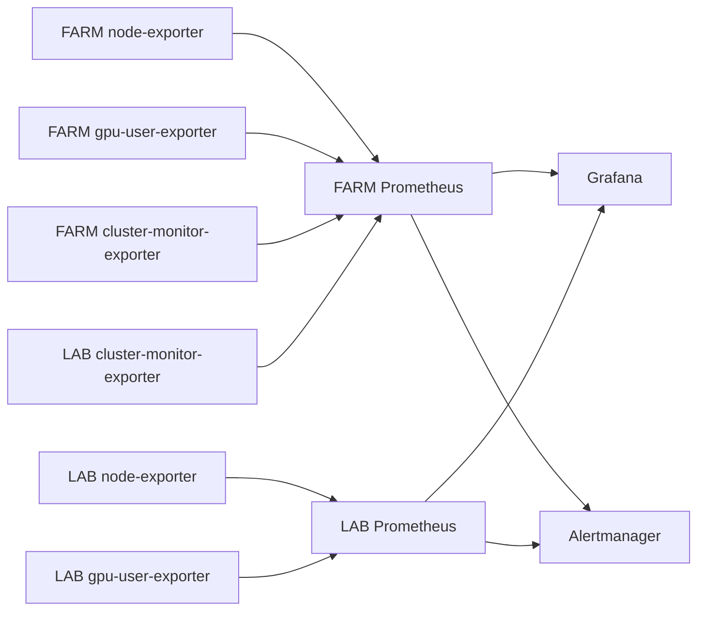

# monitoring 설계

> [개요](index.md) · [운영](operations.md)

> **GitHub 코드 링크:** `admin_infra_server`는 비공개 저장소다. 링크를 누르면
> GitHub 로그인 화면을 거쳐 해당 파일로 이동한다. 조직 저장소에 접근 권한이
> 있는 계정으로 로그인해야 한다.

## 1. 개요

`monitoring`의 목표는 FARM/LAB 서버와 주요 service의 현재 상태와 변화 추이를
지속적으로 관측하고, 운영자가 dashboard와 alert를 통해 이상 상태를 확인할 수
있게 하는 것이다. 관측 범위에는 CPU, memory, filesystem, network, GPU,
container, Docker와 외부 연결 상태가 포함된다.

서버에서는 상태를 수집해 Prometheus metric으로 제공한다. Prometheus는 metric을
주기적으로 저장하고 alert rule을 평가하며, Grafana는 저장된 시계열을 dashboard로
표시한다.

## 2. 설계 구조

monitoring은 서버에서 상태를 만드는 구성요소와 metric을 저장·조회·전달하는
control plane으로 구성된다.

| 구분 | 구성요소 | 구현 형태 | 역할 |
| --- | --- | --- | --- |
| 서버 자원 수집 | `node-exporter` | Prometheus 기본 exporter | CPU, memory, filesystem, disk와 network 상태를 metric으로 제공한다. |
| GPU 사용량 수집 | `gpu-user-exporter` | 커스텀 Go exporter | GPU process를 container와 사용자 정보에 연결한다. |
| 운영 상태 수집 | `cluster-monitor-exporter` | 커스텀 Go exporter | Docker, container, GPU와 연결 상태를 수집한다. |
| Metric 저장·평가 | FARM/LAB Prometheus | `kube-prometheus-stack` | 환경별 metric을 저장하고 alert rule을 평가한다. |
| 시각화 | Grafana | `kube-prometheus-stack` | 두 Prometheus의 시계열을 하나의 dashboard 환경에서 표시한다. |
| Alert 처리 | Alertmanager | `kube-prometheus-stack` | 두 Prometheus가 생성한 alert를 한곳에서 묶고 routing한다. |

구성요소 사이의 주요 데이터 흐름은 다음과 같다.


```mermaid
flowchart LR
    NODE_F["FARM node-exporter"] --> PF["FARM Prometheus"]
    NODE_L["LAB node-exporter"] --> PL["LAB Prometheus"]
    GPU_F["FARM gpu-user-exporter"] --> PF
    GPU_L["LAB gpu-user-exporter"] --> PL
    CM_F["FARM cluster-monitor-exporter"] --> PF
    CM_L["LAB cluster-monitor-exporter"] --> PF
    PF --> GRAFANA["Grafana"]
    PL --> GRAFANA
    PF --> ALERT["Alertmanager"]
    PL --> ALERT
```

FARM Prometheus는 FARM 서버의 자원·GPU metric과 FARM/LAB 전체의
`cluster-monitor-exporter` metric을 수집한다. 공통 service alert rule은 FARM
Prometheus가 평가하고 Alertmanager로 전달한다.

LAB Prometheus는 LAB 서버의 node·GPU metric을 별도로 저장한다. 현재 LAB
node·GPU metric은 Grafana 조회에 사용되고, LAB의
Docker·container 같은 운영 상태 경보는 FARM Prometheus가
LAB `cluster-monitor-exporter`를 수집해 처리한다. Grafana는 두 Prometheus를
datasource로 사용하며, 두 Prometheus는 같은 Alertmanager로 alert를 보낸다.
Grafana와 Alertmanager는 각각 하나의 인스턴스로 운영한다.

## 3. 서버 metric 수집

### 3.1 `node-exporter`

**구현 형태:** Prometheus 커뮤니티에서 제공하는 기본
[`node_exporter`](https://github.com/prometheus/node_exporter)다.
`kube-prometheus-stack`의 `prometheus-node-exporter` chart가 FARM/LAB node에
DaemonSet으로 배포한다. 이 저장소는 exporter 구현 코드 대신 환경별 port,
collector와 scrape 설정을 관리한다.

**역할:** 운영체제와 hardware의 기본 자원 사용량을 제공한다.

**입력:** Linux kernel이 제공하는 `/proc`, `/sys`, filesystem과 network interface
정보를 읽는다.

**처리:** upstream `node-exporter` collector가 CPU, memory, load, filesystem,
disk I/O와 network 통계를 Prometheus 형식으로 변환한다. FARM과 LAB의
`kube-prometheus-stack`이 DaemonSet으로 각 node에 배포한다.

**출력:** 각 서버의 `:30070/metrics`에서 `node_cpu_*`, `node_memory_*`,
`node_filesystem_*`, `node_disk_*`, `node_network_*` metric을 제공한다.

**주요 설정:** service port, collector option과 Prometheus 연결은 FARM/LAB
Prometheus values의 `prometheus-node-exporter` 항목에서 관리한다.

관련 코드:
[`prometheus-farm-values.yaml`](https://github.com/login?return_to=%2FCSID-DGU%2Fadmin_infra_server%2Fblob%2Fmain%2Fmonitoring%2Fprometheus%2Fconfig%2Fprometheus-farm-values.yaml),
[`prometheus-lab-values.yaml`](https://github.com/login?return_to=%2FCSID-DGU%2Fadmin_infra_server%2Fblob%2Fmain%2Fmonitoring%2Fprometheus%2Fconfig%2Fprometheus-lab-values.yaml)

### 3.2 `gpu-user-exporter`

**구현 형태:** GPU process, Docker container와 UID DB 사용자 정보를 연결하기
위해 만든 커스텀 Go exporter다. Prometheus Go client의 custom collector를
구현해 scrape 요청마다 GPU·container·사용자 정보를 수집하고 metric을 생성한다.

**역할:** 서버의 GPU 사용량을 실제 사용자와 container 단위로 제공한다.

**입력:** `nvidia-smi`의 GPU·PID·memory·utilization, `/proc/<pid>/cgroup`의
container ID, Docker inspect 결과와 UID DB의 container 사용자 정보를 사용한다.

**처리:** GPU process의 PID를 container에 연결하고, container record에서 사용자
정보를 조회한 뒤 GPU별 사용량을 집계한다. 실행 중인 DB 등록 container는 현재
GPU process가 없는 경우에도 값이 0인 시계열을 유지한다. 사용자 정보를 찾을 수
있는 process와 별도 관리가 필요한 process는 metric에서 구분한다.

**출력:** `:30072/metrics`와 `:30072/-/healthy`를 제공한다. 대표 metric은 다음과
같다.

- `docker_gpu_user_memory_used_bytes`
- `docker_gpu_user_sm_utilization_percent`
- `docker_gpu_user_process_count`
- `docker_gpu_device_utilization_percent`
- `docker_gpu_exporter_ignored_process_count`

**주요 설정:** server ID, DB 접속값, DB cache refresh 주기, command timeout,
`nvidia-smi` 경로와 `/proc` 경로를 systemd 환경 파일로 전달한다. exporter는 host
PID와 Docker 정보를 읽을 수 있는 권한으로 실행된다.

관련 코드:
[`main.go`](https://github.com/login?return_to=%2FCSID-DGU%2Fadmin_infra_server%2Fblob%2Fmain%2Fmonitoring%2Fprometheus%2Fexporters%2Fgpu-user-exporter%2Fmain.go),
[`gpu-user-exporter README`](https://github.com/login?return_to=%2FCSID-DGU%2Fadmin_infra_server%2Fblob%2Fmain%2Fmonitoring%2Fprometheus%2Fexporters%2Fgpu-user-exporter%2FREADME.md),
[`deploy_exporters.yml`](https://github.com/login?return_to=%2FCSID-DGU%2Fadmin_infra_server%2Fblob%2Fmain%2Fmonitoring%2Fansible_playbook%2Fdeploy_exporters.yml)

#### Go 코드 구조

`gpu-user-exporter`의 Go 구현은 `main.go`에 있다. 먼저 전체 실행 흐름을 확인한 뒤
아래 코드 표를 따라가면, 한 번의 scrape가 원천 데이터를 수집하고 사용자별
metric을 만드는 과정을 파악할 수 있다.

```text
main -> config·DB·registry 초기화
     -> Prometheus scrape
     -> gpuUserCollector.Collect
     -> DB cache 갱신 + GPU/process/Docker 수집
     -> PID를 container와 사용자에 연결
     -> 사용자·container·GPU 단위 집계
     -> Prometheus metric 출력
```

실행 흐름의 각 단계는 다음 코드가 담당한다.

| 코드 | 역할 |
| --- | --- |
| [`main`](https://github.com/login?return_to=%2FCSID-DGU%2Fadmin_infra_server%2Fblob%2Fmain%2Fmonitoring%2Fprometheus%2Fexporters%2Fgpu-user-exporter%2Fmain.go%23L142-L179) | DB 연결, Prometheus registry, custom collector와 HTTP endpoint를 초기화한다. |
| [`config`](https://github.com/login?return_to=%2FCSID-DGU%2Fadmin_infra_server%2Fblob%2Fmain%2Fmonitoring%2Fprometheus%2Fexporters%2Fgpu-user-exporter%2Fmain.go%23L28-L39), [`loadConfig`, `resolveDSN`](https://github.com/login?return_to=%2FCSID-DGU%2Fadmin_infra_server%2Fblob%2Fmain%2Fmonitoring%2Fprometheus%2Fexporters%2Fgpu-user-exporter%2Fmain.go%23L181-L250) | 실행 option과 환경 변수를 읽고 server ID에 맞는 DB 연결 정보를 만든다. |
| [`gpuUserCollector`](https://github.com/login?return_to=%2FCSID-DGU%2Fadmin_infra_server%2Fblob%2Fmain%2Fmonitoring%2Fprometheus%2Fexporters%2Fgpu-user-exporter%2Fmain.go%23L121-L138), [`newGPUUserCollector`](https://github.com/login?return_to=%2FCSID-DGU%2Fadmin_infra_server%2Fblob%2Fmain%2Fmonitoring%2Fprometheus%2Fexporters%2Fgpu-user-exporter%2Fmain.go%23L252-L336) | 설정과 DB cache를 보관하고 exporter가 제공할 metric을 정의한다. |
| [`Collect`](https://github.com/login?return_to=%2FCSID-DGU%2Fadmin_infra_server%2Fblob%2Fmain%2Fmonitoring%2Fprometheus%2Fexporters%2Fgpu-user-exporter%2Fmain.go%23L354-L468) | 한 번의 scrape에서 GPU, process, container와 사용자 정보를 결합해 metric을 출력한다. |
| [`ownerCache`](https://github.com/login?return_to=%2FCSID-DGU%2Fadmin_infra_server%2Fblob%2Fmain%2Fmonitoring%2Fprometheus%2Fexporters%2Fgpu-user-exporter%2Fmain.go%23L50-L59)와 [`refreshIfNeeded`](https://github.com/login?return_to=%2FCSID-DGU%2Fadmin_infra_server%2Fblob%2Fmain%2Fmonitoring%2Fprometheus%2Fexporters%2Fgpu-user-exporter%2Fmain.go%23L610-L680) | UID DB의 active container 정보를 일정 시간 cache하고 container ID 조회를 제공한다. |
| [`collectGPUInfo`, `collectGPUProcesses`, `collectPmon`](https://github.com/login?return_to=%2FCSID-DGU%2Fadmin_infra_server%2Fblob%2Fmain%2Fmonitoring%2Fprometheus%2Fexporters%2Fgpu-user-exporter%2Fmain.go%23L700-L790) | `nvidia-smi` 출력을 GPU·process·utilization 구조체로 변환한다. |
| [`containerIDFromPID`](https://github.com/login?return_to=%2FCSID-DGU%2Fadmin_infra_server%2Fblob%2Fmain%2Fmonitoring%2Fprometheus%2Fexporters%2Fgpu-user-exporter%2Fmain.go%23L805-L816) | `/proc/<pid>/cgroup`에서 GPU process가 속한 container ID를 찾는다. |
| [`runningContainerZeroKeys`, `collectRunningDockerContainers`](https://github.com/login?return_to=%2FCSID-DGU%2Fadmin_infra_server%2Fblob%2Fmain%2Fmonitoring%2Fprometheus%2Fexporters%2Fgpu-user-exporter%2Fmain.go%23L470-L539) | 실행 중인 container와 GPU 할당을 확인해 GPU process가 없는 사용자 container에도 값이 0인 시계열을 만든다. |

### 3.3 `cluster-monitor-exporter`

**구현 형태:** FARM/LAB 서버의 운영 상태와 환경별 진단 항목을 수집하기 위해 만든
커스텀 Go exporter다. background collection, metric rendering과 HTTP endpoint를
직접 구현한다.

**역할:** 기본 자원 metric만으로 판단하기 어려운 서버와 service의 운영 상태를
수집한다.

**입력:** process·kernel 상태, `nvidia-smi`, Docker와 container 상태, systemd
service와 외부 연결 상태를 읽는다.

**처리:** background collection loop가 각 점검을 실행해 마지막 결과를 memory에
보관한다. HTTP 요청은 이 결과를 Prometheus 형식으로 출력한다. 외부 명령에는
timeout을 적용하며, 마지막 수집 시각과 허용된 stale 시간을 함께 기록한다.

주요 관측 항목은 다음과 같다.

- host GPU와 Docker daemon 상태
- 대상 container의 실행, SSH와 GPU 상태
- 외부 network 연결 상태

**출력:** `:30074/metrics`, `:30074/healthz`와 서버별 public `:N89/healthz`를
제공한다. `/healthz`는 HTTP process 응답과 최근 collection freshness를 함께
확인한다.

**제한된 복구:** 설정으로 활성화한 경우 대상 container 시작, container SSH
service 시작과 NVML driver/library symlink 복구를 수행한다. 복구 시도와 결과는
metric으로 기록한다.

**주요 설정:** 수집 주기, stale 기준, command timeout, 대상 container image
pattern, public health port와 복구 기능 활성화 여부를
`/etc/default/cluster-monitor-exporter`에서 관리한다.

관련 코드:
[`main.go`](https://github.com/login?return_to=%2FCSID-DGU%2Fadmin_infra_server%2Fblob%2Fmain%2Fmonitoring%2Fprometheus%2Fexporters%2Fcluster-monitor-exporter%2Fcmd%2Fcluster-monitor-exporter%2Fmain.go),
[`환경 설정 예시`](https://github.com/login?return_to=%2FCSID-DGU%2Fadmin_infra_server%2Fblob%2Fmain%2Fmonitoring%2Fprometheus%2Fexporters%2Fcluster-monitor-exporter%2Fconfig%2Fcluster_monitor_exporter.example.env),
[`cluster-monitor-exporter README`](https://github.com/login?return_to=%2FCSID-DGU%2Fadmin_infra_server%2Fblob%2Fmain%2Fmonitoring%2Fprometheus%2Fexporters%2Fcluster-monitor-exporter%2FREADME.md)

#### Go 코드 구조

`cluster-monitor-exporter`는 `main`이 설정과 HTTP server를 준비하고, background
loop가 영역별 점검 결과를 metric text로 만든 뒤 HTTP handler가 마지막 결과를
제공한다.

```text
main -> Config 로딩·검증
     -> Collector.run background loop
     -> collect가 영역별 collector 호출
     -> renderer가 Prometheus text 생성
     -> Collector가 마지막 결과와 수집 시각 보관
     -> /metrics와 /healthz가 저장된 결과 제공
```

실행 흐름의 각 단계는 다음 코드가 담당한다.

| 파일·코드 | 역할 |
| --- | --- |
| [`main`](https://github.com/login?return_to=%2FCSID-DGU%2Fadmin_infra_server%2Fblob%2Fmain%2Fmonitoring%2Fprometheus%2Fexporters%2Fcluster-monitor-exporter%2Fcmd%2Fcluster-monitor-exporter%2Fmain.go%23L134-L211) | `Collector`, background goroutine, metric·health endpoint와 public health HTTP server를 시작한다. |
| [`Config`, `loadConfig`](https://github.com/login?return_to=%2FCSID-DGU%2Fadmin_infra_server%2Fblob%2Fmain%2Fmonitoring%2Fprometheus%2Fexporters%2Fcluster-monitor-exporter%2Fcmd%2Fcluster-monitor-exporter%2Fmain.go%23L31-L325) | 환경 파일과 환경 변수를 읽고 수집 주기, timeout, endpoint와 기능별 설정을 구성한다. |
| [`Collector.run`, `collectOnce`](https://github.com/login?return_to=%2FCSID-DGU%2Fadmin_infra_server%2Fblob%2Fmain%2Fmonitoring%2Fprometheus%2Fexporters%2Fcluster-monitor-exporter%2Fcmd%2Fcluster-monitor-exporter%2Fmain.go%23L451-L474) | 설정된 주기로 전체 수집을 실행하고 완성된 metric text와 수집 시각을 교체한다. |
| [`Collector.collect`](https://github.com/login?return_to=%2FCSID-DGU%2Fadmin_infra_server%2Fblob%2Fmain%2Fmonitoring%2Fprometheus%2Fexporters%2Fcluster-monitor-exporter%2Fcmd%2Fcluster-monitor-exporter%2Fmain.go%23L541-L581) | 영역별 collector를 순서대로 호출하고 한 번의 수집 결과를 만든다. |
| [`collectHostGPU`부터 `collectContainers`](https://github.com/login?return_to=%2FCSID-DGU%2Fadmin_infra_server%2Fblob%2Fmain%2Fmonitoring%2Fprometheus%2Fexporters%2Fcluster-monitor-exporter%2Fcmd%2Fcluster-monitor-exporter%2Fmain.go%23L1117-L1296) | host 명령과 Docker 상태를 읽고 GPU, Docker와 container metric을 생성한다. |
| [`renderer`](https://github.com/login?return_to=%2FCSID-DGU%2Fadmin_infra_server%2Fblob%2Fmain%2Fmonitoring%2Fprometheus%2Fexporters%2Fcluster-monitor-exporter%2Fcmd%2Fcluster-monitor-exporter%2Fmain.go%23L1558-L1617) | metric help, type, label과 값을 Prometheus text format으로 직렬화한다. |
| [`handleMetrics`, `handleHealthz`, `collectionHealth`](https://github.com/login?return_to=%2FCSID-DGU%2Fadmin_infra_server%2Fblob%2Fmain%2Fmonitoring%2Fprometheus%2Fexporters%2Fcluster-monitor-exporter%2Fcmd%2Fcluster-monitor-exporter%2Fmain.go%23L476-L539) | 마지막 수집 결과를 `/metrics`로 제공하고 수집 시각을 기준으로 health 상태를 응답한다. |

#### Collection freshness

`up`은 Prometheus가 exporter의 HTTP endpoint에 접속했는지를 나타낸다. 실제
점검 loop의 진행 상태는
`cluster_monitor_exporter_last_collection_timestamp_seconds`와
`cluster_monitor_exporter_metrics_stale_after_seconds`를 함께 사용해 판단한다.
이 구조를 통해 HTTP listener와 background collection의 상태를 각각 확인할 수
있다.

#### Container alert 조건

container GPU 상태는 container 실행 상태와 함께 평가한다. 정지한 container는
`running=0`, `gpu_up=0`으로 기록되고 stopped alert의 대상이 된다. 실행 중인
container에서 GPU 점검이 실패한 경우에만 GPU alert가 발생한다.

```promql
cluster_monitor_container_gpu_up{job="cluster-monitor-exporter"} == 0
and on (instance, server, container, image)
cluster_monitor_container_running{job="cluster-monitor-exporter"} == 1
```

`instance`, `server`, `container`, `image` label을 함께 사용해 같은 서버와 같은
container의 시계열을 결합한다.

## 4. Metric 저장, 시각화와 alert

### 4.1 Prometheus

**역할:** exporter metric을 주기적으로 수집해 시계열로 저장하고 alert rule을
평가한다.

**FARM 구성:** FARM node·GPU metric과 FARM/LAB 전체
`cluster-monitor-exporter` metric을 수집한다. 공통 service alert rule을 평가하고
Prometheus data를 FARM local PV에 저장한다.

**LAB 구성:** LAB node·GPU metric을 별도 Prometheus에 저장한다. LAB control
plane과 storage가 FARM과 분리되어 있다. LAB node·GPU metric은 Grafana가 LAB
datasource를 통해 조회하며, LAB Prometheus가 생성한 alert는 공용 Alertmanager로
전달한다.

Grafana와 Alertmanager는 FARM control plane에 각각 하나만 배포한다. FARM
Prometheus는 cluster 내부 Service를 사용하고, LAB Prometheus는 Alertmanager의
NodePort endpoint를 사용한다.

**주요 설정:** scrape target, label, retention, storage, alert rule과 Helm release
설정은 환경별 values에서 관리한다. FARM values가 운영 alert rule의 기준 파일이다.

관련 코드:
[`prometheus-farm-values.yaml`](https://github.com/login?return_to=%2FCSID-DGU%2Fadmin_infra_server%2Fblob%2Fmain%2Fmonitoring%2Fprometheus%2Fconfig%2Fprometheus-farm-values.yaml),
[`prometheus-lab-values.yaml`](https://github.com/login?return_to=%2FCSID-DGU%2Fadmin_infra_server%2Fblob%2Fmain%2Fmonitoring%2Fprometheus%2Fconfig%2Fprometheus-lab-values.yaml),
[`deploy_prometheus.yml`](https://github.com/login?return_to=%2FCSID-DGU%2Fadmin_infra_server%2Fblob%2Fmain%2Fmonitoring%2Fansible_playbook%2Fdeploy_prometheus.yml)

### 4.2 Alertmanager

**역할:** FARM/LAB Prometheus가 생성한 alert를 한곳에서 받아 label과 상태를
기준으로 묶고 receiver로 routing한다.

**입력:** 두 Prometheus가 alert rule을 평가해 만든 firing·resolved alert와 각
alert의 label·annotation을 사용한다.

**처리:** 같은 alert를 group label에 따라 묶고 route의 matcher에 맞는 receiver를
선택한다. 상태가 resolved로 바뀌면 같은 alert group의 해제 상태도 처리한다.

**출력:** receiver별로 정리된 alert와 현재 firing·resolved 상태를 제공한다.

**주요 설정:** 공용 Alertmanager의 route, receiver, NodePort와 Secret 연결은 FARM
Prometheus values에서 관리한다. LAB Prometheus의 공용 Alertmanager endpoint는 LAB
Prometheus values에서 관리한다.

관련 코드:
[`Alertmanager 설정`](https://github.com/login?return_to=%2FCSID-DGU%2Fadmin_infra_server%2Fblob%2Fmain%2Fmonitoring%2Fprometheus%2Fconfig%2Fprometheus-farm-values.yaml),
[`LAB Prometheus 연결 설정`](https://github.com/login?return_to=%2FCSID-DGU%2Fadmin_infra_server%2Fblob%2Fmain%2Fmonitoring%2Fprometheus%2Fconfig%2Fprometheus-lab-values.yaml)

### 4.3 Grafana

**역할:** FARM과 LAB의 시계열을 서버, GPU와 network 관점의 dashboard로
제공한다.

**입력:** 기본 FARM datasource와 UID가 `prometheus-lab`인 LAB datasource를
사용한다.

**처리:** dashboard query가 datasource, cluster, server, instance, GPU와 network
interface label을 기준으로 시계열을 선택하고 비교한다.

**출력:** GPU usage와 network traffic dashboard를 제공한다.
Grafana service는 NodePort `30080`을 사용한다.

**주요 설정:** datasource와 dashboard ConfigMap은 `monitoring/grafana/`에서,
Grafana service·persistence·Secret 연결은 FARM Prometheus values에서 관리한다.

관련 코드:
[`Grafana dashboards`](https://github.com/login?return_to=%2FCSID-DGU%2Fadmin_infra_server%2Ftree%2Fmain%2Fmonitoring%2Fgrafana%2Fdashboards),
[`LAB datasource`](https://github.com/login?return_to=%2FCSID-DGU%2Fadmin_infra_server%2Fblob%2Fmain%2Fmonitoring%2Fgrafana%2Fdatasources%2Flab-prometheus-datasource-values.yaml),
[`Grafana PV`](https://github.com/login?return_to=%2FCSID-DGU%2Fadmin_infra_server%2Fblob%2Fmain%2Fmonitoring%2Fprometheus%2Fconfig%2Fgrafana-pv.yaml)

## 5. 배포와 설정 구조

| 위치 | 역할 |
| --- | --- |
| `monitoring/ansible_playbook/inventory.ini` | FARM/LAB 배포 대상과 SSH 접속 정보 |
| `monitoring/ansible_playbook/group_vars/exporters.yml` | 두 custom exporter의 공통·서버별 설정 |
| `monitoring/ansible_playbook/deploy_exporters.yml` | 두 custom exporter build·설치·검증 |
| `monitoring/ansible_playbook/deploy_prometheus.yml` | FARM/LAB monitoring stack 검증·배포 |
| `monitoring/prometheus/config/` | Prometheus, Alertmanager, PV와 storage 설정 |
| `monitoring/grafana/` | datasource와 dashboard 원본 |

Ansible은 Go exporter binary를 build하고 서버별 환경 파일과 systemd unit을
설치한다. Prometheus 배포는 대상 Kubernetes context, node 상태, PV와 Secret을
확인한 뒤 환경별 Helm values를 적용한다. 구체적인 변경·배포·점검 절차는
[운영 문서](operations.md)에서 설명한다.

## 6. 주요 설계 기준

### 6.1 HTTP 응답과 collection 상태 분리

`cluster-monitor-exporter`는 background loop의 결과를 endpoint에서 제공한다.
Prometheus의 `up`, exporter의 마지막 collection 시각과 stale 기준을 함께 사용해
HTTP listener와 실제 점검 진행 상태를 각각 확인한다.

### 6.2 Alert label과 secret 관리

alert는 `instance`, `server`, `container`, `image`, `cluster`처럼 진단에 필요한
label을 사용한다. credential과 password는 Kubernetes Secret과 systemd 환경
파일에서 제공하며 metric과 alert payload에는 상태와 식별 정보만 기록한다.
