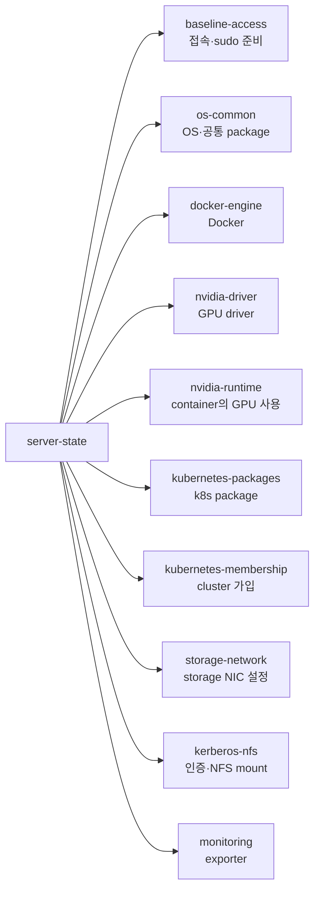

# server-state 설계

> [개요](index.md) · [운영](operations.md)

> **GitHub 코드 링크:** `admin_infra_server`는 비공개 저장소다. 링크를 누르면
> GitHub 로그인 화면을 거쳐 해당 파일로 이동한다. 조직 저장소에 접근 권한이
> 있는 계정으로 로그인해야 한다.

## 1. 개요

FARM/LAB GPU 서버 16대는 모두 같은 방식으로 설정되어 있어야 한다 — 같은
버전의 Docker, 같은 NVIDIA driver, 같은 Kubernetes package를 쓰는 식이다.
서버가 16대나 되면 사람이 하나하나 SSH로 들어가 확인하는 방법으로는 어떤
서버가 기준에서 벗어났는지 놓치기 쉽다. `server-state`는 이 확인·교정 작업을
표준화된 명령으로 대신해 주는 CLI다.

`server-state`가 다루는 점검 항목은 10가지이고, 이걸 **구성요소(component)**
라고 부른다. 구성요소 하나는 "무엇을 확인하고, 틀렸으면 어떻게 고칠지"를
하나로 묶은 단위다. 예를 들어 `docker-engine`이라는 구성요소는 Docker가
설치돼 있는지, service가 켜져 있는지, cgroup driver 설정이 맞는지를
확인하고, 틀렸으면 고치는 방법까지 함께 갖고 있다.

10개 구성요소는 다음과 같다.



각 구성요소가 정확히 무엇을 확인하고 고치는지는 4절에서 하나씩 설명한다.

10개 구성요소를 어떤 순서로 실행할지는 **정책(policy)**이라는 파일 하나가
정해 놓는다(실제 파일은 2절에서 보여준다). `server-state`는 이미 운영 중인
서버가 기준에서 벗어났는지 점검·교정하는 데도, 새 서버를 처음부터 같은
기준으로 구성하는 데도 쓸 수 있다 — 두 경우 모두 정책이 정한 같은 순서를
그대로 따른다.

## 2. 설계 구조

예를 들어 관리자가 `server-state audit --hosts farm8 --component docker-engine`을
실행하면, `server-state`는 "farm8의 docker-engine 상태를 점검하라"는 요청을 실제
Ansible 명령으로 바꿔서 실행한다. 이 과정에서 다음 순서로 필요한 정보를 찾는다.

1. `--hosts farm8` — 이 이름이 등록된 서버인지 `user-lifecycle/server_info/servers.jsonl`과
   `ansible/inventory.ini`에서 찾는다. 두 파일에 서버를 등록하는 절차와, 하나라도
   빠졌을 때 무슨 일이 생기는지는 [4.1 `baseline-access`](#comp-baseline-access)에서
   설명한다.
2. `--component docker-engine` — 10개 구성요소 중 어떤 걸 실행할지 고른다.
   구성요소 목록과 실행 순서는 `policy/standard-gpu-server.yml` 파일 하나가
   정해 놓는다. 이 파일을 **정책(policy)**이라고 부른다.
3. 고른 구성요소가 정확히 무엇을 확인하고 어떻게 고치는지는
   `components/docker-engine.yml`에 적혀 있다. 이런 파일을 **구성요소 정의**라고
   부르며, 점검(audit) 방법과 설정(converge) 방법이 한 파일 안에 함께 들어 있다.
4. farm8이 FARM 서버라는 것과 FARM에서 공통으로 쓰는 값(Kerberos realm, storage
   서버 주소 등)은 `config/environments.yml`에서 가져온다.
5. 실제로 이 서버에 어떻게 접속할지(주소, port, 어떤 계정으로)는
   `ansible/inventory.ini`와 관리자 개인의 `~/.ansible.cfg`가 정한다.
   [Ansible 설정](../ansible/config.md) 참고.
6. 여기까지 모은 정보로 `server_state/` 안의 코드가 실제 Ansible 명령 한 줄을
   조립하고, `ansible/roles/`에 있는 실제 점검·설정 작업을 실행한다.

Ansible 자체의 개념(playbook, role, tag, become 등)은 여기서 다시 설명하지
않는다. [Ansible 기초 개념](../ansible/basic.md) 참고.

이 파일들이 저장소 안 어디에 있는지는 다음과 같다. 번호는 위 1~6번 단계와 같다.

```
~/
├── admin_infra_server/
│    ├── user-lifecycle/server_info/servers.jsonl   — 1. 서버 등록 여부, 서버 식별 정보
│    ├── server-state/
│    │    ├── policy/standard-gpu-server.yml        — 2. 구성요소 목록과 실행 순서 (정책)
│    │    ├── components/docker-engine.yml 등       — 3. 구성요소별 점검·설정 방법 (구성요소 정의)
│    │    ├── config/environments.yml               — 4. FARM/LAB별 공통 설정값
│    │    ├── ansible/vars/defaults.yml              — driver 버전, k8s 버전, RX queue 크기 같은 실제 값 (4절 참고)
│    │    ├── server_state/                         — 6. 위 정보를 모아 Ansible 명령을 만드는 코드
│    │    ├── ansible/roles/, ansible/playbooks/    — 6. 실제 점검·설정 작업
│    │    └── bin/server-state                      — describe·audit·plan·apply 실행 파일
│    │
│    └── ansible/inventory.ini                     — 5. 접속 주소·port
│
└── .ansible.cfg                                   — 5. 접속 계정 (관리자 개인 파일, GitHub에 없음)
```

관리자가 실행하는 명령은 `describe`, `audit`, `plan`, `apply` 네 가지이며,
각각 무엇을 하는지는 3절에서 설명한다. 네 명령 모두 위 순서를 그대로 따르고,
명령별로 달라지는 부분만 다르다.

## 3. 명령과 구성요소 설명

먼저 큰 그림을 본다.

**구성요소(component)**는 1절에서 본 것처럼 "무엇을 확인하고, 틀렸으면
어떻게 고칠지"를 하나로 묶은 단위다(예: `docker-engine`). 구성요소 하나는
정의 파일 하나(`components/<id>.yml`)로 기술된다.

**정책(policy)**은 이 10개 구성요소를 어떤 순서로 다룰지 정한 목록 파일
**하나**다. 정책과 구성요소는 다른 것이다 — 정책은 "무엇을 어떤 순서로"를
정하는 목록이고, 구성요소는 그 목록의 항목 각각이다.

구성요소 정의 파일 하나에는 다음 네 항목이 들어 있다.

- **정상 상태** — 이 구성요소가 만족해야 할 목표
- **점검(audit)** — 지금 정상 상태인지 확인하는 방법(읽기만 하고 바꾸지 않는다)
- **설정(converge)** — 정상 상태로 만드는 방법(실제로 서버를 바꾼다)
- **설정 실행** — 그 설정을 누가, 어떤 승인을 거쳐 실행할지의 조건

이 넷은 순서대로 실행되는 목록이 아니라, **정상 상태 하나를 기준으로
나머지 셋이 갈라지는 관계**다.


점검과 설정은 둘 다 정상 상태를 기준으로 한다 — 점검은 "지금 이 목표대로인가?"만
확인하고, 설정은 실제로 목표대로 만든다. 설정 실행은 그중 "설정"에만 붙는
조건이다.

명령(`describe`/`audit`/`plan`/`apply`)은 이 네 항목을 실제로 다루는
도구다. 각 명령이 정확히 어디를 건드리는지는 다음과 같다.

| 명령 | 다루는 항목 | 하는 일 |
| --- | --- | --- |
| `describe` | 네 항목 전부 | 정의된 내용을 그대로 보여준다. 서버는 건드리지 않는다 |
| `audit` | 점검 | 대상 서버가 정상 상태인지 실제로 확인한다 |
| `plan` | 설정 | 적용하면 무엇이 바뀔지 미리 보여준다. 실제로 바꾸지 않는다 |
| `apply` | 설정(설정 실행 조건을 통과해야 함) | 실제로 서버를 정상 상태로 만든다 |

즉 "구성요소를 점검한다"는 `audit`이 하는 일이고, "구성요소를 고친다"는
`plan`으로 미리 보고 `apply`로 실행하는 일이다.

아래 3.1~3.6은 이 내용을 실제 명령·예시와 함께 하나씩 자세히 본다. 10개
구성요소 각각의 자세한 내용은 4절에 있다.

| 절 | 다루는 내용 |
| --- | --- |
| [3.1 실행 예시](#sec-3-1) | 명령 한 줄이 실제로 어떻게 생겼는지 |
| [3.2 구성요소 설명](#sec-3-2) | 정상 상태·점검·설정·설정 실행(실행 형태·안전 수준)을 자세히 |
| [3.3 `describe`](#sec-3-3) | 서버에 접속하지 않고 구성요소 정의 내용만 보기 |
| [3.4 `audit`](#sec-3-4) | 서버를 점검만 하기(읽기 전용) |
| [3.5 `plan`](#sec-3-5) | 실제로 바꾸기 전에 무엇이 바뀔지 미리 보기 |
| [3.6 `apply`](#section-apply) | 실제로 서버 상태를 바꾸기 |

### 3.1 실행 예시 <a id="sec-3-1"></a>

`server-state`가 실제로 어떻게 쓰이는지 명령 한 줄로 먼저 본다.

```bash
./server-state/bin/server-state audit --hosts <서버 이름> --component <구성요소 id>
# 예: baseline-access만 점검
./server-state/bin/server-state audit --hosts farm8 --component baseline-access
```

`--hosts`는 대상 서버, `--component`는 1절에서 본 10개 구성요소 중 어떤 걸
볼지 고른다. 이 예시는 점검(`audit`)만 하며 서버를 바꾸지 않는다 — 실제로
서버를 고치는 방법은 3.6절(`apply`)과 4절의 각 구성요소 설명에 있다.

명령의 전체 옵션과 출력 읽는 법, 실제 서버에 적용하는 순서는 [운영
문서](operations.md)에 있다.

### 3.2 구성요소를 설명하는 네 항목 <a id="sec-3-2"></a>

4절에서 10개 구성요소를 하나씩 설명할 때, 각 구성요소는 아래 네 항목으로
설명된다.

| 항목 | 의미 |
| --- | --- |
| <a id="def-desired-state"></a>정상 상태 | 이 구성요소가 "문제 없음"으로 판정하는 서버 상태(목표) |
| <a id="def-audit"></a>점검 (`audit`) | 정상 상태 충족 여부를 확인하는 방법. 서버 상태를 읽기만 하고 아무것도 변경하지 않는다. |
| <a id="def-converge"></a>설정 (`converge`) | 서버를 정상 상태로 만드는 방법. 서버를 실제로 바꿔서 정상 상태로 만든다. |
| <a id="def-execution"></a>설정 실행 | 이 구성요소의 설정 작업을 누가 실행하는지([실행 형태](#def-exec-form))와, 실행 전에 어떤 확인·승인이 필요한지([안전 수준](#def-safety-level)) |

이 네 값은 실제로 `components/<id>.yml` 파일 하나에 그대로 적혀 있다(파일
예시는 5.1절, `describe` 명령으로 원문을 보는 방법은 3.3절).

Ansible의 `playbook`, `tag`, `become` 같은 개념은 여기서 다시 설명하지 않는다.
[Ansible 기초 개념](../ansible/basic.md) 참고.

**실행 형태**는 설정 작업을 누가 수행하는지를 나타낸다.

| 실행 형태 | 동작 |
| --- | --- |
| <a id="def-exec-form"></a>`ansible-playbook` | Ansible playbook이 자동으로 설정을 바꾼다. 관리자는 결과만 확인하면 된다. |
| `manual` | 아무것도 자동으로 바뀌지 않는다. 관리자가 직접 수행할 절차를 CLI가 화면에 안내한다. |

**안전 수준**은 그 설정 작업이 서버에서 실제로 무엇을 건드리는지에 따라
나뉜다. 설정을 적용하면 보통 관련 service가 재시작되고(그 순간 그
service를 쓰던 작업이 잠깐 끊길 수 있다), driver 교체 같은 경우에는
서버 자체를 한동안 사용하지 못하게 될 수도 있다(GPU 작업이 끊기거나 reboot가
필요할 수 있다). 안전 수준은 이 정도에 따라 실행 전에 무엇을 확인해야
하는지를 정한다.

| 안전 수준 | 실행 전에 확인할 것 | `apply` 실행 조건 |
| --- | --- | --- |
| <a id="def-safety-level"></a>`safe` | 없음 — service 재시작이 없거나, 재시작돼도 문제가 없는 변경 | 별도 확인 없이 바로 실행할 수 있다 |
| `gated` | **운영 영향**: 이 변경으로 재시작되는 service를 지금 쓰고 있는 작업이 있는지 | 관리자 승인이 있어야 실행된다 |
| `risky` | **작업 영향**: 지금 이 서버의 GPU를 쓰고 있는 작업이 있는지, **운영 일정**: 지금이 reboot나 장시간 중단을 해도 되는 시점인지(사용자 공지, 점검 시간 여부) | `gated`보다 더 신중한 관리자 승인이 있어야 실행된다 |

이 확인이 실제 명령에서 정확히 어떤 flag로 요구되는지는
[3.6절(`apply`)](#section-apply)에서 설명한다.

이제 4개 명령(`describe`/`audit`/`plan`/`apply`)을 실제 명령·출력과 함께 하나씩 본다. 모든 출력은 공통으로
`대상 [구성요소]: 상태` 한 줄과, 그 아래 세부 값으로 되어 있다 — "대상"과
"상태"가 명령마다 무엇을 가리키는지가 다르므로 그 차이를 중심으로 본다.

### 3.3 `describe` <a id="sec-3-3"></a>

`describe`는 유일하게 **서버에 접속하지 않는** 명령이다. 정책·구성요소
정의 파일에 이미 적혀 있는 내용만 읽어서 보여준다 — 그래서 대상 서버를
고르는 `--hosts`가 아예 없다(붙이면 오류가 난다). `--component`로 구성요소를
고르고, 생략하면 정책에 포함된 전체 구성요소를 보여준다.

```bash
./server-state/bin/server-state describe --component baseline-access
```

```
standard-gpu-server [baseline-access]: OK
  desired_state: The host is registered, reachable through Ansible, and usable with non-interactive sudo under the expected hostname.
  audit: ansible-playbook
  converge: manual
  safety: gated
```

이 명령에는 서버가 없으므로 첫 줄의 "대상" 자리에는 정책 ID(`standard-gpu-server`)가,
"구성요소" 자리에는 `--component`로 고른 값(`baseline-access`)이 온다.
`desired_state`/`audit`/`converge`/`safety`는 3.2절에서 본 네 항목의 값
그대로다. 서버에 접속하지 않으니 결과는 `OK` 하나뿐이고(정의를 읽어서
보여줄 뿐 실패할 일이 없다), 언제 실행해도 같은 값이 나온다.

### 3.4 `audit` <a id="sec-3-4"></a>

`audit`은 3.1에서 본 명령 그대로다 — `--hosts`로 지정한 서버에 실제로
접속해서 구성요소의 읽기 전용 점검 playbook을 실행하고, "상태"를 `OK`
또는 `FAILED`로 보여준다(3.3의 정책 ID 자리에는 이번엔 실제 서버 이름이
온다). 실패하면 `detail`에 Ansible이 출력한 오류 내용이 그대로 붙는다.

서버에 접속하기 전에 어떤 Ansible 명령이 만들어지는지만 미리 보고 싶으면
`--show-command`를 붙인다 — 이러면 실제로는 접속하지 않는다.

```bash
./server-state/bin/server-state audit --hosts farm8 --component baseline-access --show-command
```

```
farm8 [baseline-access]: COMMAND
  operation: audit
  safety: safe
  detail: ANSIBLE_ROLES_PATH=... ansible-playbook .../server-state/ansible/playbooks/audit.yml --limit farm8 --tags baseline-access -e '{"server_state_domain": "FARM", "server_state_kerberos_machine_principal": "FARM8$@FARM.DECS.INTERNAL", ...}'
```

상태가 `COMMAND`로 바뀌고, `detail`에 2절에서 본 것처럼 조립된
`ansible-playbook` 명령 한 줄이 그대로 나온다.

### 3.5 `plan` <a id="sec-3-5"></a>

`plan`은 `audit`과 같은 방식으로 서버에 접속하지만, 점검이 아니라 **설정을
적용하면 무엇이 바뀔지**를 Ansible `--check --diff`로 미리 보여준다(실제로
바꾸지는 않는다). `--show-command`도 `audit`과 똑같이 쓸 수 있다.

`ansible-playbook` 구성요소(예: `docker-engine`)는 이렇게 보인다.

```bash
./server-state/bin/server-state plan --hosts farm8 --component docker-engine --show-command
```

```
farm8 [docker-engine]: COMMAND
  operation: plan
  safety: gated
  detail: ANSIBLE_ROLES_PATH=... ansible-playbook .../server-state/ansible/playbooks/converge.yml --limit farm8 --tags docker-engine,cgroups --check --diff -e '{"server_state_domain": "FARM", ...}'
```

`manual` 구성요소(예: `baseline-access`)는 애초에 Ansible 명령이 없으므로
"상태"가 `COMMAND` 대신 `MANUAL`로 나오고, `detail`에는 명령 대신 관리자가
볼 절차 문서 경로가 나온다.

### 3.6 `apply` <a id="section-apply"></a>

`apply`도 서버에 접속해서 실제로 설정을 바꾸는 명령이지만, 접속하기 **전에**
실행 형태·안전 수준(3.2절)부터 확인한다. `manual` 구성요소는 실행하지
않고 `plan`처럼 절차 문서 경로만 보여준다. `ansible-playbook` 구성요소는
`--execute`가 있어야 하고, 안전 수준이 `gated`면 `--approve-gated`를,
`risky`면 `--approve-risky`를 `--execute`에 추가로 붙여야 한다.

필요한 승인 flag가 빠지면 "상태"가 `BLOCKED`로 나온다 — 이때는 서버에
접속하기도 전에 여기서 멈추고, **같이 실행하려던 다른 구성요소도 전부
같이 막힌다.** `docker-engine`은 안전 수준이 `gated`이므로, `--execute`만
주고 `--approve-gated`를 빠뜨리면 이렇게 막힌다.

```bash
./server-state/bin/server-state apply --hosts farm8 --component docker-engine --execute
```

```
farm8 [docker-engine]: BLOCKED
  operation: apply
  safety: gated
  detail: requires --approve-gated
```

`--approve-gated`를 추가하면 그제서야 실제로 Ansible이 실행되고, 성공하면
`BLOCKED` 대신 `OK`로 표시된다.

## 4. 구성요소

[`standard-gpu-server.yml`](https://github.com/login?return_to=%2FCSID-DGU%2Fadmin_infra_server%2Fblob%2Fmain%2Fserver-state%2Fpolicy%2Fstandard-gpu-server.yml%23L1-L14)은
10개 구성요소의 실행 순서를 정의한다. 각 구성요소를 설명하는 네 항목의 뜻은
3.2절에 있다. 구성요소 하나만 골라 점검해 보려면 3.1절의 예시처럼
`--component`에 아래 제목의 코드(예: `baseline-access`)를 그대로 넣으면 된다.

### 4.1 `baseline-access` <a id="comp-baseline-access"></a>

다른 9개 구성요소는 서버에 설치된 package나 설정값을 점검한다. `baseline-access`는
그 앞 단계로, **`server-state`가 이 서버를 대상으로 잡아 접속할 수 있는지**를
점검한다. 나머지 구성요소는 이 점검을 통과한 서버에서만 실행할 수 있다.

**[정상 상태](#def-desired-state):** 서버가 아래 두 파일에 등록되어 있고, 등록된 SSH 주소·port로
접속되며, 등록된 hostname이 실제 hostname과 같고, 비밀번호 없이 sudo를 쓸 수
있다.

| 파일 | 담는 값 | 실제로 읽는 곳 |
| --- | --- | --- |
| `user-lifecycle/server_info/servers.jsonl` | host 이름, server ID, domain, SSH 주소·port, network 정보 | `server_state/inventory.py`가 읽어서 Kerberos principal, storage NIC 이름 같은 구성요소별 값을 계산한다 |
| `ansible/inventory.ini` | Ansible이 접속할 host 이름과 SSH 주소·port | Ansible 실행 시 자동으로 읽힌다 |

두 파일에 서버가 등록되어 있지 않으면 `--hosts`가 그 이름을 찾지 못해 audit
자체가 시작되지 않는다. 즉 "등록되어 있는지"는 아래 audit이 직접 확인하는
항목이 아니라 그 전에 필요한 조건이고, audit은 등록된 값으로 실제 접속·권한이
되는지를 확인한다.

`servers.jsonl`은 한 서버당 한 줄의 JSON이다. `server-state`가 쓰는 필드만
줄이면 다음과 같은 모습이다.

```json
{"host": "farm8", "server_id": "FARM8", "domain": "FARM",
 "inventory": {"group": "FARM", "ansible_host": "192.168.2.18", "ansible_port": 8088}}
```

`inventory.ini`에는 같은 서버가 host 이름과 접속 주소로 등록된다. 두 파일 모두
접속 계정(`ansible_user`)은 적지 않는다 — 계정은 관리자마다 자신의
`~/.ansible.cfg`가 정한다.

```ini
[FARM]
farm8 ansible_host=192.168.2.18 ansible_port=8088
```

**[점검](#def-audit):** 등록된 값으로 다음 세 가지를 순서대로 확인한다.

1. Ansible ping — 등록된 주소·port로 접속이 되는가
2. `sudo -n true` 실행 — 비밀번호 없이 sudo가 되는가
3. 실제 서버의 hostname과 inventory의 host 이름이 같은가

**[설정](#def-converge):** 관리자가 서버의 IP·hostname을 확인하고 SSH key와 sudo 권한을 준비한
뒤 위 두 파일에 서버를 등록한다. `server-state`가 자동으로 등록하지 않는다.
절차는 [운영 문서](operations.md)의 "2. 신규 서버 추가"를 참고한다.

비대화형 sudo는 **명령을 실행하는 관리자 각자의 계정**에 필요하다. 다른 관리자에게
설정되어 있어도 본인 계정에 없으면 위 2번 점검에서 막힌다. 준비 절차는
[Ansible 설정](../ansible/config.md)에 있다.

**[설정 실행](#def-execution):** 실행 형태 `manual`, 안전 수준 `gated`. 관리자가 준비 절차를 수행한다. 이 구성요소는 이후 Ansible 작업을 실행하기 위한 선행 조건이다.

관련 코드: [`baseline-access.yml`](https://github.com/login?return_to=%2FCSID-DGU%2Fadmin_infra_server%2Fblob%2Fmain%2Fserver-state%2Fcomponents%2Fbaseline-access.yml),
[`baseline_access/tasks/audit.yml`](https://github.com/login?return_to=%2FCSID-DGU%2Fadmin_infra_server%2Fblob%2Fmain%2Fserver-state%2Fansible%2Froles%2Fbaseline_access%2Ftasks%2Faudit.yml)

### 4.2 `os-common` <a id="comp-os-common"></a>

**[정상 상태](#def-desired-state):** Ubuntu 최소 버전(22.04)은 `policy`나
별도 설정 파일이 아니라 `os_common/tasks/audit.yml`에 직접 적힌 하한선이다
— 22.04보다 낮으면 실패하고, 그 이상은 전부 통과한다. 이 하한을 만족하면서
다른 구성요소에 필요한 공통 package 12개가 모두 설치되어 있어야 한다:
`apt-transport-https`, `ca-certificates`, `cifs-utils`, `curl`, `adcli`,
`ethtool`, `gnupg`, `keyutils`, `krb5-user`, `nfs-common`, `python3`,
`software-properties-common`.

**[점검](#def-audit):** OS 종류와 version이 22.04 이상인지 확인하고, package facts에서
위 12개 package가 모두 설치돼 있는지 하나씩 확인한다.

**[설정](#def-converge):** apt cache를 갱신하고 공통 package 목록을 설치한다.

**[설정 실행](#def-execution):** 실행 형태 `ansible-playbook`, 안전 수준 `safe`.

관련 코드: [`os-common.yml`](https://github.com/login?return_to=%2FCSID-DGU%2Fadmin_infra_server%2Fblob%2Fmain%2Fserver-state%2Fcomponents%2Fos-common.yml),
[`os_common/tasks/audit.yml`](https://github.com/login?return_to=%2FCSID-DGU%2Fadmin_infra_server%2Fblob%2Fmain%2Fserver-state%2Fansible%2Froles%2Fos_common%2Ftasks%2Faudit.yml),
[`os_common/tasks/main.yml`](https://github.com/login?return_to=%2FCSID-DGU%2Fadmin_infra_server%2Fblob%2Fmain%2Fserver-state%2Fansible%2Froles%2Fos_common%2Ftasks%2Fmain.yml)

### 4.3 `docker-engine` <a id="comp-docker-engine"></a>

**[정상 상태](#def-desired-state):** Docker Engine package가 설치되고 service가 활성화·실행되며,
daemon이 응답하고 `systemd` cgroup driver를 사용한다. `/etc/docker/daemon.json`은
아래 네 값을 반드시 포함해야 한다(기존에 다른 값이 있으면 그건 그대로 두고
이 네 값만 병합한다).

```json
{
  "exec-opts": ["native.cgroupdriver=systemd"],
  "log-driver": "json-file",
  "log-opts": {"max-size": "100m"},
  "storage-driver": "overlay2"
}
```

**[점검](#def-audit):** Docker service의 enabled·active 상태, `docker info` 응답과 cgroup
driver 값을 확인한다.

**[설정](#def-converge):** Docker apt key와 repository를 등록하고 Engine package를 설치한다.
기존 `daemon.json`에 필요한 값을 병합하고 변경된 경우 Docker service를
재시작한다.

**[설정 실행](#def-execution):** 실행 형태 `ansible-playbook`, 안전 수준 `gated`. package
source와 daemon 설정이 변경되고 service가 재시작될 수 있어 운영 영향 확인이
필요하다.

관련 코드: [`docker-engine.yml`](https://github.com/login?return_to=%2FCSID-DGU%2Fadmin_infra_server%2Fblob%2Fmain%2Fserver-state%2Fcomponents%2Fdocker-engine.yml),
[`docker_engine/tasks/audit.yml`](https://github.com/login?return_to=%2FCSID-DGU%2Fadmin_infra_server%2Fblob%2Fmain%2Fserver-state%2Fansible%2Froles%2Fdocker_engine%2Ftasks%2Faudit.yml),
[`docker_engine/tasks/main.yml`](https://github.com/login?return_to=%2FCSID-DGU%2Fadmin_infra_server%2Fblob%2Fmain%2Fserver-state%2Fansible%2Froles%2Fdocker_engine%2Ftasks%2Fmain.yml)

### 4.4 `nvidia-driver` <a id="comp-nvidia-driver"></a>

**[정상 상태](#def-desired-state):** 설치할 driver package는
`policy/standard-gpu-server.yml`이 아니라 `server-state/ansible/vars/defaults.yml`의
`server_state_nvidia_driver_package` 값 하나가 정한다(현재 값:
`nvidia-driver-580`) — 버전을 올리려면 이 한 줄만 바꾸면 된다. 정상
상태는 이 package가 설치되고 GPU를 정상 인식하며, apt hold 상태로 유지되는
것이다.

**[점검](#def-audit):** `nvidia-smi`로 GPU 이름과 driver version을 읽는다. package
hold 확인은 `apt-mark showhold`에서 `nvidia-driver-`로 시작하는 package가
있는지만 보고, 정확히 지정된 버전(`nvidia-driver-580`)인지까지는 확인하지
않는다.

**[설정](#def-converge):** `server_state_nvidia_driver_package`에 지정된 driver package를
설치하고 apt hold를 설정한다.

**[설정 실행](#def-execution):** 실행 형태 `ansible-playbook`, 안전 수준 `risky`. driver 변경은
GPU workload와 reboot 일정에 영향을 줄 수 있어 작업 영향과 운영 일정을
확인해야 한다.

관련 코드: [`nvidia-driver.yml`](https://github.com/login?return_to=%2FCSID-DGU%2Fadmin_infra_server%2Fblob%2Fmain%2Fserver-state%2Fcomponents%2Fnvidia-driver.yml),
[`nvidia_driver/tasks/audit.yml`](https://github.com/login?return_to=%2FCSID-DGU%2Fadmin_infra_server%2Fblob%2Fmain%2Fserver-state%2Fansible%2Froles%2Fnvidia_driver%2Ftasks%2Faudit.yml),
[`nvidia_driver/tasks/main.yml`](https://github.com/login?return_to=%2FCSID-DGU%2Fadmin_infra_server%2Fblob%2Fmain%2Fserver-state%2Fansible%2Froles%2Fnvidia_driver%2Ftasks%2Fmain.yml)

### 4.5 `nvidia-runtime` <a id="comp-nvidia-runtime"></a>

**[정상 상태](#def-desired-state):** NVIDIA Container Toolkit이 설치되고 Docker와 containerd가
NVIDIA runtime을 사용할 수 있다.

**[점검](#def-audit):** `nvidia-ctk` 설치, Docker runtime 목록과 containerd 설정의 NVIDIA
runtime 항목을 확인한다.

**[설정](#def-converge):** NVIDIA repository와 toolkit package를 설치하고 `nvidia-ctk runtime
configure`를 Docker와 containerd에 실행한다. 설정 변경 후 관련 service를
재시작한다.

**[설정 실행](#def-execution):** 실행 형태 `ansible-playbook`, 안전 수준 `gated`. container
runtime 설정이 변경되고 관련 service가 재시작될 수 있어 운영 영향 확인이
필요하다.

관련 코드: [`nvidia-runtime.yml`](https://github.com/login?return_to=%2FCSID-DGU%2Fadmin_infra_server%2Fblob%2Fmain%2Fserver-state%2Fcomponents%2Fnvidia-runtime.yml),
[`nvidia_runtime/tasks/audit.yml`](https://github.com/login?return_to=%2FCSID-DGU%2Fadmin_infra_server%2Fblob%2Fmain%2Fserver-state%2Fansible%2Froles%2Fnvidia_runtime%2Ftasks%2Faudit.yml),
[`nvidia_runtime/tasks/main.yml`](https://github.com/login?return_to=%2FCSID-DGU%2Fadmin_infra_server%2Fblob%2Fmain%2Fserver-state%2Fansible%2Froles%2Fnvidia_runtime%2Ftasks%2Fmain.yml)

### 4.6 `kubernetes-packages` <a id="comp-kubernetes-packages"></a>

**[정상 상태](#def-desired-state):** 설치할 Kubernetes version은
`server-state/ansible/vars/defaults.yml`의 `server_state_kubernetes_minor`
값이 정하는 apt repository에서 온다(현재 값: `v1.36`). 정상 상태는
`kubeadm`, `kubelet`, `kubectl` package가 이 repository에서 설치·hold되고
kubelet service가 활성화되어 있는 것이다.

**[점검](#def-audit):** 세 package가 설치돼 있는지와 kubelet enabled 상태만 확인한다.
설치된 버전이 `server_state_kubernetes_minor`와 실제로 같은지는 확인하지
않는다 — package가 있고 kubelet이 켜져 있으면 통과한다.

**[설정](#def-converge):** `server_state_kubernetes_minor` 버전의 Kubernetes apt key와
repository를 등록하고 세 package를 설치·hold한 뒤 kubelet을 활성화한다.

**[설정 실행](#def-execution):** 실행 형태 `ansible-playbook`, 안전 수준 `gated`. Kubernetes
package version이 바뀌고 kubelet에 영향을 줄 수 있어 운영 영향 확인이
필요하다.

관련 코드: [`kubernetes-packages.yml`](https://github.com/login?return_to=%2FCSID-DGU%2Fadmin_infra_server%2Fblob%2Fmain%2Fserver-state%2Fcomponents%2Fkubernetes-packages.yml),
[`kubernetes_packages/tasks/audit.yml`](https://github.com/login?return_to=%2FCSID-DGU%2Fadmin_infra_server%2Fblob%2Fmain%2Fserver-state%2Fansible%2Froles%2Fkubernetes_packages%2Ftasks%2Faudit.yml),
[`kubernetes_packages/tasks/main.yml`](https://github.com/login?return_to=%2FCSID-DGU%2Fadmin_infra_server%2Fblob%2Fmain%2Fserver-state%2Fansible%2Froles%2Fkubernetes_packages%2Ftasks%2Fmain.yml)

### 4.7 `kubernetes-membership` <a id="comp-kubernetes-membership"></a>

**[정상 상태](#def-desired-state):** 서버가 FARM 또는 LAB의 지정 Kubernetes cluster에 join되고,
node에 해당 domain label이 설정되어 있다.

**[점검](#def-audit):** 서버의 kubelet credential 파일을 확인하고 controller에서 node와
domain label을 조회한다.

**[설정](#def-converge):** 관리자가 cluster, join token과 node 정보를 확인하고 검토를 마친 뒤
`kubeadm join` 명령을 실행한다.

**[설정 실행](#def-execution):** 실행 형태 `manual`, 안전 수준 `risky`. join token의 유효
시간과 cluster 선택을 관리자가 확인한다.

관련 코드: [`kubernetes-membership.yml`](https://github.com/login?return_to=%2FCSID-DGU%2Fadmin_infra_server%2Fblob%2Fmain%2Fserver-state%2Fcomponents%2Fkubernetes-membership.yml),
[`kubernetes_membership/tasks/audit.yml`](https://github.com/login?return_to=%2FCSID-DGU%2Fadmin_infra_server%2Fblob%2Fmain%2Fserver-state%2Fansible%2Froles%2Fkubernetes_membership%2Ftasks%2Faudit.yml),
[`kubernetes_membership/tasks/main.yml`](https://github.com/login?return_to=%2FCSID-DGU%2Fadmin_infra_server%2Fblob%2Fmain%2Fserver-state%2Fansible%2Froles%2Fkubernetes_membership%2Ftasks%2Fmain.yml)

### 4.8 `storage-network` <a id="comp-storage-network"></a>

**[정상 상태](#def-desired-state):** RX queue 크기는
`server-state/ansible/vars/defaults.yml`의 `server_state_rx_queue_size`
값이 정한다(현재 값: `4096`). 정상 상태는 `servers.jsonl`에 storage
interface가 기록되어 있고, 그 NIC의 RX queue를 이 값으로 설정하는 systemd
service가 활성화되어 있는 것이다.

**[점검](#def-audit):** storage interface 값과 `decs-rx-queue.service`
enabled 상태, 그리고 현재 RX queue 크기가 4096 이상인지 확인한다. 이
4096은 `server_state_rx_queue_size` 값을 다시 읽는 게 아니라 점검 코드에
직접 적힌 값이다 — `defaults.yml`의 값을 바꿔도 점검 기준(4096)은 따로
바뀌지 않는다.

**[설정](#def-converge):** RX queue를 설정하는 oneshot systemd unit을 설치하고 활성화한다.

**[설정 실행](#def-execution):** 실행 형태 `ansible-playbook`, 안전 수준 `safe`.

관련 코드: [`storage-network.yml`](https://github.com/login?return_to=%2FCSID-DGU%2Fadmin_infra_server%2Fblob%2Fmain%2Fserver-state%2Fcomponents%2Fstorage-network.yml),
[`storage_network/tasks/audit.yml`](https://github.com/login?return_to=%2FCSID-DGU%2Fadmin_infra_server%2Fblob%2Fmain%2Fserver-state%2Fansible%2Froles%2Fstorage_network%2Ftasks%2Faudit.yml),
[`storage_network/tasks/main.yml`](https://github.com/login?return_to=%2FCSID-DGU%2Fadmin_infra_server%2Fblob%2Fmain%2Fserver-state%2Fansible%2Froles%2Fstorage_network%2Ftasks%2Fmain.yml)

### 4.9 `kerberos-nfs` <a id="comp-kerberos-nfs"></a>

**[정상 상태](#def-desired-state):** 서버가 FARM/LAB Kerberos 설정과 host keytab을 사용해 machine
principal 인증과 NFS service ticket 발급에 성공한다. `rpc-gssd`가 실행되고
공유 경로가 지정 source와 `sec=krb5` option으로 mount된다.

**[점검](#def-audit):** `/etc/krb5.conf`, keytab, `kinit -k`, `kvno`, `rpc-gssd`와 mount
source·option을 순서대로 확인한다. 자세한 Kerberos/NFS 인증·mount 구조는
[Kerberos/NFS 설계](../kerberos-nfs/design.md) 참고.

**[설정](#def-converge):** domain Kerberos 설정을 설치하고 keytab과 principal을 검증한다. NFS
GSS readiness·recovery unit을 설치하고 fstab에 mount를 기록한다.

**[설정 실행](#def-execution):** 실행 형태 `ansible-playbook`, 안전 수준 `gated`. Kerberos
설정, fstab과 mount recovery에 영향을 줄 수 있어 운영 영향 확인이 필요하다.
실제 mount 실행은 별도 `server_state_mount_now` 값으로 제어한다.

관련 코드: [`kerberos-nfs.yml`](https://github.com/login?return_to=%2FCSID-DGU%2Fadmin_infra_server%2Fblob%2Fmain%2Fserver-state%2Fcomponents%2Fkerberos-nfs.yml),
[`audit_client.yml`](https://github.com/login?return_to=%2FCSID-DGU%2Fadmin_infra_server%2Fblob%2Fmain%2Fkerberos-nfs%2Fansible%2Faudit_client.yml),
[`kerberos_nfs_client/`](https://github.com/login?return_to=%2FCSID-DGU%2Fadmin_infra_server%2Ftree%2Fmain%2Fkerberos-nfs%2Fansible%2Froles%2Fkerberos_nfs_client)

### 4.10 `monitoring` <a id="comp-monitoring"></a>

**[정상 상태](#def-desired-state):** `cluster-monitor-exporter`와 `gpu-user-exporter` service가
활성화·실행되고, 두 metrics endpoint와 public health endpoint가 HTTP 200으로
응답한다.

**[점검](#def-audit):** 두 exporter service의 enabled·active 상태와 로컬 metrics·health
endpoint 응답을 확인한다.

**[설정](#def-converge):** exporter binary를 build하고 설정 파일과 systemd unit을 설치한다.
service를 시작한 뒤 metrics 응답을 검증한다.

**[설정 실행](#def-execution):** 실행 형태 `ansible-playbook`, 안전 수준 `safe`.

관련 코드: [`monitoring.yml`](https://github.com/login?return_to=%2FCSID-DGU%2Fadmin_infra_server%2Fblob%2Fmain%2Fserver-state%2Fcomponents%2Fmonitoring.yml),
[`audit_exporters.yml`](https://github.com/login?return_to=%2FCSID-DGU%2Fadmin_infra_server%2Fblob%2Fmain%2Fmonitoring%2Fansible_playbook%2Faudit_exporters.yml),
[`deploy_exporters.yml`](https://github.com/login?return_to=%2FCSID-DGU%2Fadmin_infra_server%2Fblob%2Fmain%2Fmonitoring%2Fansible_playbook%2Fdeploy_exporters.yml)

## 5. 설정 구조

### 5.1 정책과 구성요소 정의

정책 파일은 구성요소 ID와 순서를 기록한다. 각 `components/<id>.yml`은 다음
정보를 기록한다.

| 필드 | 의미 |
| --- | --- |
| `id` | `--component`에서 사용하는 이름 |
| `desired_state` | 점검과 설정의 기준이 되는 서버 상태 |
| `audit` | 점검 playbook과 tag. 안전 수준은 항상 `safe`다 — `safe`가 아니면 `catalog.py`가 로딩 시점에 오류를 낸다 |
| `converge` | 설정 playbook 또는 수동 절차와 안전 수준 |

[`docker-engine.yml`](https://github.com/login?return_to=%2FCSID-DGU%2Fadmin_infra_server%2Fblob%2Fmain%2Fserver-state%2Fcomponents%2Fdocker-engine.yml)은
다음과 같이 구성된다.

```yaml
id: docker-engine
desired_state: Docker Engine is installed, enabled, responsive, and configured with the systemd cgroup driver.
audit:
  kind: ansible-playbook
  playbook: server-state/ansible/playbooks/audit.yml
  tags: [docker-engine]
  safety: safe
converge:
  kind: ansible-playbook
  playbook: server-state/ansible/playbooks/converge.yml
  tags: [docker-engine, cgroups]
  safety: gated
```

`audit` 명령은 audit playbook에 `docker-engine` tag를 전달한다. `plan`과
`apply`는 converge playbook에 `docker-engine,cgroups` tag를 전달한다. 실제
점검 task는 role의 `tasks/audit.yml`, 설정 task는 `tasks/main.yml`에 있다.

### 5.2 서버와 FARM/LAB 설정

`servers.jsonl`은 host, server ID, domain, SSH 주소·port와
management/storage interface 정보를 제공한다. 접속 계정은 담지 않는다. 이
중 SSH 주소·port는 `list-hosts` 같은 조회용 표시값일 뿐, 실제 접속 주소는
아니다 — 실제 접속은 항상 `ansible/inventory.ini`가 결정한다(4.1절 참고).
`config/environments.yml`은 FARM/LAB별 realm, Kerberos config, storage
host·mount와 Kubernetes context를 제공한다.

[`inventory.py`](https://github.com/login?return_to=%2FCSID-DGU%2Fadmin_infra_server%2Fblob%2Fmain%2Fserver-state%2Fserver_state%2Finventory.py)는
두 정보를 결합해 Kerberos principal, NFS mount target, Kubernetes context와
public health port를 만든다.

### 5.3 명령 구성

[`planner.py`](https://github.com/login?return_to=%2FCSID-DGU%2Fadmin_infra_server%2Fblob%2Fmain%2Fserver-state%2Fserver_state%2Fplanner.py)는
대상 서버와 구성요소를 결합해 playbook, host, tag와 extra vars가 포함된
`ansible-playbook` 명령과, role을 찾기 위한 `ANSIBLE_ROLES_PATH` 환경변수를
만든다. **접속 정보(inventory)는 이 명령에 넣지 않는다** — Ansible이
`ansible/inventory.ini`와 `~/.ansible.cfg`를 자동으로 찾아 쓴다(2절 참고).

[`commands.py`](https://github.com/login?return_to=%2FCSID-DGU%2Fadmin_infra_server%2Fblob%2Fmain%2Fserver-state%2Fserver_state%2Fcommands.py)는
`describe`, `audit`, `plan`, `apply`를 실행하고 결과를 text 또는 JSON으로
출력한다.

## 6. 코드 위치

`server-state`의 코드는 대부분 `server-state/` 아래에 있지만, 일부 구성요소는
다른 모듈의 코드를 그대로 가져다 쓴다. `kerberos-nfs` 구성요소는 `kerberos-nfs`
모듈의 role을, `monitoring` 구성요소는 `monitoring` 모듈의 playbook을 그대로
실행하고, `servers.jsonl`은 `user-lifecycle` 모듈이 만들고 관리하는 파일을
가져다 쓴다. 그래서 아래 목록에 `server-state/`가 아닌 경로도 섞여 있다.

저장소 안에서 이 파일들이 어디 있는지는 다음과 같다. 링크는 아래 표에 있다.

```
admin_infra_server/
├── ansible/inventory.ini                     — 관리자 전원이 공유하는 접속 대상 목록 (계정 제외)
├── server-state/
│   ├── policy/standard-gpu-server.yml        — 구성요소와 실행 순서
│   ├── components/                           — 구성요소별 정상 상태, 점검·설정 방법과 안전 수준
│   ├── server_state/
│   │   ├── catalog.py                        — 정책과 구성요소 로딩·검증
│   │   ├── inventory.py                      — 서버 선택과 FARM/LAB 실행값(Kerberos principal 등) 계산
│   │   ├── planner.py                        — Ansible 명령 생성
│   │   └── commands.py                       — CLI 명령과 결과 처리
│   ├── ansible/playbooks/audit.yml           — 공통 구성요소 audit 순서
│   ├── ansible/playbooks/converge.yml        — 공통 구성요소 설정 순서 (defaults.yml을 불러온다)
│   ├── ansible/vars/defaults.yml             — driver 버전, k8s 버전 등 실제 설정값
│   ├── ansible/roles/                        — 구성요소별 점검·설정 task
│   └── tests/                                — 정책, 서버 정보, 명령 구성과 승인 test
├── kerberos-nfs/ansible/                     — Kerberos/NFS 점검·설정 task
├── monitoring/ansible_playbook/              — exporter 점검·배포 playbook
└── user-lifecycle/server_info/servers.jsonl  — 서버 상세 정보 (user-lifecycle 소유)
```

| 파일·디렉터리 | 역할 |
| --- | --- |
| [`policy/standard-gpu-server.yml`](https://github.com/login?return_to=%2FCSID-DGU%2Fadmin_infra_server%2Fblob%2Fmain%2Fserver-state%2Fpolicy%2Fstandard-gpu-server.yml) | 구성요소와 실행 순서 |
| [`components/`](https://github.com/login?return_to=%2FCSID-DGU%2Fadmin_infra_server%2Ftree%2Fmain%2Fserver-state%2Fcomponents) | 구성요소별 정상 상태, 점검·설정 방법과 안전 수준 |
| [`server_state/catalog.py`](https://github.com/login?return_to=%2FCSID-DGU%2Fadmin_infra_server%2Fblob%2Fmain%2Fserver-state%2Fserver_state%2Fcatalog.py) | 정책과 구성요소 로딩·검증 |
| [`server_state/inventory.py`](https://github.com/login?return_to=%2FCSID-DGU%2Fadmin_infra_server%2Fblob%2Fmain%2Fserver-state%2Fserver_state%2Finventory.py) | 서버 선택과 FARM/LAB 실행값(Kerberos principal 등) 계산 |
| [`server_state/planner.py`](https://github.com/login?return_to=%2FCSID-DGU%2Fadmin_infra_server%2Fblob%2Fmain%2Fserver-state%2Fserver_state%2Fplanner.py) | Ansible 명령 생성 |
| [`server_state/commands.py`](https://github.com/login?return_to=%2FCSID-DGU%2Fadmin_infra_server%2Fblob%2Fmain%2Fserver-state%2Fserver_state%2Fcommands.py) | CLI 명령과 결과 처리 |
| [`ansible/playbooks/audit.yml`](https://github.com/login?return_to=%2FCSID-DGU%2Fadmin_infra_server%2Fblob%2Fmain%2Fserver-state%2Fansible%2Fplaybooks%2Faudit.yml) | 공통 구성요소 audit 순서 |
| [`ansible/playbooks/converge.yml`](https://github.com/login?return_to=%2FCSID-DGU%2Fadmin_infra_server%2Fblob%2Fmain%2Fserver-state%2Fansible%2Fplaybooks%2Fconverge.yml) | 공통 구성요소 설정 순서 |
| [`ansible/vars/defaults.yml`](https://github.com/login?return_to=%2FCSID-DGU%2Fadmin_infra_server%2Fblob%2Fmain%2Fserver-state%2Fansible%2Fvars%2Fdefaults.yml) | NVIDIA driver 버전, Kubernetes minor 버전, RX queue 크기 같은 실제 값 (`converge.yml`만 읽는다) |
| [`ansible/roles/`](https://github.com/login?return_to=%2FCSID-DGU%2Fadmin_infra_server%2Ftree%2Fmain%2Fserver-state%2Fansible%2Froles) | 구성요소별 점검·설정 task |
| [`kerberos-nfs/ansible/`](https://github.com/login?return_to=%2FCSID-DGU%2Fadmin_infra_server%2Ftree%2Fmain%2Fkerberos-nfs%2Fansible) | Kerberos/NFS 점검·설정 task |
| [`monitoring/ansible_playbook/`](https://github.com/login?return_to=%2FCSID-DGU%2Fadmin_infra_server%2Ftree%2Fmain%2Fmonitoring%2Fansible_playbook) | exporter 점검·배포 playbook |
| [`ansible/inventory.ini`](https://github.com/login?return_to=%2FCSID-DGU%2Fadmin_infra_server%2Fblob%2Fmain%2Fansible%2Finventory.ini) | 관리자 전원이 공유하는 Ansible 접속 대상 목록 (접속 계정은 포함하지 않는다) |
| [`user-lifecycle/server_info/servers.jsonl`](https://github.com/login?return_to=%2FCSID-DGU%2Fadmin_infra_server%2Fblob%2Fmain%2Fuser-lifecycle%2Fserver_info%2Fservers.jsonl) | 서버 상세 정보 (`user-lifecycle` 소유) |
| [`tests/`](https://github.com/login?return_to=%2FCSID-DGU%2Fadmin_infra_server%2Ftree%2Fmain%2Fserver-state%2Ftests) | 정책, 서버 정보, 명령 구성과 승인 test |

## 7. 용어 정리

용어를 누르면 그 용어를 설명하는 절로 이동한다.

| 용어 | 의미 | 설명 위치 |
| --- | --- | --- |
| 구성요소(component) | "무엇을 확인하고, 틀렸으면 어떻게 고칠지"를 하나로 묶은 단위. 10개가 있다 | 1절, 3절 |
| 정책(policy) | 10개 구성요소를 어떤 순서로 다룰지 정한 목록 파일 하나 | 1절, 3절, 5.1절 |
| 구성요소 정의 | 구성요소 하나를 기술하는 파일(`components/<id>.yml`) | 2절, 5.1절 |
| [정상 상태](#def-desired-state) | 구성요소가 만족해야 할 목표. `desired_state` 값 그대로 | 3.2절 |
| [점검(audit)](#def-audit) | 정상 상태인지 확인하는 방법(읽기 전용, 서버를 바꾸지 않는다) | 3.2절 |
| [설정(converge)](#def-converge) | 정상 상태로 만드는 방법(실제로 서버를 바꾼다) | 3.2절 |
| [설정 실행](#def-execution) | 설정을 누가, 어떤 승인으로 실행할지의 조건 | 3.2절 |
| [실행 형태](#def-exec-form) | 설정을 자동(`ansible-playbook`)으로 하는지 수동(`manual`)으로 하는지 | 3.2절 |
| [안전 수준](#def-safety-level) | 실행 전 필요한 승인 정도. `safe`/`gated`/`risky` | 3.2절 |
| 운영 영향 / 작업 영향 / 운영 일정 | `gated`/`risky` 실행 전에 확인해야 하는 것들(재시작 영향, GPU 작업 영향, 시점) | 3.2절 |
| [`describe`](#sec-3-3) | 서버에 접속하지 않고 구성요소 정의를 보여주는 명령 | 3.3절 |
| `audit`(명령) | 서버를 점검만 하는 명령(읽기 전용) | 3.4절 |
| [`plan`](#sec-3-5) | 적용하면 무엇이 바뀔지 미리 보여주는 명령(실행하지 않는다) | 3.5절 |
| [`apply`](#section-apply) | 실제로 서버를 정상 상태로 만드는 명령 | 3.6절 |
| `--hosts` | 대상 서버를 고르는 옵션 | 3.1절 |
| `--component` | 대상 구성요소를 고르는 옵션 | 3.1절 |
| `--show-command` | 서버에 접속하지 않고 만들어질 명령만 보여주는 옵션 | 3.4절 |
| `--execute` | `apply`가 실제로 실행하게 하는 옵션 | 3.6절 |
| `--approve-gated` / `--approve-risky` | `gated`/`risky` 구성요소를 `apply`로 실행하는 데 필요한 승인 옵션 | 3.6절 |
| FARM / LAB | 서버가 속한 두 환경 구분 | 1절, 5.2절 |
| `servers.jsonl` | 서버 상세 정보 파일. `user-lifecycle` 소유, 실제 접속에는 안 쓰인다 | 2절, 4.1절, 6절 |
| `inventory.ini` | 관리자 공용 Ansible 접속 대상 목록. 실제 SSH 접속 주소를 여기서 결정한다 | 2절, 4.1절, 6절 |
