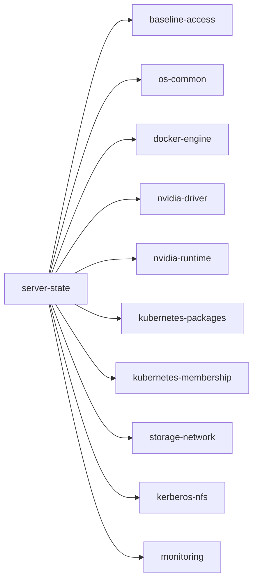

# server-state 개요

`server-state` 문서는 FARM/LAB GPU 서버가 공통 운영 기준에 맞게 설정되어
있는지 점검하고 고치는 도구를 설명한다. 이 페이지는 어떤 문서를 먼저
봐야 하는지 안내하고, 세부 내용은 각 문서에서 다룬다.

## server-state가 하는 일

FARM/LAB GPU 서버 16대는 모두 같은 방식으로 설정되어 있어야 한다 — 같은
버전의 Docker, 같은 NVIDIA driver, 같은 Kubernetes package를 쓰는 식이다.
서버가 16대나 되면 사람이 하나하나 SSH로 들어가 확인하는 방법으로는 어떤
서버가 기준에서 벗어났는지 놓치기 쉽다. **관리용 데스크탑에서 명령을 한 번
실행하면 `server-state`가 대상 서버에 Ansible로 접속해 점검·설정을 수행한다.**

```bash
./server-state/bin/server-state audit --hosts farm8 --component docker-engine
```

이 CLI가 다루는 점검 항목은 10가지이고, 이를 **구성요소(component)**라고
부른다.



`server-state`는 이미 등록된 서버가 기준에서 벗어났는지 점검·교정하는
데도, 신규 서버를 처음부터 같은 기준으로 구성하는 데도 쓴다.

## 어디부터 보면 되나

| 상황 | 확인할 문서 |
| --- | --- |
| `server-state`가 처음이고 개념부터 알고 싶다 | [설계](design.md) 1~3절 |
| 서버를 새로 추가하거나 등록하고 싶다 | [운영](operations.md) "2. 신규 서버 추가" |
| 특정 구성요소(예: `docker-engine`)가 정확히 뭘 확인·설정하는지 알고 싶다 | [설계](design.md) 4절 |
| 명령이 서버 접속 단계에서 실패한다 | [Ansible 설정](../ansible/config.md) 8장 |
| 용어가 헷갈린다 | [설계](design.md) 7절 용어 정리 |

## 문서는 이런 순서로 이어진다

### 1. Ansible 설정을 먼저 마친다

`server-state`의 모든 명령은 Ansible로 서버에 접속한다.
[Ansible 설정](../ansible/config.md)이 끝나 있지 않으면 어떤 명령도 서버에
닿지 못한다. Ansible 자체가 낯설다면 [Ansible 기초 개념](../ansible/basic.md)을
먼저 본다.

### 2. 설계 문서에서 개념과 구조를 본다

- [설계](design.md)가 이 묶음의 중심 문서다.
- 구성요소·정책이 뭔지, `describe`/`audit`/`plan`/`apply` 네 명령이 뭘
  하는지(3절), 10개 구성요소 각각이 정확히 뭘 확인·설정하는지(4절)가
  여기 있다.

### 3. 운영 문서에서 실제 절차를 따라간다

- [운영](operations.md)은 서버 등록, 환경 설정 변경, 구성요소 확장, 점검·설정
  실행 절차를 다룬다.
- 설계 문서가 "무엇을 확인·설정하는지"를 설명한다면, 운영 문서는 "그래서
  실제로 어떻게 하는지"를 설명한다.

## 문서 지도

| 문서 | 역할 | 여기서 이해하는 내용 |
| --- | --- | --- |
| 개요 (현재 페이지) | 출발점 | `server-state`가 하는 일, 문서를 보는 순서 |
| [설계](design.md) | 개념·구조 | 구성요소·정책 개념, 명령 4가지, 10개 구성요소 각각의 상태·점검·설정, 설정값과 코드 위치 |
| [운영](operations.md) | 실행 절차 | 서버 등록, 환경 설정 변경, 구성요소 확장, 실행 제어 변경, 점검·설정과 검증 절차 |

## 이 문서가 다루는 범위

- FARM/LAB GPU 서버의 공통 운영 기준을 점검·설정하는 `server-state` 모듈만
  다룬다.
- Ansible 자체의 개념과 설정 방법은 다루지 않는다.
  [Ansible 문서](../ansible/index.md) 참고.
- Kerberos/NFS의 자세한 인증·mount 구조는 다루지 않는다.
  [Kerberos/NFS 설계](../kerberos-nfs/design.md) 참고.
