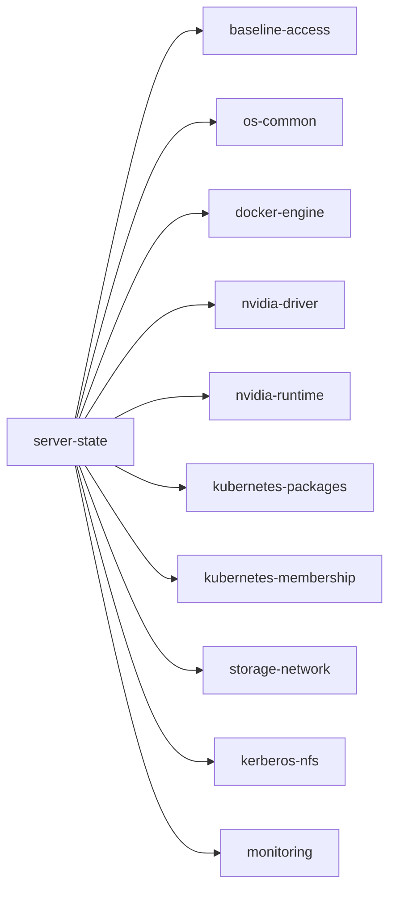

# server-state 개요

> [설계](design.md) · [운영](operations.md) · [GitHub](https://github.com/CSID-DGU/admin_infra_server)

`server-state` 매뉴얼은 FARM/LAB GPU 서버가 공통 운영 기준에 맞게 설정되어 있는지
점검하고 고치는 도구를 설명한다.

처음 보는 사람은 이 페이지에서 "어떤 매뉴얼을 먼저 읽어야 하는지"를 잡고, 각 매뉴얼
안에서 세부 내용을 내려가면 된다.

## server-state가 무엇을 하나

`server-state`는 **FARM/LAB 서버가 정해 둔 기준(같은 Docker 버전, 같은 NVIDIA
driver, 같은 Kubernetes 패키지 등)과 어긋나 있는지 점검하고, 어긋난 부분을 기준에
맞게 고친다.**

점검 항목은 10가지이고, 이를 **구성요소(component)** 라고 부른다.

이미 운영 중인 서버가 기준에서 벗어났는지 확인하는 데도 쓰고, 신규 서버를 처음부터
같은 기준으로 구성하는 데도 쓴다. 각 구성요소가 정확히 무엇을 확인하고 설정하는지는
[설계](design.md) 4장에 있다.

## 상황별로 볼 곳

| 상황 | 확인할 매뉴얼 |
| --- | --- |
| `server-state`가 처음이고 개념부터 알고 싶다 | [설계](design.md) 1~3장 |
| 서버를 새로 추가하거나 등록하고 싶다 | [운영](operations.md) 2장 신규 서버 추가 |
| 특정 구성요소(예: `docker-engine`)가 무엇을 확인·설정하는지 알고 싶다 | [설계](design.md) 4장 |
| 운영 중인 서버를 점검하고 싶다 | [운영](operations.md) 7장 운영 서버 점검 |
| 점검 결과를 어떻게 읽는지 모르겠다 | [운영](operations.md) 9장 결과 해석 |
| 어긋난 설정을 실제로 고쳐야 한다 | [운영](operations.md) 8장 서버 설정 |
| 점검 항목을 추가하거나 고치고 싶다 | [운영](operations.md) 4장 구성요소 추가·수정 |
| 명령이 서버 접속 단계에서 실패한다 | [Ansible 설정](../ansible/config.md) 8장 문제 해결 |
| 용어가 헷갈린다 | [설계](design.md) 7장 용어 정리 |

## 매뉴얼 읽기 순서

### 1. Ansible 설정을 먼저 마친다

`server-state`의 모든 명령은 Ansible로 서버에 접속한다.
[Ansible 설정](../ansible/config.md)이 끝나 있지 않으면 어떤 명령도 서버에 닿지
못한다. Ansible 자체가 낯설다면 [Ansible 기초 개념](../ansible/basic.md)을 먼저 본다.

### 2. 설계 매뉴얼에서 개념과 구조를 본다

- [설계](design.md)가 이 묶음의 중심이다.
- 구성요소와 정책이 무엇인지, `describe`·`audit`·`plan`·`apply` 네 명령이 각각 무엇을
  하는지(3장), 10개 구성요소가 정확히 무엇을 확인·설정하는지(4장)가 여기 있다.

### 3. 운영 매뉴얼에서 실제 절차를 따라간다

- [운영](operations.md)은 서버 등록, 환경 설정 변경, 구성요소 확장, 점검·설정 실행
  절차를 다룬다.
- 설계 매뉴얼이 "무엇을 확인·설정하는지"를 설명한다면, 운영 매뉴얼은 "그래서 실제로
  어떻게 하는지"를 설명한다.

## 매뉴얼 지도

| 매뉴얼 | 역할 | 여기서 이해하는 내용 |
| --- | --- | --- |
| 개요 (현재 페이지) | 출발점 | server-state가 하는 일, 매뉴얼 읽는 순서 |
| [설계](design.md) | 개념·구조 | 구성요소·정책 개념, 명령 4가지, 10개 구성요소 각각의 상태·점검·설정, 설정값과 코드 위치 |
| [운영](operations.md) | 실행 절차 | 서버 등록, 환경 설정 변경, 구성요소 확장, 점검·설정과 검증 절차 |

## 이 매뉴얼이 다루는 범위

- FARM/LAB GPU 서버의 공통 운영 기준을 **점검하고 고치는 것**만 다룬다.
- 서버 상태를 지속적으로 관측하고 알림을 보내는 일은 다루지 않는다.
  [monitoring](../monitoring/index.md) 참고.
- 부팅 시점에 한 번 수행하는 점검과 복구는 다루지 않는다.
  [remote-operations](../remote-operations/index.md) 참고.
- Ansible 자체의 개념과 설정 방법은 다루지 않는다.
  [Ansible 매뉴얼](../ansible/index.md) 참고.
- Kerberos/NFS의 자세한 인증·mount 구조는 다루지 않는다.
  [Kerberos/NFS 설계](../kerberos-nfs/design.md) 참고.
