# AI LAB 홈페이지 이용 방법

# 0. 회원가입과 로그인

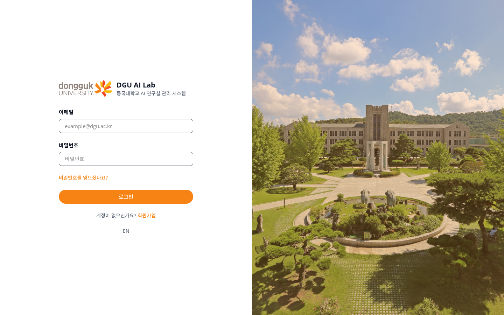

[홈페이지](http://210.94.179.18:30081/login)에 접속하면 로그인 화면이 나온다. 계정이 없다면 아래쪽 **회원가입**을 누른다.

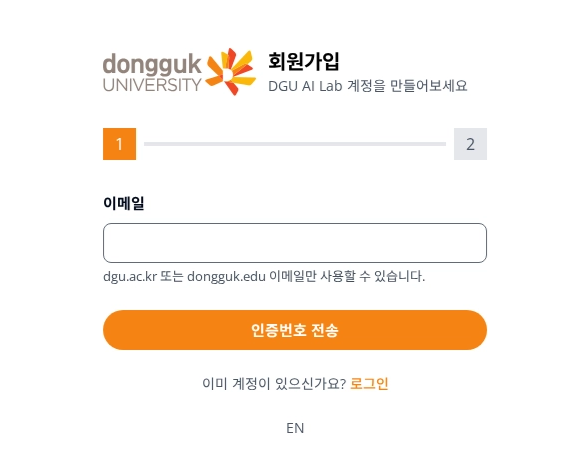

회원가입은 두 단계다.

1. **이메일 인증**
    - 학교 이메일(`@dgu.ac.kr` 또는 `@dongguk.edu`)만 사용할 수 있다.
    1. 이메일을 적고 "인증번호 전송"을 누르면 메일로 인증번호가 온다.
    2. 그 번호를 입력하면 다음 단계로 넘어간다.
2. **정보 입력**
    - 비밀번호, 이름, 학과, 학번, 전화번호를 입력하면 가입이 끝난다.

가입한 이메일과 비밀번호로 로그인하면 바로 사용할 수 있다.

---

# 1. 첫 화면(대시보드)

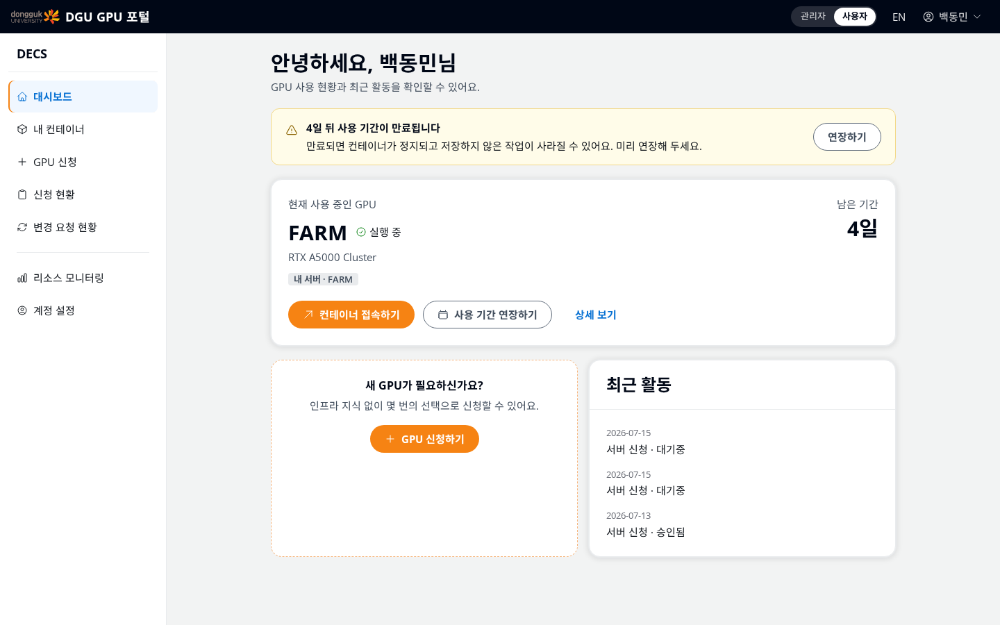

로그인하면 대시보드가 나온다. 지금 쓰고 있는 GPU가 있으면 남은 기간과 함께 표시되고, 없으면 "GPU 신청하기" 버튼이 보인다. 왼쪽 메뉴는 다음과 같이 쓰인다.

- **대시보드** : 내 사용 현황과 최근 활동 요약.
- **내 컨테이너** : 배정받은 서버의 접속 정보(SSH 명령, Jupyter)와 남은 기간.
- **GPU 신청** : 새 서버를 신청하는 곳. 이 문서의 핵심이다.
- **신청 현황** : 내가 낸 신청서가 승인됐는지 확인하는 곳.
- **변경 요청 현황** : 사용 기간 연장 같은 변경 요청의 처리 상태.
- **리소스 모니터링** : 서버별 GPU 사용률. 신청 전에 어디가 한가한지 볼 수 있다.
- **계정 설정** : 내 정보와 비밀번호 관리.

만료가 다가오면 대시보드 위쪽에 노란 알림 배너가 뜨고, 그 자리에서 바로 연장을 신청할 수 있다.

---

# 2. GPU 신청하기 (6단계)

왼쪽 메뉴의 **GPU 신청**을 누르면 6단계 신청서가 시작된다.

## 2-1. 사용 목적

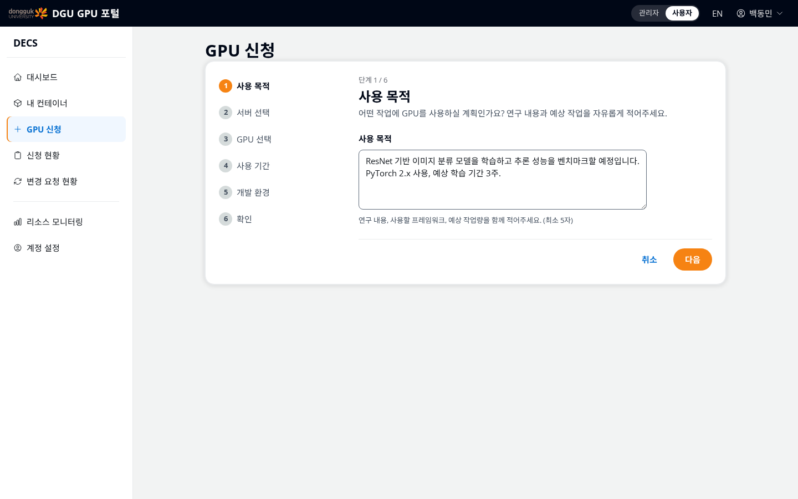

GPU로 무엇을 할 계획인지 적는다. 관리자는 이 내용을 보고 승인 여부를 판단하므로, **연구 내용·사용할 프레임워크·예상 작업량**을 함께 적을수록 승인이 빨라진다.

> 예시: "ResNet 기반 이미지 분류 모델을 학습하고 추론 성능을 벤치마크할 예정입니다. PyTorch 2.x 사용, 예상 학습 기간 3주."
>

## 2-2. 서버 선택

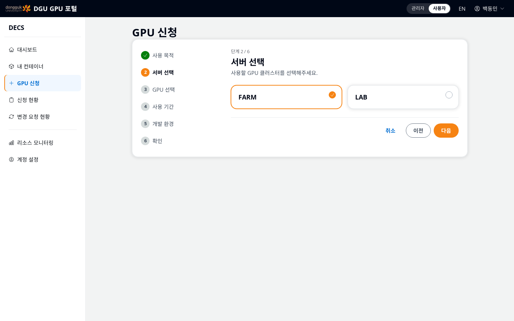

FARM과 LAB 중 하나를 고른다.

## 2-3. GPU 선택

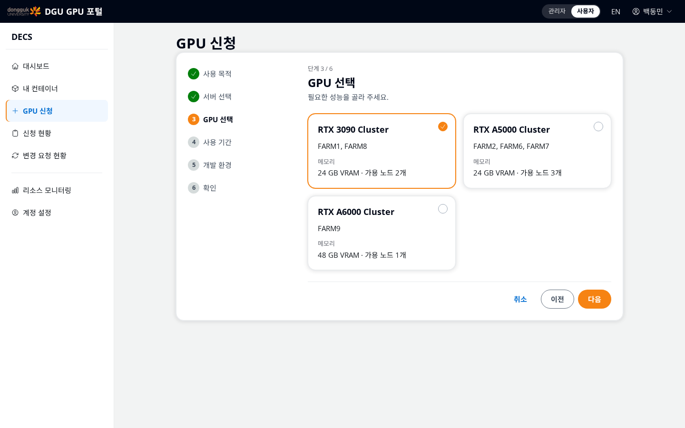

선택한 서버에서 신청할 수 있는 GPU 묶음(클러스터)이 카드로 나온다. 카드에는 GPU 메모리(VRAM)와 가용 노드 수가 함께 표시된다.

- 큰 모델을 다루거나 배치 크기를 키우려면 VRAM이 큰 쪽을 고른다.

2026년 7월 19일 기준 선택지는 다음과 같다.

**LAB 서버**

| GPU 클러스터 | VRAM | 가용 노드 |
| --- | --- | --- |
| RTX 2080 Ti Cluster | 11GB | 5개 (LAB2·3·4·6·8) |
| RTX 3090 Cluster | 24GB | 2개 (LAB1·7) |
| RTX A6000 Cluster | 48GB | 1개 (LAB5) |
| RTX 6000 Ada Cluster | 48GB | 1개 (LAB9) |
| H200 NVL Server | 140GB | 1개 (LAB10) |

**FARM 서버**

| GPU 클러스터 | VRAM | 가용 노드 |
| --- | --- | --- |
| RTX 3090 Cluster | 24GB | 2개 (FARM1·8) |
| RTX A5000 Cluster | 24GB | 3개 (FARM2·6·7) |
| RTX A6000 Cluster | 48GB | 1개 (FARM9) |

> ⚠️
>
> 사용자 현황에 따라 원하는 GPU 모델을 배정받지 못할 수 있다. 어느 노드에 배치될지는 신청 시점의 서버 부하를 보고 시스템이 자동으로 정한다.

## 2-4. 사용 기간

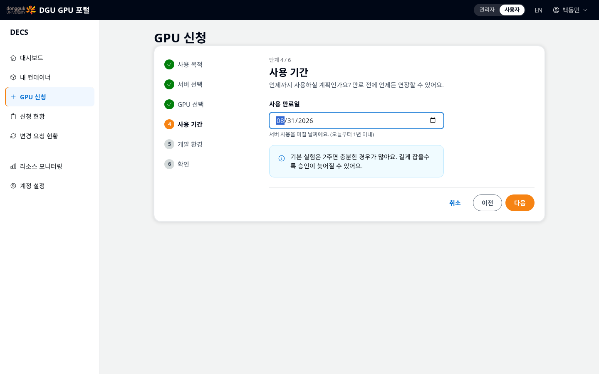

서버 사용을 마칠 날짜를 고른다. 오늘부터 1년 이내로만 선택할 수 있다. 화면 안내처럼 기본 실험은 2주면 충분한 경우가 많고, 길게 잡을수록 승인이 늦어질 수 있다. 만료 전에 언제든 연장할 수 있으므로(5절 참고) 처음에는 짧게 잡는 편을 추천한다.

## 2-5. 개발 환경

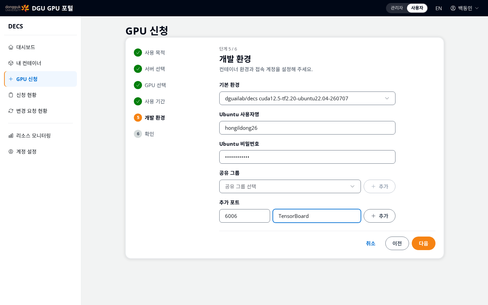

컨테이너 환경과 접속 계정을 정하는 단계다.

- **기본 환경** : 미리 준비된 개발 환경 꾸러미(이미지)다. CUDA, 프레임워크, Jupyter 등이 설치되어 있어 따로 셋업할 필요가 없다. 현재 기본 제공은 `dguailab/decs cuda12.5-tf2.20-ubuntu22.04` 이다.
- **Ubuntu 사용자명** : 서버에 로그인할 때 쓸 계정 이름이다. 소문자·숫자로 3~50자다. "다음"을 누르면 이미 쓰는 이름인지 자동으로 확인해 준다.
- **Ubuntu 비밀번호** : 그 계정으로 SSH 접속할 때 쓸 비밀번호다. 잊어버리면 곤란하므로 반드시 기억해 둔다.
- **공유 그룹** : 팀 단위로 폴더를 같이 쓰려면 그룹을 선택해 추가한다. 혼자 쓰면 비워 둔다.
- **추가 포트** : SSH(22)와 Jupyter(8888)는 기본으로 열린다. TensorBoard(6006)처럼 다른 포트가 필요할 때만 번호와 용도를 적고 "추가"를 누른다.

## 2-6. 확인 후 신청

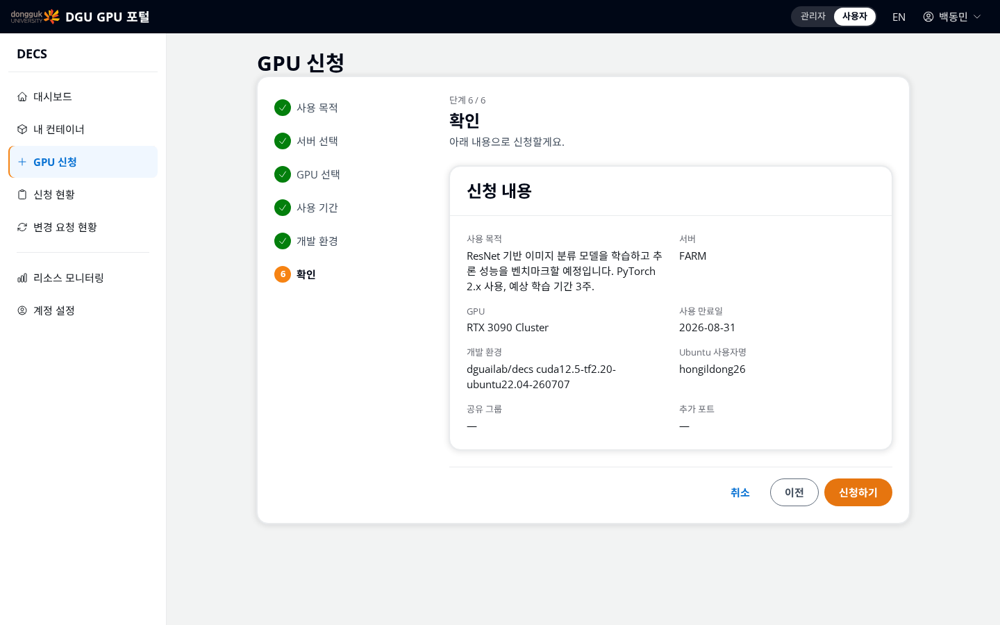

지금까지 입력한 내용이 한눈에 정리된다. 틀린 곳이 있으면 "이전"으로 돌아가 고치고, 맞으면 **신청하기**를 누른다. "신청이 접수되었어요" 화면이 나오면 끝이며, 이제 관리자 승인을 기다리면 된다.

---

# 3. 신청 결과 확인

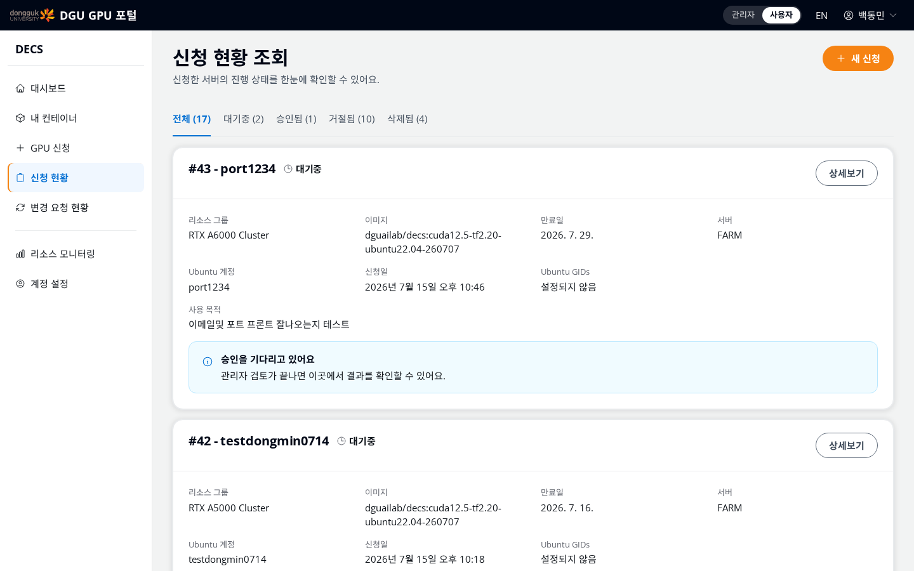

왼쪽 메뉴 **신청 현황**에서 내 신청서의 상태를 볼 수 있다.

- **대기중** : 관리자가 아직 검토하지 않은 상태다.
- **승인됨** : 승인이 끝나 컨테이너가 준비된 상태다.
- **거절됨** : 승인되지 않은 경우다. 사용 목적을 보강해 다시 신청할 수 있다.

승인이 완료되면 가입한 이메일로 배정 안내 메일이 온다. 접속 비밀번호는 신청서에서 정한 Ubuntu 비밀번호를 사용한다.

---

# 4. 내 서버(컨테이너) 접속하기

승인이 끝나면 **내 컨테이너** 메뉴에 접속 정보가 나타난다.

> ⚠️
>
> 교내망에서는 되는데 집이나 카페에서 접속이 안 되는 경우가 있다. 외부에 열려 있는 포트 범위가 제한되어 있기 때문이며, 이런 경우 관리자에게 문의한다.

---

# 5. 사용 기간 연장과 만료

만료 4일 전부터 대시보드에 알림 배너가 뜬다. **연장하기** 버튼(대시보드 또는 내 컨테이너)을 누르면 새 만료일과 사유를 적어 변경 요청을 낼 수 있다. 처리 상태는 **변경 요청 현황** 메뉴에서 확인한다.

> ⚠️
>
> 만료되면 컨테이너가 정지되고 저장하지 않은 작업이 사라질 수 있다. 연장은 미리 신청하고, 중요한 결과물은 만료 전에 내 컴퓨터로 옮겨 둔다.

---

# 6. 리소스 모니터링

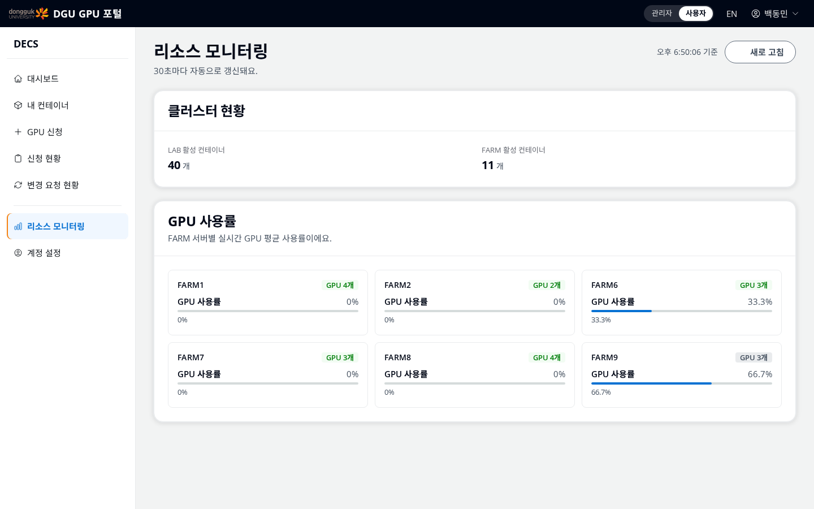

**리소스 모니터링** 메뉴에서 서버별 실시간 GPU 사용률을 볼 수 있다(30초마다 자동 갱신).

신청 전에 들러 보면 어느 클러스터가 한가한지 감을 잡는 데 도움이 된다.

---

# 문의

- 신청이 계속 "대기중"이면 관리자가 검토 중인 것이므로 조금 기다린다.
- 접속 오류, 비밀번호 분실, 외부 접속 문제는 연구실 관리자에게 문의한다.
