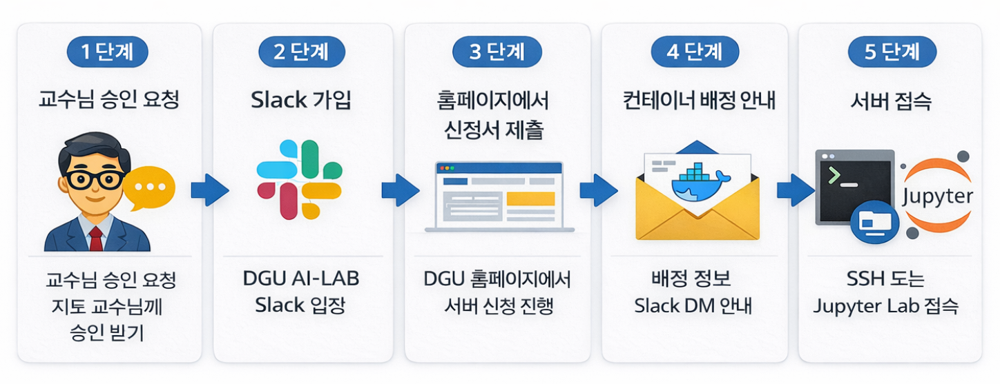
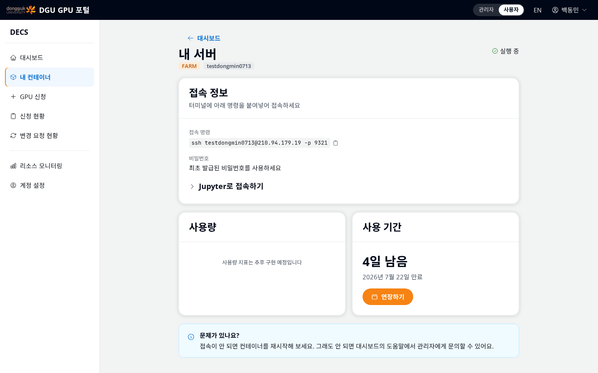
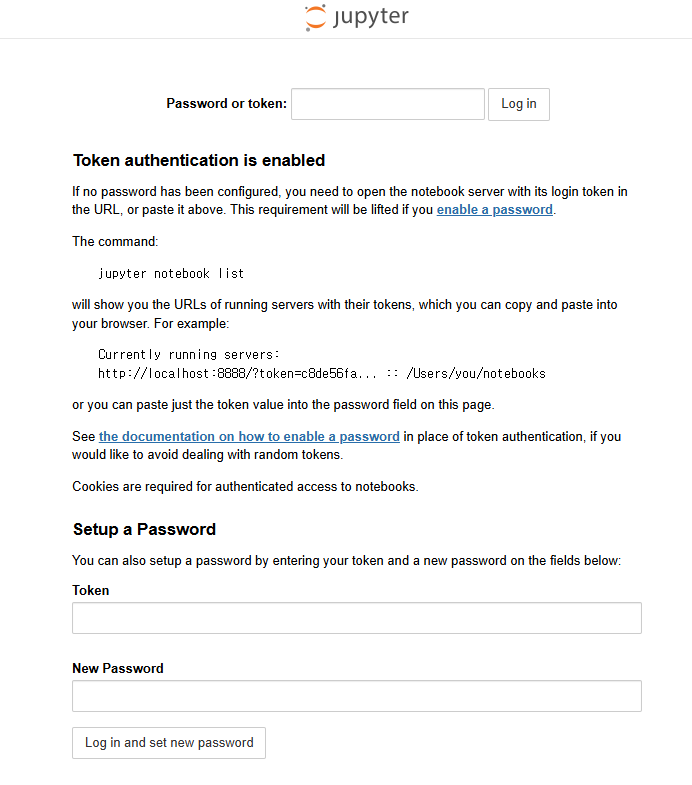
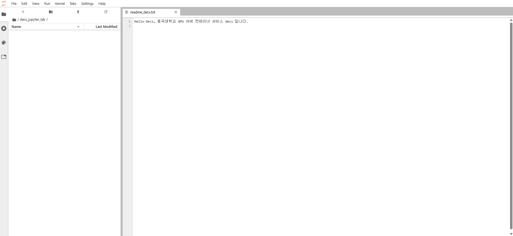
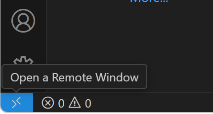
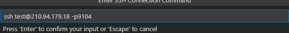
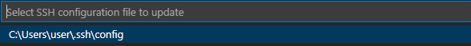
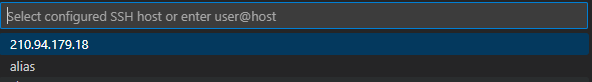
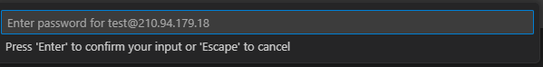
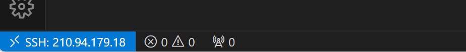

# LAB & FARM 유저 매뉴얼

## 0. 본 문서의 목적

이 문서는 동국대학교 **AI-LAB / FARM 서버를 처음 사용하는 사용자**를 위한 안내서다. 서버 사용 신청부터, 컨테이너 배정 후 접속(SSH, Jupyter Lab), 기본적인 사용 방법까지 정리되어 있다.

> 💡
>
> 전체 내용을 숙지하지 않아 생기는 불이익은 사용자에게 있다.

---

## 1. 서버 사용 대상자

LAB & FARM 서버는 아래 두 경우 중 하나에 해당하는 사용자만 이용할 수 있다.

- **LAB 서버**
    - 김지희 교수님 연구실 소속의 학생
    - 연구 목적의 사용
- **FARM 서버**
    - 김동호 교수님의 승인을 받은 학생
    - 수업 또는 프로젝트 목적 사용

본인이 어떤 서버에 해당하는지는 서버 사용 승인받은 교수님 기준으로 구분한다.

---

## 2. 서버 사용 신청 방법

서버 사용 신청은 아래 단계를 모두 완료해야 정상적으로 처리된다.



### 2-1. 지도 교수님께 사용 승인 요청

서버는 **교수님 승인** 기반으로 운영되므로 사용 신청 전에 교수님의 승인이 필요하다.

교수님의 승인 판단 이후 신청 과정을 통해 컨테이너를 배정한다.

**⚠️ 교수님 승인 없이 신청한 경우 사용자에게 서버가 배정되지 않는다.**

### 2-2. DGU AI-LAB Slack 가입

서버 사용과 관련된 모든 안내는 Slack을 통해 진행된다.

- 서버 배정 안내
- 오류 대응
- 공지 사항 확인

아래 링크를 통해 Slack에 가입한다.

슬랙 가입 링크:

[**DGU AI-LAB Slack 가입하기**](https://join.slack.com/t/dguai-lab/shared_invite/zt-1xkbwofuv-hwQluklT6JSxAnzSXnmPrA)

### 2-3. DGU AI LAB 홈페이지에서 신청서 제출

본인의 소속과 서버 사용에 맞게 서버 신청을 진행한다.

[AI LAB 홈페이지 이용 방법](AI-LAB-홈페이지-이용-방법.md)

### 2-4. 컨테이너 배정 안내

관리자 승인이 완료되면 **가입한 이메일로 배정 안내 메일**이 발송된다.

접속에 필요한 정보는 홈페이지의 **내 컨테이너** 메뉴에서 언제든 다시 확인할 수 있다.

- 접속 아이디: 신청서에서 본인이 정한 Ubuntu 사용자명
- 비밀번호: 신청서에서 본인이 정한 Ubuntu 비밀번호
- SSH 접속 명령어(포트 포함), Jupyter 접속 주소: **내 컨테이너** 화면에 표시

⚠️ 비밀번호는 신청서 작성 단계에서 본인이 직접 정한 값이며, 별도로 발급되지 않는다.

**비밀번호를 잊어버린 경우 서버 접속이 불가능하므로, 신청 시 정한 비밀번호를 반드시 기억해야 한다.** 분실 시에는 오류 신고 구글폼(5절)을 통해 문의한다.

---

## 3. 서버 접속 방법

컨테이너 배정 안내를 성공적으로 받았다면 아래 방법을 통해 서버에 접속할 수 있다.

서버 접속은 크게 **SSH 접속**, **Jupyter Lab 접속**, **VS Code 접속** 세 가지 방식이 있다.

---

### 3-1. SSH로 서버 접속하기

1. CMD(또는 PowerShell) 혹은 터미널(macOS/Linux)을 실행한다.
2. 아래 형식의 명령어를 입력해 SSH로 서버에 접속한다.

**SSH 접속 명령어 형식**

```bash
ssh -p <포트번호> <아이디>@<서버IP>
```

**예시**

```bash
ssh -p 9600 test0923@210.94.179.19
```

접속에 필요한 **포트 번호, 아이디, 서버 IP**는 홈페이지의 **내 컨테이너** 메뉴 → "접속 정보"에서 확인할 수 있다.

화면에 표시된 접속 명령을 **복사 아이콘으로 그대로 복사해 붙여넣어도 문제없다.**



---

### 3-2. Jupyter Lab으로 접속하기

`dguailab/containerssh-guest` 이미지를 선택한 경우 Jupyter Lab을 이용할 수 있다.

- Jupyter Lab에 접속하려면 다음 순서를 따른다.
    1. 컨테이너 배정 시 안내받은 **Jupyter Lab 주소를 브라우저에 입력**한다.
    2. SSH로 서버에 접속한 뒤, 본인의 홈 디렉터리(`/home/{username}`) 경로의 `/decs_jupyter_lab/jupyter_token.txt` 파일에 저장된 Token을 확인한다.
    3. Jupyter Lab 웹페이지 `Password or token`에 발급받은 Token을 입력한다.



- 기본적으로 Jupyter Lab의 폴더는 `/home/{**username}**/decs_jupyter_lab`으로 되어 있다.



---

### 3-3. **VScode SSH로 접속하기**

(1) VSCode 확장 팩에서 Remote - SSH를 설치한다.


(2) VSCode 왼쪽 하단 파란색 버튼을 클릭한 후, 명령어 선택창에서 [Connect To Host…]를 선택한다.



(3) [Add New SSH Host…]를 선택한다.


(4) ssh <계정명>@<서버 주소> -p <배정받은 포트 번호>



(5) C:\Users\user\.ssh\config 를 클릭하면 config 파일에 사용자 서버 정보가 기입되고 ssh 접속이 가능해진다.



(6) [Ctrl] + [Shift] + [P]를 누르고 [Remote-SSH: Connect to Host]를 클릭하면 아래 사진과 같은 화면이 표시된다.



(7) 비밀번호를 입력하는 란이 나오면 사용자 본인의 컨테이너 비밀번호를 입력한다.



(8) VSCode 왼쪽 하단을 통해 SSH 연결된 것을 확인한다.



---

## 4. 서버 이용 시 주의사항

### 4-1. 중요한 데이터는 수시로 백업하기

컨테이너는 서버 운영 상황에 따라 **삭제되거나 재생성**될 수 있다.

- 컨테이너 내부에만 존재하는 파일 → **삭제됨**
- `/home/{username}`에 저장된 파일 → **유지됨**

컨테이너가 삭제되거나 재생성되더라도 **본인의 홈 디렉터리(`/home/{username}`)에 저장된 데이터는 유지된다.**

따라서 작업 중 생성되는 데이터는 **항상 홈 디렉터리 기준으로 관리해야 한다.**

⚠️ 다만 서버 개인 폴더의 데이터는 **별도의 백업 장치가 운영되고 있지 않다.**

중요한 데이터는 반드시 로컬 저장소(개인 PC)로 주기적으로 백업해야 한다.

[서버 내 파일 백업하기](서버-내-파일-백업하기.md)

### 4-2. **본인에게 할당된 접속 방법과 저장 공간만 사용하기**

비정상적인 접근이나 다른 유저의 계정, 컨테이너 및 디렉터리에 접근하려는 시도가 적발되는 경우 즉시 계정과 모든 데이터가 삭제되며 추후 서버를 이용할 수 없다.

반드시 본인에게 할당된 접속 방법, 저장 공간만을 사용하여 본인의 프로세스 및 데이터만 조작해야 하며, 다른 사용자가 실행 중인 프로세스나 저장하고 있는 데이터를 조작하는 것은 절대 금지한다.

### 4-3. 제공된 실행 환경을 임의로 변경하지 않기

제공된 소프트웨어(NVIDIA Driver, CUDA)를 사용자가 변경해서는 안 된다. 사용자가 임의로 변경할 경우 오류로 컨테이너를 더 이상 사용할 수 없게 된다.

### 4-4. 2회 경고 누적 시 서버 사용 불가능

본인에게 할당되지 않은 접속 방법과 저장 공간을 사용하는 경우, 제공된 소프트웨어를 임의로 변경한 경우, `오류 신고 및 문의 사항` 구글 폼에 명시된 규칙에 따라 관리자는 사용자에게 경고를 부여할 수 있으며, 2회 누적 시 해당 사용자는 서버 이용을 **금지**한다.

---

## 5. 오류 발생 시 대처 방법

서버 사용 중 오류가 발생한 경우, 아래의 **오류 신고 구글폼**을 통해 오류를 접수한다.

- [**LAB 오류 신고 링크**](https://docs.google.com/forms/d/1kMXlObP53k2rO-YM4kdOOC4rT6p7C9o1WmwP4w94EyU/edit)
- [**FARM 오류 신고 링크**](https://docs.google.com/forms/d/15cNoicwmUwBjhAqAts4-JD0y5JmSxl0DGO3oDGuHb8U/edit)

오류 신고가 접수되면 작성된 내용이 자동으로 **Slack 채널**에 스레드 형태로 공유된다.

- LAB 서버:     **`lab-오류신고및문의`**
- FARM 서버: **`farm-오류신고및문의`**

이후 관리자는 신고된 내용을 확인한 뒤 대응을 진행하며, 추가 정보가 필요한 경우 **Slack 스레드 댓글을 통해 요청**한다.

### 오류 신고 전 유의사항

- 오류 신고 전 **사용자 매뉴얼**과 **[오류 Q&A](https://app.notion.com/p/QnA-1b3c7692a26380e59821d99285169bcf?pvs=21)**에 안내된 해결 방법을 먼저 확인하고, 사용자가 수행할 수 있는 모든 디버깅을 수행해야 한다. 사용자가 셀프 디버깅을 충분히 하지 않고, 관리자가 처리해야 하는 오류가 아님에도 오류 신고할 경우 곧바로 경고 1회를 부여하며 오류 신고 스레드가 삭제된다.
- 사용자는 오류 신고와 문의 사항을 혼동해서는 안 된다.
- 서버 관리자에게 개별적으로 연락해서는 안 된다.
- 오류 신고 시 오류 메시지 전체 내용 또는 스크린샷을 첨부한다. 관리자는 오류와 관련된 내용을 Slack 스레드 댓글로 요청할 수 있으며, 사용자는 요청을 받은 경우 **12시간 이내**에 관리자의 질문에 답변해야 한다.

⚠️ 위 규칙을 위반할 경우 **경고 처리될 수 있다.**

자세한 내용은 [오류 Q&A](https://app.notion.com/p/QnA-1b3c7692a26380e59821d99285169bcf?pvs=21)를 참고한다.

---
